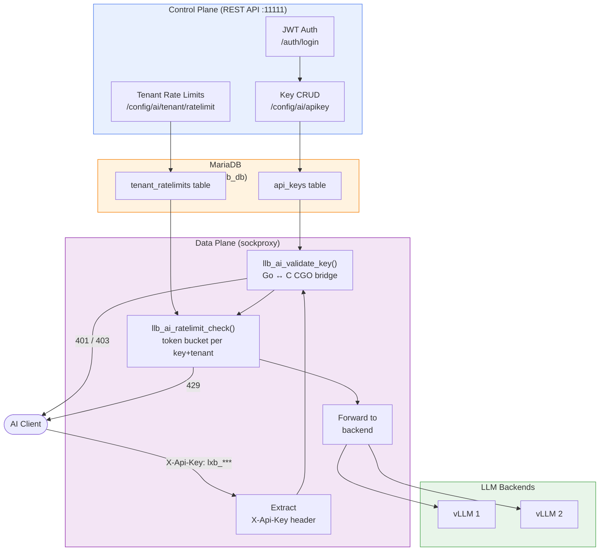
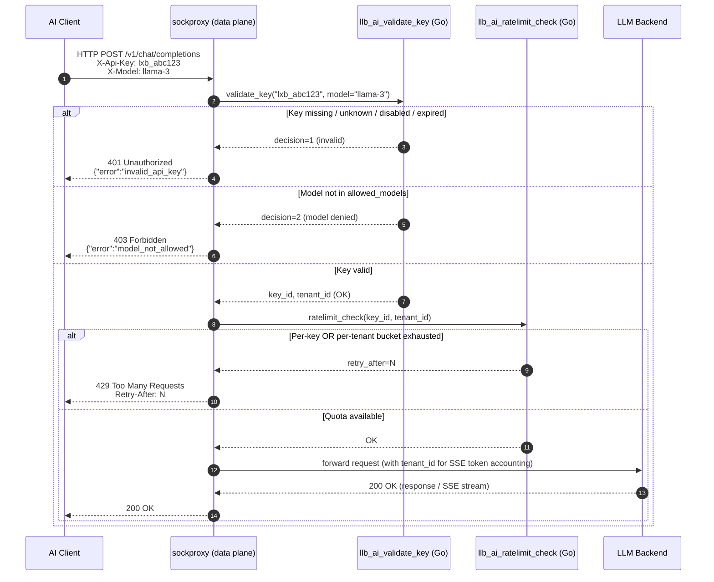
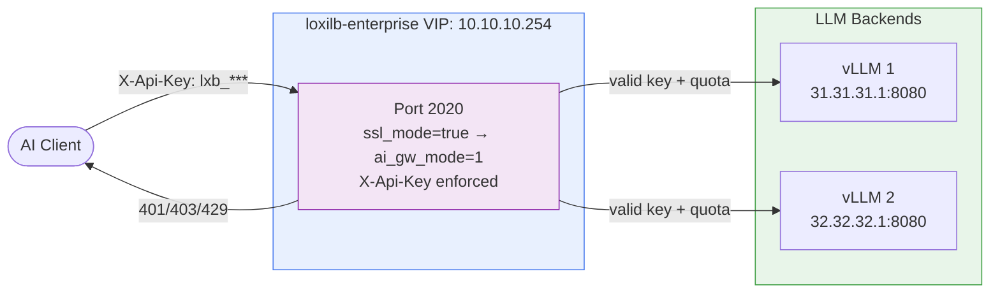
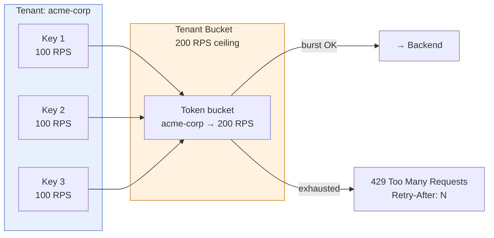

# API Key Management

!!! enterprise "Enterprise Feature"
    This feature requires loxilb-enterprise. It is not available in the community edition.
    See [Installation](../getting-started/installation.md) for enterprise binary setup.

loxilb-enterprise provides API key lifecycle management for AI Gateway endpoints. Every inbound request is authenticated at the **data plane** before it reaches any backend — invalid, expired, or rate-limited requests are rejected by the sockproxy engine at line speed, consuming no GPU resources.

---

## Why Gateway-Layer API Key Enforcement Matters

When you expose LLM endpoints, standard approaches put authentication logic inside the application or in a separate auth sidecar. Both create problems at scale:

| Problem | Without Gateway Auth | With loxilb-enterprise |
|---|---|---|
| Unauthenticated burst | Hits vLLM directly — consumes GPU even for junk requests | Rejected at sockproxy before reaching backend |
| Model access control | Each vLLM instance must check key permissions | Single enforcement point at the gateway |
| Tenant isolation | Application code responsible for per-tenant limits | Per-tenant RPS + token quota enforced at gateway |
| Key rotation | Requires redeploying all services | Update via REST API — effective immediately |

---

## Architecture

loxilb-enterprise API key management has two independent layers that work together:



**Key design points:**

- **Control plane** (REST API) stores keys in MariaDB. Requires `--userservice` flag and `--databasehost`.
- **Data plane** (sockproxy) loads key info via Go↔C CGO bridge at request time — no database round-trip per request.
- `ai_gw_mode` must be enabled on the LB rule (`sse_mode: true`) to activate enforcement. Without it, all requests pass through regardless of key.

---

## How Validation Works

When a request hits an AI Gateway endpoint, sockproxy performs two sequential checks:



**Model identification priority** (from source: `sockproxy_http.c:5197`):

1. `X-Model` HTTP request header ← fastest path
2. `model` field parsed from JSON request body
3. Empty string → matches any key with `allowed_models: []` (wildcard)

---

## Prerequisites

- loxilb-enterprise started with **`--userservice`** flag — this activates the API key enforcement pipeline
- A **MariaDB** instance accessible from loxilb — stores keys and tenant quotas
- MySQL password file at `/etc/loxilb/mysql_password` (one line, plain text)
- LB rule configured with **`sse_mode: true`** (sets `ai_gw_mode=1` in sockproxy)

!!! danger "Silent fail-open without --userservice"
    If `--userservice` is missing, **all requests pass through** regardless of `X-Api-Key`. There is no warning or error message. Always verify the flag is set.

### Start loxilb-enterprise with user service

```bash
# Write DB password to expected path
echo "your_db_password" > /etc/loxilb/mysql_password

# Start loxilb-enterprise
docker run -d \
  --name loxilb \
  -v /etc/loxilb:/etc/loxilb \
  -p 11111:11111 \
  ghcr.io/netlox-dev/loxilb-enterprise:latest \
  --userservice \
  --databasehost <mariadb-ip>
```

### Start MariaDB (Docker)

```bash
docker run -d --name mariadb \
  -e MYSQL_ROOT_PASSWORD=your_db_password \
  -e MYSQL_DATABASE=loxilb_db \
  mariadb:10.11
```

---

## Step 1 — Get a JWT Token

All control-plane API calls require a JWT Bearer token. First create an admin user, then log in:

```bash
# Create admin user (no auth required on first use)
curl -X POST http://loxilb:11111/netlox/v1/auth/users \
  -H "Content-Type: application/json" \
  -d '{"username":"admin","password":"Admin123!","role":"admin"}'

# Log in and extract token
TOKEN=$(curl -s -X POST http://loxilb:11111/netlox/v1/auth/login \
  -H "Content-Type: application/json" \
  -d '{"username":"admin","password":"Admin123!"}' \
  | python3 -c "import sys,json; print(json.load(sys.stdin)['token'])")

echo "Token: ${TOKEN:0:30}..."
```

---

## Step 2 — Create the LB Rule with AI Gateway Mode

The LB rule must have `sse_mode: true` (which sets `ai_gw_mode=1` in sockproxy) to activate API key enforcement:



=== "loxicmd"

    ```bash
    loxicmd create lb 10.10.10.254 \
      --tcp=2020:8080 \
      --select=rr \
      --mode=fullproxy \
      --sse-mode=true \
      --host=10.10.10.254 \
      --endpoints=31.31.31.1:1,32.32.32.1:1
    ```

=== "REST API"

    ```bash
    curl -X POST http://loxilb:11111/netlox/v1/config/loadbalancer \
      -H "Content-Type: application/json" \
      -H "Authorization: Bearer $TOKEN" \
      -d '{
        "serviceArguments": {
          "externalIP":      "10.10.10.254",
          "port":            2020,
          "protocol":        "tcp",
          "mode":            4,
          "sel":             0,
          "sse_mode":        true,
          "inactiveTimeOut": 300,
          "host":            "10.10.10.254"
        },
        "endpoints": [
          {"endpointIP": "31.31.31.1", "targetPort": 8080, "weight": 1},
          {"endpointIP": "32.32.32.1", "targetPort": 8080, "weight": 1}
        ]
      }'
    ```

---

## Step 3 — Manage API Keys

### Create an API Key

=== "loxicmd"

    ```bash
    loxicmd create ai-apikey \
      --tenant-id=acme-corp \
      --name=prod-llama-key \
      --allowed-models=meta-llama/Llama-3-70B,llama-3 \
      --rate-limit-rps=100 \
      --burst-size=150 \
      --tokens-per-min=100000 \
      --expires-at=2027-01-01T00:00:00Z
    ```

=== "REST API"

    ```bash
    curl -X POST http://loxilb:11111/netlox/v1/config/ai/apikey \
      -H "Authorization: Bearer $TOKEN" \
      -H "Content-Type: application/json" \
      -d '{
        "tenant_id":      "acme-corp",
        "name":           "prod-llama-key",
        "allowed_models": ["meta-llama/Llama-3-70B", "llama-3"],
        "rate_limit_rps": 100,
        "burst_size":     150,
        "tokens_per_min": 100000,
        "enabled":        true,
        "expires_at":     "2027-01-01T00:00:00Z"
      }'

    # Response 201:
    # {
    #   "key_id":  "ak_abc123def456",
    #   "raw_key": "lxb_a1b2c3d4e5f6..."
    # }
    ```

!!! warning "Save the raw_key now"
    The `raw_key` (prefix `lxb_`) is returned **only once** at creation. It is never stored in plain text — only a hash is kept in the database. Store it in your secrets manager immediately.

### List Keys for a Tenant

=== "loxicmd"

    ```bash
    loxicmd get ai-apikeys --tenant-id=acme-corp
    ```

=== "REST API"

    ```bash
    curl -H "Authorization: Bearer $TOKEN" \
      "http://loxilb:11111/netlox/v1/config/ai/apikey?tenant_id=acme-corp"

    # Returns array of ApiKeySummary — key_hash is never included
    ```

### Get a Single Key

=== "loxicmd"

    ```bash
    loxicmd get ai-apikey ak_abc123def456
    ```

=== "REST API"

    ```bash
    curl -H "Authorization: Bearer $TOKEN" \
      http://loxilb:11111/netlox/v1/config/ai/apikey/ak_abc123def456
    ```

### Delete (Revoke) a Key

=== "loxicmd"

    ```bash
    loxicmd delete ai-apikey ak_abc123def456
    # → "API key deleted successfully"
    ```

=== "REST API"

    ```bash
    curl -X DELETE -H "Authorization: Bearer $TOKEN" \
      http://loxilb:11111/netlox/v1/config/ai/apikey/ak_abc123def456
    # → HTTP 204 No Content
    ```

Revocation is **immediate** — the next request using this key returns `401`.

---

## Step 4 — Set Tenant-Level Rate Limits

Individual key limits (`rate_limit_rps`) apply per key. Tenant limits apply to the **sum** of all keys under a `tenant_id`. This prevents a single tenant from monopolizing capacity across many keys.



=== "loxicmd"

    ```bash
    loxicmd create ai-tenant-ratelimit \
      --tenant-id=acme-corp \
      --rps=200 \
      --tokens-per-min=500000
    # → "Tenant rate limit set"

    # Verify
    loxicmd get ai-tenant-ratelimit acme-corp
    ```

=== "REST API"

    ```bash
    # Set
    curl -X POST http://loxilb:11111/netlox/v1/config/ai/tenant/ratelimit \
      -H "Authorization: Bearer $TOKEN" \
      -H "Content-Type: application/json" \
      -d '{
        "tenant_id":      "acme-corp",
        "rps":            200,
        "tokens_per_min": 500000
      }'

    # Get
    curl -H "Authorization: Bearer $TOKEN" \
      http://loxilb:11111/netlox/v1/config/ai/tenant/ratelimit/acme-corp
    # → {"tenant_id":"acme-corp","rps":200,"tokens_per_min":500000,"updated_at":"..."}
    ```

---

## API Key Fields Reference

| Field | Type | Required | Description |
|---|---|:---:|---|
| `tenant_id` | string | **yes** | Groups keys by customer or team. Used for tenant-level rate limiting. |
| `name` | string | no | Human-readable label (e.g. `"prod-llama-key"`). Not used for auth. |
| `allowed_models` | []string | no | Model IDs this key can access. **Empty = all models allowed.** Matched against `X-Model` header or JSON body `model` field. |
| `rate_limit_rps` | int64 | no | Steady-state requests per second for this key. `0` = unlimited. |
| `burst_size` | int64 | no | Short burst above `rate_limit_rps`. Typically set to `1.5×rate_limit_rps`. |
| `tokens_per_min` | int64 | no | LLM token quota per minute. Charged after SSE stream completes. `0` = unlimited. |
| `expires_at` | RFC3339 | no | Key expiry. Expired keys return `401` immediately. |
| `enabled` | bool | no | Soft disable without deleting. Disabled keys return `401`. Default: `true`. |

**Response-only fields** (never in create request):

| Field | Description |
|---|---|
| `key_id` | Auto-generated unique ID. Use for GET / DELETE. |
| `raw_key` | Plaintext key with `lxb_` prefix. **Returned once only.** |
| `created_at` | Timestamp of creation. |

---

## Verify

Test the full enforcement pipeline end-to-end:

```bash
# 1. No key → 401
curl -s -w "\n%{http_code}" http://10.10.10.254:2020/v1/chat/completions \
  -H "Content-Type: application/json" \
  -d '{"model":"llama-3","messages":[{"role":"user","content":"hi"}]}'
# → {"error":"invalid_api_key",...}
# → 401

# 2. Valid key → reaches backend
curl -s -w "\n%{http_code}" http://10.10.10.254:2020/v1/chat/completions \
  -H "X-Api-Key: lxb_your_raw_key_here" \
  -H "Content-Type: application/json" \
  -d '{"model":"llama-3","messages":[{"role":"user","content":"hi"}]}'
# → 200

# 3. Valid key, disallowed model → 403
curl -s -w "\n%{http_code}" http://10.10.10.254:2020/v1/chat/completions \
  -H "X-Api-Key: lxb_your_raw_key_here" \
  -H "X-Model: gpt-4" \
  -H "Content-Type: application/json" \
  -d '{"model":"gpt-4","messages":[{"role":"user","content":"hi"}]}'
# → {"error":"model_not_allowed",...}
# → 403
```

---

## Troubleshooting

**All requests pass through without checking X-Api-Key**

- Confirm loxilb was started with `--userservice`. Check running process: `docker inspect loxilb | grep userservice`
- Confirm the LB rule has `sse_mode: true` (= `ai_gw_mode=1`). Without it, sockproxy skips the validation block entirely.

**401 on a key that should be valid**

- Verify the key exists: `GET /config/ai/apikey/<key_id`
- Check `enabled: true` — soft-disabled keys return 401
- Check `expires_at` has not passed
- Confirm you are sending the key in the `X-Api-Key` header (case-insensitive, but must be this header name)

**403 Model not allowed**

- Check `allowed_models` on the key. Empty array = all models allowed.
- The model is matched against the `X-Model` request header first, then the JSON body `model` field. Ensure the client is sending the same model ID string that appears in `allowed_models`.

**429 Rate limit exceeded**

- Check per-key limits: `GET /config/ai/apikey/<key_id>`
- Check tenant ceiling: `GET /config/ai/tenant/ratelimit/<tenant_id>`
- The `Retry-After` response header tells the client how many seconds until the token bucket refills.

**"database connection" error on startup**

- Confirm MariaDB is reachable from loxilb: `mysql -h <databasehost> -u root -p loxilb_db`
- Confirm `/etc/loxilb/mysql_password` contains the correct password (single line, no trailing newline issues)

---

## Next Steps

- [MCP Gateway](mcp-gateway.md) — Add session-sticky routing for MCP agents on top of API key auth
- [LLM Routing](llm-routing.md) — Route by model name with GPU-aware and KV cache-aware selection
- [SSE Quota Management](sse-quota-management.md) — Token-level quota management per tenant
