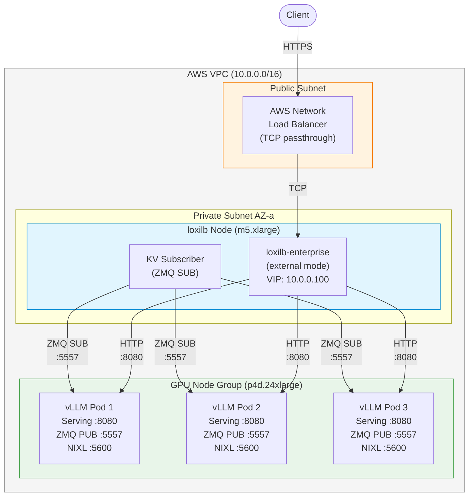
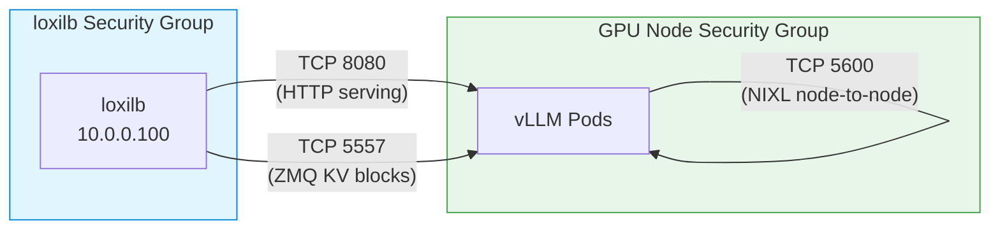
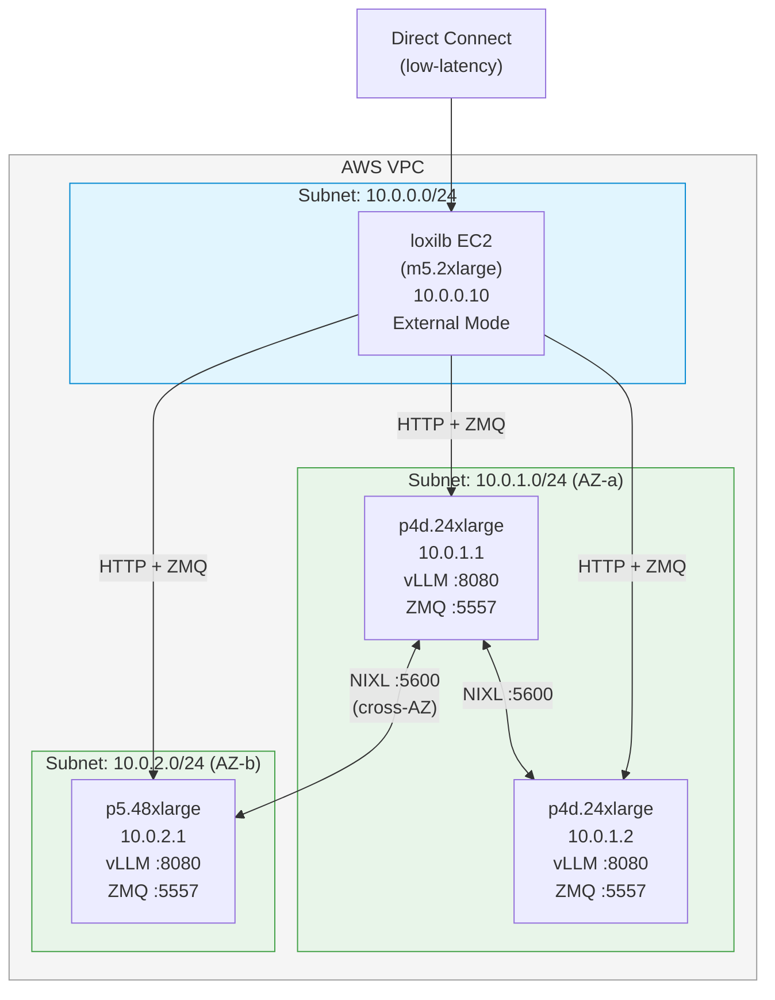

# AWS KV Cache Deployment

!!! enterprise "Enterprise Feature"
    This feature requires loxilb-enterprise. It is not available in the community edition.
    See [Installation](../getting-started/installation.md) for enterprise binary setup.

## Overview

This page documents deploying KV cache-aware AI Gateway routing on **AWS** infrastructure. The core KV routing configuration is the same as documented in [KV Caching](kv-caching.md) -- this page adds AWS-specific networking, security group, and deployment considerations.

!!! note "No AWS-Specific Code"
    No AWS-specific loxilb code exists. This is a deployment guide applying standard KV routing on AWS infrastructure. All configuration fields are documented in [KV Caching](kv-caching.md) and [Configuration Reference](configuration-reference.md).

---

## Architecture on AWS

### EKS Deployment Architecture

A typical AWS EKS deployment runs loxilb in external mode with GPU node groups:



**Key components:**

| Component | AWS Resource | Purpose |
|-----------|-------------|---------|
| NLB | AWS Network Load Balancer | TCP passthrough to loxilb VIP (no L7 processing) |
| loxilb node | m5.xlarge EC2 (EKS node) | Runs loxilb-enterprise in external mode with KV subscriber |
| GPU nodes | p4d.24xlarge / p5.48xlarge / g5.xlarge | Runs vLLM instances with ZMQ KV block publishing |
| VPC CNI | AWS VPC CNI plugin | Pod-level networking -- each vLLM pod gets a routable IP |

---

## AWS Networking Requirements

### Security Group Rules

Three ports must be open between loxilb and vLLM instances:



| Rule | Protocol | Port | Source | Destination | Purpose |
|------|----------|------|--------|-------------|---------|
| HTTP serving | TCP | 8080 | loxilb SG | GPU SG | Forward inference requests to vLLM |
| ZMQ KV blocks | TCP | 5557 | loxilb SG | GPU SG | KV block inventory updates (ZMQ PUB/SUB) |
| NIXL transfer | TCP | 5600 | GPU SG | GPU SG (self) | GPU-to-GPU KV cache transfer for P/D |

```bash
# Security Group Rule: loxilb -> vLLM HTTP
aws ec2 authorize-security-group-ingress \
  --group-id sg-gpu-nodes \
  --protocol tcp --port 8080 \
  --source-group sg-loxilb

# Security Group Rule: loxilb -> vLLM ZMQ
aws ec2 authorize-security-group-ingress \
  --group-id sg-gpu-nodes \
  --protocol tcp --port 5557 \
  --source-group sg-loxilb

# Security Group Rule: GPU node -> GPU node NIXL (for P/D)
aws ec2 authorize-security-group-ingress \
  --group-id sg-gpu-nodes \
  --protocol tcp --port 5600 \
  --source-group sg-gpu-nodes
```

### ENI Considerations

GPU instances (p4d, p5, g5) may have **limited ENI slots**. When running multiple vLLM pods per node:

- Use **pod-level networking** (AWS VPC CNI) rather than host networking to avoid ENI exhaustion
- Verify that each vLLM pod gets a routable IP that loxilb can reach for both HTTP (serving) and ZMQ (KV block publishing)
- For p4d.24xlarge: 15 ENI slots available -- sufficient for most deployments

### Multi-AZ Deployment

For high availability across AWS Availability Zones, reference [Multi-AZ HA on AWS](../aws-multi-az.md) for the base HA deployment pattern. Layer KV-exact routing config on top:

- KV cache routing works across AZs -- loxilb's ZMQ subscriber connects to vLLM instances in all AZs
- Cross-AZ ZMQ traffic incurs additional latency (~1ms) but this is in the background (block inventory updates), not on the request path
- For latency-sensitive deployments, consider AZ-affinity with fallback to cross-AZ routing

---

## Deployment Scenario 1: EKS with GPU Node Groups

A standard EKS deployment with loxilb as external load balancer and vLLM on GPU node groups.

### Node Configuration

| Node Group | Instance Type | Count | Purpose |
|------------|--------------|-------|---------|
| loxilb | m5.xlarge | 1-2 (HA) | AI Gateway with KV subscriber |
| gpu-a100 | p4d.24xlarge | 3 | vLLM inference with KV block publishing |

### vLLM Pod Spec

```yaml
apiVersion: apps/v1
kind: Deployment
metadata:
  name: vllm-llama3-70b
spec:
  replicas: 3
  template:
    spec:
      nodeSelector:
        node.kubernetes.io/instance-type: p4d.24xlarge
      containers:
      - name: vllm
        image: ghcr.io/vllm-project/vllm-openai:latest
        args:
          - "--model=meta-llama/Llama-3-70B"
          - "--host=0.0.0.0"
          - "--port=8080"
          - "--enable-request-id-headers"
          - "--kv-events-config={\"publisher\":\"zmq\",\"zmq\":{\"port\":5557,\"num_topics\":1},\"hash_algo\":\"sha256\"}"
        ports:
        - containerPort: 8080
          name: http
        - containerPort: 5557
          name: zmq
        resources:
          limits:
            nvidia.com/gpu: 8  # p4d has 8 A100-40GB GPUs
```

### loxilb Configuration

```bash
# Download tokenizer to loxilb node
mkdir -p /etc/loxilb/tokenizers/meta-llama__Llama-3-70B
huggingface-cli download meta-llama/Llama-3-70B tokenizer.json \
  --local-dir /etc/loxilb/tokenizers/meta-llama__Llama-3-70B

# Start loxilb with tokenizer mount
docker run -u root --privileged --network host -dit --name loxilb \
  -v /etc/loxilb/tokenizers:/etc/loxilb/tokenizers \
  ghcr.io/netlox-dev/loxilb-enterprise:latest -p

# Configure KV-aware routing
curl -X POST http://loxilb:11111/netlox/v1/config/loadbalancer \
  -H "Content-Type: application/json" \
  -d '{
    "serviceArguments": {
      "externalIP": "10.0.0.100",
      "port": 443,
      "protocol": "tcp",
      "mode": 4,
      "sel": 8,
      "backend_protocol": "http1",
      "llm_type": "chat-interactive",
      "kvExactMode": 1,
      "kvBlockSize": 16,
      "kvHashAlgo": "sha256_cbor",
      "kvZmqPort": 5557,
      "kvWarmupSec": 60
    },
    "endpoints": [
      {"endpointIP": "<vllm-pod-1-ip>", "targetPort": 8080, "weight": 1},
      {"endpointIP": "<vllm-pod-2-ip>", "targetPort": 8080, "weight": 1},
      {"endpointIP": "<vllm-pod-3-ip>", "targetPort": 8080, "weight": 1}
    ]
  }'
```

!!! tip "`kvWarmupSec: 60` for AWS"
    AWS GPU instances (g5, p4d) take longer to load models and establish ZMQ connections
    than local testbeds. Use `kvWarmupSec: 60` (vs the default `30`) to allow the KV block
    inventory to fully populate before loxilb starts routing KV-exact traffic.

---

## Deployment Scenario 2: EC2 Bare Metal with Direct Connect

For non-Kubernetes deployments where vLLM runs directly on EC2 bare metal instances with maximum GPU performance.



### Configuration

```bash
# loxilb on EC2 (external mode, no Kubernetes)
# Install loxilb-enterprise directly
curl -sL https://github.com/loxilb-io/loxilb-enterprise/releases/latest/download/loxilb-enterprise-linux-amd64 \
  -o /usr/local/bin/loxilb-enterprise
chmod +x /usr/local/bin/loxilb-enterprise

# Stage tokenizer
mkdir -p /etc/loxilb/tokenizers/meta-llama__Llama-3-70B
huggingface-cli download meta-llama/Llama-3-70B tokenizer.json \
  --local-dir /etc/loxilb/tokenizers/meta-llama__Llama-3-70B

# Configure KV-aware routing with bare metal IPs
curl -X POST http://localhost:11111/netlox/v1/config/loadbalancer \
  -H "Content-Type: application/json" \
  -d '{
    "serviceArguments": {
      "externalIP": "10.0.0.10",
      "port": 443,
      "protocol": "tcp",
      "mode": 4,
      "sel": 8,
      "backend_protocol": "http1",
      "llm_type": "chat-interactive",
      "security": 1,
      "kvExactMode": 1,
      "kvBlockSize": 16,
      "kvHashAlgo": "sha256_cbor",
      "kvZmqPort": 5557,
      "kvWarmupSec": 60
    },
    "endpoints": [
      {"endpointIP": "10.0.1.1", "targetPort": 8080, "weight": 1},
      {"endpointIP": "10.0.1.2", "targetPort": 8080, "weight": 1},
      {"endpointIP": "10.0.2.1", "targetPort": 8080, "weight": 1}
    ]
  }'
```

**Advantages of bare metal deployment:**

- **No Kubernetes overhead** -- Direct GPU access without container abstractions
- **Full NUMA control** -- Pin vLLM processes to GPU-local NUMA nodes for optimal memory bandwidth
- **Direct Connect access** -- Low-latency client access without NAT or proxy layers
- **Simplified networking** -- Fixed IPs, no pod IP churn

---

## AWS Cost Optimization

### Instance Type Recommendations

| Fleet Size | Recommended Instance | Cost Tier | Notes |
|-----------|---------------------|-----------|-------|
| 1-3 GPUs | g5.xlarge (A10G) | $ | Good for development and small models |
| 4-8 GPUs | g5.12xlarge (4x A10G) | $$ | Cost-effective for medium models |
| 8-24 GPUs | p4d.24xlarge (8x A100-40GB) | $$$ | Production serving for 70B models |
| 24+ GPUs | p5.48xlarge (8x H100-80GB) | $$$$ | Maximum throughput, PD disaggregation |

### Spot Instance Considerations

- **Decode nodes**: Good candidates for Spot Instances (2-3x cost savings). If a decode node is interrupted, loxilb routes to remaining decode endpoints.
- **Prefill nodes**: Less suitable for Spot -- interruption during prefill causes request failure.
- **loxilb node**: Use On-Demand -- this is the routing control plane.

### Placement Groups

For P/D disaggregation deployments, use **cluster placement groups** to minimize NIXL transfer latency between prefill and decode nodes:

```bash
aws ec2 create-placement-group \
  --group-name gpu-cluster \
  --strategy cluster

# Launch GPU instances in the placement group
aws ec2 run-instances \
  --placement GroupName=gpu-cluster \
  --instance-type p4d.24xlarge \
  --count 3
```

---

## Monitoring and Observability

### CloudWatch Integration

Export loxilb Prometheus metrics to CloudWatch for AWS-native monitoring:

| Metric | CloudWatch Namespace | Alarm Threshold | Action |
|--------|---------------------|-----------------|--------|
| KV cache hit rate | `loxilb/AI/CacheHitRate` | < 30% for 5 min | Check tokenizer staging, ZMQ connectivity |
| Queue depth (per EP) | `loxilb/AI/QueueDepth` | > 50 for 5 min | Scale GPU node group |
| P/D fallback count | `loxilb/AI/PDFallback` | > 0 for 1 min | Check NIXL connectivity, endpoint health |
| Active connections | `loxilb/Proxy/ActiveConns` | > 80% capacity | Scale loxilb or add GPU nodes |

### Key Metrics to Watch

1. **KV block inventory size** -- Should increase during warmup, then stabilize. If it stays at zero, ZMQ is not connecting.
2. **Tier 1.5 hit rate** -- Percentage of requests routed by KV cache matching. Target: >60% for conversational workloads.
3. **ZMQ subscriber lag** -- If block inventory updates lag behind actual GPU memory state, routing decisions are stale.

---

## EKS Service Setup

loxilb runs as an external load balancer on EKS. Two common patterns:

1. **NLB frontend** -- AWS Network Load Balancer forwards client traffic to loxilb's VIP. loxilb handles L7 AI Gateway routing.
2. **Direct VIP** -- loxilb advertises the VIP directly via BGP to the AWS VPC router (requires Transit Gateway or custom routing).

See [EKS External Mode](../eks-external.md) for detailed setup instructions.

---

## Verify

Confirm ZMQ connectivity between loxilb and vLLM instances:

```bash
# Test ZMQ port from loxilb node to each vLLM pod
nc -zv <vllm-pod-ip> 5557
```

Expected output: `Connection to <vllm-pod-ip> 5557 port [tcp/*] succeeded!`

Also verify the service rule is configured:

```bash
curl http://loxilb:11111/netlox/v1/config/loadbalancer/all
```

Check for the log line confirming the KV block inventory is active:

```
kv-router: block inventory populated, N endpoints active
```

---

## Troubleshooting

**ZMQ connection refused**

- Verify the security group allows inbound TCP 5557 from the loxilb security group to the GPU node group
- Confirm vLLM is configured to publish KV block events on ZMQ and the port matches `kvZmqPort`
- Check pod networking: ensure vLLM pod IPs are routable from the loxilb node (AWS VPC CNI)

**Cache not populating (block inventory empty)**

- Check loxilb logs for ZMQ subscriber connection errors
- Verify vLLM startup flags include `--kv-events-config` (not just `--kv-transfer-config` which handles NIXL but not ZMQ publishing)
- Ensure `kvWarmupSec` has elapsed since startup (use `60` seconds for AWS)

**Cross-AZ latency higher than expected**

- ZMQ block inventory updates are background traffic -- cross-AZ latency (~1ms) does not affect request-path latency
- For latency-sensitive deployments, consider AZ-affinity routing with cross-AZ fallback

**GPU instance not joining the cluster**

- Check EKS node group status and GPU driver installation (NVIDIA device plugin)
- Verify the NVIDIA runtime is configured in containerd/docker
- For p4d/p5 instances, ensure the EFA (Elastic Fabric Adapter) is enabled if using NIXL

## Next Steps

- [KV Caching](kv-caching.md) -- Core KV cache routing configuration and concepts
- [PD Disaggregation](pd-disaggregation.md) -- Combine KV routing with P/D disaggregation
- [vLLM Integration](vllm-integration.md) -- GPU metrics scraping for all pools
- [EKS External Mode](../eks-external.md) -- Base EKS setup for loxilb external load balancer
- [Multi-AZ HA on AWS](../aws-multi-az.md) -- High availability deployment on AWS
- [Configuration Reference](configuration-reference.md) -- All AI Gateway config fields
