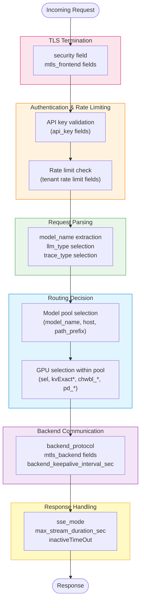

# AI Gateway Configuration Reference

!!! enterprise "Enterprise Feature"
    This feature requires loxilb-enterprise. It is not available in the community edition.
    See [Installation](../getting-started/installation.md) for enterprise binary setup.

This page consolidates all AI Gateway configuration fields in one place. For conceptual explanations and usage guidance, see the linked feature pages.

---

## Configuration Pipeline

The following diagram shows which configuration sections are evaluated at each stage of request processing. Use this to understand which fields matter for your use case:



---

## Quick Reference: Minimum Config per Feature

Use this table to find the minimum required fields to enable each AI Gateway feature:

| Feature | Required Fields | Optional Fields |
|---------|----------------|-----------------|
| **Basic L7 Proxy** | `mode: 4`, `backend_protocol: "http1"` | `security`, `host` |
| **Model-Based Routing** | + `model_name` on each LB rule | `sel`, `llm_type` |
| **KV Cache Routing** | + `kvExactMode: 1`, `kvHashAlgo`, `kvZmqPort` | `kvBlockSize`, `kvWarmupSec` |
| **GPU-Aware LB** | + `sel: 9` | (vLLM metrics auto-scraped) |
| **PD Disaggregation** | + `pd_disagg_mode: true`, `ep_role` on each endpoint | `pd_cache_aware_mode`, `pd_session_ttl_sec` |
| **SSE Streaming** | + `sse_mode: true` (auto-enabled by `llm_type`) | `max_stream_duration_sec` |
| **API Key Auth** | API key created via `/config/ai/apikey` | `allowed_models`, `rate_limit` |
| **Session Stickiness** | + `sel: 3`, `session_header_name` | `inactiveTimeOut` |
| **CHWBL Tuning** | + `sel: 8` | `chwbl_mean_load_factor`, `chwbl_replication` |
| **mTLS (Frontend)** | + `security: 1`, `mtls_frontend.client_cert_mode: "required"` | `client_ca_path`, `client_cn_pattern` |
| **mTLS (Backend)** | + `mtls_backend.verify_server_cert: true` | `backend_ca_path`, `client_cert_path` |

---

## Field Interaction Matrix

Some fields require, conflict with, or modify the behavior of other fields. This matrix prevents common misconfiguration errors:

| Field A | Relationship | Field B | Notes |
|---------|-------------|---------|-------|
| `pd_cache_aware_mode: true` | **requires** | `pd_disagg_mode: true` | Cache-aware decode only works with P/D enabled |
| `pd_disagg_mode: true` | **requires** | `ep_role: 1` or `2` on endpoints | Endpoints with `ep_role: 0` are ignored by P/D routing |
| `kvExactMode: 1` | **requires** | Tokenizer staged at `/etc/loxilb/tokenizers/` | Silently falls back to Tier 2 without tokenizer |
| `kvExactMode: 1` | **requires** | vLLM `--kv-events-config` | No block inventory without ZMQ publishing |
| `kvHashAlgo` | **must pair with** | vLLM `hash_algo` | `sha256_cbor` <-> `sha256`, `xxhash_cbor` <-> `xxhash128` |
| `sel: 9` (GPU-aware) | **requires** | vLLM `/metrics` endpoint reachable | Falls back to Tier 3 without metrics |
| `sel: 3` (persist) | **enhanced by** | `session_header_name` | Without header, falls back to IP-based persistence |
| `sse_mode: true` | **suppresses** | `inactiveTimeOut` | Idle timeout is paused during active SSE streams |
| `max_stream_duration_sec` | **overrides** | `sse_mode` timeout suppression | Hard cap even for active SSE streams |
| `security: 1` or `2` | **enables** | `mtls_frontend`, `mtls_backend` | mTLS fields ignored without TLS enabled |
| `model_name` | **creates** | Separate endpoint pool per value | Multiple rules on same VIP:port with different `model_name` |
| `backend_protocol: "http1"` | **required by** | All AI Gateway features | HTTP/2 backend not supported for AI Gateway |

---

## Service Arguments

### Core

| Field | Type | Valid Values | Default | Description | Feature Page |
|-------|------|-------------|---------|-------------|-------------|
| `mode` | int | `4` | - | **Must be `4`** (LBModeFullProxy) for all AI Gateway features | [Overview](overview.md) |
| `security` | int | `0`, `1`, `2` | `0` | TLS mode: `0`=plain HTTP, `1`=HTTPS/TLS termination, `2`=end-to-end HTTPS | [MCP Routing](mcp-gateway.md) |
| `backend_protocol` | string | `http1`, `http2`, `both` | `http1` | Backend protocol for ALPN negotiation. `http1`=HTTP/1.1 only (safest default), `http2`=HTTP/2 only, `both`=supports both | [Overview](overview.md) |
| `sel` | int | `0`-`10` | `0` | LB selection algorithm. See [LB Selection Modes](#lb-selection-modes) | [LLM Routing](llm-routing.md) |
| `host` | string | hostname or IP | - | SNI / `Host` header value for FullProxy mode routing | [MCP Routing](mcp-gateway.md) |
| `path_prefix` | string | URL path | - | URL path prefix for L7 routing (e.g. `/v1/chat/completions`). Empty = hostname-only matching | [LLM Routing](llm-routing.md) |
| `path_match_mode` | string | `disabled`, `prefix`, `exact` | `disabled` | Path matching mode. `disabled`=hostname-only (backward compat), `prefix`=longest-prefix match, `exact`=exact path match | [LLM Routing](llm-routing.md) |
| `inactiveTimeOut` | int | seconds | - | Per-rule idle timeout in seconds. Suppressed while an SSE stream is active (`sse_mode: true`) | [SSE Streaming](sse-quota-management.md) |
| `llm_type` | string | `chat-interactive`, `rag-longcontext`, `batch-inference`, `code-generation`, `default` | - | GPU routing catalog profile for load balancing decisions | [Model Load Balancing](model-load-balancing.md) |
| `trace_type` | string | `v1`, `anthropic`, `default` | - | Tracing catalog name for deep inspection and protocol analysis. Independent of `llm_type`. Enables body capture and parser invocation | [Overview](overview.md) |
| `model_name` | string | any model identifier | - | Model name for per-model endpoint pools. Omit for wildcard pool. Source: `sockproxy_routing.c` `build_ephash_key()` | [Model Load Balancing](model-load-balancing.md) |
| `session_header_name` | string | see below | - | Session affinity key for `sel: 3` (persist). Supports header, `cookie:<name>`, `query:<name>`, or `basic-auth`. See [Session Affinity Methods](#session-affinity-methods) | [LLM Routing](llm-routing.md) |

### KV Cache Routing

| Field | Type | Valid Values | Default | Description | Feature Page |
|-------|------|-------------|---------|-------------|-------------|
| `kvExactMode` | int | `0`, `1`, `2` | `0` | KV-exact routing mode. `0`=off, `1`=ZMQ subscriber, `2`=NATS (reserved). Source: `sockproxy_kv_exact.c` line 236 | [KV Caching](kv-caching.md) |
| `kvBlockSize` | int | > 0 | `16` | Number of tokens per block for hashing. Must match vLLM block size. Source: `sockproxy_kv_exact.c` line 274 | [KV Caching](kv-caching.md) |
| `kvHashAlgo` | string | `sha256_cbor`, `xxhash_cbor` | `"sha256_cbor"` | Hash algorithm for token block hashing. SHA256 produces 32-byte hashes, XXH3-128 produces 16-byte hashes. Source: `sockproxy_kv_exact.c` line 178 | [KV Caching](kv-caching.md) |
| `kvZmqPort` | int | 1-65535 | `5557` | ZMQ PUB socket port on each vLLM instance | [KV Caching](kv-caching.md) |
| `kvWarmupSec` | int | >= 0 | `30` | Seconds to wait before activating Tier 1.5 routing. Source: `sockproxy_kv_exact.c` line 241 | [KV Caching](kv-caching.md) |

### PD Disaggregation

| Field | Type | Valid Values | Default | Description | Feature Page |
|-------|------|-------------|---------|-------------|-------------|
| `pd_disagg_mode` | bool | `true`, `false` | `false` | Enable prefill/decode disaggregation. Source: `sockproxy_pd.c` | [PD Disaggregation](pd-disaggregation.md) |
| `pd_cache_aware_mode` | bool | `true`, `false` | `false` | Enable session stickiness + trie matching + min-load for decode endpoints. Requires `pd_disagg_mode: true`. Source: `sockproxy_pd_trie.c` | [PD Disaggregation](pd-disaggregation.md) |
| `pd_session_ttl_sec` | int | >= 0 | `0` | Session stickiness TTL for decode endpoints (seconds). `0` = no automatic expiry | [PD Disaggregation](pd-disaggregation.md) |
| `pd_cache_threshold` | int | 0-100 | `20` | Cache match threshold for P/D cache-aware routing. Lower values make cache routing more aggressive. Source: `sockproxy_pd.c` | [PD Disaggregation](pd-disaggregation.md) |
| `pd_balance_abs_threshold` | int | >= 0 | `3` | Load imbalance threshold. If max-min active connections exceeds this value, cache affinity is bypassed. Source: `sockproxy_pd.c` | [PD Disaggregation](pd-disaggregation.md) |

### SSE Streaming

| Field | Type | Valid Values | Default | Description | Feature Page |
|-------|------|-------------|---------|-------------|-------------|
| `sse_mode` | bool | `true`, `false` | `false` | Suppress idle timeout while `Content-Type: text/event-stream` is active. Required for OpenAI-compatible streaming endpoints | [SSE Streaming](sse-quota-management.md) |
| `max_stream_duration_sec` | int | `0`-`86400` | `0` | Absolute wall-clock cap for SSE streams in seconds. `0` = 24h hard cap (`PROXY_SSE_HARD_CAP_SEC`). Values > 86400 are rejected | [SSE Streaming](sse-quota-management.md) |
| `backend_keepalive_interval_sec` | int | >= 0 | `0` | Sets `SO_KEEPALIVE` + `TCP_KEEPIDLE` on the backend socket in seconds. Keeps TCP NAT entries alive during long SSE streams. `0` = disabled. Recommended: `60` in cloud environments | [SSE Streaming](sse-quota-management.md) |

### CHWBL Tuning

Advanced tuning for `sel: 8` (CHWBL) and `sel: 10` (WRR_HASH) modes. All fields default to the values shown; only override when you have a specific reason.

| Field | Type | Valid Values | Default | Description | Feature Page |
|-------|------|-------------|---------|-------------|-------------|
| `chwbl_prefix_hash_level` | int | `1`, `2`, `3` | `1` | Prefix hash depth. `1`=system prompt+model only, `2`=+session context, `3`=+RAG | [LLM Routing](llm-routing.md) |
| `chwbl_prefix_hash_flags` | int | `0`-`255` | `0` | Bit flags for additional field inclusion. `0`=auto-detect. Bit 0=LoRA, 1=image, 2=audio, 3=cache_salt, 4=tools, 5=session, 6=RAG template, 7=RAG docs | [LLM Routing](llm-routing.md) |
| `chwbl_mean_load_factor` | int | `100`-`300` | `125` | Maximum load factor as a percentage of average load. `125` = allow 25% overload before bypassing cache affinity. Source: `sockproxy_lb.c` CHWBL implementation | [LLM Routing](llm-routing.md) |
| `chwbl_replication` | int | `1`-`1024` | `100` | Virtual nodes per physical endpoint on the consistent-hash ring. Higher values improve distribution at the cost of memory. Source: `sockproxy_lb.c` | [LLM Routing](llm-routing.md) |
| `chwbl_enable_cache_salt` | bool | `true`, `false` | `false` | Require `cache_salt` field in requests for strict multi-tenant isolation | [LLM Routing](llm-routing.md) |

### mTLS

Applies only when `security: 1` (HTTPS) or `security: 2` (E2E HTTPS) and `mode: 4` (FullProxy).

**`mtls_frontend`** -- client certificate verification (client -> loxilb):

| Field | Type | Valid Values | Default | Description |
|-------|------|-------------|---------|-------------|
| `client_cert_mode` | string | `disabled`, `optional`, `required` | `disabled` | Client certificate requirement. `required` rejects connections without a valid cert |
| `client_ca_path` | string | filesystem path | - | Path to client CA bundle (PEM). e.g. `/opt/loxilb/cert/client_ca_bundle.crt` |
| `client_ca_cert_data` | string | base64-encoded PEM | - | Inline CA certificate data. Alternative to `client_ca_path` for Kubernetes secrets |
| `require_client_cn` | bool | `true`, `false` | `false` | Require a specific CN pattern in the client certificate |
| `client_cn_pattern` | string | glob pattern | - | Required CN pattern (e.g. `*.corp.example.com`). Supports wildcards. Active only if `require_client_cn: true` |

**`mtls_backend`** -- backend server certificate verification (loxilb -> backend):

| Field | Type | Valid Values | Default | Description |
|-------|------|-------------|---------|-------------|
| `verify_server_cert` | bool | `true`, `false` | `false` | Verify backend TLS certificate (`SSL_VERIFY_PEER`). `false` = skip verification (default, backward compat) |
| `backend_ca_path` | string | filesystem path | - | Path to backend CA bundle (PEM). Empty = system CA store |
| `client_cert_path` | string | filesystem path | - | Path to loxilb's client certificate for backend mTLS |
| `client_key_path` | string | filesystem path | - | Path to loxilb's private key for backend mTLS |
| `client_cert_data` | string | base64-encoded PEM | - | Inline client certificate. Alternative to `client_cert_path` |
| `client_key_data` | string | base64-encoded PEM | - | Inline client key. Alternative to `client_key_path` |

---

## Endpoint Fields

| Field | Type | Valid Values | Default | Description | Feature Page |
|-------|------|-------------|---------|-------------|-------------|
| `endpointIP` | string | IP address | - | Backend vLLM instance IP address | - |
| `targetPort` | int | 1-65535 | - | Backend vLLM serving port | - |
| `weight` | int | >= 1 | `1` | Endpoint weight for weighted selection modes | - |
| `ep_role` | int | `0`, `1`, `2` | `0` | Endpoint role: `0`=normal, `1`=prefill, `2`=decode. Source: `sockproxy_pd.c` | [PD Disaggregation](pd-disaggregation.md) |
| `nixl_port` | int | 1-65535 | - | NIXL sideband port for KV cache transfer (prefill endpoints only) | [PD Disaggregation](pd-disaggregation.md) |

---

## Session Affinity Methods

Used with `session_header_name` when `sel: 3` (persist). Specify the extraction method as the field value:

| `session_header_name` value | What loxilb extracts | Example client |
|---|---|---|
| `X-Session-ID` (or any header name) | Full value of the named header | LangChain, custom agents |
| `mcp-session-id` | Full value of `mcp-session-id` header | MCP clients |
| `cookie:JSESSIONID` | `JSESSIONID` value from `Cookie:` header | Java / Spring |
| `cookie:SESSION_TOKEN` | Named cookie value | Any web application |
| `query:session_id` | `session_id` value from URL query string | REST clients |
| `basic-auth` | Username from `Authorization: Basic ...` | Internal services |

If `session_header_name` is empty and `sel: 3`, loxilb falls back to IP-based persistence.

---

## LB Selection Modes

Full selection mode table (all valid `sel` values). LLM-specific modes are highlighted.

| `sel` | Name | Description | Best For |
|---|---|---|---|
| `0` | Round-Robin | Distributes requests evenly in sequence | Stateless endpoints |
| `1` | Hash | Consistent hash on client IP | IP-based affinity |
| `2` | Priority / WRR | Weighted round-robin by endpoint weight | Heterogeneous GPU pools |
| `3` | Persist | Session-sticky: binds session header to a backend | MCP agents, stateful LLM sessions |
| `4` | Least-Connection | Routes to the endpoint with the fewest active connections | General purpose load balancing |
| `8` | **CHWBL** | Consistent hash with bounded loads -- Tier 3 fallback in LLM routing. Source: `sockproxy_lb.c` | **Conversational workloads -- preserves KV cache locality** |
| `9` | **GPU-Aware** | GPU queue-depth scoring from live vLLM metrics. Source: `sockproxy_metrics.c` | **Batch/independent queries -- optimizes throughput** |
| `10` | **WRR_Hash** | Weighted round-robin with consistent hash. Source: `sockproxy_lb.c` | **Mixed or transitional LLM workloads** |

See [LLM Routing](llm-routing.md) for detailed guidance on choosing a selection mode.

---

## REST API Endpoints

All paths are relative to `http://<loxilb-host>:11111/netlox/v1/`.

| Method | Path | Description | Feature Page |
|--------|------|-------------|-------------|
| `POST` | `/config/loadbalancer` | Create LB rule (service arguments + endpoints) | [LLM Routing](llm-routing.md) |
| `GET` | `/config/loadbalancer/all` | List all LB rules | [LLM Routing](llm-routing.md) |
| `DELETE` | `/config/loadbalancer` | Delete LB rule | [LLM Routing](llm-routing.md) |
| `POST` | `/config/ai/apikey` | Create API key | [API Key Management](api-key-management.md) |
| `GET` | `/config/ai/apikey` | List API keys (filter by `?tenant_id=`) | [API Key Management](api-key-management.md) |
| `GET` | `/config/ai/apikey/{key_id}` | Get a single API key by ID | [API Key Management](api-key-management.md) |
| `DELETE` | `/config/ai/apikey/{key_id}` | Delete API key | [API Key Management](api-key-management.md) |
| `POST` | `/config/ai/tenant/ratelimit` | Create or update tenant rate limit | [SSE Streaming](sse-quota-management.md) |
| `GET` | `/config/ai/tenant/ratelimit/{tenant_id}` | Get rate limit configuration for a tenant | [SSE Streaming](sse-quota-management.md) |
| `GET` | `/config/gpu/status` | Get GPU monitoring status | [vLLM Integration](vllm-integration.md) |

---

## Prerequisites Checklist

Before configuring AI Gateway features, verify:

- [ ] loxilb-enterprise binary installed (not community edition)
- [ ] `mode: 4` (LBModeFullProxy) set on LB service
- [ ] `backend_protocol: "http1"` set on LB service
- [ ] `--userservice` flag set at loxilb startup (for API key enforcement)
- [ ] vLLM started with `--enable-metrics` (for GPU-aware selection)
- [ ] Tokenizer files staged at `/etc/loxilb/tokenizers/` (for KV-exact routing)
- [ ] ZMQ port 5557 open between loxilb and vLLM instances (for KV-exact routing)

---

## Common Configuration Examples

### Minimal: Basic L7 Proxy with Round-Robin

The simplest AI Gateway configuration -- L7 proxy mode with round-robin load balancing:

```bash
curl -X POST http://loxilb:11111/netlox/v1/config/loadbalancer \
  -H "Content-Type: application/json" \
  -d '{
    "serviceArguments": {
      "externalIP": "10.0.0.100",
      "port": 443,
      "protocol": "tcp",
      "mode": 4,
      "backend_protocol": "http1",
      "sel": 0
    },
    "endpoints": [
      {"endpointIP": "10.0.1.1", "targetPort": 8080, "weight": 1},
      {"endpointIP": "10.0.1.2", "targetPort": 8080, "weight": 1}
    ]
  }'
```

### Intermediate: Multi-Model with KV Cache Routing

Two model pools with KV cache-aware routing on the larger model:

```bash
# Large model pool with KV cache routing
curl -X POST http://loxilb:11111/netlox/v1/config/loadbalancer \
  -H "Content-Type: application/json" \
  -d '{
    "serviceArguments": {
      "externalIP": "10.0.0.100", "port": 443, "protocol": "tcp",
      "mode": 4, "backend_protocol": "http1",
      "model_name": "llama3-70b",
      "sel": 8, "llm_type": "chat-interactive",
      "kvExactMode": 1, "kvBlockSize": 16,
      "kvHashAlgo": "sha256_cbor", "kvZmqPort": 5557, "kvWarmupSec": 30
    },
    "endpoints": [
      {"endpointIP": "10.0.1.1", "targetPort": 8080, "weight": 1},
      {"endpointIP": "10.0.1.2", "targetPort": 8080, "weight": 1}
    ]
  }'

# Small model pool with GPU-aware routing
curl -X POST http://loxilb:11111/netlox/v1/config/loadbalancer \
  -H "Content-Type: application/json" \
  -d '{
    "serviceArguments": {
      "externalIP": "10.0.0.100", "port": 443, "protocol": "tcp",
      "mode": 4, "backend_protocol": "http1",
      "model_name": "llama3-8b", "sel": 9
    },
    "endpoints": [
      {"endpointIP": "10.0.2.1", "targetPort": 8080, "weight": 1},
      {"endpointIP": "10.0.2.2", "targetPort": 8080, "weight": 1},
      {"endpointIP": "10.0.2.3", "targetPort": 8080, "weight": 1}
    ]
  }'
```

### Advanced: Full P/D with KV Cache, TLS, and mTLS

Production deployment with all features enabled:

```bash
curl -X POST http://loxilb:11111/netlox/v1/config/loadbalancer \
  -H "Content-Type: application/json" \
  -d '{
    "serviceArguments": {
      "externalIP": "10.0.0.100", "port": 443, "protocol": "tcp",
      "mode": 4, "security": 1, "backend_protocol": "http1",
      "sel": 8, "llm_type": "chat-interactive",
      "kvExactMode": 1, "kvBlockSize": 16,
      "kvHashAlgo": "sha256_cbor", "kvZmqPort": 5557, "kvWarmupSec": 60,
      "pd_disagg_mode": true, "pd_cache_aware_mode": true,
      "pd_cache_threshold": 20, "pd_balance_abs_threshold": 3,
      "pd_session_ttl_sec": 300,
      "sse_mode": true, "max_stream_duration_sec": 300,
      "backend_keepalive_interval_sec": 60,
      "mtls_frontend": {
        "client_cert_mode": "required",
        "client_ca_path": "/opt/loxilb/cert/client_ca.crt"
      },
      "mtls_backend": {
        "verify_server_cert": true,
        "backend_ca_path": "/opt/loxilb/cert/backend_ca.crt"
      }
    },
    "endpoints": [
      {"endpointIP": "10.0.1.1", "targetPort": 8080, "weight": 1, "ep_role": 1, "nixl_port": 5600},
      {"endpointIP": "10.0.1.2", "targetPort": 8080, "weight": 1, "ep_role": 1, "nixl_port": 5600},
      {"endpointIP": "10.0.2.1", "targetPort": 8080, "weight": 1, "ep_role": 2},
      {"endpointIP": "10.0.2.2", "targetPort": 8080, "weight": 1, "ep_role": 2},
      {"endpointIP": "10.0.2.3", "targetPort": 8080, "weight": 1, "ep_role": 2}
    ]
  }'
```

### Default Values Summary

All default values verified against sockproxy source code:

| Field | Default | Source |
|-------|---------|--------|
| `kvBlockSize` | `16` | `sockproxy_kv_exact.c` line 274 |
| `kvHashAlgo` | `"sha256_cbor"` | `sockproxy_kv_exact.c` line 178 |
| `kvZmqPort` | `5557` | ZMQ default |
| `kvWarmupSec` | `30` | `sockproxy_kv_exact.c` line 241 |
| `pd_cache_threshold` | `20` | `sockproxy_pd.c` |
| `pd_balance_abs_threshold` | `3` | `sockproxy_pd.c` |
| `chwbl_mean_load_factor` | `125` | `sockproxy_lb.c` (175 for WRR_HASH) |
| `chwbl_replication` | `100` | `sockproxy_lb.c` |
| `max_stream_duration_sec` | `0` (24h hard cap) | `sockproxy_http.c` |

---

## See Also

- [AI Gateway Overview](overview.md) -- Conceptual introduction and traffic flow
- [LLM Routing](llm-routing.md) -- Four-tier routing architecture, CHWBL, GPU-aware scoring
- [MCP Routing](mcp-gateway.md) -- Session-sticky routing and SSE connection handling
- [SSE Streaming and Quota Management](sse-quota-management.md) -- Stream lifetime, duration caps, token quotas
- [KV Caching](kv-caching.md) -- KV-exact routing configuration
- [vLLM Integration](vllm-integration.md) -- GPU metrics scraping
- [Model Load Balancing](model-load-balancing.md) -- Per-model endpoint pools
- [PD Disaggregation](pd-disaggregation.md) -- Prefill/decode separation
- [API Key Management](api-key-management.md) -- API key lifecycle and per-key rate limits
- [SSE Quota Management](sse-quota-management.md) -- Token quota management
- [API Key Management API Reference](../reference/api.md#ai-gateway-api-key-management)
- [Tenant Rate Limits API Reference](../reference/api.md#ai-gateway-tenant-rate-limits)
- [GPU and LLM Catalog API Reference](../reference/api.md#ai-gateway-gpu-and-llm-catalog)
