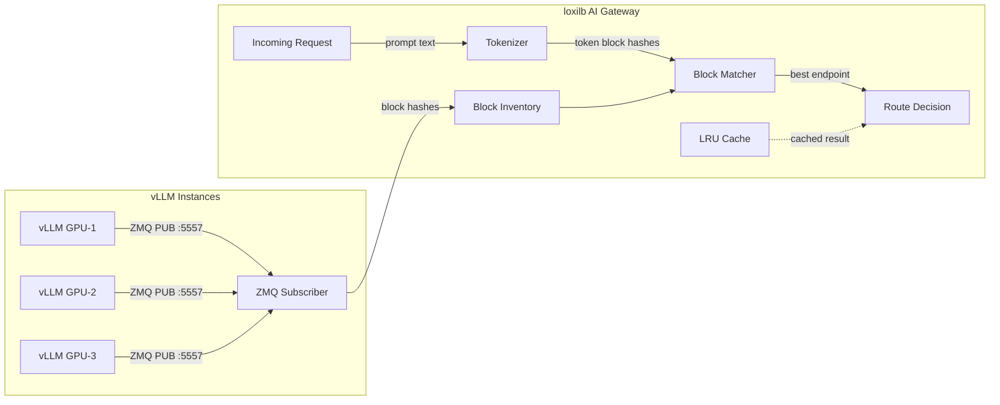

# KV Caching

!!! enterprise "Enterprise Feature"
    This feature requires loxilb-enterprise. It is not available in the community edition.
    See [Installation](../getting-started/installation.md) for enterprise binary setup.

## What is KV Caching?

KV cache stands for **key-value attention matrices** stored in GPU memory during LLM inference. When a user sends a message to an LLM, the GPU computes attention matrices for every token in the conversation — these matrices are the KV cache. Think of it as a **server-side session cache**, but stored in GPU VRAM instead of RAM.

Why does routing matter? If request N goes to GPU-A (which has the KV cache from the previous conversation turns), but request N+1 goes to GPU-B, GPU-B has no cache for that conversation. It must **recompute the entire conversation context from scratch** — a 3-5x latency penalty. For a 10-turn conversation, that means reprocessing all previous turns before generating a single new token.

loxilb's KV cache-aware routing solves this by directing each request to the GPU that already holds the relevant KV cache blocks, preserving cache locality while maintaining load balance across the fleet.

## How loxilb Implements KV-Aware Routing

KV-aware routing (Tier 1.5 in the [routing architecture](llm-routing.md)) uses three components working together:



### ZMQ Subscriber

The ZMQ subscriber (`ai_kv_subscriber.go`) connects to each vLLM instance's ZMQ PUB socket. It receives **msgpack-encoded `KVEventBatch` messages** listing which token-block hashes each GPU currently holds. This builds a per-endpoint **block inventory** — essentially a map of "which GPU has which pieces of which conversations in memory."

- Wire format: msgpack-encoded KVEventBatch on ZMQ PUB socket
- Default port: 5557 (configurable via `kvZmqPort`)
- Connection: one subscriber per vLLM endpoint


### Tokenizer

When a request arrives, loxilb tokenizes the prompt — converting text to token IDs using the model's HuggingFace tokenizer file. The tokens are then grouped into blocks (configurable size via `kvBlockSize`) and hashed using the configured algorithm (`kvHashAlgo`). This produces a set of block hashes representing the prompt content.

The tokenizer is loaded from a staged file on the loxilb host. See [Tokenizer Staging](#tokenizer-staging) below.


### LRU Cache

A **4096-entry LRU cache** keyed by `(model-slug, first 512 chars of prompt)` avoids re-tokenizing identical or similar prompts. This is particularly effective when many requests share the same system prompt — the tokenization result is cached and reused.


### Block Matching

The hashed blocks from the incoming prompt are compared against each endpoint's block inventory. The endpoint with the **highest cache hit count** is selected — the GPU that already has the most relevant KV cache blocks for this prompt in its VRAM.

## REST API Config

Configure KV cache-aware routing via `POST /config/services` with the KV-specific `serviceArguments` fields:

```bash
curl -X POST http://loxilb:11111/netlox/v1/config/services \
  -H "Authorization: Bearer <token>" \
  -H "Content-Type: application/json" \
  -d '{
    "serviceArguments": {
      "externalIP": "192.168.1.100",
      "port": 443,
      "protocol": "tcp",
      "mode": 4,
      "sel": 8,
      "backend_protocol": "http1",
      "llm_type": "chat-interactive",
      "kvExactMode": 1,
      "kvBlockSize": 16,
      "kvHashAlgo": "sha256_cbor",
      "kvZmqPort": 5557,
      "kvWarmupSec": 30
    },
    "endpoints": [
      {"endpointIP": "10.0.1.1", "targetPort": 8080, "weight": 1},
      {"endpointIP": "10.0.1.2", "targetPort": 8080, "weight": 1}
    ]
  }'

# Response (200):
# {"result": "Success"}
```

!!! warning "Required: FullProxy Mode"
    KV cache routing requires `mode: 4` (LBModeFullProxy) and `backend_protocol: "http1"`. Other LB modes cannot inspect HTTP bodies for prompt content.

## Tokenizer Staging

!!! warning "Required: Stage Tokenizer Files"
    KV-exact routing **silently falls back** to Tier 2 (GPU queue-depth scoring) if the tokenizer file is missing. There is no error — only a log line: `kv-router: tokenizer not available for model`. If you enable `kvExactMode: 1` but see no improvement in cache hit rates, check that the tokenizer is staged correctly.

The tokenizer file must be placed at a specific path on the loxilb host:

```
/etc/loxilb/tokenizers/<model-slug>/tokenizer.json
```

**Model slug derivation:** Replace `/` with `__` in the model name.

| Model Name | Model Slug | Tokenizer Path |
|------------|------------|----------------|
| `meta-llama/Llama-3-8B` | `meta-llama__Llama-3-8B` | `/etc/loxilb/tokenizers/meta-llama__Llama-3-8B/tokenizer.json` |
| `mistralai/Mistral-7B-v0.1` | `mistralai__Mistral-7B-v0.1` | `/etc/loxilb/tokenizers/mistralai__Mistral-7B-v0.1/tokenizer.json` |

**File format:** The standard HuggingFace `tokenizer.json` file. Download it from the model's HuggingFace repository:

```bash
# Example: Download Llama-3-8B tokenizer
mkdir -p /etc/loxilb/tokenizers/meta-llama__Llama-3-8B/
wget -O /etc/loxilb/tokenizers/meta-llama__Llama-3-8B/tokenizer.json \
  https://huggingface.co/meta-llama/Llama-3-8B/raw/main/tokenizer.json
```


## Configuration Reference

| Field | Type | Valid Values | Default | Description |
|-------|------|-------------|---------|-------------|
| `kvExactMode` | int | `0`, `1` | `0` | KV-exact routing mode. `0`=off, `1`=zmq subscriber mode |
| `kvBlockSize` | int | > 0 | `16` | Number of tokens per block for hashing |
| `kvHashAlgo` | string | `sha256_cbor`, `xxhash_cbor` | `"sha256_cbor"` | Hash algorithm for token block hashing |
| `kvZmqPort` | int | 1–65535 | `5557` | ZMQ PUB socket port on each vLLM instance |
| `kvWarmupSec` | int | >= 0 | `30` | Seconds to wait before activating Tier 1.5 (allows block inventory to populate) |

## Verify

Confirm KV cache routing is configured by listing your service rules:

```bash
curl http://loxilb:11111/netlox/v1/config/services \
  -H "Authorization: Bearer <token>"
```

Check that the response includes your service rule with `kvExactMode: 1` and the expected KV fields. Also look for the following log line confirming the block inventory is active:

```
kv-router: block inventory populated, N endpoints active
```

## Troubleshooting

### Tier 1.5 Not Activating

**Symptoms:** KV cache routing enabled (`kvExactMode: 1`) but requests are not being routed based on cache hits. Logs show `kv-router: tokenizer not available for model`.

**Check:**

1. **Tokenizer file exists** at `/etc/loxilb/tokenizers/<model-slug>/tokenizer.json` — verify the model slug uses `__` not `/`.
2. **ZMQ port reachable** — ensure port 5557 (or your configured `kvZmqPort`) is open between loxilb and each vLLM instance. Test with `nc -zv <vllm-ip> 5557`.
3. **Warmup period** — Tier 1.5 does not activate until `kvWarmupSec` seconds after startup (default: 30s). Wait for the block inventory to populate before testing.
4. **vLLM KV block publishing** — Verify that vLLM is configured to publish KV block events on ZMQ. Check vLLM startup flags.

### High Cache Miss Rate

**Symptoms:** Tier 1.5 is active but cache hit rate is low.

**Check:**

1. **Block size mismatch** — Verify `kvBlockSize` matches the block size configured on your vLLM instances. Mismatched block sizes produce different hashes for the same content.
2. **Hash algorithm consistency** — All loxilb instances in an HA setup must use the same `kvHashAlgo`.
3. **Workload pattern** — KV-exact routing works best for conversational workloads with multi-turn conversations. For batch/one-shot queries, consider [GPU-aware selection](vllm-integration.md) (`sel: 9`) instead.

## See Also

- [LLM Routing](llm-routing.md) — Three-tier routing architecture overview
- [vLLM Integration](vllm-integration.md) — GPU metrics scraping (Tier 2)
- [AWS KV Cache Deployment](aws-kv-cache.md) — Deploying KV routing on AWS EKS
- [Configuration Reference](configuration-reference.md) — All AI Gateway config fields
- [GPU and LLM Catalog API Reference](../reference/api.md#ai-gateway-gpu-and-llm-catalog)
