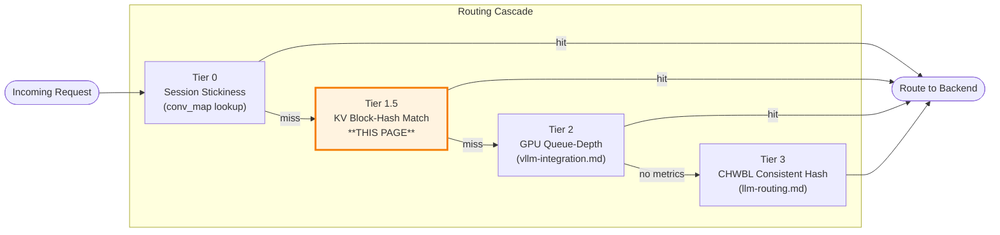
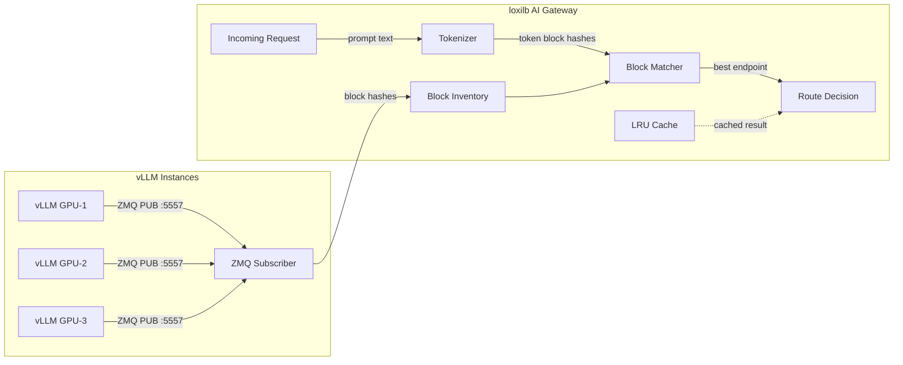
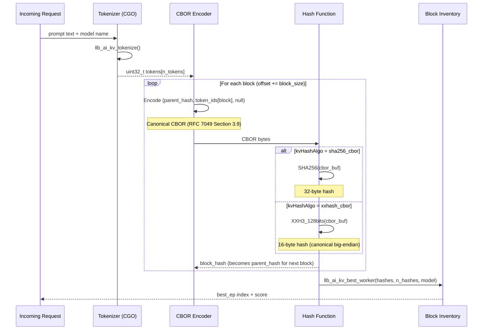

# KV Caching

!!! enterprise "Enterprise Feature"
    This feature requires loxilb-enterprise. It is not available in the community edition.
    See [Installation](../getting-started/installation.md) for enterprise binary setup.

## How This Page Fits Into the Bigger Picture

KV cache-aware routing is **Tier 1.5** in the [four-tier routing architecture](llm-routing.md). It sits between Session Stickiness (Tier 0) and GPU Queue-Depth Scoring (Tier 2):



**When Tier 1.5 fires:** A request arrives with no session stickiness hit (Tier 0 miss). Tier 1.5 tokenizes the prompt, hashes the token blocks, and compares them against each GPU's block inventory. If a GPU holds matching blocks, it is selected -- preserving KV cache locality without requiring an explicit conversation ID.

**When Tier 1.5 skips:** If `kvExactMode` is `0` (off), the tokenizer file is missing, or the warmup period has not elapsed, Tier 1.5 is bypassed and routing falls through to Tier 2.

---

## What is KV Caching?

KV cache stands for **key-value attention matrices** stored in GPU memory during LLM inference. When a user sends a message to an LLM, the GPU computes attention matrices for every token in the conversation -- these matrices are the KV cache. Think of it as a **server-side session cache**, but stored in GPU VRAM instead of RAM.

Why does routing matter? If request N goes to GPU-A (which has the KV cache from the previous conversation turns), but request N+1 goes to GPU-B, GPU-B has no cache for that conversation. It must **recompute the entire conversation context from scratch** -- a 3-5x latency penalty. For a 10-turn conversation, that means reprocessing all previous turns before generating a single new token.

loxilb's KV cache-aware routing solves this by directing each request to the GPU that already holds the relevant KV cache blocks, preserving cache locality while maintaining load balance across the fleet.

---

## How loxilb Implements KV-Aware Routing

KV-aware routing uses three components working together:



### ZMQ Subscriber

The ZMQ subscriber (`ai_kv_subscriber.go`) connects to each vLLM instance's ZMQ PUB socket. It receives **msgpack-encoded `KVEventBatch` messages** listing which token-block hashes each GPU currently holds. This builds a per-endpoint **block inventory** -- essentially a map of "which GPU has which pieces of which conversations in memory."

- Wire format: msgpack-encoded KVEventBatch on ZMQ PUB socket
- Default port: 5557 (configurable via `kvZmqPort`)
- Connection: one subscriber per vLLM endpoint


### Tokenizer

When a request arrives, loxilb tokenizes the prompt -- converting text to token IDs using the model's HuggingFace tokenizer file. The tokens are then grouped into blocks (configurable size via `kvBlockSize`, default: 16) and hashed using the configured algorithm (`kvHashAlgo`). This produces a set of block hashes representing the prompt content.

The tokenizer is loaded from a staged file on the loxilb host. See [Tokenizer Staging](#tokenizer-staging) below.


### LRU Cache

A **4096-entry LRU cache** keyed by `(model-slug, first 512 chars of prompt)` avoids re-tokenizing identical or similar prompts. This is particularly effective when many requests share the same system prompt -- the tokenization result is cached and reused.


### Block Matching

The hashed blocks from the incoming prompt are compared against each endpoint's block inventory. The endpoint with the **highest cache hit count** is selected -- the GPU that already has the most relevant KV cache blocks for this prompt in its VRAM.

---

## Deep Internals: Token Block Hashing

This section explains the C-level implementation in `sockproxy_kv_exact.c`. Understanding the hashing pipeline helps diagnose cache miss issues and tune block size.

### How Token Blocks Are Created

The `kv_compute_block_hashes()` function in `sockproxy_kv_exact.c` processes tokens in fixed-size blocks:

1. **Token array**: The prompt text is tokenized into a `uint32_t tokens[]` array (max `KV_MAX_TOKENS` entries)
2. **Block slicing**: Tokens are sliced into consecutive blocks of `block_size` tokens (default: 16). The last block may be shorter if the token count is not evenly divisible
3. **Chained hashing**: Each block's hash depends on the previous block's hash (chain linking), creating a Merkle-like chain that detects prefix reuse



### CBOR Encoding

Each block is encoded as a **canonical CBOR** tuple before hashing. The encoding follows RFC 7049 Section 3.9 (deterministic encoding):

```
CBOR array(3): [parent_hash_bytes, [token_id_0, token_id_1, ...], null]
```

- **Element 0**: Byte string containing the parent block's hash (zeros for the first block)
- **Element 1**: Array of unsigned integers (the token IDs in this block)
- **Element 2**: null (`0xF6`)

This encoding must produce **bit-identical** results to Python's `cbor2.dumps(canonical=True)` -- this is how loxilb's C-side hashes match vLLM's Python-side hashes.

### Hash Algorithms

Two algorithms are supported, configured via `kvHashAlgo`:

| Algorithm | `kvHashAlgo` Value | Hash Size | Speed | vLLM Pairing |
|-----------|-------------------|-----------|-------|-------------|
| SHA-256 | `sha256_cbor` | 32 bytes | Moderate | vLLM `hash_algo: "sha256"` |
| XXH3-128 | `xxhash_cbor` | 16 bytes | Fast | vLLM `hash_algo: "xxhash128"` |

**XXH3-128 details**: The `XXH3_128bits()` result is stored in canonical (big-endian) form via `XXH128_canonicalFromHash()`. This stores high64 first, then low64 -- matching Python `xxhash.xxh3_128_digest()` byte order.

!!! warning "Algorithm Pairing"
    The `kvHashAlgo` in loxilb **must match** the `hash_algo` configured on vLLM. Mismatched algorithms produce different hashes for the same content, resulting in zero cache hits. Pairing: `sha256_cbor` <-> `sha256`, `xxhash_cbor` <-> `xxhash128`.

### Warmup Period and Guards

The `pd_kv_exact_select()` function in `sockproxy_kv_exact.c` has several guard conditions that bypass Tier 1.5:

| Guard | Condition | Behavior |
|-------|-----------|----------|
| Mode off | `kv_exact_mode == 0` | Return -1 (skip Tier 1.5) |
| Warmup | Current time < `kv_warmup_start + kv_warmup_sec` | Return -1 (wait for inventory) |
| No text | Empty prompt or prefix | Return -1 |
| No model | Empty model name | Return -1 |
| Tokenize fail | `llb_ai_kv_tokenize()` returns <= 0 | Return -1 (tokenizer missing or error) |
| No match | `llb_ai_kv_best_worker()` returns score <= 0 | Return -1 (no GPU has matching blocks) |
| Excluded | `excluded_mask` bit set for best EP | Return -1 (endpoint excluded by circuit breaker) |

When any guard fires, routing falls through to Tier 2.

---

## Deep Internals: ZMQ Event Processing

The Go-side ZMQ subscriber (`ai_kv_subscriber.go`) manages the block inventory:

1. **Connection**: One ZMQ SUB socket per vLLM endpoint, connecting to port `kvZmqPort` (default: 5557)
2. **Message format**: msgpack-encoded `KVEventBatch` containing block hash add/remove events
3. **Inventory update**: Each event updates the per-endpoint block hash set -- adds record new KV cache entries, removes record evictions
4. **Query**: When `llb_ai_kv_best_worker()` is called from C, it scans all endpoint inventories and returns the endpoint index with the highest matching block count

**Eviction behavior**: When vLLM evicts KV cache blocks (due to memory pressure), it publishes remove events. loxilb's inventory is updated within one ZMQ message cycle, ensuring routing decisions reflect current GPU memory state.

---

## REST API Config

Configure KV cache-aware routing via `POST /netlox/v1/config/loadbalancer` with the KV-specific `serviceArguments` fields:

```bash
curl -X POST http://loxilb:11111/netlox/v1/config/loadbalancer \
  -H "Authorization: Bearer <token>" \
  -H "Content-Type: application/json" \
  -d '{
    "serviceArguments": {
      "externalIP": "192.168.1.100",
      "port": 443,
      "protocol": "tcp",
      "mode": 4,
      "sel": 8,
      "backend_protocol": "http1",
      "llm_type": "chat-interactive",
      "kvExactMode": 1,
      "kvBlockSize": 16,
      "kvHashAlgo": "sha256_cbor",
      "kvZmqPort": 5557,
      "kvWarmupSec": 30
    },
    "endpoints": [
      {"endpointIP": "10.0.1.1", "targetPort": 8080, "weight": 1},
      {"endpointIP": "10.0.1.2", "targetPort": 8080, "weight": 1}
    ]
  }'

# Response (200):
# {"result": "Success"}
```

!!! warning "Required: FullProxy Mode"
    KV cache routing requires `mode: 4` (LBModeFullProxy) and `backend_protocol: "http1"`. Other LB modes cannot inspect HTTP bodies for prompt content.

---

## Tokenizer Staging

!!! warning "Required: Stage Tokenizer Files"
    KV-exact routing **silently falls back** to Tier 2 (GPU queue-depth scoring) if the tokenizer file is missing. There is no error -- only a log line: `kv-router: tokenizer not available for model`. If you enable `kvExactMode: 1` but see no improvement in cache hit rates, check that the tokenizer is staged correctly.

The tokenizer file must be placed at a specific path on the loxilb host:

```
/etc/loxilb/tokenizers/<model-slug>/tokenizer.json
```

**Model slug derivation:** Replace `/` with `__` in the model name.

| Model Name | Model Slug | Tokenizer Path |
|------------|------------|----------------|
| `meta-llama/Llama-3-8B` | `meta-llama__Llama-3-8B` | `/etc/loxilb/tokenizers/meta-llama__Llama-3-8B/tokenizer.json` |
| `mistralai/Mistral-7B-v0.1` | `mistralai__Mistral-7B-v0.1` | `/etc/loxilb/tokenizers/mistralai__Mistral-7B-v0.1/tokenizer.json` |

**File format:** The standard HuggingFace `tokenizer.json` file. Download it from the model's HuggingFace repository:

```bash
# Example: Download Llama-3-8B tokenizer
mkdir -p /etc/loxilb/tokenizers/meta-llama__Llama-3-8B/
wget -O /etc/loxilb/tokenizers/meta-llama__Llama-3-8B/tokenizer.json \
  https://huggingface.co/meta-llama/Llama-3-8B/raw/main/tokenizer.json
```

---

## Configuration Reference

| Field | Type | Valid Values | Default | Description |
|-------|------|-------------|---------|-------------|
| `kvExactMode` | int | `0`, `1`, `2` | `0` | KV-exact routing mode. `0`=off, `1`=zmq subscriber mode, `2`=nats (reserved) |
| `kvBlockSize` | int | > 0 | `16` | Number of tokens per block for hashing. Must match vLLM's block size. Source: `sockproxy_kv_exact.c` line 274 (`if (block_size == 0) block_size = 16`) |
| `kvHashAlgo` | string | `sha256_cbor`, `xxhash_cbor` | `"sha256_cbor"` | Hash algorithm for token block hashing. Determines hash stride (32 bytes for SHA256, 16 bytes for XXH3-128). Must pair with vLLM's `hash_algo`. |
| `kvZmqPort` | int | 1-65535 | `5557` | ZMQ PUB socket port on each vLLM instance |
| `kvWarmupSec` | int | >= 0 | `30` | Seconds to wait before activating Tier 1.5 (allows block inventory to populate). Source: `sockproxy_kv_exact.c` line 241 |

---

## Deployment Scenarios

### Scenario 1: Basic KV-Aware Routing (3 GPUs)

A simple 3-GPU setup with KV-exact routing enabled. Each GPU runs vLLM with ZMQ block publishing.

```bash
curl -X POST http://loxilb:11111/netlox/v1/config/loadbalancer \
  -H "Authorization: Bearer <token>" \
  -H "Content-Type: application/json" \
  -d '{
    "serviceArguments": {
      "externalIP": "192.168.1.100",
      "port": 443,
      "protocol": "tcp",
      "mode": 4,
      "sel": 8,
      "backend_protocol": "http1",
      "llm_type": "chat-interactive",
      "kvExactMode": 1,
      "kvBlockSize": 16,
      "kvHashAlgo": "sha256_cbor",
      "kvZmqPort": 5557,
      "kvWarmupSec": 30
    },
    "endpoints": [
      {"endpointIP": "10.0.1.1", "targetPort": 8080, "weight": 1},
      {"endpointIP": "10.0.1.2", "targetPort": 8080, "weight": 1},
      {"endpointIP": "10.0.1.3", "targetPort": 8080, "weight": 1}
    ]
  }'
```

**vLLM launch command** (each GPU):
```bash
python -m vllm.entrypoints.openai.api_server \
  --model meta-llama/Llama-3-8B \
  --host 0.0.0.0 --port 8080 \
  --kv-events-config '{"publisher":"zmq","zmq":{"port":5557,"num_topics":1},"hash_algo":"sha256"}'
```

**What each field does:**

- `kvExactMode: 1` -- Enables ZMQ-based KV block tracking (mode 1)
- `kvBlockSize: 16` -- Tokens are grouped into 16-token blocks before hashing. Must match vLLM's block size
- `kvHashAlgo: "sha256_cbor"` -- SHA-256 hash over canonical CBOR encoding. Pair with vLLM `hash_algo: "sha256"`
- `kvZmqPort: 5557` -- loxilb connects to each vLLM instance's ZMQ PUB socket on this port
- `kvWarmupSec: 30` -- Wait 30 seconds after startup before activating Tier 1.5, allowing the block inventory to populate
- `sel: 8` -- CHWBL consistent hash as the fallback algorithm (Tier 3)
- `llm_type: "chat-interactive"` -- Enables SSE streaming and conversation tracking

### Scenario 2: KV + PD Disaggregation Combined

An advanced scenario combining KV cache routing with prefill/decode disaggregation. KV-aware routing selects the best prefill endpoint, and cache-aware decode selection routes decode requests to GPUs with matching prompt prefixes.

```bash
curl -X POST http://loxilb:11111/netlox/v1/config/loadbalancer \
  -H "Authorization: Bearer <token>" \
  -H "Content-Type: application/json" \
  -d '{
    "serviceArguments": {
      "externalIP": "10.0.0.100",
      "port": 443,
      "protocol": "tcp",
      "mode": 4,
      "sel": 8,
      "backend_protocol": "http1",
      "llm_type": "chat-interactive",
      "kvExactMode": 1,
      "kvBlockSize": 16,
      "kvHashAlgo": "sha256_cbor",
      "kvZmqPort": 5557,
      "kvWarmupSec": 30,
      "pd_disagg_mode": true,
      "pd_cache_aware_mode": true,
      "pd_cache_threshold": 20,
      "pd_balance_abs_threshold": 3
    },
    "endpoints": [
      {"endpointIP": "10.0.1.1", "targetPort": 8080, "weight": 1, "ep_role": "prefill", "nixl_port": 5600},
      {"endpointIP": "10.0.1.2", "targetPort": 8080, "weight": 1, "ep_role": "prefill", "nixl_port": 5600},
      {"endpointIP": "10.0.2.1", "targetPort": 8080, "weight": 1, "ep_role": "decode"},
      {"endpointIP": "10.0.2.2", "targetPort": 8080, "weight": 1, "ep_role": "decode"},
      {"endpointIP": "10.0.2.3", "targetPort": 8080, "weight": 1, "ep_role": "decode"}
    ]
  }'
```

**How KV and PD interact:**

1. **KV Tier 1.5** selects the best *prefill* endpoint based on block hash matching
2. The prefill endpoint processes the prompt and transfers the KV cache to a decode endpoint via NIXL
3. **`pd_cache_aware_mode`** uses a radix trie to route the decode phase to a GPU that already has matching prompt prefix data
4. If the trie match score exceeds `pd_cache_threshold` (default: 20), the trie-selected decode endpoint is used; otherwise, the least-loaded decode endpoint is chosen

See [PD Disaggregation](pd-disaggregation.md) for full P/D configuration details.

---

## Verify

Confirm KV cache routing is configured by listing your service rules:

```bash
curl http://loxilb:11111/netlox/v1/config/loadbalancer/all
```

Check that the response includes your service rule with `kvExactMode: 1` and the expected KV fields. Also look for the following log line confirming the block inventory is active:

```
kv-router: block inventory populated, N endpoints active
```

---

## Troubleshooting

### Tier 1.5 Not Activating

**Symptoms:** KV cache routing enabled (`kvExactMode: 1`) but requests are not being routed based on cache hits. Logs show `kv-router: tokenizer not available for model`.

**Check:**

1. **Tokenizer file exists** at `/etc/loxilb/tokenizers/<model-slug>/tokenizer.json` -- verify the model slug uses `__` not `/`.
2. **ZMQ port reachable** -- ensure port 5557 (or your configured `kvZmqPort`) is open between loxilb and each vLLM instance. Test with `nc -zv <vllm-ip> 5557`.
3. **Warmup period** -- Tier 1.5 does not activate until `kvWarmupSec` seconds after startup (default: 30s). Wait for the block inventory to populate before testing.
4. **vLLM KV block publishing** -- Verify vLLM is started with `--kv-events-config` to publish KV block events on ZMQ. The required flag is:

    ```bash
    --kv-events-config '{"publisher":"zmq","zmq":{"port":5557,"num_topics":1},"hash_algo":"sha256"}'
    ```

    The `hash_algo` in vLLM must pair with `kvHashAlgo` in loxilb: `sha256` <-> `sha256_cbor`, `xxhash128` <-> `xxhash_cbor`. Mismatched algorithms produce no cache hits.

### High Cache Miss Rate

**Symptoms:** Tier 1.5 is active but cache hit rate is low.

**Check:**

1. **Block size mismatch** -- Verify `kvBlockSize` matches the block size configured on your vLLM instances. Mismatched block sizes produce different hashes for the same content.
2. **Hash algorithm consistency** -- All loxilb instances in an HA setup must use the same `kvHashAlgo`.
3. **Workload pattern** -- KV-exact routing works best for conversational workloads with multi-turn conversations. For batch/one-shot queries, consider [GPU-aware selection](vllm-integration.md) (`sel: 9`) instead.

### ZMQ Connection Failures

**Symptoms:** Log shows `kv-subscriber: connection failed to <ip>:5557` or block inventory stays empty.

**Check:**

1. **Firewall rules** -- ZMQ uses TCP. Ensure port 5557 is open from loxilb to each vLLM instance.
2. **vLLM running** -- The ZMQ PUB socket is only active while vLLM is serving. If vLLM crashes or restarts, loxilb's subscriber reconnects automatically.
3. **Port conflict** -- If another process is using port 5557 on the vLLM host, change `kvZmqPort` on both sides.

### Tokenizer Not Found

**Symptoms:** Log shows `kv-router: tokenizer not available for model <name>` despite the file existing.

**Check:**

1. **Model slug derivation** -- The model name is converted to a slug by replacing `/` with `__`. Verify the directory name matches exactly (case-sensitive).
2. **File permissions** -- The loxilb process must be able to read the tokenizer file.
3. **File format** -- Must be a valid HuggingFace `tokenizer.json` file, not a SentencePiece or other format.

---

## Next Steps

- [LLM Routing](llm-routing.md) -- Three-tier routing architecture overview
- [vLLM Integration](vllm-integration.md) -- GPU metrics scraping (Tier 2)
- [PD Disaggregation](pd-disaggregation.md) -- Combine KV routing with prefill/decode GPU separation
- [AWS KV Cache Deployment](aws-kv-cache.md) -- Deploying KV routing on AWS EKS
- [Configuration Reference](configuration-reference.md) -- All AI Gateway config fields
