# LLM Routing

!!! enterprise "Enterprise Feature"
    This feature requires loxilb-enterprise. It is not available in the community edition.
    See [Installation](../getting-started/installation.md) for enterprise binary setup.

loxilb-enterprise routes LLM inference requests intelligently across your GPU fleet — keeping hot KV caches in use, routing each model to the right backend pool, and reacting to GPU load in real time. This page explains how each routing tier works and how to configure them.

---

## How This Page Fits Into the Bigger Picture

AI Gateway routing happens in **two sequential stages**. It helps to understand where this page fits before diving into the details:

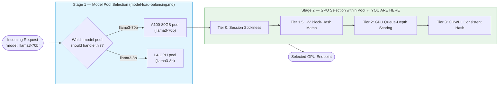

| Stage | Question Answered | Key Config | Covered In |
|---|---|---|---|
| **Stage 1** — Model Pool Selection | *Which backend pool handles this model?* | `model_name` on the LB rule | [Model Load Balancing](model-load-balancing.md) |
| **Stage 2** — GPU Selection within Pool | *Which specific GPU gets this request?* | `sel` field (`8` / `9` / `10`) | **This page** |

!!! tip "Read both pages together"
    Every request passes through both stages. Model Load Balancing dispatches to the right pool first; LLM Routing then picks the best GPU within that pool. Neither page replaces the other.

---

## Why Standard Load Balancers Break LLM Inference

LLM inference is stateful. Every GPU processing a conversation builds a **KV cache** — the model's working memory stored in VRAM that represents everything seen so far in that conversation. This cache is what makes follow-up responses fast.

The problem: a standard round-robin load balancer routes each request to a different GPU. The new GPU has no KV cache for that conversation and must recompute everything from scratch — a **3–5× latency penalty** that compounds with every additional turn.

| Approach | What Happens |
|---|---|
| Round-robin (no affinity) | Every request hits a fresh GPU → cold-start recompute every time |
| L4 sticky sessions | Same TCP connection → same GPU, but reconnects lose affinity |
| loxilb intelligent routing | Conversation → GPU binding persists across reconnects and falls back gracefully |

loxilb solves this with a **four-tier routing cascade** — trying the most cache-efficient option first, then falling back progressively.

---

## Four-Tier Routing Architecture

When a request arrives, loxilb evaluates each tier in order and routes as soon as a tier finds a match:

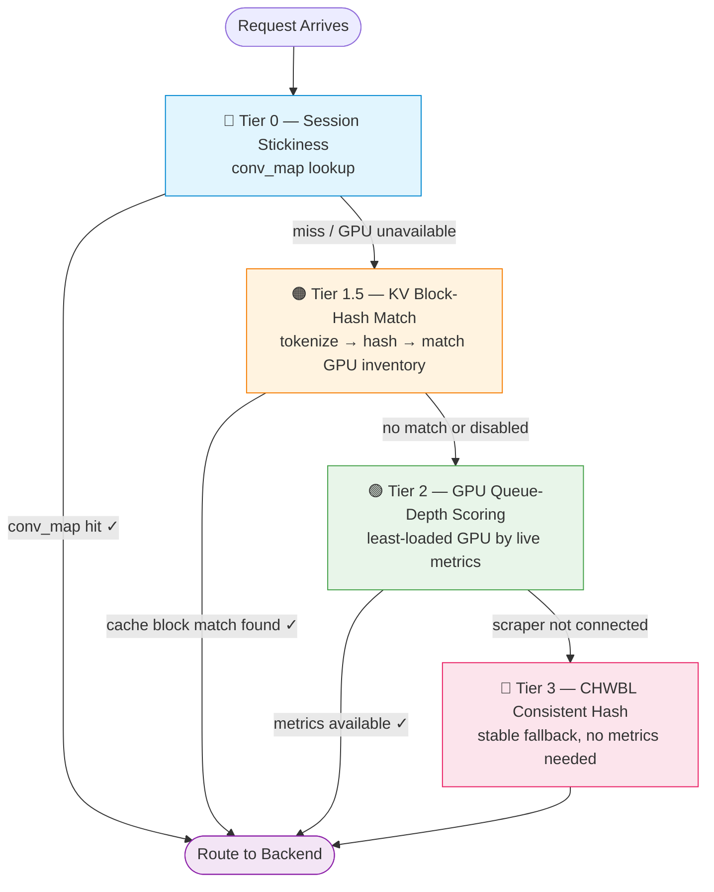

---

## Tier 0: Session Stickiness

**What it does**: Instantly routes a returning conversation to the GPU that already holds its KV cache — a hash table lookup that completes before any other routing logic runs.

When loxilb first routes a request to a backend, it records the `conversation ID → GPU endpoint` mapping in an internal **conversation map** (`conv_map`). Every subsequent request from the same conversation is pinned to the same GPU.

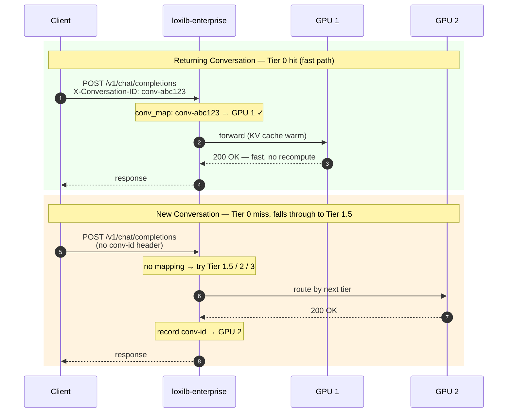

!!! info "Tier 0 falls through automatically"
    If the target GPU fails a health check or is removed from the pool, Tier 0 deletes the stale mapping and cascades to the next tier. The new assignment is recorded and stickiness resumes from there.

### How loxilb Identifies a Conversation

loxilb extracts the conversation identifier from requests using up to **four sources**, checked in priority order:

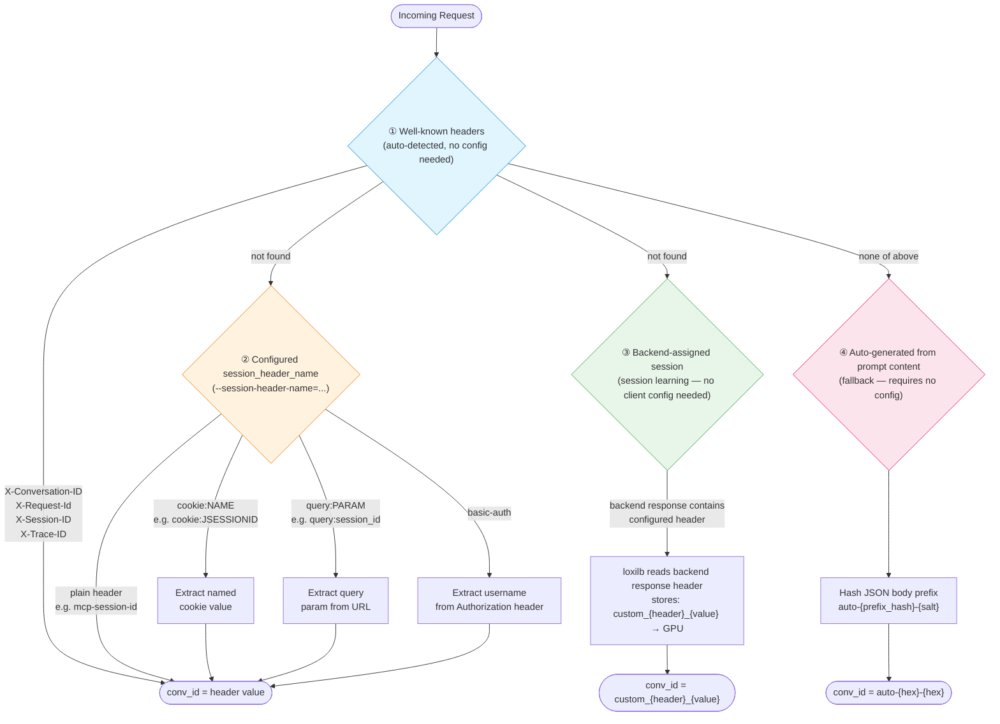

#### Source 1 — Well-Known Headers (automatic, no config)

loxilb automatically recognizes these standard headers from common LLM frameworks and API clients:

| Header | Sent by |
|---|---|
| `X-Conversation-ID` | [LangChain](https://python.langchain.com/), [LangGraph](https://langchain-ai.github.io/langgraph/), custom agents |
| `X-Request-Id` | [OpenAI Python SDK](https://github.com/openai/openai-python), [OpenAI Node SDK](https://github.com/openai/openai-node), reverse proxies |
| `X-Session-ID` | Custom agents, enterprise middleware |
| `X-Trace-ID` | Distributed tracing systems (Jaeger, Zipkin) used for affinity |

No configuration is needed — if the client sends any of these headers, loxilb uses the value as the conversation key.

#### Source 2 — Configured Session Header

Set `--session-header-name` on the LB rule to tell loxilb which header (or cookie, query param, or auth identity) carries the session ID. Four extraction modes:

| `session_header_name` value | What loxilb extracts | Example client |
|---|---|---|
| `mcp-session-id` | Full value of `mcp-session-id:` header | MCP clients |
| `cookie:JSESSIONID` | `JSESSIONID` value from `Cookie:` header | Java / Spring applications |
| `query:session_id` | `session_id` value from the URL query string | REST clients with URL-encoded sessions |
| `basic-auth` | Username from `Authorization: Basic ...` header | Internal services using HTTP Basic Auth |

#### Source 3 — Session Learning from Backend Response

When `--select=persist` is configured with `--session-header-name`, loxilb **reads the backend response** headers to learn the session binding automatically. The backend assigns the session ID (e.g. an MCP server returning `mcp-session-id: sess-abc123`) and loxilb records it immediately — so the very next request with that value is already pinned.

This is how MCP session stickiness works: no client-side configuration required. See [MCP Routing](mcp-gateway.md) for details.

#### Source 4 — Auto-Generated from Prompt (fallback)

If none of the above sources yield a conversation ID, loxilb parses the JSON request body (OpenAI chat format), extracts the prompt prefix from `messages[].content`, and computes:

```
conv_id = "auto-{xxhash64(prompt_prefix):016x}-{salt:08x}"
```

This provides reasonable session locality for clients that send no session headers at all — requests with the same conversation context naturally hash to the same GPU.

### Conv-Map Properties

| Property | Value |
|---|---|
| Key format | `custom_{header_name}_{header_value}` (learned) or raw header value (client-sent) |
| Max key length | 128 bytes |
| TTL | 3600 seconds (1 hour) — refreshed on every request |
| Cleanup interval | Every 300 seconds (5 minutes) |
| Stale mapping behavior | Deleted immediately when target GPU becomes unhealthy |

---

## Tier 1.5: KV Block-Hash Match

**What it does**: Finds the GPU that already holds the **most relevant KV cache blocks** for this specific prompt — even for a brand-new conversation.

This tier tokenizes the incoming prompt and matches its content against each GPU's live block inventory. The GPU with the most existing blocks for this prompt wins — maximizing cache reuse without requiring any client-side session tracking.

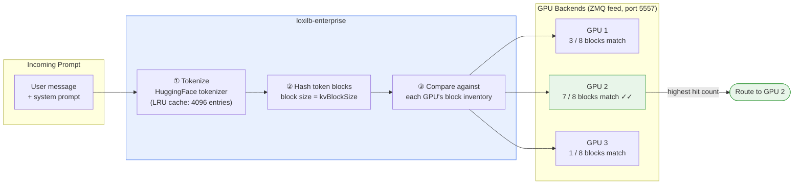

**How GPU block inventories stay current**: Each vLLM instance publishes a real-time feed of its cached token-block hashes over a **ZMQ PUB socket** (default port 5557). loxilb subscribes to all backends and maintains a live per-GPU block inventory — updated as vLLM loads and evicts blocks from VRAM.

!!! tip "When to enable Tier 1.5"
    Set `kvExactMode: 1` for workloads with multi-turn conversations or shared system prompts (e.g. customer support bots). For single-shot batch queries with no conversation context, Tier 2 alone is usually sufficient.

**Requirements**: `kvExactMode: 1` in the service config + tokenizer file staged on the loxilb host. See [KV Caching](kv-caching.md) for setup steps.

---

## Tier 2: GPU Queue-Depth Scoring

**What it does**: Routes to the least-loaded GPU in real time, using live metrics scraped from each vLLM instance every 10 seconds.

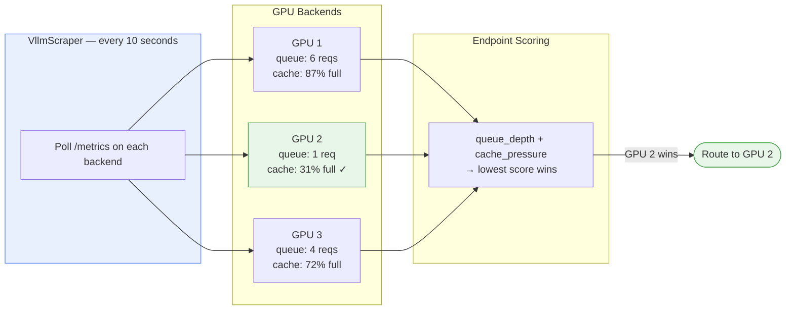

The scraper collects two signals from each backend:

| Metric | What It Measures | Effect on Routing |
|---|---|---|
| `vllm:num_requests_waiting` | Requests queued, waiting for GPU time | High queue → penalize this GPU |
| `vllm:gpu_cache_usage_perc` | KV cache VRAM fill (0.0 – 1.0) | Near full → penalize this GPU |

Use `sel: 9` to enable GPU-aware scoring. See [vLLM Integration](vllm-integration.md) for scraper configuration.

---

## Tier 3: Consistent Hash Fallback

**What it does**: Provides stable endpoint assignment when no GPU metrics are available and no KV cache match was found — always active as a safety net.

loxilb uses **CHWBL** (Consistent Hash with Bounded Loads) — the same algorithm used in large-scale CDN and cache clusters. Requests are mapped to a position on a virtual ring, and the nearest endpoint is selected. When backends are added or removed, only a minimal fraction of requests are remapped; existing conversation-to-GPU bindings remain stable for the majority of traffic.

This tier requires no configuration. Use `sel: 8` to use CHWBL as the **primary** algorithm (bypassing Tiers 1.5 and 2 for pure conversation locality).

---

## Model-Name Routing (Stage 1 — Recap)

!!! info "This is Stage 1 — handled before GPU selection"
    Model-name routing runs **before** any of the four tiers above. It routes the request to the correct backend pool based on which model was requested. The four-tier cascade (this page) then runs **within** that pool to pick the individual GPU. See [Model Load Balancing](model-load-balancing.md) for full configuration examples.

The AI Gateway supports **per-model endpoint pools** on the same VIP and port. Different GPU tiers serve different models under a single API endpoint — clients use the standard `"model"` field and loxilb routes to the matching pool.

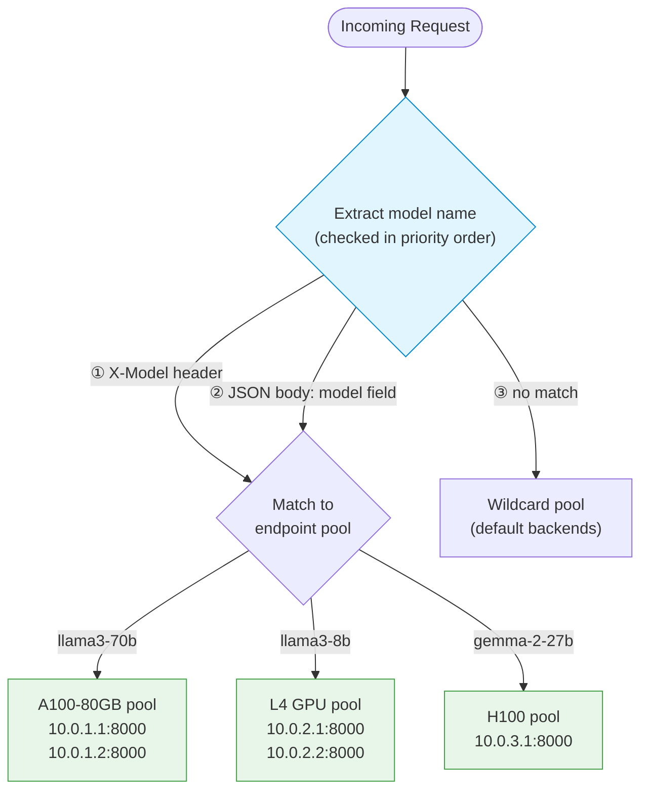

Each model pool is a separate LB rule on the same `VIP:Port` with a distinct `model_name` field. Rules without a `model_name` catch all unmatched requests.

See [Model Load Balancing](model-load-balancing.md) for configuration examples.

---

## Prerequisites

!!! warning "Required: FullProxy Mode"
    All AI Gateway routing features require `mode: 4` (FullProxy) and `backend_protocol: "http1"`. Other LB modes perform L4 load balancing only and cannot inspect HTTP bodies for model routing or KV cache matching.

| What You Want | Where to Go |
|---|---|
| Configure KV cache-aware routing | [KV Caching](kv-caching.md) — tokenizer staging, ZMQ setup, kvExactMode config |
| Set up vLLM metrics scraping | [vLLM Integration](vllm-integration.md) — scraper setup, metrics reference |
| Configure per-model endpoint pools | [Model Load Balancing](model-load-balancing.md) — model_name routing, multi-rule examples |
| Deploy on AWS EKS | [AWS KV Cache Deployment](aws-kv-cache.md) — security groups, ZMQ networking |
| See all config fields | [Configuration Reference](configuration-reference.md) — complete field reference |

---

## Configuration

The `sel` field controls which routing algorithm is active:

| `sel` | Algorithm | Best For |
|---|---|---|
| `8` | CHWBL Consistent Hash | Conversational workloads — maximizes KV cache locality |
| `9` | GPU-Aware Scoring | Throughput workloads — balances queue depth and cache pressure |
| `10` | Weighted Round-Robin with Hash | Mixed or transitional workloads |

!!! tip "CLI vs REST API"
    Every example below shows both the [`loxicmd` CLI](../cmd.md) and the equivalent REST API call. Use whichever fits your automation workflow.

---

### Option 1 — GPU-Aware Routing (`sel: 9`)

Best for throughput-heavy workloads where requests are largely independent. loxilb polls each vLLM backend's `/metrics` endpoint every 10 seconds and routes to the least-loaded GPU.

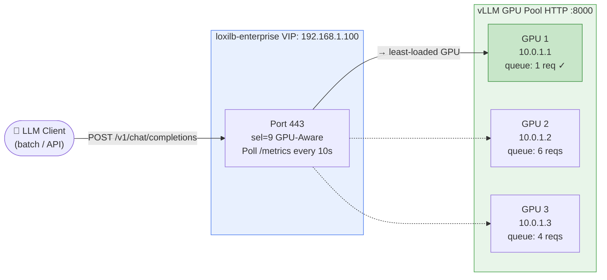

=== "loxicmd"

    ```bash
    loxicmd create lb 192.168.1.100 \
      --tcp=443:8000 \
      --select=gpu \
      --mode=fullproxy \
      --endpoints=10.0.1.1:1,10.0.1.2:1,10.0.1.3:1
    ```

=== "REST API"

    ```bash
    curl -X POST http://loxilb-host:11111/netlox/v1/config/loadbalancer \
      -H "Content-Type: application/json" \
      -d '{
        "serviceArguments": {
          "externalIP": "192.168.1.100",
          "port": 443,
          "protocol": "tcp",
          "mode": 4,
          "sel": 9,
          "backend_protocol": "http1"
        },
        "endpoints": [
          {"endpointIP": "10.0.1.1", "targetPort": 8000, "weight": 1},
          {"endpointIP": "10.0.1.2", "targetPort": 8000, "weight": 1},
          {"endpointIP": "10.0.1.3", "targetPort": 8000, "weight": 1}
        ]
      }'
    ```

Clients connect to: `https://192.168.1.100:443/v1/chat/completions`

---

### Option 2 — KV Cache-Aware Routing (`sel: 8`)

Best for multi-turn conversational workloads. loxilb subscribes to each vLLM backend's ZMQ feed (port 5557), tracks which GPU holds which KV cache blocks, and routes each request to the GPU most likely to have a cache hit.

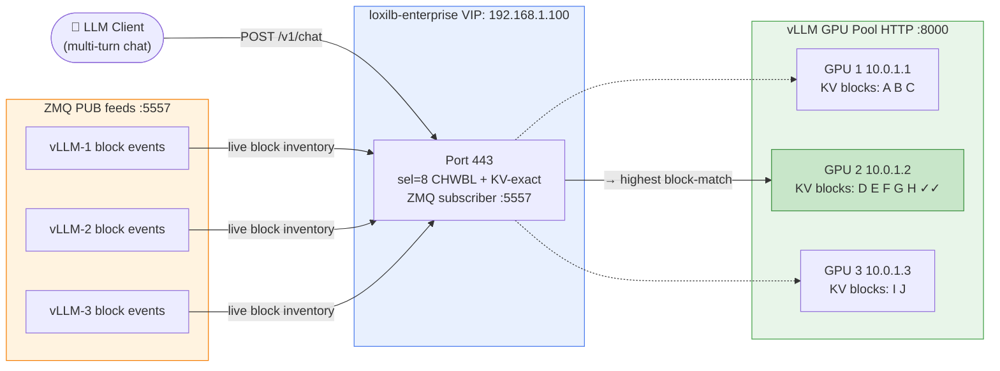

=== "loxicmd"

    ```bash
    loxicmd create lb 192.168.1.100 \
      --tcp=443:8000 \
      --select=chwbl \
      --mode=fullproxy \
      --kv-exact-mode=1 \
      --kv-block-size=16 \
      --endpoints=10.0.1.1:1,10.0.1.2:1,10.0.1.3:1
    ```

=== "REST API"

    ```bash
    curl -X POST http://loxilb-host:11111/netlox/v1/config/loadbalancer \
      -H "Content-Type: application/json" \
      -d '{
        "serviceArguments": {
          "externalIP": "192.168.1.100",
          "port": 443,
          "protocol": "tcp",
          "mode": 4,
          "sel": 8,
          "kvExactMode": 1,
          "kvBlockSize": 16,
          "backend_protocol": "http1"
        },
        "endpoints": [
          {"endpointIP": "10.0.1.1", "targetPort": 8000, "weight": 1},
          {"endpointIP": "10.0.1.2", "targetPort": 8000, "weight": 1},
          {"endpointIP": "10.0.1.3", "targetPort": 8000, "weight": 1}
        ]
      }'
    ```

For tokenizer staging and ZMQ setup, see [KV Caching](kv-caching.md).

---

### Option 3 — Session Stickiness by HTTP Header

For any custom header your application uses as a session identifier (e.g. `X-Thread-ID`, `mcp-session-id`):

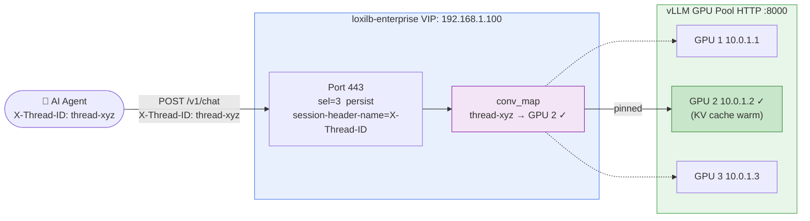

=== "loxicmd"

    ```bash
    loxicmd create lb 192.168.1.100 \
      --tcp=443:8000 \
      --select=persist \
      --mode=fullproxy \
      --session-header-name=X-Thread-ID \
      --endpoints=10.0.1.1:1,10.0.1.2:1,10.0.1.3:1
    ```

=== "REST API"

    ```bash
    curl -X POST http://loxilb-host:11111/netlox/v1/config/loadbalancer \
      -H "Content-Type: application/json" \
      -d '{
        "serviceArguments": {
          "externalIP": "192.168.1.100",
          "port": 443,
          "protocol": "tcp",
          "mode": 4,
          "sel": 3,
          "session_header_name": "X-Thread-ID",
          "backend_protocol": "http1"
        },
        "endpoints": [
          {"endpointIP": "10.0.1.1", "targetPort": 8000, "weight": 1},
          {"endpointIP": "10.0.1.2", "targetPort": 8000, "weight": 1},
          {"endpointIP": "10.0.1.3", "targetPort": 8000, "weight": 1}
        ]
      }'
    ```

---

### Option 4 — Session Stickiness by Cookie

For web applications that carry the session in an HTTP cookie (e.g. Java/Spring `JSESSIONID`, custom session cookies):

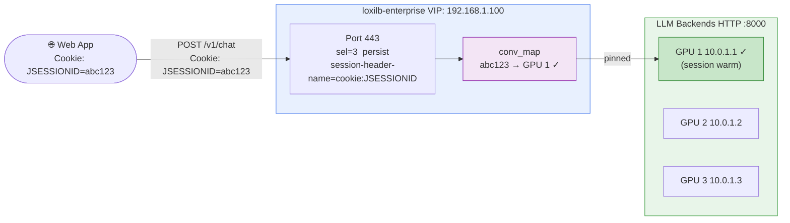

=== "loxicmd"

    ```bash
    loxicmd create lb 192.168.1.100 \
      --tcp=443:8000 \
      --select=persist \
      --mode=fullproxy \
      --session-header-name=cookie:JSESSIONID \
      --endpoints=10.0.1.1:1,10.0.1.2:1,10.0.1.3:1
    ```

=== "REST API"

    ```bash
    curl -X POST http://loxilb-host:11111/netlox/v1/config/loadbalancer \
      -H "Content-Type: application/json" \
      -d '{
        "serviceArguments": {
          "externalIP": "192.168.1.100",
          "port": 443,
          "protocol": "tcp",
          "mode": 4,
          "sel": 3,
          "session_header_name": "cookie:JSESSIONID",
          "backend_protocol": "http1"
        },
        "endpoints": [
          {"endpointIP": "10.0.1.1", "targetPort": 8000, "weight": 1},
          {"endpointIP": "10.0.1.2", "targetPort": 8000, "weight": 1},
          {"endpointIP": "10.0.1.3", "targetPort": 8000, "weight": 1}
        ]
      }'
    ```

---

### Option 5 — Session Stickiness by Query Parameter

For REST clients that pass the session in the URL (e.g. `?session_id=abc`):

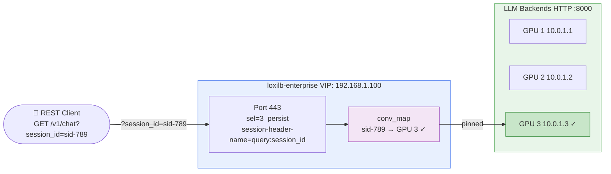

=== "loxicmd"

    ```bash
    loxicmd create lb 192.168.1.100 \
      --tcp=443:8000 \
      --select=persist \
      --mode=fullproxy \
      --session-header-name=query:session_id \
      --endpoints=10.0.1.1:1,10.0.1.2:1,10.0.1.3:1
    ```

=== "REST API"

    ```bash
    curl -X POST http://loxilb-host:11111/netlox/v1/config/loadbalancer \
      -H "Content-Type: application/json" \
      -d '{
        "serviceArguments": {
          "externalIP": "192.168.1.100",
          "port": 443,
          "protocol": "tcp",
          "mode": 4,
          "sel": 3,
          "session_header_name": "query:session_id",
          "backend_protocol": "http1"
        },
        "endpoints": [
          {"endpointIP": "10.0.1.1", "targetPort": 8000, "weight": 1},
          {"endpointIP": "10.0.1.2", "targetPort": 8000, "weight": 1},
          {"endpointIP": "10.0.1.3", "targetPort": 8000, "weight": 1}
        ]
      }'
    ```

---

### Option 6 — Session Stickiness by Basic Auth Username

Routes each authenticated user consistently to the same GPU — useful for internal services or per-user model personalization:

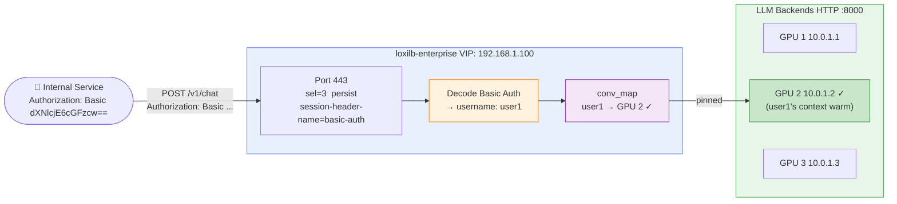

=== "loxicmd"

    ```bash
    loxicmd create lb 192.168.1.100 \
      --tcp=443:8000 \
      --select=persist \
      --mode=fullproxy \
      --session-header-name=basic-auth \
      --endpoints=10.0.1.1:1,10.0.1.2:1,10.0.1.3:1
    ```

=== "REST API"

    ```bash
    curl -X POST http://loxilb-host:11111/netlox/v1/config/loadbalancer \
      -H "Content-Type: application/json" \
      -d '{
        "serviceArguments": {
          "externalIP": "192.168.1.100",
          "port": 443,
          "protocol": "tcp",
          "mode": 4,
          "sel": 3,
          "session_header_name": "basic-auth",
          "backend_protocol": "http1"
        },
        "endpoints": [
          {"endpointIP": "10.0.1.1", "targetPort": 8000, "weight": 1},
          {"endpointIP": "10.0.1.2", "targetPort": 8000, "weight": 1},
          {"endpointIP": "10.0.1.3", "targetPort": 8000, "weight": 1}
        ]
      }'
    ```

For GPU scraper setup see [vLLM Integration](vllm-integration.md). For KV cache fields see [KV Caching](kv-caching.md).

---

## Verify

Confirm the active routing mode:

```bash
loxicmd get lb -o wide
```

For GPU-aware mode (`sel: 9`), also verify the scraper is connected and metrics are flowing:

```bash
curl http://loxilb-host:11111/netlox/v1/config/gpu/status
# Expected: {"gpu_aware_enabled": true, "active_scrapers": N}
```

---

## Troubleshooting

**Uneven load distribution across GPUs**

- Check the `sel` value in use: `loxicmd get lb -o wide`
- For GPU-aware mode (`sel: 9`), confirm the vLLM scraper is connected: `GET /netlox/v1/config/gpu/status`
- Verify that endpoint weights are equal if you expect balanced distribution

**Model not routable (requests failing with 502)**

- Confirm all backend endpoints are healthy: `loxicmd get ep -o wide`
- Check that `backend_protocol` is set to `"http1"` in the service rule
- Verify the `model_name` value matches exactly what the client sends in the `"model"` field or `X-Model` header

**KV cache hit rate is low**

- Ensure `kvExactMode: 1` is set and the tokenizer file is staged on the loxilb host
- Verify ZMQ connectivity to vLLM instances on port 5557: `telnet <vllm-host> 5557`
- Check that `kvBlockSize` matches the block size configured in your vLLM instances

**All requests going to one GPU**

- Tier 0 session stickiness is working as intended — each unique conversation ID is pinned to its assigned GPU. This is correct behavior for stateful agents.
- If you want pure load balancing without stickiness, use `sel: 9` (GPU-aware scoring).

---

## See Also

- [Model Load Balancing](model-load-balancing.md) — **Stage 1**: Route requests to the right model pool before GPU selection runs
- [AI Gateway Overview](overview.md) — Feature overview and traffic flow diagram
- [KV Caching](kv-caching.md) — KV-exact routing configuration and tokenizer setup
- [vLLM Integration](vllm-integration.md) — GPU metrics scraping setup
- [Model Load Balancing](model-load-balancing.md) — Per-model endpoint pools
- [PD Disaggregation](pd-disaggregation.md) — Prefill/decode separation
- [Configuration Reference](configuration-reference.md) — All AI Gateway config fields
- [API Reference](../reference/api.md)
