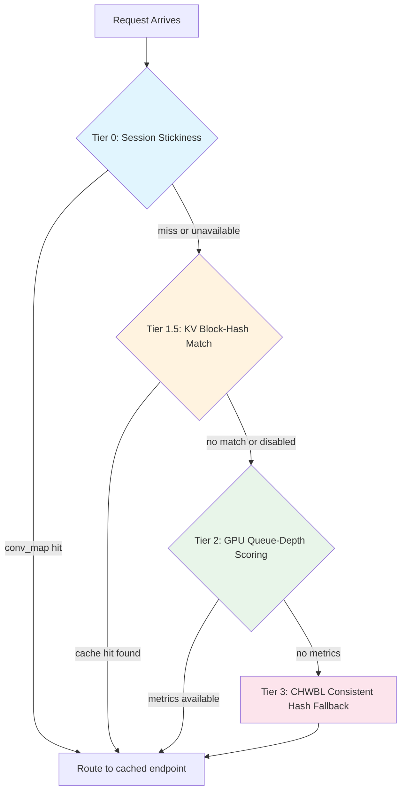

# LLM Routing

!!! enterprise "Enterprise Feature"
    This feature requires loxilb-enterprise. It is not available in the community edition.
    See [Installation](../getting-started/installation.md) for enterprise binary setup.

## The LLM Routing Problem

Standard load balancers treat every request as independent and stateless — round-robin, least-connections, or random selection all assume that any backend can serve any request equally well. This works for web servers because each request is self-contained.

LLM inference breaks this assumption. When GPU-A processes a conversation, it builds a **KV cache** (key-value attention matrices — think of it as the GPU's working memory for that conversation) in its VRAM. If the next message in that conversation lands on GPU-B, GPU-B has no KV cache for it and must recompute the entire conversation context from scratch. This **cold-start penalty** costs 3-5x the latency of a cache-hit request. For a 10-turn conversation, that means reprocessing all 10 previous turns before generating a single new token.

loxilb solves this with a **three-tier routing architecture** that preserves KV cache locality while maintaining load balance across the GPU fleet. Each tier acts as a progressively broader fallback — the system tries the most cache-efficient option first, then falls back to less specific but still intelligent routing.

## Three-Tier Routing Architecture

When a request arrives at the AI Gateway, it cascades through four routing tiers until one selects an endpoint:



### Tier 0: Session Stickiness

**Networking analogy:** Sticky sessions — like `cookie insert` on a traditional L7 load balancer, but keyed on conversation ID instead of a cookie.

When loxilb routes a request to a backend, it records the mapping in a **conversation map** (`conv_map`). If the same conversation sends another request, Tier 0 immediately routes it to the same endpoint — a sub-microsecond hash lookup with no computation.

Tier 0 falls through if the previously assigned endpoint is unavailable (health check failed, connection refused, or the endpoint was removed).

### Tier 1.5: KV Block-Hash Exact Match

**Networking analogy:** Content-based routing with cache awareness — like routing HTTP requests to the web server that has the relevant page in its local cache, except the "cache" is GPU VRAM holding transformer attention matrices.

This tier requires `kvExactMode: 1` and a tokenizer file staged on the loxilb host. When active, it works as follows:

1. **ZMQ Subscriber** (`ai_kv_subscriber.go`): Connects to each vLLM instance's ZMQ PUB socket. Receives msgpack-encoded `KVEventBatch` messages listing which token-block hashes each GPU currently holds. Builds a per-endpoint block inventory — essentially a map of "which GPU has which pieces of which conversations in memory."

2. **Tokenizer** (`ai_kv_router.go`): When a request arrives, loxilb tokenizes the prompt (converting text to token IDs using the model's HuggingFace tokenizer), then hashes token blocks (configurable block size via `kvBlockSize`). This produces a set of block hashes representing the prompt content.

3. **Block Matching**: The hashed blocks are compared against each endpoint's block inventory. The endpoint with the **highest cache hit count** is selected — meaning the GPU that already has the most relevant KV cache blocks for this prompt.

4. **LRU Cache**: A 4096-entry LRU cache keyed by `(model-slug, first 512 chars of prompt)` avoids re-tokenizing identical or similar prompts. This is particularly effective for repeated system prompts.

The ZMQ PUB socket defaults to port 5557 on each vLLM instance. The wire format is msgpack-encoded `KVEventBatch`.


!!! tip "When to Use Tier 1.5"
    Enable KV-exact routing (`kvExactMode: 1`) for conversational workloads where users have multi-turn conversations with the same model. The cache hit rate improves with longer conversations and more shared system prompts. For batch/one-shot queries with no conversation continuity, Tier 2 (GPU-aware scoring) may be more effective.

### Tier 2: GPU Queue-Depth Scoring

**Networking analogy:** Least-connections load balancing with health-awareness — like choosing the server with the shortest request queue, but using GPU-specific metrics instead of connection count.

loxilb's `VllmScraper` polls each backend vLLM instance's `/metrics` HTTP endpoint every 10 seconds (configurable). It extracts two key metrics:

| Metric | Type | What It Measures |
|--------|------|-----------------|
| `vllm:num_requests_waiting` | Gauge | Number of requests queued, waiting for GPU time |
| `vllm:gpu_cache_usage_perc` | Gauge | GPU KV cache fill percentage (0.0 to 1.0) |

The scraper updates the C-side queue depth via `llb_ai_update_ep_queue_depth()` CGO call, enabling the endpoint selection algorithm to combine queue depth and cache usage to find the **least-loaded, most-available GPU**.

Use `sel: 9` (LbSelGPUAware) to enable GPU-aware selection.


### Tier 3: Fallback — CHWBL Consistent Hash

**Networking analogy:** Consistent hashing with bounded loads — the same algorithm used for distributing cache keys across a memcached cluster.

When no KV cache match exists (Tier 1.5 disabled or no match found) and no GPU metrics are available (Tier 2 scraper not connected), loxilb falls back to `LbSelCHWBL` (consistent hash with bounded loads). This provides stable endpoint assignment with minimal disruption when endpoints are added or removed.

## Model-Name Routing

The AI Gateway supports **per-model endpoint pools** on the same VIP and port. This allows you to run different LLM models on different GPU tiers — for example, a 70B parameter model on A100-80GB GPUs and an 8B model on L4 GPUs — while exposing a single API endpoint to clients.

How it works:

1. **Per-model rules**: The `model_name` field in the LB service configuration creates distinct endpoint pools. Multiple LB rules on the same `VIP:Port` can differ only in `model_name`, each pointing to a different set of backend endpoints.

2. **Routing priority**: When a request arrives, loxilb determines the target model in this order:
    - `X-Model` HTTP header (highest priority)
    - `"model"` field in the JSON request body
    - Wildcard pool (no `model_name` set — catches unmatched requests)

3. **HTTP body parsing**: The model name is extracted from the JSON body by sockproxy.c using the jsmn JSON parser, operating at C speed in the data plane.


See [Model Load Balancing](model-load-balancing.md) for configuration examples.

## CGO Bridge Pattern

For engineers who want to understand the implementation: all AI Gateway enforcement follows a consistent C-to-Go bridge pattern.

```
C sockproxy (hot path, data plane)
  → //export llb_ai_*() function in Go
  → Pure Go logic (validateAPIKeyInternal, rateLimitCheckInternal, etc.)
  → Return C.int decision to sockproxy
```

This design allows:

- **Data-plane speed enforcement**: API key validation, rate limiting, and security scanning execute in the request path without leaving the proxy process.
- **Testable business logic**: All enforcement logic is pure Go, testable with standard Go test tooling — no CGO required for unit tests.
- **Consistent pattern**: Every AI Gateway feature (API keys, rate limits, LlamaFirewall, token quotas) uses the same bridge pattern, making the codebase predictable.


## Prerequisites and Configuration Pointers

!!! warning "Required: FullProxy Mode"
    All AI Gateway routing features require `mode: 4` (LBModeFullProxy) and `backend_protocol: "http1"`. Other LB modes perform L4 load balancing only and cannot inspect HTTP bodies for model routing or KV cache matching.

| What You Want | Where to Go |
|---------------|-------------|
| Configure KV cache-aware routing | [KV Caching](kv-caching.md) — tokenizer staging, ZMQ setup, kvExactMode config |
| Set up vLLM metrics scraping | [vLLM Integration](vllm-integration.md) — scraper setup, metrics reference |
| Configure per-model endpoint pools | [Model Load Balancing](model-load-balancing.md) — model_name routing, multi-rule examples |
| Deploy on AWS EKS | [AWS KV Cache Deployment](aws-kv-cache.md) — security groups, ZMQ networking |
| See all config fields | [Configuration Reference](configuration-reference.md) — complete field reference with source annotations |

## REST API Config

LLM routing modes are configured via the `sel` field in `serviceArguments` when creating an LB service rule. The `sel` field controls which load balancing algorithm is used for endpoint selection:

| `sel` Value | Mode | Best For |
|-------------|------|----------|
| `8` | Consistent Hash with Bounded Loads (CHWBL) | KV cache locality — conversational workloads |
| `9` | GPU-Aware | Throughput — batch/independent queries with vLLM metrics |
| `10` | Weighted Round-Robin with Hash | Mixed workloads or transition from standard LB |

### Configure GPU-Aware Routing (sel: 9)

```bash
curl -X POST http://loxilb:11111/netlox/v1/config/services \
  -H "Authorization: Bearer <token>" \
  -H "Content-Type: application/json" \
  -d '{
    "serviceArguments": {
      "externalIP": "192.168.1.100",
      "port": 443,
      "protocol": "tcp",
      "mode": 4,
      "sel": 9,
      "backend_protocol": "http1"
    },
    "endpoints": [
      {"endpointIP": "10.0.1.1", "targetPort": 8000, "weight": 1},
      {"endpointIP": "10.0.1.2", "targetPort": 8000, "weight": 1}
    ]
  }'

# Response (200):
# {"result": "Success"}
```

### Configure KV Cache-Aware Routing (sel: 8)

```bash
curl -X POST http://loxilb:11111/netlox/v1/config/services \
  -H "Authorization: Bearer <token>" \
  -H "Content-Type: application/json" \
  -d '{
    "serviceArguments": {
      "externalIP": "192.168.1.100",
      "port": 443,
      "protocol": "tcp",
      "mode": 4,
      "sel": 8,
      "kvExactMode": 1,
      "kvBlockSize": 16,
      "backend_protocol": "http1"
    },
    "endpoints": [
      {"endpointIP": "10.0.1.1", "targetPort": 8000, "weight": 1},
      {"endpointIP": "10.0.1.2", "targetPort": 8000, "weight": 1}
    ]
  }'

# Response (200):
# {"result": "Success"}
```

For detailed KV cache configuration fields, see [KV Caching](kv-caching.md). For GPU-aware scraper setup, see [vLLM Integration](vllm-integration.md).

## Verify

Confirm the routing mode is active by listing configured services:

```bash
curl http://loxilb:11111/netlox/v1/config/services \
  -H "Authorization: Bearer <token>"
```

Check that your service rule shows the expected `sel` value in the response. For GPU-aware mode (`sel: 9`), also verify the GPU feature is enabled:

```bash
curl http://loxilb:11111/netlox/v1/config/gpu/status \
  -H "Authorization: Bearer <token>"

# Expected: {"gpu_aware_enabled": true, "active_scrapers": N}
```

## Troubleshooting

**Uneven load distribution across GPUs**

- Verify the `sel` value matches your intended routing mode: `GET /config/services`
- For GPU-aware mode (`sel: 9`), confirm the vLLM scraper is connected and metrics are being collected: `GET /config/gpu/status`
- Check that endpoint weights are balanced if using weighted modes

**Model not routable (requests failing with 502)**

- Confirm all backend endpoints are healthy and accepting connections
- Check that `backend_protocol` is set to `"http1"` in the service rule
- Verify the `model_name` field matches the model served by the backend (if using per-model routing)

**KV cache hit rate is low**

- Ensure `kvExactMode: 1` is set and the tokenizer file is staged on the loxilb host
- Verify ZMQ connectivity to vLLM instances on port 5557
- Check that `kvBlockSize` matches the block size used by the vLLM instances

## See Also

- [AI Gateway Overview](overview.md) — Conceptual introduction and traffic flow diagram
- [KV Caching](kv-caching.md) — KV-exact routing configuration
- [vLLM Integration](vllm-integration.md) — GPU metrics scraping setup
- [Model Load Balancing](model-load-balancing.md) — Per-model endpoint pools
- [PD Disaggregation](pd-disaggregation.md) — Prefill/decode separation
- [Configuration Reference](configuration-reference.md) — All AI Gateway config fields
- [GPU and LLM Catalog API Reference](../reference/api.md#ai-gateway-gpu-and-llm-catalog)
