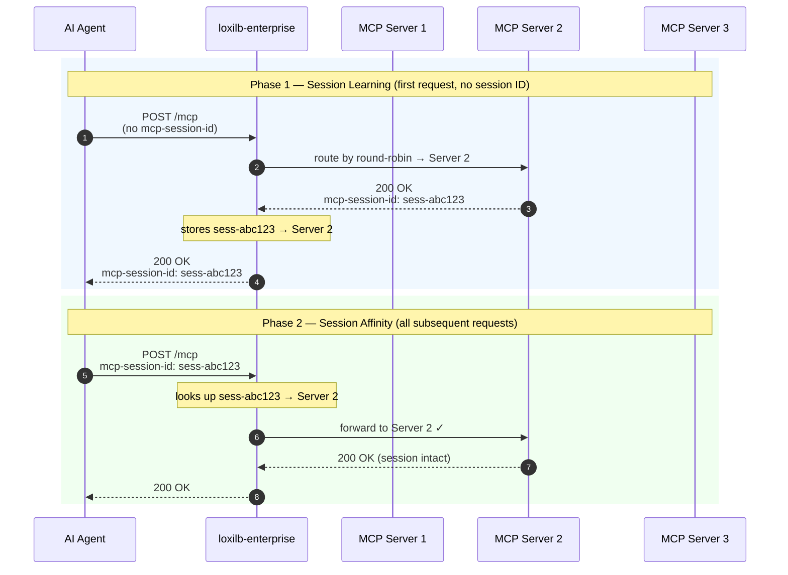
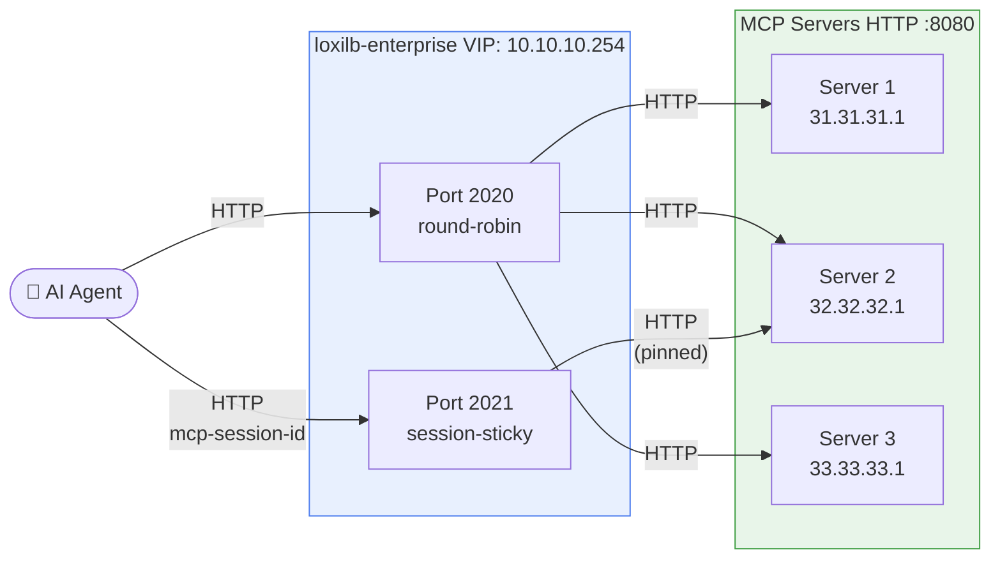
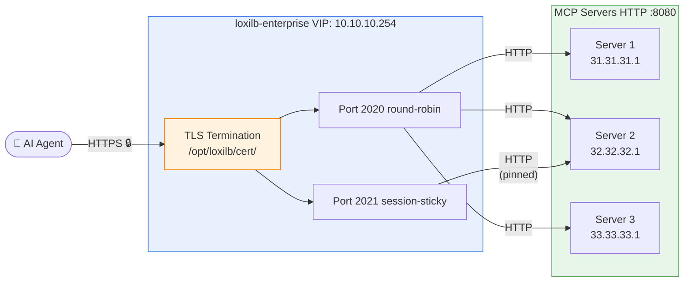
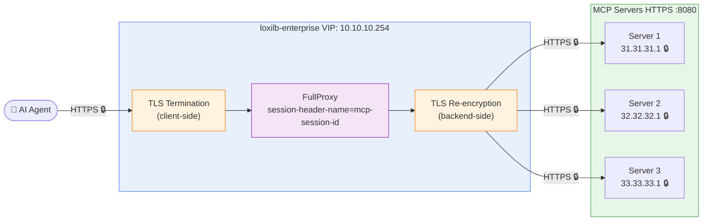

# MCP Routing

!!! enterprise "Enterprise Feature"
    This feature requires loxilb-enterprise. It is not available in the community edition.
    See [Installation](../getting-started/installation.md) for enterprise binary setup.

loxilb-enterprise can load balance [Model Context Protocol (MCP)](https://modelcontextprotocol.io/) servers — the emerging standard for connecting AI agents to tools, APIs, and data sources. This page covers the data-plane features that make MCP load balancing reliable: **session-sticky routing** and **SSE-aware connection handling**.

---

## Why Standard Load Balancers Break MCP Agents

MCP uses **HTTP + Server-Sent Events (SSE)** as its transport:

- **Client → Server**: HTTP POST requests carrying JSON-RPC method calls (`tools/call`, `resources/read`, etc.)
- **Server → Client**: Long-lived HTTP GET with `Content-Type: text/event-stream` — a streaming response that stays open for the duration of the agent conversation

Multi-turn agents maintain **stateful sessions** across many requests. An MCP server assigns a `mcp-session-id` to each connected client, and all subsequent calls in that session must reach the **same backend instance** — because in-progress tool state, conversation history, and resource locks live there.

A standard L4 load balancer knows nothing about HTTP headers or SSE streams:

| Problem | What happens |
|---|---|
| New connection per request | Agent gets different backend each time → session not found → error |
| SSE connection killed by idle timeout | Streaming response interrupted mid-conversation |
| Backend returns new `mcp-session-id` | Subsequent requests still route randomly → session mismatch |

loxilb-enterprise solves all three at the **data plane layer** — no changes to your MCP servers or agent code required.

---

## How Session Stickiness Works

loxilb operates in **FullProxy mode**, which gives it full L7 visibility into HTTP headers and response bodies. Session binding happens in two phases:



The session binding is stored in loxilb's **conversation mapping table**:

- **TTL**: 1 hour — sessions survive agent reconnects and retries within this window
- **Cleanup**: every 5 minutes — stale sessions are automatically purged
- **Scope**: per VIP+port — different LB rules maintain independent session tables

!!! info "The first request can land on any backend — that's fine"
    The initial request has no `mcp-session-id` yet, so loxilb routes it freely (round-robin, or whichever algorithm is configured). **Session stickiness kicks in as soon as the backend responds.** loxilb reads the `mcp-session-id` header from the backend response, records the binding, and from that point forward every request carrying that session ID is pinned to the same backend — regardless of which server was randomly selected at first. You don't need to pre-configure which agent goes to which server; the data plane learns and enforces it automatically.

---

## SSE Connection Handling

MCP streaming responses carry `Content-Type: text/event-stream`. loxilb detects this header on the first backend response packet and switches the connection to **SSE-aware mode**:

- The long-lived streaming connection is **never killed by idle read timeouts** while the SSE stream is active
- The stream terminator (`data: [DONE]`) is detected correctly even when it spans two TCP segments
- Streaming connections are gracefully cleaned up when the agent disconnects

This means an agent can hold an open SSE stream for the full duration of a multi-step tool workflow without being disconnected.

---

## Two Routing Strategies

Deploy two LB rules on separate ports for the two distinct traffic patterns in an MCP deployment:

| Port | Mode | Use case |
|---|---|---|
| `2020` | `--select=rr` (round-robin) | Stateless single-shot tool calls — any backend can serve them |
| `2021` | `--select=persist` | Stateful multi-turn agents — session affinity enforced |

Both rules use `--session-header-name=mcp-session-id` so loxilb knows which header carries the session ID.

!!! tip "Which port should clients use?"
    Point stateless tool integrations (e.g. CI/CD pipelines calling a single tool) at port `2020`.
    Point long-running AI agents (e.g. Claude Desktop, LangChain agents) at port `2021`.

---

## Prerequisites

- loxilb-enterprise running (`ghcr.io/netlox-dev/loxilb-enterprise:latest`)
- MCP servers running with SSE transport enabled (any framework — [FastMCP](https://github.com/jlowin/fastmcp), etc.)
- `loxicmd` CLI available on the loxilb host

---

## Deployment

!!! tip "CLI vs REST API"
    Every example below shows both the [`loxicmd` CLI](../cmd.md) and the equivalent REST API call (`POST /netlox/v1/config/loadbalancer`). Use whichever fits your automation workflow.

### Option 1 — HTTP Frontend → HTTP Backends

Simplest setup. Use for internal clusters where TLS is terminated elsewhere.



=== "loxicmd"

    ```bash
    # Stateless tool calls (round-robin)
    loxicmd create lb 10.10.10.254 \
      --tcp=2020:8080 \
      --select=rr \
      --mode=fullproxy \
      --session-header-name=mcp-session-id \
      --host=10.10.10.254 \
      --endpoints=31.31.31.1:1,32.32.32.1:1,33.33.33.1:1

    # Stateful agent sessions (session-sticky)
    loxicmd create lb 10.10.10.254 \
      --tcp=2021:8080 \
      --select=persist \
      --mode=fullproxy \
      --session-header-name=mcp-session-id \
      --host=10.10.10.254 \
      --endpoints=31.31.31.1:1,32.32.32.1:1,33.33.33.1:1
    ```

=== "REST API"

    ```bash
    # Stateless tool calls (round-robin) — port 2020
    curl -X POST http://loxilb-host:11111/netlox/v1/config/loadbalancer \
      -H "Content-Type: application/json" \
      -d '{
        "serviceArguments": {
          "externalIP": "10.10.10.254",
          "port": 2020,
          "protocol": "tcp",
          "mode": 4,
          "sel": 0,
          "session_header_name": "mcp-session-id",
          "host": "10.10.10.254"
        },
        "endpoints": [
          {"endpointIP": "31.31.31.1", "targetPort": 8080, "weight": 1},
          {"endpointIP": "32.32.32.1", "targetPort": 8080, "weight": 1},
          {"endpointIP": "33.33.33.1", "targetPort": 8080, "weight": 1}
        ]
      }'

    # Stateful agent sessions (session-sticky) — port 2021
    curl -X POST http://loxilb-host:11111/netlox/v1/config/loadbalancer \
      -H "Content-Type: application/json" \
      -d '{
        "serviceArguments": {
          "externalIP": "10.10.10.254",
          "port": 2021,
          "protocol": "tcp",
          "mode": 4,
          "sel": 3,
          "session_header_name": "mcp-session-id",
          "host": "10.10.10.254"
        },
        "endpoints": [
          {"endpointIP": "31.31.31.1", "targetPort": 8080, "weight": 1},
          {"endpointIP": "32.32.32.1", "targetPort": 8080, "weight": 1},
          {"endpointIP": "33.33.33.1", "targetPort": 8080, "weight": 1}
        ]
      }'
    ```

Clients connect to:
- `http://10.10.10.254:2020/mcp` — stateless
- `http://10.10.10.254:2021/mcp` — stateful / session-sticky

---

### Option 2 — HTTPS Frontend → HTTP Backends (TLS Termination)

loxilb terminates TLS from the client side. Backends remain plain HTTP. Requires a TLS certificate for the VIP.



=== "loxicmd"

    ```bash
    # Copy your certificate to loxilb first
    cp server.crt /opt/loxilb/cert/server.crt
    cp server.key /opt/loxilb/cert/server.key
    cp rootCA.crt /opt/loxilb/cert/rootCA.crt

    # Stateless tool calls
    loxicmd create lb 10.10.10.254 \
      --tcp=2020:8080 \
      --select=rr \
      --mode=fullproxy \
      --security=https \
      --session-header-name=mcp-session-id \
      --host=10.10.10.254 \
      --endpoints=31.31.31.1:1,32.32.32.1:1,33.33.33.1:1

    # Stateful agent sessions
    loxicmd create lb 10.10.10.254 \
      --tcp=2021:8080 \
      --select=persist \
      --mode=fullproxy \
      --security=https \
      --session-header-name=mcp-session-id \
      --host=10.10.10.254 \
      --endpoints=31.31.31.1:1,32.32.32.1:1,33.33.33.1:1
    ```

=== "REST API"

    ```bash
    # Stateless tool calls (round-robin) — port 2020
    curl -X POST http://loxilb-host:11111/netlox/v1/config/loadbalancer \
      -H "Content-Type: application/json" \
      -d '{
        "serviceArguments": {
          "externalIP": "10.10.10.254",
          "port": 2020,
          "protocol": "tcp",
          "mode": 4,
          "sel": 0,
          "security": 1,
          "session_header_name": "mcp-session-id",
          "host": "10.10.10.254"
        },
        "endpoints": [
          {"endpointIP": "31.31.31.1", "targetPort": 8080, "weight": 1},
          {"endpointIP": "32.32.32.1", "targetPort": 8080, "weight": 1},
          {"endpointIP": "33.33.33.1", "targetPort": 8080, "weight": 1}
        ]
      }'

    # Stateful agent sessions (session-sticky) — port 2021
    curl -X POST http://loxilb-host:11111/netlox/v1/config/loadbalancer \
      -H "Content-Type: application/json" \
      -d '{
        "serviceArguments": {
          "externalIP": "10.10.10.254",
          "port": 2021,
          "protocol": "tcp",
          "mode": 4,
          "sel": 3,
          "security": 1,
          "session_header_name": "mcp-session-id",
          "host": "10.10.10.254"
        },
        "endpoints": [
          {"endpointIP": "31.31.31.1", "targetPort": 8080, "weight": 1},
          {"endpointIP": "32.32.32.1", "targetPort": 8080, "weight": 1},
          {"endpointIP": "33.33.33.1", "targetPort": 8080, "weight": 1}
        ]
      }'
    ```

Clients connect via HTTPS:
- `https://10.10.10.254:2020/mcp`
- `https://10.10.10.254:2021/mcp`

---

### Option 3 — End-to-End HTTPS (Client TLS + Backend TLS)

Full encryption from client through loxilb to each backend. Use when backend servers also require TLS (e.g. zero-trust environments). loxilb re-encrypts the connection to each backend.



=== "loxicmd"

    ```bash
    loxicmd create lb 10.10.10.254 \
      --tcp=2020:8080 \
      --select=rr \
      --mode=fullproxy \
      --security=e2ehttps \
      --session-header-name=mcp-session-id \
      --host=10.10.10.254 \
      --endpoints=31.31.31.1:1,32.32.32.1:1,33.33.33.1:1
    ```

=== "REST API"

    ```bash
    curl -X POST http://loxilb-host:11111/netlox/v1/config/loadbalancer \
      -H "Content-Type: application/json" \
      -d '{
        "serviceArguments": {
          "externalIP": "10.10.10.254",
          "port": 2020,
          "protocol": "tcp",
          "mode": 4,
          "sel": 0,
          "security": 2,
          "session_header_name": "mcp-session-id",
          "host": "10.10.10.254"
        },
        "endpoints": [
          {"endpointIP": "31.31.31.1", "targetPort": 8080, "weight": 1},
          {"endpointIP": "32.32.32.1", "targetPort": 8080, "weight": 1},
          {"endpointIP": "33.33.33.1", "targetPort": 8080, "weight": 1}
        ]
      }'
    ```

!!! note "Backend certificates"
    Each backend server must have a valid TLS certificate. loxilb validates the backend cert using the CA in `/opt/loxilb/cert/rootCA.crt`. You can use a shared internal CA (e.g. [minica](https://github.com/jsha/minica)) to issue certs for all backends.

---

## Key Configuration Fields

The following fields are used across all MCP deployment options. For the full parameter reference see the [CLI Reference](../cmd.md) and [API Reference](../reference/api.md).

| CLI flag | REST API field | Values | Description |
|---|---|---|---|
| `--mode=fullproxy` | `mode: 4` | `4` = FullProxy | Required for L7 header inspection and SSE handling. See [NAT Modes](../nat.md). |
| `--select=rr` | `sel: 0` | `0` = round-robin | Stateless distribution — no session binding |
| `--select=persist` | `sel: 3` | `3` = persist | Session-sticky — binds `mcp-session-id` to a backend |
| `--security=https` | `security: 1` | `1` = HTTPS (TLS termination) | Frontend HTTPS, backends stay plain HTTP |
| `--security=e2ehttps` | `security: 2` | `2` = end-to-end HTTPS | TLS from client all the way to each backend |
| `--session-header-name=mcp-session-id` | `session_header_name: "mcp-session-id"` | any HTTP header name | Header loxilb reads to learn and enforce session binding |
| `--host=<VIP>` | `host: "<VIP>"` | IP or hostname | SNI / Host header value for FullProxy mode |

---

## Verify Session Stickiness

After deploying, confirm that repeated calls with the same session ID land on the same backend:

```bash
# First call — no session ID yet; backend assigns one
curl -s http://10.10.10.254:2021/mcp \
  -H "Content-Type: application/json" \
  -d '{"jsonrpc":"2.0","method":"initialize","params":{"clientInfo":{"name":"test","version":"1.0"}},"id":1}' \
  -D - | grep -i mcp-session-id
# → mcp-session-id: sess-abc123

# Subsequent calls with the session ID — should always reach the same backend
for i in 1 2 3 4 5; do
  curl -s http://10.10.10.254:2021/mcp \
    -H "Content-Type: application/json" \
    -H "mcp-session-id: sess-abc123" \
    -d '{"jsonrpc":"2.0","method":"tools/list","params":{},"id":'$i'}' | \
    python3 -c "import sys,json; r=json.load(sys.stdin); print('server:', r.get('result',{}).get('serverInfo',{}).get('name','?'))"
done
# → server: server2
# → server: server2
# → server: server2  (always the same)
```

Check the current session table on loxilb:

```bash
loxicmd get lb -o wide
```

---

## Troubleshooting

**Session not sticking — agent gets different backends**

- Confirm `--mode=fullproxy` is set. L4 modes cannot inspect HTTP headers.
- Check that the agent is actually sending the `mcp-session-id` header on follow-up requests.
- Verify the header name exactly matches what your MCP server sends: `loxicmd get lb -o wide` shows the configured `session-header-name`.

**SSE stream drops after 30–60 seconds**

- Confirm loxilb is in FullProxy mode. L4 modes apply idle TCP timeout and cannot detect an active SSE stream.

**Backend returns 404 on `/mcp`**

- Check the MCP server is listening on the configured port: `curl http://<backend-ip>:8080/mcp`
- The default MCP endpoint path depends on your framework — verify with your server's docs.

**TLS handshake failure (HTTPS or e2ehttps)**

- The certificate in `/opt/loxilb/cert/server.crt` must have a Subject Alternative Name matching the VIP (`10.10.10.254`) or the DNS name clients use.
- For end-to-end TLS, the CA in `/opt/loxilb/cert/rootCA.crt` must be the issuer of all backend certs.

---

## Next Steps

- [LLM Routing](llm-routing.md) — route requests to different LLM backends by model name or path
- [API Key Management](api-key-management.md) — authenticate MCP clients with API keys at the gateway layer
- [SSE Quota Management](sse-quota-management.md) — throttle long-running SSE streams per tenant
