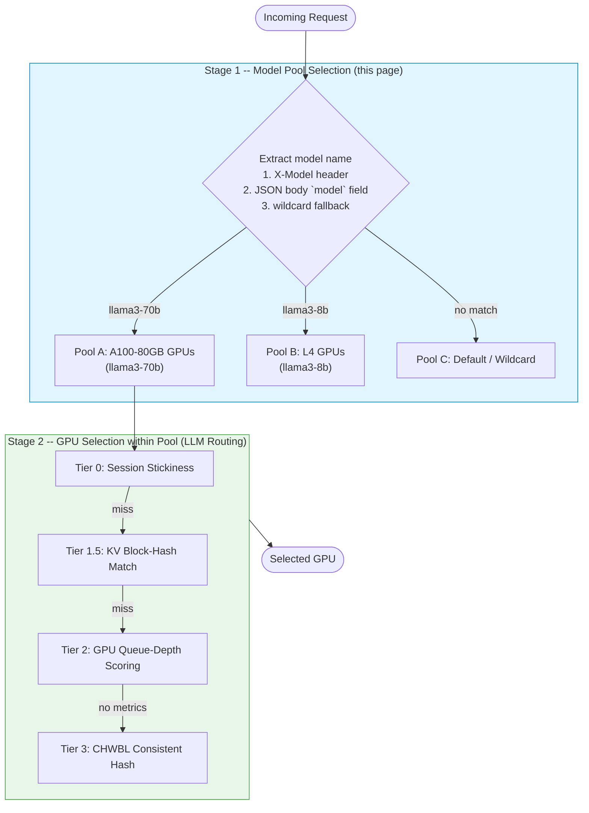
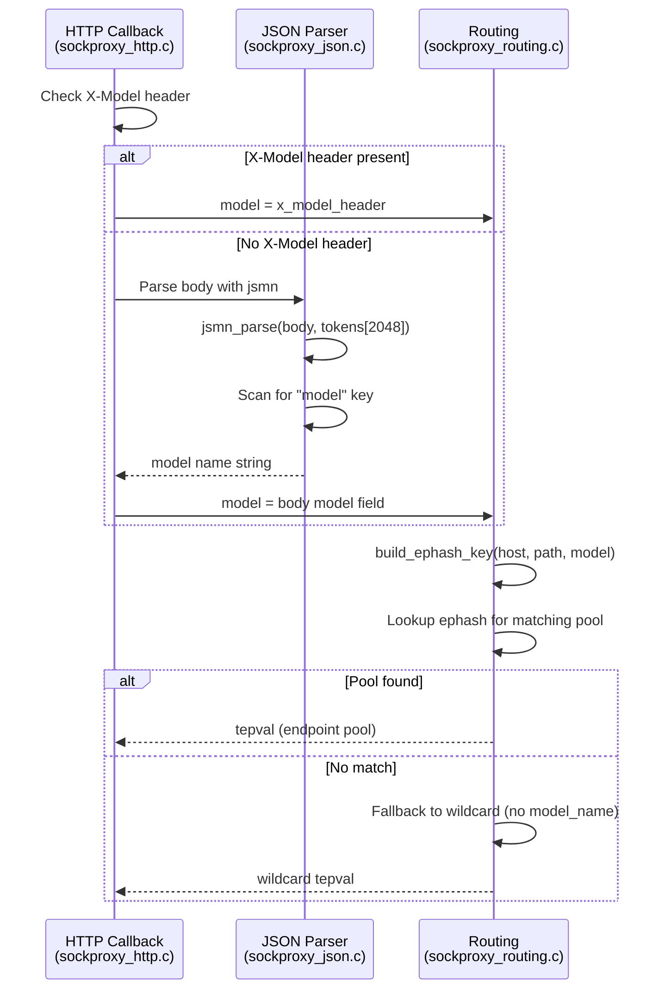
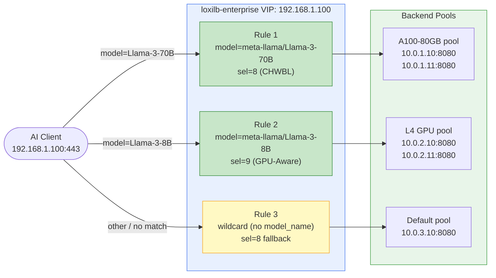

# Model Load Balancing

!!! enterprise "Enterprise Feature"
    This feature requires loxilb-enterprise. It is not available in the community edition.
    See [Installation](../getting-started/installation.md) for enterprise binary setup.

## How This Page Fits Into the Bigger Picture

AI Gateway routing happens in **two sequential stages**. This page covers Stage 1 only:

| Stage | Question Answered | Key Config | Covered In |
|---|---|---|---|
| **Stage 1** -- Model Pool Selection | *Which backend pool handles this model?* | `model_name` on the LB rule | **This page** |
| **Stage 2** -- GPU Selection within Pool | *Which specific GPU gets this request?* | `sel` field (`8` / `9` / `10`) | [LLM Routing](llm-routing.md) |

Stage 1 runs first: it reads the model name from the request and dispatches to the correct GPU pool. Stage 2 then runs **within** that pool to pick the best individual GPU (using session stickiness, KV cache matching, or load-based scoring). Neither stage replaces the other -- both run for every request.

---

## Why Standard Load Balancers Can't Route by Model

Modern AI deployments run **multiple models simultaneously** -- a large 70B parameter model for deep reasoning, a smaller 8B model for fast queries, an embedding model for RAG pipelines. Each model requires a specific GPU tier and has a different cost profile.

Standard load balancers operate at Layer 4 (TCP/IP) and never read the HTTP body. They cannot extract the `"model"` field from an OpenAI-format request and therefore cannot dispatch it to the right GPU pool:

| Problem | Without Model-Aware Routing | With loxilb-enterprise |
|---|---|---|
| Wrong GPU tier | 8B request lands on an A100-80GB node -- expensive GPU wasted on a small model | Routes to the L4 GPU pool matched to that model |
| 404 from backend | 70B request hits a vLLM instance serving only 8B -- model not found | Routes to the A100-80GB pool that actually runs llama-3-70B |
| No fallback for unknown models | Unhandled error or silently wrong routing | Wildcard pool catches all unmatched requests |
| Multiple entry points | Clients must hardcode each model's backend address separately | Single VIP+port for all models -- client just sets the `"model"` field |

loxilb inspects the HTTP body at C speed inside the sockproxy data plane, extracts the `model` field, and dispatches to the matching pool -- before any GPU resources are consumed.

---

## How Model-Name Routing Works

loxilb's AI Gateway uses the `model_name` field in the LB service configuration to create **per-model endpoint pools**. Multiple LB rules on the same VIP and port can differ only in `model_name`, each pointing to a different set of backend endpoints.



## How Model Selection Works

When a request arrives at the AI Gateway, loxilb determines the target model in this priority order:

1. **`X-Model` HTTP header** (highest priority) -- Allows client-side model selection without modifying the request body.
2. **`"model"` field in JSON body** -- The standard OpenAI-compatible API format. sockproxy extracts this from the HTTP body using the jsmn JSON parser at C speed.
3. **Wildcard pool** (lowest priority) -- If no model-specific rule matches, the request falls through to a rule with no `model_name` set.

This means clients can use the standard OpenAI API format (`"model": "meta-llama/Llama-3-70B"` in the request body) and loxilb automatically routes to the correct GPU pool.

---

## Deep Internals: Model Name Extraction

Understanding how sockproxy extracts the model name helps diagnose routing issues and optimize request handling.

### X-Model Header Extraction (Priority 1)

In `sockproxy_http.c`, the HTTP header callback checks for the `X-Model` header using case-insensitive comparison:

```
// US-202: Extract X-Model header for model-based endpoint pool selection
if (!strncasecmp("X-Model", pfe->last_header_name, 7)) {
    strncpy(pfe->x_model_header, at, length);
}
```

The `x_model_header` field is stored on the per-connection `proxy_fd_ent_t` structure and takes priority over the JSON body `model` field. This is the **fast path** -- no body parsing is needed when the header is present.

### JSON Body Model Field Extraction (Priority 2)

If no `X-Model` header is found, sockproxy parses the JSON body using the `jsmn` parser in `sockproxy_json.c`. The parser scans for the top-level `"model"` key:



**Key implementation details from sockproxy_json.c:**

- Token array size: 2048 tokens (sufficient for large system prompts)
- Model field extracted by scanning top-level keys with `jsoneq(json_body, &tokens[i], "model")`
- LoRA adapter field also extracted if present (`lora_adapter` key)
- The `X-Model` header is reset (`x_model_header[0] = '\0'`) after each request to prevent stale values on keep-alive connections

### Wildcard Pool Fallback (Priority 3)

When neither the header nor the body contains a model name that matches a configured pool, the routing engine in `sockproxy_routing.c` falls back to a **wildcard pool** -- an LB rule on the same VIP:port that has no `model_name` set.

The `build_ephash_key()` function constructs a composite lookup key:

| Has model_name? | Key Format | Example |
|----------------|------------|---------|
| Yes | `host\|path\|model` | `api.example.com\|/v1/chat\|llama-70b` |
| No (wildcard) | `host\|path` or `host` | `api.example.com` |

Lookup proceeds with **Longest Prefix Match (LPM)**: the routing engine tries the most specific key first (with model), then falls back through less specific keys until a match is found.

---

## Deep Internals: Pool Management

### How Pools Are Created

Each LB rule with a `model_name` field on the same VIP:port creates a separate `proxy_epval_t` structure in the ephash. The ephash key includes the model name, so different model pools coexist independently:

- `POST /netlox/v1/config/loadbalancer` with `model_name: "llama3-70b"` creates Pool A
- `POST /netlox/v1/config/loadbalancer` with `model_name: "llama3-8b"` creates Pool B
- `POST /netlox/v1/config/loadbalancer` with no `model_name` creates the wildcard pool

Each pool has its own:

- Endpoint list (`eps[]` array)
- Selection algorithm (`sel` value -- can differ per pool)
- Health check state per endpoint
- Circuit breaker state per endpoint
- CHWBL hash ring (if `sel: 8`)
- WRR weights (if `sel: 10`)

### Health Check Interaction

When all endpoints in a model pool are unhealthy (health checks failing), requests for that model receive no healthy endpoint. The behavior depends on the selection algorithm:

- **With wildcard pool**: Requests may fall through to the wildcard pool if configured
- **Without wildcard**: The request fails with a 503 response

### Weight Behavior

Endpoint weights (`weight` field) control traffic distribution within a pool:

- `sel: 0` (round-robin): Weights are used for WRR (Weighted Round-Robin) -- higher weight gets proportionally more traffic
- `sel: 8` (CHWBL): Weights do not directly affect the consistent hash ring. Load bounding provides balance.
- `sel: 9` (GPU-aware): Weights are secondary to live GPU metrics
- `sel: 10` (WRR Hash): Weights determine vnode allocation -- `weight: 3` gets ~3x the virtual nodes as `weight: 1`, affecting hash ring distribution proportionally

---

## Prerequisites

!!! warning "Required: FullProxy Mode"
    All AI Gateway routing features require `mode: 4` (FullProxy) and `backend_protocol: "http1"`. Standard NAT modes operate at Layer 4 only and cannot inspect HTTP bodies to extract the `model` field.

| Requirement | Details |
|---|---|
| `mode: 4` (FullProxy) | Enables L7 HTTP body inspection -- required to read the `model` field from each request |
| `backend_protocol: "http1"` | Tells loxilb the backends speak HTTP/1.1; required for AI Gateway HTTP body parsing |
| loxilb-enterprise | Model-name routing is an enterprise feature; not available in the community edition |

---

## Configuration

!!! tip "CLI vs REST API"
    Every example below shows both the [`loxicmd` CLI](../cmd.md) and the equivalent REST API call. Use whichever fits your automation workflow.

A full multi-model setup requires one LB rule per model plus a wildcard catch-all -- all on the same VIP and port:



### Rule 1 -- Llama-3-70B Pool (A100-80GB GPUs, `sel: 8`)

=== "loxicmd"

    ```bash
    loxicmd create lb 192.168.1.100 \
      --tcp=443:8080 \
      --select=chwbl \
      --mode=fullproxy \
      --model-name=meta-llama/Llama-3-70B \
      --llm-type=chat-interactive \
      --backend-protocol=http1 \
      --endpoints=10.0.1.10:1,10.0.1.11:1
    ```

=== "REST API"

    ```bash
    curl -X POST http://loxilb:11111/netlox/v1/config/services \
      -H "Authorization: Bearer <token>" \
      -H "Content-Type: application/json" \
      -d '{
        "serviceArguments": {
          "externalIP": "192.168.1.100",
          "port": 443,
          "protocol": "tcp",
          "mode": 4,
          "backend_protocol": "http1",
          "model_name": "meta-llama/Llama-3-70B",
          "sel": 8,
          "llm_type": "chat-interactive"
        },
        "endpoints": [
          {"endpointIP": "10.0.1.10", "targetPort": 8080, "weight": 1},
          {"endpointIP": "10.0.1.11", "targetPort": 8080, "weight": 1}
        ]
      }'

    # Response (200):
    # {"result": "Success"}
    ```

### Rule 2 -- Llama-3-8B Pool (L4 GPUs, `sel: 9`)

=== "loxicmd"

    ```bash
    loxicmd create lb 192.168.1.100 \
      --tcp=443:8080 \
      --select=gpu \
      --mode=fullproxy \
      --model-name=meta-llama/Llama-3-8B \
      --llm-type=chat-interactive \
      --backend-protocol=http1 \
      --endpoints=10.0.2.10:1,10.0.2.11:1
    ```

=== "REST API"

    ```bash
    curl -X POST http://loxilb:11111/netlox/v1/config/services \
      -H "Authorization: Bearer <token>" \
      -H "Content-Type: application/json" \
      -d '{
        "serviceArguments": {
          "externalIP": "192.168.1.100",
          "port": 443,
          "protocol": "tcp",
          "mode": 4,
          "backend_protocol": "http1",
          "model_name": "meta-llama/Llama-3-8B",
          "sel": 9,
          "llm_type": "chat-interactive"
        },
        "endpoints": [
          {"endpointIP": "10.0.2.10", "targetPort": 8080, "weight": 1},
          {"endpointIP": "10.0.2.11", "targetPort": 8080, "weight": 1}
        ]
      }'

    # Response (200):
    # {"result": "Success"}
    ```

### Rule 3 -- Wildcard Fallback (catches unmatched models)

=== "loxicmd"

    ```bash
    loxicmd create lb 192.168.1.100 \
      --tcp=443:8080 \
      --select=chwbl \
      --mode=fullproxy \
      --backend-protocol=http1 \
      --endpoints=10.0.3.10:1
    ```

=== "REST API"

    ```bash
    curl -X POST http://loxilb:11111/netlox/v1/config/services \
      -H "Authorization: Bearer <token>" \
      -H "Content-Type: application/json" \
      -d '{
        "serviceArguments": {
          "externalIP": "192.168.1.100",
          "port": 443,
          "protocol": "tcp",
          "mode": 4,
          "backend_protocol": "http1",
          "sel": 8
        },
        "endpoints": [
          {"endpointIP": "10.0.3.10", "targetPort": 8080, "weight": 1}
        ]
      }'

    # Response (200):
    # {"result": "Success"}
    ```

With all three rules in place, a client sends a standard OpenAI-format request:

```json
{
  "model": "meta-llama/Llama-3-70B",
  "messages": [{"role": "user", "content": "Explain quantum computing"}]
}
```

loxilb reads the `model` field and dispatches: `Llama-3-70B` -> Rule 1 (A100-80GB pool), `Llama-3-8B` -> Rule 2 (L4 pool), any other model -> Rule 3 (wildcard).

---

## Deployment Scenario: Multi-Model with GPU Tiering

A production deployment serving three models on different GPU tiers with optimized selection algorithms for each workload:

| Model | GPU Tier | Pool Size | Selection | Why |
|-------|----------|-----------|-----------|-----|
| llama3-70b | A100-80GB | 2 endpoints | `sel: 8` (CHWBL) | Conversational workload -- cache locality matters |
| llama3-8b | L4 | 3 endpoints | `sel: 9` (GPU-aware) | High-throughput batch -- route to least-loaded GPU |
| text-embedding-3 | CPU | 4 endpoints | `sel: 0` (round-robin) | Embedding is CPU-bound -- no GPU metrics needed |

```bash
# llama3-70b pool (A100-80GB, CHWBL for cache locality)
curl -X POST http://loxilb:11111/netlox/v1/config/services \
  -H "Content-Type: application/json" \
  -d '{
    "serviceArguments": {
      "externalIP": "10.0.0.100", "port": 443, "protocol": "tcp",
      "mode": 4, "backend_protocol": "http1",
      "model_name": "llama3-70b", "sel": 8,
      "llm_type": "chat-interactive",
      "kvExactMode": 1, "kvBlockSize": 16, "kvHashAlgo": "sha256_cbor",
      "kvZmqPort": 5557, "kvWarmupSec": 30
    },
    "endpoints": [
      {"endpointIP": "10.0.1.1", "targetPort": 8080, "weight": 1},
      {"endpointIP": "10.0.1.2", "targetPort": 8080, "weight": 1}
    ]
  }'

# llama3-8b pool (L4, GPU-aware for throughput)
curl -X POST http://loxilb:11111/netlox/v1/config/services \
  -H "Content-Type: application/json" \
  -d '{
    "serviceArguments": {
      "externalIP": "10.0.0.100", "port": 443, "protocol": "tcp",
      "mode": 4, "backend_protocol": "http1",
      "model_name": "llama3-8b", "sel": 9,
      "llm_type": "chat-interactive"
    },
    "endpoints": [
      {"endpointIP": "10.0.2.1", "targetPort": 8080, "weight": 1},
      {"endpointIP": "10.0.2.2", "targetPort": 8080, "weight": 1},
      {"endpointIP": "10.0.2.3", "targetPort": 8080, "weight": 1}
    ]
  }'

# text-embedding-3 pool (CPU, round-robin)
curl -X POST http://loxilb:11111/netlox/v1/config/services \
  -H "Content-Type: application/json" \
  -d '{
    "serviceArguments": {
      "externalIP": "10.0.0.100", "port": 443, "protocol": "tcp",
      "mode": 4, "backend_protocol": "http1",
      "model_name": "text-embedding-3", "sel": 0
    },
    "endpoints": [
      {"endpointIP": "10.0.3.1", "targetPort": 8080, "weight": 1},
      {"endpointIP": "10.0.3.2", "targetPort": 8080, "weight": 1},
      {"endpointIP": "10.0.3.3", "targetPort": 8080, "weight": 1},
      {"endpointIP": "10.0.3.4", "targetPort": 8080, "weight": 1}
    ]
  }'
```

## Deployment Scenario: Model Migration with Zero Downtime

When migrating a model from one pool to another (e.g., upgrading from llama3-8b to llama3.1-8b), you can update endpoints without dropping requests:

**Step 1:** Add the new model endpoints alongside existing ones:

```bash
# Add new model pool for llama3.1-8b
curl -X POST http://loxilb:11111/netlox/v1/config/services \
  -H "Content-Type: application/json" \
  -d '{
    "serviceArguments": {
      "externalIP": "10.0.0.100", "port": 443, "protocol": "tcp",
      "mode": 4, "backend_protocol": "http1",
      "model_name": "llama3.1-8b", "sel": 9
    },
    "endpoints": [
      {"endpointIP": "10.0.4.1", "targetPort": 8080, "weight": 1},
      {"endpointIP": "10.0.4.2", "targetPort": 8080, "weight": 1}
    ]
  }'
```

**Step 2:** Update clients to send `"model": "llama3.1-8b"` -- traffic shifts to the new pool immediately.

**Step 3:** Once the old pool shows zero traffic, remove the old llama3-8b rule:

```bash
curl -X DELETE http://loxilb:11111/netlox/v1/config/services \
  -H "Content-Type: application/json" \
  -d '{"serviceArguments": {"externalIP": "10.0.0.100", "port": 443, "protocol": "tcp", "model_name": "llama3-8b"}}'
```

Both model pools coexist during migration -- no downtime, no dropped requests.

---

## llm_type Catalog Profiles

The `llm_type` field selects a **GPU routing catalog profile** that tunes routing parameters for different workload patterns. Examples:

| llm_type | Workload Pattern | Routing Behavior |
|----------|-----------------|------------------|
| `chat-interactive` | Multi-turn conversations | Optimizes for KV cache reuse and low latency |
| `rag-longcontext` | Long-context RAG queries | Optimizes for large prompt processing |

The catalog profile list is defined in `pkg/loxinet/catalog.go`. See [Configuration Reference](configuration-reference.md) for available profiles.

## Configuration Reference

| Field | Type | Valid Values | Default | Description |
|-------|------|-------------|---------|-------------|
| `model_name` | string | Any model identifier | (none) | Model name for per-model endpoint pools. Omit for wildcard pool. Source: `sockproxy_routing.c` `build_ephash_key()` |
| `sel` | int | `0`, `3`, `8`, `9`, `10` | `8` | Endpoint selection algorithm. Can differ per model pool. |
| `llm_type` | string | `chat-interactive`, `rag-longcontext` | - | GPU routing catalog profile |
| `mode` | int | `4` | - | Must be `4` (FullProxy) for AI Gateway features |
| `backend_protocol` | string | `http1` | - | Must be `http1` for AI Gateway |

## Verify

Confirm all model routing rules are active:

=== "loxicmd"

    ```bash
    loxicmd get lb -o wide
    # Expected: three rules on 192.168.1.100:443 with different model_name values
    ```

=== "REST API"

    ```bash
    curl http://loxilb:11111/netlox/v1/config/services \
      -H "Authorization: Bearer <token>"
    # Response shows all rules; verify model_name and sel values per rule
    ```

Test model dispatch end-to-end by sending a request for each model and confirming the correct pool responds:

```bash
# Routes to A100-80GB pool (Rule 1)
curl -s http://192.168.1.100:443/v1/chat/completions \
  -H "Content-Type: application/json" \
  -d '{"model":"meta-llama/Llama-3-70B","messages":[{"role":"user","content":"hi"}]}'

# Routes to L4 GPU pool (Rule 2)
curl -s http://192.168.1.100:443/v1/chat/completions \
  -H "Content-Type: application/json" \
  -d '{"model":"meta-llama/Llama-3-8B","messages":[{"role":"user","content":"hi"}]}'

# X-Model header overrides the JSON body field (highest priority)
curl -s http://192.168.1.100:443/v1/chat/completions \
  -H "X-Model: meta-llama/Llama-3-70B" \
  -H "Content-Type: application/json" \
  -d '{"model":"anything","messages":[{"role":"user","content":"hi"}]}'
# Routed to A100-80GB pool regardless of body model field
```

## Troubleshooting

**Requests routed to wrong model pool**

- Check `model_name` spelling in each service rule matches exactly what clients send in the `"model"` field
- Verify rule priority: `X-Model` header takes precedence over JSON body `"model"` field
- If no model-specific rule matches, requests fall to the wildcard pool (no `model_name` set)

**Model not found (404 from backend)**

- Confirm the backend vLLM instances are serving the expected model
- Verify `targetPort` matches the vLLM serving port on each endpoint

**Uneven load between model pools**

- Check endpoint health: unhealthy endpoints are excluded from selection
- For GPU-aware mode (`sel: 9`), verify the vLLM scraper is collecting metrics from all endpoints

**Wildcard pool receiving unexpected traffic**

- Verify `model_name` is set on all model-specific rules
- Check that client requests include the `"model"` field in the JSON body or the `X-Model` header
- On keep-alive connections, verify the `X-Model` header is sent on every request (it is reset per-request in sockproxy)

**Model extraction failing (all traffic to wildcard)**

- Verify `mode: 4` and `backend_protocol: "http1"` are set -- without these, HTTP body parsing is disabled
- Check that the JSON body is well-formed -- malformed JSON causes jsmn parsing failure and fallback to wildcard
- For large request bodies (>2048 JSON tokens), the jsmn parser may truncate -- the `model` field should appear early in the body

## Next Steps

- [LLM Routing](llm-routing.md) -- **Stage 2**: Four-tier GPU selection algorithm that runs within the pool chosen here
- [KV Caching](kv-caching.md) -- KV cache-aware routing for conversational workloads within a model pool
- [vLLM Integration](vllm-integration.md) -- GPU metrics scraping for `sel: 9` (GPU-aware scoring)
- [API Key Management](api-key-management.md) -- Authenticate clients and restrict which models each key can access
- [Configuration Reference](configuration-reference.md) -- All AI Gateway config fields
- [GPU and LLM Catalog API Reference](../reference/api.md#ai-gateway-gpu-and-llm-catalog)
