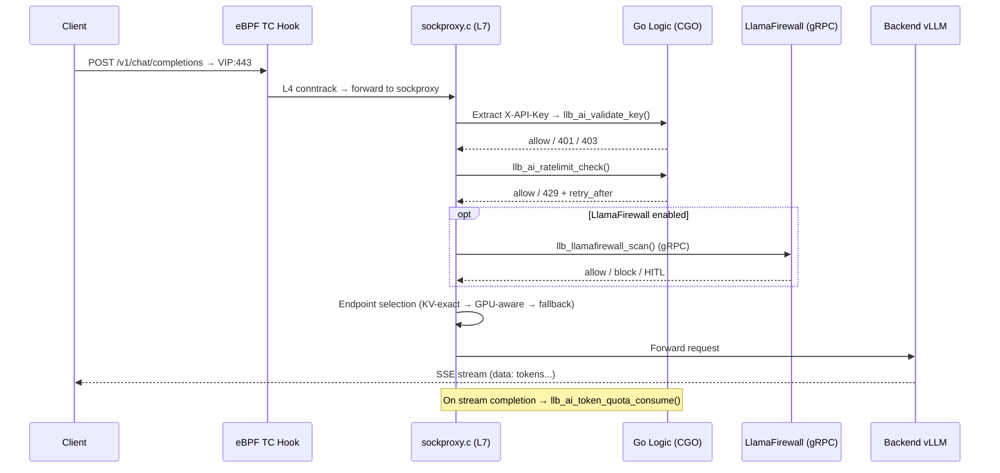

# AI Gateway Overview

!!! enterprise "Enterprise Feature"
    This feature requires loxilb-enterprise. It is not available in the community edition.
    See [Installation](../getting-started/installation.md) for enterprise binary setup.

## What is the AI Gateway?

You know how a load balancer distributes HTTP traffic across web servers. An AI Gateway does the same for Large Language Model (LLM) inference traffic — but with awareness of GPU memory state, model placement, and streaming response patterns that standard L4/L7 load balancers cannot handle.

The core problem is that LLM inference is **stateful**, not stateless like web traffic. When a GPU processes a prompt, it builds a **KV cache** (key-value attention matrices) in its VRAM — essentially a memory of the conversation context. If the next request in that conversation lands on a different GPU, that GPU must rebuild the entire KV cache from scratch. This causes a **3-5x latency increase** on every cache miss, turning a sub-second response into a multi-second wait.

loxilb's AI Gateway solves this with **eBPF-accelerated L7 proxy routing** (FullProxy mode) that is KV cache-aware. Instead of blindly round-robining requests across GPUs, loxilb routes each prompt to the GPU that already holds the relevant KV cache blocks — preserving cache locality while maintaining load balance across the GPU fleet.

## Why eBPF for AI Traffic?

Networking engineers are familiar with eBPF for high-performance packet processing. loxilb applies the same principle to AI traffic:

- **eBPF TC hook** handles L4 fast-path operations: connection tracking (conntrack) and NAT map lookups. This is the same eBPF acceleration used for standard load balancing.

- **sockproxy.c** (C user-space) performs L7 HTTP body parsing. It extracts the model name, API key, and prompt content from incoming `/v1/chat/completions` requests using the jsmn JSON parser — all in C for minimal overhead.

- **CGO bridge pattern**: The C hot-path calls Go logic for enforcement decisions (API key validation, rate limiting, AI security scanning). This keeps enforcement at data-plane speed while business logic stays in testable Go code. Each bridge function follows the same pattern: C sockproxy calls `//export llb_ai_*()` in Go, Go runs pure logic, returns a `C.int` decision.

This architecture means that API key validation, rate limiting, and security scanning all happen **before** traffic reaches the backend LLM — at data-plane speed, not application-layer speed.


## Key Capabilities

The AI Gateway provides the following enterprise features, each documented on its own page:

- **KV Cache-Aware Routing** — Route requests to the GPU that already has the relevant KV cache blocks, eliminating cold-start latency penalties. See [KV Caching](kv-caching.md).

- **vLLM Integration & GPU-Aware Load Balancing** — Scrape real-time GPU metrics (queue depth, cache usage) from vLLM instances for intelligent endpoint selection. See [vLLM Integration](vllm-integration.md) and [Model Load Balancing](model-load-balancing.md).

- **API Key Management & Rate Limiting** — Per-key and per-tenant rate limiting enforced at the data plane. Keys are validated before traffic reaches backends. See [API Key Management](api-key-management.md).

- **AI Security (LlamaFirewall + Presidio)** — Inline prompt inspection for injection attacks, credential leakage, and PII detection. See [LlamaFirewall](../security-gateway/llamafirewall.md) and [PII Detection with Presidio](../security-gateway/presidio-pii-detection.md).

- **SSE Streaming & Token Quota** — Server-Sent Events support with per-tenant token quota management for streaming LLM responses. See [SSE Quota Management](sse-quota-management.md).

- **PD Disaggregation** — Separate prefill (compute-bound) and decode (memory-bound) phases onto different GPU pools for 2-3x throughput improvement. See [PD Disaggregation](pd-disaggregation.md).

## Traffic Flow Overview

The following diagram shows the complete request path through the AI Gateway:




## Prerequisites

Before configuring any AI Gateway feature, ensure the following:

!!! warning "Required: FullProxy Mode"
    All AI Gateway features require `mode: 4` (LBModeFullProxy) and `backend_protocol: "http1"`. Other LB modes perform L4 load balancing only and cannot inspect HTTP bodies for model routing, API key validation, or KV cache matching.

- **loxilb-enterprise binary** — The AI Gateway is an enterprise-only feature. See [Installation](../getting-started/installation.md) for setup instructions.
- **FullProxy mode** — Set `mode: 4` on your LB service. This enables L7 proxy mode with HTTP body inspection, unlike L4 DNAT modes.
- **HTTP/1 backend protocol** — Set `backend_protocol: "http1"` for all AI Gateway services. HTTP/2 is not supported for AI Gateway features.

## LB Selection Modes for LLM Workloads

loxilb provides three load balancing selection modes optimized for LLM traffic. Choose based on your workload pattern:

| Mode | `sel` Value | Name | Use Case |
|------|-------------|------|----------|
| Consistent Hash with Bounded Loads | `8` | LbSelCHWBL | **Default for KV cache routing.** Routes based on consistent hash, preserving KV cache locality. Best for conversational workloads where cache reuse matters. |
| GPU-Aware | `9` | LbSelGPUAware | Uses real-time GPU queue depth and cache usage metrics from vLLM. Best for batch/independent queries where throughput matters more than cache locality. |
| Weighted Round-Robin with Hash | `10` | LbSelWRRHash | Combines weighted round-robin with hash-based distribution. For mixed workloads or when transitioning from standard LB. |


## REST API Config

The AI Gateway is configured through the loxilb REST API. Three main endpoint groups cover all AI Gateway operations:

- **API Key Management** (`/config/ai/apikey`) — Create, list, and revoke API keys for tenant access control. See [API Key Management](api-key-management.md) for full examples.
- **Tenant Rate Limits** (`/config/ai/tenant/ratelimit`) — Set per-tenant request and token rate limits. See [SSE Quota Management](sse-quota-management.md) for full examples.
- **GPU and LLM Catalog** (`/config/gpu/*`, `/config/llm-catalogs`) — Enable GPU-aware load balancing, query GPU status, and manage LLM catalog profiles. See [vLLM Integration](vllm-integration.md) and [Model Load Balancing](model-load-balancing.md) for configuration.

AI Gateway features are activated on LB service rules created via `POST /config/services` with `mode: 4` (FullProxy) and feature-specific `serviceArguments`. Each feature page documents the exact JSON body.

To check AI Gateway status, query the GPU feature endpoint:

```bash
curl http://loxilb:11111/netlox/v1/config/gpu/status \
  -H "Authorization: Bearer <token>"

# Response (200):
# {"gpu_aware_enabled": true, "active_scrapers": 3}
```

## Verify

Confirm the AI Gateway is operational by listing configured services:

```bash
curl http://loxilb:11111/netlox/v1/config/services \
  -H "Authorization: Bearer <token>"
```

The response should include your AI Gateway service rules with `mode: 4` and the relevant `serviceArguments` fields. You can also verify GPU-aware mode:

```bash
curl http://loxilb:11111/netlox/v1/config/gpu/status \
  -H "Authorization: Bearer <token>"

# Expected: {"gpu_aware_enabled": true, "active_scrapers": N}
```

## Troubleshooting

**Gateway not responding to API requests**

- Confirm the loxilb-enterprise service is running: `systemctl status loxilb`
- Check that the API port (default 11111) is reachable: `curl http://loxilb:11111/netlox/v1/config/services`
- Verify FullProxy mode is set (`mode: 4`) on your LB service rule

**API key rejected (401/403)**

- Verify the key exists and is enabled: `GET /config/ai/apikey/<key_id>`
- Check `expires_at` has not passed
- Confirm `allowed_models` includes the requested model

**Backend LLM not receiving traffic**

- Verify endpoints are healthy in the service rule: `GET /config/services`
- Check that `backend_protocol` is set to `"http1"` (required for AI Gateway)
- Review loxilb logs for connection errors to backend endpoints

## Next Steps

- **New to AI Gateway?** Start with [LLM Routing](llm-routing.md) to understand the three-tier routing architecture.
- **Setting up KV cache routing?** See [KV Caching](kv-caching.md) for configuration.
- **Deploying on AWS?** See [AWS KV Cache Deployment](aws-kv-cache.md) for cloud-specific guidance.
- **Need the full config reference?** See [Configuration Reference](configuration-reference.md) for all fields.

## See Also

- [API Key Management API Reference](../reference/api.md#ai-gateway-api-key-management)
- [Tenant Rate Limits API Reference](../reference/api.md#ai-gateway-tenant-rate-limits)
- [GPU and LLM Catalog API Reference](../reference/api.md#ai-gateway-gpu-and-llm-catalog)
