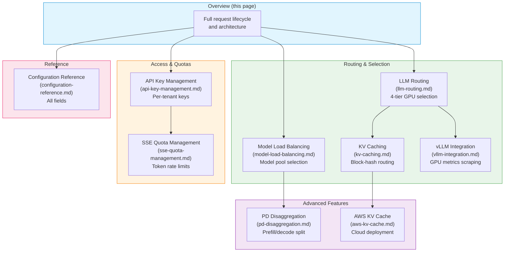
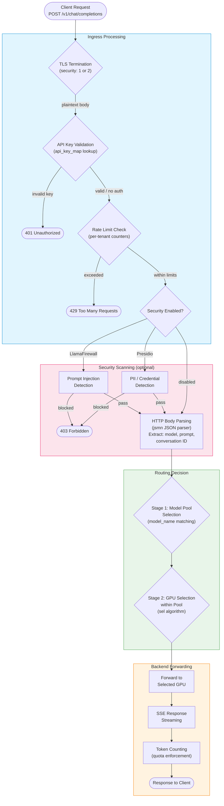
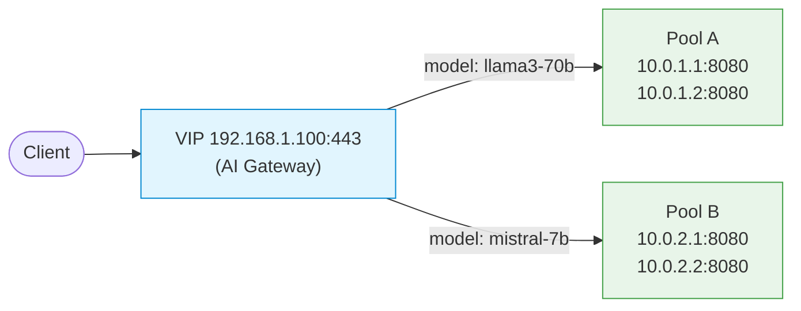
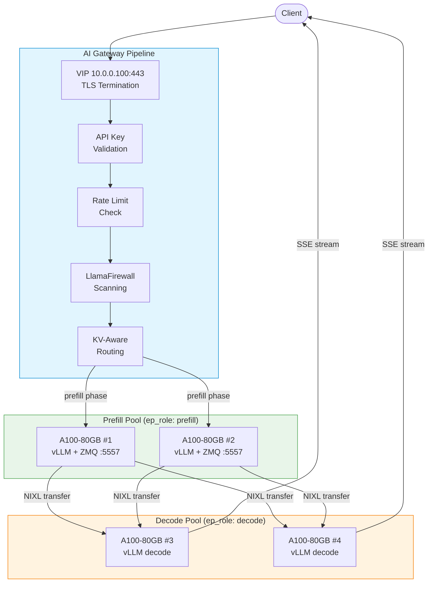

# AI Gateway Overview

!!! enterprise "Enterprise Feature"
    The AI Gateway is included in loxilb-enterprise, which is **free to download and use**.
    See [Installation](../getting-started/installation.md) to get started.

## What is the AI Gateway?

A standard load balancer routes HTTP requests to the least-busy server. That works well for web traffic -- but LLM inference is fundamentally different.

When a GPU processes a prompt, it builds a **KV cache** in its memory -- a record of the conversation context it computed. If the next request in that conversation lands on a *different* GPU, that GPU must rebuild the entire KV cache from scratch. This cold-start penalty causes a **3-5x latency increase** on every miss, turning a sub-second response into a multi-second wait.

**loxilb's AI Gateway** is designed specifically for this problem. It acts as a high-performance L7 proxy in front of your LLM backends, routing each request with awareness of GPU memory state, model placement, and streaming response patterns -- so you get both cache efficiency and load balance across your GPU fleet.

All inspection and enforcement (API key validation, rate limiting, security scanning) happens **before** traffic reaches the backend LLM, at the network layer.

---

## How This Page Relates to Other AI Gateway Pages

The AI Gateway documentation is organized around the request lifecycle. This page provides the architecture overview; each feature page dives deep into one component:



---

## Architecture: Full Request Lifecycle

Every request through the AI Gateway follows the same data-plane pipeline. Understanding this pipeline is essential for configuring and troubleshooting the gateway.



### Pipeline Stages Explained

| Stage | Component | What Happens | Source File |
|-------|-----------|-------------|-------------|
| **TLS Termination** | sockproxy_ssl.c | If `security: 1` or `2`, OpenSSL terminates TLS. The plaintext HTTP body is available for inspection. | sockproxy_ssl.c |
| **API Key Validation** | sockproxy_http.c | The `Authorization: Bearer <key>` header is checked against the in-memory `api_key_map`. Invalid keys get an immediate 401 response without touching the backend. | sockproxy_http.c |
| **Rate Limiting** | sockproxy_http.c | Per-tenant request counters and token-rate buckets are checked. If the tenant exceeds their configured limit, a 429 response is returned. | sockproxy_http.c |
| **Security Scanning** | sockproxy_llamafirewall.c, sockproxy_presidio.c | Optional inline scanning for prompt injection (LlamaFirewall) or PII/credential leakage (Presidio). Blocked requests get a 403 response. | sockproxy_llamafirewall.c |
| **HTTP Body Parsing** | sockproxy_json.c | The `jsmn` JSON parser extracts the `model` field, prompt text, and conversation identifiers from the request body at C speed -- no heap allocation for the parser itself. | sockproxy_json.c |
| **Model Pool Selection** | sockproxy_routing.c | Stage 1: The extracted `model` name is matched against configured model pools. Each LB rule with a `model_name` field defines a separate endpoint pool. | sockproxy_routing.c |
| **GPU Selection** | sockproxy_lb.c, sockproxy_kv_exact.c | Stage 2: Within the selected pool, the `sel` algorithm picks the best GPU. The four-tier cascade (Session -> KV Block Match -> GPU Queue Depth -> CHWBL) is evaluated in order. | sockproxy_lb.c |
| **Backend Forwarding** | sockproxy_http.c | The request is forwarded to the selected GPU endpoint. Connection pooling reuses existing TCP connections where possible. | sockproxy_http.c |
| **SSE Streaming** | sockproxy_http.c | The response is streamed back as Server-Sent Events (SSE). loxilb passes through each `data:` chunk in real time without buffering the entire response. | sockproxy_http.c |
| **Token Counting** | sockproxy_http.c | On the response path, tokens are counted from SSE chunks and charged against the tenant's quota. | sockproxy_http.c |

---

## Deep Internals: How sockproxy Processes an AI Request

The AI Gateway runs inside loxilb's **sockproxy** -- a userspace TCP proxy written in C that handles all L7 processing. Understanding the C-level data path helps operators diagnose performance issues and configure advanced features correctly.

### FullProxy Mode (mode: 4)

All AI Gateway features require `mode: 4` (FullProxy). This is fundamentally different from L4 modes:

| Mode | Layer | Body Inspection | AI Gateway Features |
|------|-------|----------------|-------------------|
| `1` (Default) | L4 | No -- TCP passthrough | None |
| `2` (OneArm) | L4 | No -- NAT only | None |
| `4` (FullProxy) | L7 | Yes -- full HTTP parsing | All features available |

In FullProxy mode, sockproxy terminates the client TCP connection, parses the HTTP request completely, makes a routing decision, then opens (or reuses) a separate connection to the backend. This is what enables model-aware routing, API key validation, and inline security scanning.

### The jsmn JSON Parser

Request body parsing uses **jsmn** -- a minimal, zero-allocation JSON parser written in C. jsmn tokenizes the JSON body into a flat array of tokens without building a tree structure or copying strings. This is critical for performance:

- **No heap allocation**: The token array is stack-allocated (2048 tokens max, sufficient for large system prompts)
- **Single-pass parsing**: The JSON body is scanned once to produce token offsets
- **Field extraction**: Model name, prompt text, and other fields are read directly from the original buffer using token start/end offsets

The parsing pipeline in `sockproxy_json.c` extracts fields in priority order:

1. **`model`** field from JSON body (e.g., `"model": "llama3-70b"`)
2. **`messages`** array for prompt content (system prompt + user messages)
3. **Session context**, RAG templates, and other advanced fields for cache key computation

### How the AI Gateway Pipeline is Assembled

sockproxy is modular -- each C source file implements one concern:

| File | Responsibility |
|------|---------------|
| `sockproxy_http.c` | HTTP parsing callbacks, header injection, SSE streaming, connection lifecycle |
| `sockproxy_json.c` | JSON body extraction (model name, prompt, session context) using jsmn |
| `sockproxy_routing.c` | Model-name pool selection (Stage 1) and X-Model header parsing |
| `sockproxy_lb.c` | Load balancing algorithms: WRR, CHWBL consistent hash, weighted hash ring |
| `sockproxy_kv_exact.c` | Tier 1.5 KV block-hash computation: CBOR encoding, SHA256/XXH3 hashing |
| `sockproxy_metrics.c` | Prometheus metrics export, queue-depth updates from vLLM scraper |
| `sockproxy_pd.c` | Prefill/decode disaggregation: P/D routing, NIXL transfer monitoring |
| `sockproxy_pd_trie.c` | Radix trie for cache-aware decode endpoint selection |
| `sockproxy_conn.c` | Connection management, fd lifecycle, backend connection pooling |
| `sockproxy_health.c` | Endpoint health checks, circuit breaker state machine |
| `sockproxy_ssl.c` | TLS termination, kTLS offload, certificate management |

### The Role of sockproxy_conn.c

Connection management is handled by `sockproxy_conn.c`. For each client connection, sockproxy maintains a `proxy_fd_ent_t` structure that tracks:

- The parsed HTTP state (headers, body offset, content length)
- The extracted model name (`x_model_header` field) and conversation ID
- The selected backend endpoint index
- SSE streaming state (for token counting on the response path)
- P/D disaggregation state (prefill vs decode phase tracking)

Backend connections are pooled and reused across requests. When a client connection closes, the backend connection is returned to the pool rather than being destroyed.

---

## Features at a Glance

AI Gateway features fall into two categories depending on whether they require a vLLM backend.

### Works with Any LLM Backend

These features are available regardless of your inference framework and can be enabled independently:

| Feature | What it does |
|---|---|
| [API Key Management](api-key-management.md) | Issue and revoke per-tenant API keys; validate keys before requests hit backends |
| [Rate Limiting](sse-quota-management.md) | Per-tenant request and token-rate limits enforced at the data plane |
| [Model-Based Routing](llm-routing.md) | Route requests to different backend pools based on the requested model name |
| [SSE Streaming & Token Quota](sse-quota-management.md) | Full support for streaming responses; count consumed tokens per tenant |
| [AI Security -- LlamaFirewall](../security-gateway/llamafirewall.md) | Inline prompt inspection for prompt injection and jailbreak attempts |
| [AI Security -- PII Detection](../security-gateway/presidio-pii-detection.md) | Detect and block credential leakage or personal data in prompts |

### Requires vLLM

These features depend on real-time GPU metrics scraped from [vLLM](https://github.com/vllm-project/vllm) instances. A vLLM serving endpoint must be reachable for each backend:

| Feature | What it does |
|---|---|
| [KV Cache-Aware Routing](kv-caching.md) | Route each request to the GPU that already holds the relevant KV cache, minimising time-to-first-token |
| [GPU-Aware Load Balancing](vllm-integration.md) | Select backends based on live GPU queue depth and memory pressure from vLLM metrics |
| [Model Load Balancing](model-load-balancing.md) | Distribute across model replicas with health-aware failover and weighted routing |
| [PD Disaggregation](pd-disaggregation.md) | Split prefill (compute-intensive) and decode (memory-intensive) phases onto separate GPU pools for higher throughput |

---

## Choosing a Routing Strategy

When deploying the AI Gateway, select a routing strategy based on your workload:

| Strategy | Best for | Requires vLLM |
|---|---|:---:|
| **KV Cache Routing** -- Send conversations to the GPU that already processed earlier turns in the same session | Chatbots, multi-turn assistants, any workload where requests share context | Yes |
| **GPU-Aware Routing** -- Route to the least-loaded GPU based on live queue depth and memory usage | Batch jobs, single-turn completions, high-throughput pipelines | Yes |
| **Model-Based Routing** -- Route to different backend pools by model name | Serving multiple models behind one endpoint | No |
| **Weighted Routing** -- Distribute across backends with configurable weights | A/B testing, canary deployments, migrating between model versions | No |

You can combine strategies. For example: use model-based routing to separate `gpt-4o` and `llama-3` pools, then apply KV cache routing within each pool.

See [LLM Routing](llm-routing.md) for a complete guide to the three-tier routing architecture.

---

## Deployment Scenarios

### Scenario 1: Single VIP Serving Multiple Models (Simplest)

The simplest AI Gateway deployment: one VIP serving two models, each on its own backend pool. No vLLM integration required.



**Configuration:**

```bash
# Pool A: llama3-70b (2 GPUs, round-robin)
curl -X POST http://loxilb:11111/netlox/v1/config/loadbalancer \
  -H "Content-Type: application/json" \
  -d '{
    "serviceArguments": {
      "externalIP": "192.168.1.100",
      "port": 443,
      "protocol": "tcp",
      "mode": 4,
      "sel": 0,
      "backend_protocol": "http1",
      "model_name": "llama3-70b"
    },
    "endpoints": [
      {"endpointIP": "10.0.1.1", "targetPort": 8080, "weight": 1},
      {"endpointIP": "10.0.1.2", "targetPort": 8080, "weight": 1}
    ]
  }'

# Pool B: mistral-7b (2 GPUs, round-robin)
curl -X POST http://loxilb:11111/netlox/v1/config/loadbalancer \
  -H "Content-Type: application/json" \
  -d '{
    "serviceArguments": {
      "externalIP": "192.168.1.100",
      "port": 443,
      "protocol": "tcp",
      "mode": 4,
      "sel": 0,
      "backend_protocol": "http1",
      "model_name": "mistral-7b"
    },
    "endpoints": [
      {"endpointIP": "10.0.2.1", "targetPort": 8080, "weight": 1},
      {"endpointIP": "10.0.2.2", "targetPort": 8080, "weight": 1}
    ]
  }'
```

### Scenario 2: Production Deployment with Security and KV Caching

A production deployment with API key validation, LlamaFirewall scanning, KV cache-aware routing, and PD disaggregation.



**Configuration:**

```bash
curl -X POST http://loxilb:11111/netlox/v1/config/loadbalancer \
  -H "Content-Type: application/json" \
  -d '{
    "serviceArguments": {
      "externalIP": "10.0.0.100",
      "port": 443,
      "protocol": "tcp",
      "mode": 4,
      "security": 1,
      "sel": 8,
      "backend_protocol": "http1",
      "llm_type": "chat-interactive",
      "kvExactMode": 1,
      "kvBlockSize": 16,
      "kvHashAlgo": "sha256_cbor",
      "kvZmqPort": 5557,
      "kvWarmupSec": 30,
      "pd_disagg_mode": true,
      "pd_cache_aware_mode": true
    },
    "endpoints": [
      {"endpointIP": "10.0.1.1", "targetPort": 8080, "weight": 1, "ep_role": "prefill"},
      {"endpointIP": "10.0.1.2", "targetPort": 8080, "weight": 1, "ep_role": "prefill"},
      {"endpointIP": "10.0.2.1", "targetPort": 8080, "weight": 1, "ep_role": "decode"},
      {"endpointIP": "10.0.2.2", "targetPort": 8080, "weight": 1, "ep_role": "decode"}
    ]
  }'
```

---

## Prerequisites

!!! warning "L7 Proxy Mode Required"
    All AI Gateway features require the load balancer service to run in **FullProxy mode** (`mode: 4`). Other modes operate at L4 only and cannot inspect HTTP request bodies for model routing, API key validation, or cache matching. See [Configuration Reference](configuration-reference.md) for how to enable this.

- **loxilb-enterprise** -- Free to download. See [Installation](../getting-started/installation.md).
- **HTTP/1.1 backends** -- HTTP/2 is not supported for AI Gateway features.
- **vLLM endpoints** (for GPU-aware and KV cache features) -- Each backend must expose vLLM metrics; the gateway scrapes these automatically once configured.

---

## Verify the Gateway is Running

After setup, confirm AI Gateway services are active:

```bash
curl http://loxilb:11111/netlox/v1/config/services \
  -H "Authorization: Bearer <token>"
```

If you have vLLM integration enabled, check that GPU metrics are being collected:

```bash
curl http://loxilb:11111/netlox/v1/config/gpu/status \
  -H "Authorization: Bearer <token>"
```

Expected response when GPU-aware mode is active:
```json
{"gpu_aware_enabled": true, "active_scrapers": 3}
```

---

## Troubleshooting

**Gateway not responding**

- Confirm loxilb-enterprise is running and the API port (default `11111`) is reachable
- Verify FullProxy mode is enabled on your load balancer service rule (`mode: 4`)

**API key rejected (401 / 403)**

- Check the key exists and has not expired: `GET /netlox/v1/config/ai/apikey/<key_id>`
- Confirm the key's `allowed_models` list includes the model being requested

**Backend not receiving traffic**

- Verify all backend endpoints are healthy in the service rule
- Ensure `backend_protocol` is set to `http1` (required for AI Gateway)

**High latency on first request (KV cache miss)**

- This is expected on cold start. See [KV Caching](kv-caching.md#cache-warmup) for warm-up strategies.

**Model routing not working (all requests go to same pool)**

- Verify `model_name` is set on each LB rule for the same VIP:port
- Check that the client sends the model name in the JSON body `"model"` field or the `X-Model` header
- See [Model Load Balancing](model-load-balancing.md) for troubleshooting model extraction

---

## Next Steps

**Routing & Access Control -- works with any LLM backend:**

| Goal | Start here |
|---|---|
| First time using AI Gateway | [LLM Routing](llm-routing.md) |
| Set up API keys and rate limits | [API Key Management](api-key-management.md) |
| Manage streaming token quotas | [SSE Quota Management](sse-quota-management.md) |
| Full configuration reference | [Configuration Reference](configuration-reference.md) |

**GPU & vLLM Integration -- requires vLLM backends:**

| Goal | Start here |
|---|---|
| Enable KV cache-aware routing | [KV Caching](kv-caching.md) |
| Connect to vLLM and scrape GPU metrics | [vLLM Integration](vllm-integration.md) |
| Balance load across model replicas | [Model Load Balancing](model-load-balancing.md) |
| Separate prefill and decode GPU pools | [PD Disaggregation](pd-disaggregation.md) |
| Deploy KV cache routing on AWS | [AWS KV Cache Deployment](aws-kv-cache.md) |

## See Also

- [API Key Management API Reference](../reference/api.md#ai-gateway-api-key-management)
- [Tenant Rate Limits API Reference](../reference/api.md#ai-gateway-tenant-rate-limits)
- [GPU and LLM Catalog API Reference](../reference/api.md#ai-gateway-gpu-and-llm-catalog)
