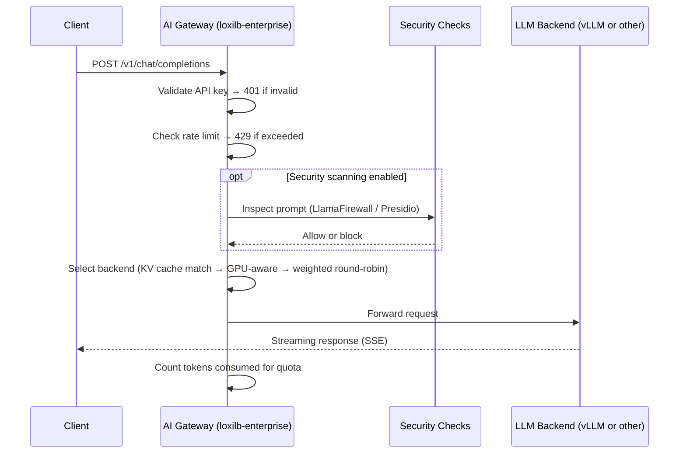

# AI Gateway Overview

!!! enterprise "Enterprise Feature"
    The AI Gateway is included in loxilb-enterprise, which is **free to download and use**.
    See [Installation](../getting-started/installation.md) to get started.

## What is the AI Gateway?

A standard load balancer routes HTTP requests to the least-busy server. That works well for web traffic — but LLM inference is fundamentally different.

When a GPU processes a prompt, it builds a **KV cache** in its memory — a record of the conversation context it computed. If the next request in that conversation lands on a *different* GPU, that GPU must rebuild the entire KV cache from scratch. This cold-start penalty causes a **3–5× latency increase** on every miss, turning a sub-second response into a multi-second wait.

**loxilb's AI Gateway** is designed specifically for this problem. It acts as a high-performance L7 proxy in front of your LLM backends, routing each request with awareness of GPU memory state, model placement, and streaming response patterns — so you get both cache efficiency and load balance across your GPU fleet.

All inspection and enforcement (API key validation, rate limiting, security scanning) happens **before** traffic reaches the backend LLM, at the network layer.

---

## Features at a Glance

AI Gateway features fall into two categories depending on whether they require a vLLM backend.

### Works with Any LLM Backend

These features are available regardless of your inference framework and can be enabled independently:

| Feature | What it does |
|---|---|
| [API Key Management](api-key-management.md) | Issue and revoke per-tenant API keys; validate keys before requests hit backends |
| [Rate Limiting](sse-quota-management.md) | Per-tenant request and token-rate limits enforced at the data plane |
| [Model-Based Routing](llm-routing.md) | Route requests to different backend pools based on the requested model name |
| [SSE Streaming & Token Quota](sse-quota-management.md) | Full support for streaming responses; count consumed tokens per tenant |
| [AI Security — LlamaFirewall](../security-gateway/llamafirewall.md) | Inline prompt inspection for prompt injection and jailbreak attempts |
| [AI Security — PII Detection](../security-gateway/presidio-pii-detection.md) | Detect and block credential leakage or personal data in prompts |

### Requires vLLM

These features depend on real-time GPU metrics scraped from [vLLM](https://github.com/vllm-project/vllm) instances. A vLLM serving endpoint must be reachable for each backend:

| Feature | What it does |
|---|---|
| [KV Cache-Aware Routing](kv-caching.md) | Route each request to the GPU that already holds the relevant KV cache, minimising time-to-first-token |
| [GPU-Aware Load Balancing](vllm-integration.md) | Select backends based on live GPU queue depth and memory pressure from vLLM metrics |
| [Model Load Balancing](model-load-balancing.md) | Distribute across model replicas with health-aware failover and weighted routing |
| [PD Disaggregation](pd-disaggregation.md) | Split prefill (compute-intensive) and decode (memory-intensive) phases onto separate GPU pools for higher throughput |

---

## How It Works

The AI Gateway operates as a **full L7 proxy** sitting in front of your LLM backends. Incoming requests are inspected at the application layer — not just at the TCP/IP level — so the gateway can read the model name, API key, and prompt content before making a routing decision.



---

## Choosing a Routing Strategy

When deploying the AI Gateway, select a routing strategy based on your workload:

| Strategy | Best for | Requires vLLM |
|---|---|:---:|
| **KV Cache Routing** — Send conversations to the GPU that already processed earlier turns in the same session | Chatbots, multi-turn assistants, any workload where requests share context | Yes |
| **GPU-Aware Routing** — Route to the least-loaded GPU based on live queue depth and memory usage | Batch jobs, single-turn completions, high-throughput pipelines | Yes |
| **Model-Based Routing** — Route to different backend pools by model name | Serving multiple models behind one endpoint | No |
| **Weighted Routing** — Distribute across backends with configurable weights | A/B testing, canary deployments, migrating between model versions | No |

You can combine strategies. For example: use model-based routing to separate `gpt-4o` and `llama-3` pools, then apply KV cache routing within each pool.

See [LLM Routing](llm-routing.md) for a complete guide to the three-tier routing architecture.

---

## Prerequisites

!!! warning "L7 Proxy Mode Required"
    All AI Gateway features require the load balancer service to run in **FullProxy mode**. Other modes operate at L4 only and cannot inspect HTTP request bodies for model routing, API key validation, or cache matching. See [Configuration Reference](configuration-reference.md) for how to enable this.

- **loxilb-enterprise** — Free to download. See [Installation](../getting-started/installation.md).
- **HTTP/1.1 backends** — HTTP/2 is not supported for AI Gateway features.
- **vLLM endpoints** (for GPU-aware and KV cache features) — Each backend must expose vLLM metrics; the gateway scrapes these automatically once configured.

---

## Verify the Gateway is Running

After setup, confirm AI Gateway services are active:

```bash
curl http://loxilb:11111/netlox/v1/config/services \
  -H "Authorization: Bearer <token>"
```

If you have vLLM integration enabled, check that GPU metrics are being collected:

```bash
curl http://loxilb:11111/netlox/v1/config/gpu/status \
  -H "Authorization: Bearer <token>"
```

Expected response when GPU-aware mode is active:
```json
{"gpu_aware_enabled": true, "active_scrapers": 3}
```

---

## Troubleshooting

**Gateway not responding**

- Confirm loxilb-enterprise is running and the API port (default `11111`) is reachable
- Verify FullProxy mode is enabled on your load balancer service rule

**API key rejected (401 / 403)**

- Check the key exists and has not expired: `GET /netlox/v1/config/ai/apikey/<key_id>`
- Confirm the key's `allowed_models` list includes the model being requested

**Backend not receiving traffic**

- Verify all backend endpoints are healthy in the service rule
- Ensure `backend_protocol` is set to `http1` (required for AI Gateway)

**High latency on first request (KV cache miss)**

- This is expected on cold start. See [KV Caching](kv-caching.md#cache-warmup) for warm-up strategies.

---

## Next Steps

**Routing & Access Control — works with any LLM backend:**

| Goal | Start here |
|---|---|
| First time using AI Gateway | [LLM Routing](llm-routing.md) |
| Set up API keys and rate limits | [API Key Management](api-key-management.md) |
| Manage streaming token quotas | [SSE Quota Management](sse-quota-management.md) |
| Full configuration reference | [Configuration Reference](configuration-reference.md) |

**GPU & vLLM Integration — requires vLLM backends:**

| Goal | Start here |
|---|---|
| Enable KV cache-aware routing | [KV Caching](kv-caching.md) |
| Connect to vLLM and scrape GPU metrics | [vLLM Integration](vllm-integration.md) |
| Balance load across model replicas | [Model Load Balancing](model-load-balancing.md) |
| Separate prefill and decode GPU pools | [PD Disaggregation](pd-disaggregation.md) |
| Deploy KV cache routing on AWS | [AWS KV Cache Deployment](aws-kv-cache.md) |

## See Also

- [API Key Management API Reference](../reference/api.md#ai-gateway-api-key-management)
- [Tenant Rate Limits API Reference](../reference/api.md#ai-gateway-tenant-rate-limits)
- [GPU and LLM Catalog API Reference](../reference/api.md#ai-gateway-gpu-and-llm-catalog)
