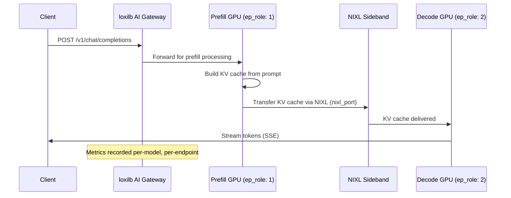

# PD Disaggregation

!!! enterprise "Enterprise Feature"
    This feature requires loxilb-enterprise. It is not available in the community edition.
    See [Installation](../getting-started/installation.md) for enterprise binary setup.

## What is PD Disaggregation?

LLM inference has two distinct phases with very different computational profiles:

- **Prefill** (P) — Processing the input prompt. This is **compute-bound**, like rendering a web page. The GPU processes all input tokens in parallel to build the initial KV cache. Latency depends on prompt length.

- **Decode** (D) — Generating output tokens one at a time. This is **memory-bandwidth-bound**, like streaming a video. Each new token requires reading the entire KV cache from GPU memory. Throughput depends on memory bandwidth.

**PD disaggregation** separates these phases onto different GPU pools optimized for each workload. Prefill nodes use compute-optimized GPUs (high FLOPS), decode nodes use memory-optimized GPUs (high bandwidth). This specialization can achieve **2-3x throughput improvement** for high-concurrency LLM serving compared to running both phases on the same GPU.

## How loxilb Routes P/D Traffic

When PD disaggregation is enabled, loxilb orchestrates the two-phase flow:



### Cache-Aware Variant

When `pd_cache_aware_mode: true`, the decode endpoint selection adds intelligence:

1. **Session stickiness** — Return conversations to the same decode GPU that has the KV cache from previous turns
2. **Radix trie prefix matching** — Match prompt prefixes against known cached content on each decode GPU
3. **Min-load balancing** — Among decode GPUs with cache hits, pick the least loaded

This combines the benefits of PD disaggregation with KV cache locality for decode endpoints.

## Configuration

### REST API Config

Configure PD disaggregation via `POST /config/services` with PD-specific `serviceArguments` and endpoint roles:

```bash
curl -X POST http://loxilb:11111/netlox/v1/config/services \
  -H "Authorization: Bearer <token>" \
  -H "Content-Type: application/json" \
  -d '{
    "serviceArguments": {
      "externalIP": "192.168.1.100",
      "port": 443,
      "protocol": "tcp",
      "mode": 4,
      "backend_protocol": "http1",
      "pd_disagg_mode": true,
      "pd_cache_aware_mode": true,
      "pd_session_ttl_sec": 300,
      "pd_cache_threshold": 20,
      "pd_balance_abs_threshold": 3
    },
    "endpoints": [
      {"endpointIP": "10.0.1.10", "targetPort": 8080, "weight": 1, "ep_role": 1, "nixl_port": 5001},
      {"endpointIP": "10.0.1.11", "targetPort": 8080, "weight": 1, "ep_role": 1, "nixl_port": 5001},
      {"endpointIP": "10.0.2.10", "targetPort": 8081, "weight": 1, "ep_role": 2},
      {"endpointIP": "10.0.2.11", "targetPort": 8081, "weight": 1, "ep_role": 2}
    ]
  }'

# Response (200):
# {"result": "Success"}
```

## Endpoint Roles

!!! warning "Required: Set ep_role on Every Endpoint"
    PD disaggregation enabled (`pd_disagg_mode: true`) but endpoints with `ep_role: 0` (default/normal) will **NOT** participate in P/D routing. You MUST set `ep_role: 1` for prefill and `ep_role: 2` for decode endpoints explicitly. Forgetting this causes P/D routing to fall back to basic first-healthy selection with no disaggregation benefit.


| ep_role | Value | Description | GPU Profile |
|---------|-------|-------------|-------------|
| Normal | `0` | Standard endpoint (default) | General purpose |
| Prefill | `1` | Prompt processing — compute-bound | High FLOPS (e.g., A100, H100) |
| Decode | `2` | Token generation — memory-bandwidth-bound | High bandwidth (e.g., A100-80GB, H100) |

## Configuration Reference

| Field | Type | Valid Values | Default | Description |
|-------|------|-------------|---------|-------------|
| `pd_disagg_mode` | bool | `true`, `false` | `false` | Enable PD disaggregation |
| `pd_cache_aware_mode` | bool | `true`, `false` | `false` | Enable session stickiness + trie matching + min-load for decode selection |
| `pd_session_ttl_sec` | int | > 0 | `300` | Session stickiness TTL for decode endpoints (seconds) |
| `pd_cache_threshold` | int | 0–100 | `20` | Minimum cache match percentage to stick to a decode endpoint |
| `pd_balance_abs_threshold` | int | >= 0 | `3` | Maximum load imbalance tolerance before rebalancing |
| `ep_role` | int | `0`, `1`, `2` | `0` | Endpoint role: 0=normal, 1=prefill, 2=decode |
| `nixl_port` | int | 1–65535 | - | NIXL sideband port for KV cache transfer (prefill endpoints only) |

## Monitoring

PD disaggregation exposes Prometheus metrics for performance tracking:

- **`llb_ai_pd_record()`** — Per-model P/D latency histograms (overall prefill and decode times)
- **`llb_ai_pd_record_ep()`** — Per-endpoint P/D latency histograms (individual GPU performance)

These metrics help identify:

- Prefill bottlenecks (compute-bound) vs decode bottlenecks (memory-bound)
- Imbalanced GPU pools (one endpoint consistently slower)
- NIXL transfer overhead between prefill and decode nodes

## Verify

Confirm PD disaggregation is configured by listing your service rules:

```bash
curl http://loxilb:11111/netlox/v1/config/services \
  -H "Authorization: Bearer <token>"
```

Check that the response includes your service rule with `pd_disagg_mode: true` and endpoints with the correct `ep_role` values (1 for prefill, 2 for decode).

## Troubleshooting

**Prefill endpoints not sticky (decode endpoints constantly changing)**

- Verify `pd_cache_aware_mode: true` is set in the service rule
- Check `pd_session_ttl_sec` is high enough for your conversation patterns (default: 300s)
- Ensure `pd_cache_threshold` is not too high — lower values (e.g., 10-20) allow stickiness with partial cache matches

**Decode load imbalanced (some GPUs overloaded)**

- Check `pd_balance_abs_threshold` — lower values trigger rebalancing sooner
- Verify all decode endpoints (`ep_role: 2`) are healthy and accepting connections
- If one decode GPU is consistently slower, investigate GPU memory bandwidth or thermal throttling

**P/D routing falling back to basic selection**

- Confirm all endpoints have explicit `ep_role` values set (1 or 2) — endpoints with `ep_role: 0` do not participate in P/D routing
- Verify `pd_disagg_mode: true` is set in `serviceArguments`

## See Also

- [KV Caching](kv-caching.md) — KV-exact routing for non-disaggregated deployments
- [vLLM Integration](vllm-integration.md) — GPU metrics scraping
- [Configuration Reference](configuration-reference.md) — All AI Gateway config fields
- [GPU and LLM Catalog API Reference](../reference/api.md#ai-gateway-gpu-and-llm-catalog)
