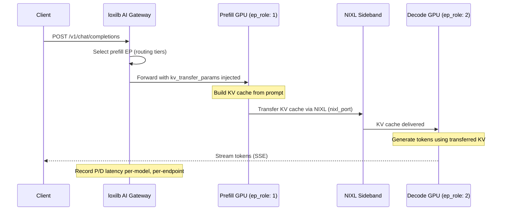
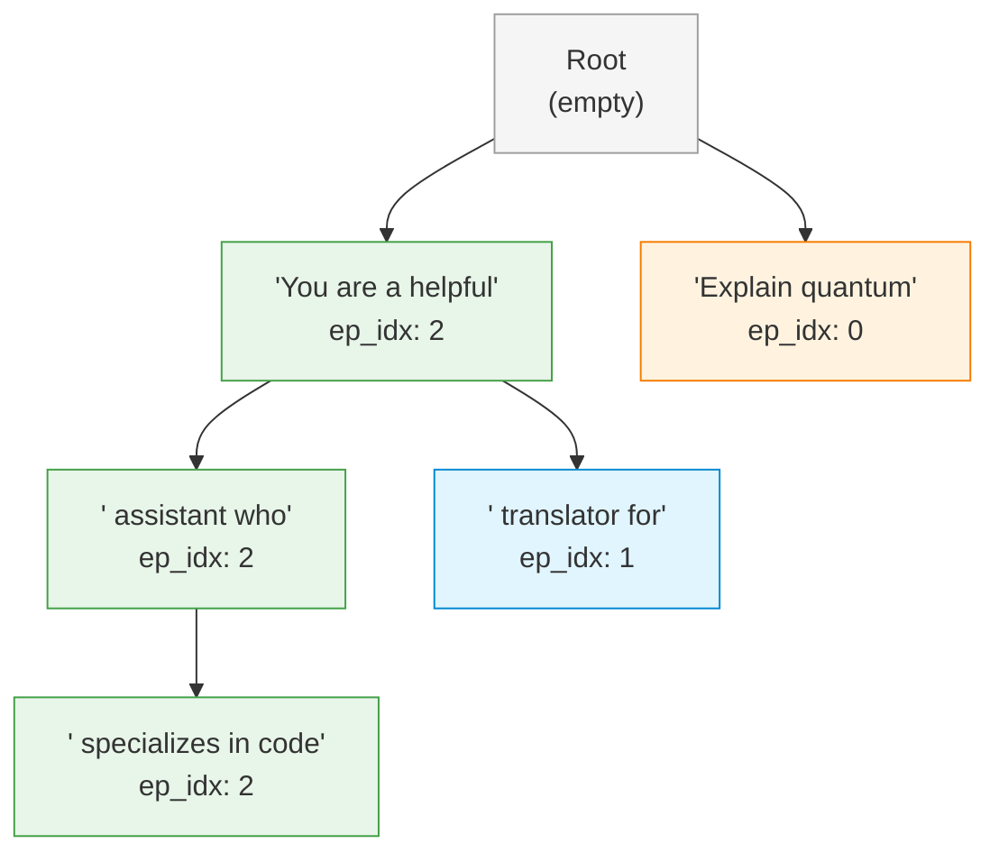

# PD Disaggregation

!!! enterprise "Enterprise Feature"
    This feature requires loxilb-enterprise. It is not available in the community edition.
    See [Installation](../getting-started/installation.md) for enterprise binary setup.

## How This Page Fits Into the Bigger Picture

PD disaggregation is an **advanced routing feature** that splits the LLM inference pipeline across specialized GPU pools. It works alongside the standard routing tiers:


---

## What is PD Disaggregation?

LLM inference has two distinct phases with very different computational profiles:

- **Prefill** (P) -- Processing the input prompt. This is **compute-bound**, like rendering a web page. The GPU processes all input tokens in parallel to build the initial KV cache. Latency depends on prompt length.

- **Decode** (D) -- Generating output tokens one at a time. This is **memory-bandwidth-bound**, like streaming a video. Each new token requires reading the entire KV cache from GPU memory. Throughput depends on memory bandwidth.

**PD disaggregation** separates these phases onto different GPU pools optimized for each workload. Prefill nodes use compute-optimized GPUs (high FLOPS), decode nodes use memory-optimized GPUs (high bandwidth). This specialization can achieve **2-3x throughput improvement** for high-concurrency LLM serving compared to running both phases on the same GPU.

---

## How loxilb Routes P/D Traffic

When PD disaggregation is enabled, loxilb orchestrates the two-phase flow:



---

## Deep Internals: Prefill-Decode Routing Logic

This section explains the C-level implementation in `sockproxy_pd.c` and `sockproxy_http.c`.

### How Endpoints Are Classified

Each endpoint has an `ep_role` field that determines its role in P/D routing:

| `ep_role` Value | Role | Source Constant | Description |
|----------------|------|-----------------|-------------|
| `0` | Normal | Default | Standard endpoint -- does not participate in P/D routing |
| `1` | Prefill | EP_ROLE_PREFILL | Handles prompt processing (compute-bound phase) |
| `2` | Decode | EP_ROLE_DECODE | Handles token generation (memory-bandwidth-bound phase) |

!!! warning "Required: Set ep_role on Every Endpoint"
    PD disaggregation enabled (`pd_disagg_mode: true`) but endpoints with `ep_role: 0` (default/normal) will **NOT** participate in P/D routing. You MUST set `ep_role: 1` for prefill and `ep_role: 2` for decode endpoints explicitly. Forgetting this causes P/D routing to fall back to basic first-healthy selection with no disaggregation benefit.

### Request Body Rewriting

When a request is routed to a prefill endpoint, `sockproxy_pd.c` rewrites the JSON body to inject KV transfer parameters:

The function `pd_prepare_prefill_body()` appends a `kv_transfer_params` field to the JSON body:

```json
{
  "model": "llama3-70b",
  "messages": [...],
  "kv_transfer_params": {
    "do_remote_decode": true,
    "do_remote_prefill": false
  }
}
```

This tells the vLLM prefill instance to:
1. Build the KV cache from the prompt
2. Transfer the KV cache to the decode endpoint via NIXL (instead of decoding locally)
3. Return the KV transfer metadata in the response

### NIXL Transfer Flow

After prefill completes, the NIXL sideband transfers the KV cache tensors directly between GPUs:

1. **Prefill response**: Contains KV params (transfer metadata) in the response body
2. **Extract KV params**: `pd_extract_kv_params()` extracts the transfer metadata from the prefill response
3. **Prepare decode body**: `pd_prepare_decode_body()` constructs a new request body for the decode endpoint, injecting the KV params from the prefill response
4. **Route to decode**: The modified request is forwarded to the selected decode endpoint
5. **Token streaming**: The decode endpoint generates tokens using the transferred KV cache and streams SSE back to the client

### The X-Request-Id Format

P/D requests include a special `X-Request-Id` header that encodes the routing decision:

```
X-Request-Id: ___prefill_addr_10.0.1.10:5600___decode_addr_10.0.2.10:5600_<uuid>
```

The ports in the header are the **NIXL sideband ports** (`nixl_port`), not the HTTP serving ports. This header enables:
- End-to-end request tracing across the P/D pipeline
- Verification that P/D routing is active
- Debugging which prefill/decode pair was selected

---

## Deep Internals: Cache-Aware Decode Selection

When `pd_cache_aware_mode: true`, decode endpoint selection uses a **compressed radix trie** implemented in `sockproxy_pd_trie.c`.

### How the Radix Trie Works

The trie stores `(prompt_prefix -> ep_idx)` mappings. Each node along the path records which decode endpoint has processed prompts with that prefix:



**Key properties:**

- **Compressed edges**: Common prefixes are stored once, with split nodes for divergent suffixes
- **ep_idx at every node**: Not just at leaves -- this enables longest prefix matching at any depth
- **Linked-list children**: Each node stores children as a linked list (efficient for small alphabets)
- **Node merge on removal**: When a node loses its ep_idx and has exactly one child, it merges with the child to prevent trie bloat

### Prefix Matching Score

`pd_trie_match()` returns the **deepest node** with a valid `ep_idx` (longest prefix match). The match score is the depth of the matched node, representing how many characters of the prompt prefix matched a known decode endpoint.

### How Cache Threshold and Balance Work

Two configuration parameters control when the trie match overrides load-based selection:

| Parameter | Default | Effect |
|-----------|---------|--------|
| `pd_cache_threshold` | `20` | Minimum trie match score (depth) to prefer the trie-selected endpoint. If the match score is below this threshold, load-based selection is used instead. |
| `pd_balance_abs_threshold` | `3` | Maximum allowed load difference between the trie-selected endpoint and the least-loaded endpoint. If the trie-selected endpoint has more than this many extra active connections, the least-loaded endpoint is chosen instead (preventing hotspots). |

**Decision flow:**

1. Run `pd_trie_match()` on the prompt prefix
2. If match score >= `pd_cache_threshold`: prefer the trie-selected endpoint
3. But if (trie EP load - min EP load) > `pd_balance_abs_threshold`: override with least-loaded endpoint
4. If match score < `pd_cache_threshold`: use least-loaded decode endpoint

### Session Stickiness Integration

P/D sessions are tracked in a `pd_session_map` hash table. When `pd_session_ttl_sec > 0`:

- First request in a conversation: routed via trie match or load-based selection, then recorded in session map
- Subsequent requests: looked up in session map first (fast path), falling back to trie match on miss
- Session expiry: sessions are evicted after `pd_session_ttl_sec` seconds of inactivity

---

## Configuration

### REST API Config

Configure PD disaggregation via `POST /netlox/v1/config/loadbalancer` with PD-specific `serviceArguments` and endpoint roles:

```bash
curl -X POST http://loxilb:11111/netlox/v1/config/loadbalancer \
  -H "Authorization: Bearer <token>" \
  -H "Content-Type: application/json" \
  -d '{
    "serviceArguments": {
      "externalIP": "192.168.1.100",
      "port": 443,
      "protocol": "tcp",
      "mode": 4,
      "backend_protocol": "http1",
      "pd_disagg_mode": true,
      "pd_cache_aware_mode": true,
      "pd_session_ttl_sec": 300,
      "pd_cache_threshold": 20,
      "pd_balance_abs_threshold": 3
    },
    "endpoints": [
      {"endpointIP": "10.0.1.10", "targetPort": 8100, "weight": 1, "ep_role": 1, "nixl_port": 5600},
      {"endpointIP": "10.0.1.11", "targetPort": 8100, "weight": 1, "ep_role": 1, "nixl_port": 5600},
      {"endpointIP": "10.0.2.10", "targetPort": 8200, "weight": 1, "ep_role": 2, "nixl_port": 5600},
      {"endpointIP": "10.0.2.11", "targetPort": 8200, "weight": 1, "ep_role": 2, "nixl_port": 5600}
    ]
  }'

# Response (200):
# {"result": "Success"}
```

---

## Deployment Scenarios

### Scenario 1: Basic P/D Split (2 Prefill, 4 Decode)

A basic P/D deployment without cache-aware decode selection. Requests are prefilled on the prefill pool and decoded on the least-loaded decode endpoint.

```bash
curl -X POST http://loxilb:11111/netlox/v1/config/loadbalancer \
  -H "Authorization: Bearer <token>" \
  -H "Content-Type: application/json" \
  -d '{
    "serviceArguments": {
      "externalIP": "10.0.0.100",
      "port": 443,
      "protocol": "tcp",
      "mode": 4,
      "backend_protocol": "http1",
      "llm_type": "chat-interactive",
      "pd_disagg_mode": true,
      "pd_cache_aware_mode": false
    },
    "endpoints": [
      {"endpointIP": "10.0.1.1", "targetPort": 8080, "weight": 1, "ep_role": 1, "nixl_port": 5600},
      {"endpointIP": "10.0.1.2", "targetPort": 8080, "weight": 1, "ep_role": 1, "nixl_port": 5600},
      {"endpointIP": "10.0.2.1", "targetPort": 8080, "weight": 1, "ep_role": 2},
      {"endpointIP": "10.0.2.2", "targetPort": 8080, "weight": 1, "ep_role": 2},
      {"endpointIP": "10.0.2.3", "targetPort": 8080, "weight": 1, "ep_role": 2},
      {"endpointIP": "10.0.2.4", "targetPort": 8080, "weight": 1, "ep_role": 2}
    ]
  }'
```

**What each field does:**

- `pd_disagg_mode: true` -- Enables P/D routing (requests are split across prefill and decode endpoints)
- `pd_cache_aware_mode: false` -- Decode selection is purely load-based (no trie matching)
- `ep_role: 1` -- Marks endpoints as prefill nodes
- `ep_role: 2` -- Marks endpoints as decode nodes
- `nixl_port: 5600` -- NIXL sideband port for KV cache transfer between prefill and decode GPUs

### Scenario 2: P/D with Cache-Aware Decode (Tuned for Different Workloads)

**Latency-sensitive workload** (chatbot): Higher cache threshold to prefer cache hits, lower balance threshold to prevent hotspots:

```bash
curl -X POST http://loxilb:11111/netlox/v1/config/loadbalancer \
  -H "Authorization: Bearer <token>" \
  -H "Content-Type: application/json" \
  -d '{
    "serviceArguments": {
      "externalIP": "10.0.0.100",
      "port": 443,
      "protocol": "tcp",
      "mode": 4,
      "backend_protocol": "http1",
      "llm_type": "chat-interactive",
      "pd_disagg_mode": true,
      "pd_cache_aware_mode": true,
      "pd_session_ttl_sec": 600,
      "pd_cache_threshold": 10,
      "pd_balance_abs_threshold": 2
    },
    "endpoints": [
      {"endpointIP": "10.0.1.1", "targetPort": 8080, "weight": 1, "ep_role": 1, "nixl_port": 5600},
      {"endpointIP": "10.0.1.2", "targetPort": 8080, "weight": 1, "ep_role": 1, "nixl_port": 5600},
      {"endpointIP": "10.0.2.1", "targetPort": 8080, "weight": 1, "ep_role": 2},
      {"endpointIP": "10.0.2.2", "targetPort": 8080, "weight": 1, "ep_role": 2},
      {"endpointIP": "10.0.2.3", "targetPort": 8080, "weight": 1, "ep_role": 2}
    ]
  }'
```

- `pd_cache_threshold: 10` -- Accept shorter prefix matches (more cache hits, better latency)
- `pd_balance_abs_threshold: 2` -- Tighter load balancing (rebalance sooner to prevent hotspots)
- `pd_session_ttl_sec: 600` -- 10-minute session stickiness for long conversations

**Throughput-optimized workload** (batch inference): Lower cache threshold, higher balance tolerance:

```bash
# Same structure but with different tuning:
# pd_cache_threshold: 30  (require longer prefix matches -- fewer but higher-quality cache hits)
# pd_balance_abs_threshold: 5  (tolerate more load imbalance for better cache reuse)
# pd_session_ttl_sec: 60  (short sessions -- batch queries are independent)
```

---

## Performance Tuning

### When P/D Helps vs Hurts

| Scenario | P/D Benefit | Recommendation |
|----------|------------|----------------|
| High concurrency, short prompts | High -- compute and bandwidth requirements decouple well | Use P/D with 1:3 prefill:decode ratio |
| Low concurrency, long prompts | Moderate -- prefill dominates, but NIXL transfer adds overhead | Use P/D only if you have >4 GPUs total |
| Single-turn batch queries | Low -- no session stickiness benefit, NIXL overhead per-request | Consider standard routing (`sel: 9`) instead |
| Multi-turn chat with shared system prompts | High -- cache-aware decode reuses system prompt KV cache | Use P/D with `pd_cache_aware_mode: true` |

### Minimum Fleet Size

P/D disaggregation requires at least **2 prefill + 2 decode** endpoints (4 GPUs total) to provide meaningful benefit. With fewer GPUs:

- 2 GPUs: Use standard routing -- NIXL transfer overhead negates the specialization benefit
- 3 GPUs: Marginal benefit -- 1 prefill + 2 decode provides some throughput improvement
- 4+ GPUs: P/D starts showing clear throughput gains

---

## Endpoint Roles

| ep_role | Value | Description | GPU Profile |
|---------|-------|-------------|-------------|
| Normal | `0` | Standard endpoint (default) | General purpose |
| Prefill | `1` | Prompt processing -- compute-bound | High FLOPS (e.g., A100, H100) |
| Decode | `2` | Token generation -- memory-bandwidth-bound | High bandwidth (e.g., A100-80GB, H100) |

## Configuration Reference

| Field | Type | Valid Values | Default | Description |
|-------|------|-------------|---------|-------------|
| `pd_disagg_mode` | bool | `true`, `false` | `false` | Enable PD disaggregation. Source: `sockproxy_pd.c` |
| `pd_cache_aware_mode` | bool | `true`, `false` | `false` | Enable session stickiness + trie matching + min-load for decode selection. Source: `sockproxy_pd_trie.c` |
| `pd_session_ttl_sec` | int | >= 0 | `0` (no expiry) | Session stickiness TTL for decode endpoints (seconds). `0` = no automatic expiry |
| `pd_cache_threshold` | int | 0-100 | `20` | Minimum cache match percentage to stick to a decode endpoint. Source: `sockproxy_pd.c` |
| `pd_balance_abs_threshold` | int | >= 0 | `3` | Maximum load imbalance tolerance before rebalancing. Source: `sockproxy_pd.c` |
| `ep_role` | int | `0`, `1`, `2` | `0` | Endpoint role: 0=normal, 1=prefill, 2=decode |
| `nixl_port` | int | 1-65535, `0` | `0` | NIXL sideband port for KV cache transfer. `0` = use `targetPort` (backward compatible) |

## Monitoring

PD disaggregation exposes Prometheus metrics for performance tracking:

| Metric | Type | Description |
|--------|------|-------------|
| `loxilb_ai_pd_requests_total` | Counter | Total P/D requests processed |
| `loxilb_ai_pd_prefill_duration_seconds` | Histogram | Time spent in prefill phase per request |
| `loxilb_ai_pd_sessions_active` | Gauge | Current active P/D sessions (from `sockproxy_metrics.c`) |
| `loxilb_ai_pd_trie_nodes` | Gauge | Current trie node count (from `sockproxy_metrics.c`) |
| `loxilb_ai_pd_kv_params_overflow` | Counter | KV params buffer overflow events |
| `loxilb_ai_pd_cb_flips` | Counter | Circuit breaker state transitions |
| `loxilb_ai_pd_fallback_to_normal` | Counter | Fallback to normal routing (P/D failure) |

## Verify

Confirm PD disaggregation is configured by listing your service rules:

```bash
curl http://loxilb:11111/netlox/v1/config/loadbalancer/all
```

Check that the response includes your service rule with `pd_disagg_mode: true` and endpoints with the correct `ep_role` values (1 for prefill, 2 for decode).

End-to-end test -- confirm P/D routing via `X-Request-Id` in the response:

```bash
curl -i http://loxilb:11111/v1/completions \
  -H "Content-Type: application/json" \
  -d '{"model":"Qwen/Qwen3-0.6B","prompt":"hello","max_tokens":8}'

# Look for X-Request-Id in response headers -- P/D format:
#   X-Request-Id: ___prefill_addr_10.0.1.10:5600___decode_addr_10.0.2.10:5600_<uuid>
# The ports shown are the NIXL sideband ports (nixl_port = 5600), not HTTP ports.
```

## Troubleshooting

**Prefill endpoints not sticky (decode endpoints constantly changing)**

- Verify `pd_cache_aware_mode: true` is set in the service rule
- Check `pd_session_ttl_sec` is high enough for your conversation patterns (default: 300s)
- Ensure `pd_cache_threshold` is not too high -- lower values (e.g., 10-20) allow stickiness with partial cache matches

**Decode load imbalanced (some GPUs overloaded)**

- Check `pd_balance_abs_threshold` -- lower values trigger rebalancing sooner
- Verify all decode endpoints (`ep_role: 2`) are healthy and accepting connections
- If one decode GPU is consistently slower, investigate GPU memory bandwidth or thermal throttling

**P/D routing falling back to basic selection**

- Confirm all endpoints have explicit `ep_role` values set (1 or 2) -- endpoints with `ep_role: 0` do not participate in P/D routing
- Verify `pd_disagg_mode: true` is set in `serviceArguments`
- Check for `pd_fallback_to_normal` counter increasing -- this indicates P/D failures causing fallback

**NIXL transfer failures**

- Verify `nixl_port` is set on prefill endpoints and the port is accessible from decode endpoints
- Check that both prefill and decode vLLM instances are configured with matching `--kv-transfer-config`
- Monitor `pd_kv_params_overflow` counter -- if this increments, the KV params buffer is too small

## Next Steps

- [KV Caching](kv-caching.md) -- KV-exact routing for non-disaggregated deployments
- [vLLM Integration](vllm-integration.md) -- GPU metrics scraping
- [AWS KV Cache Deployment](aws-kv-cache.md) -- Deploy P/D disaggregation on AWS EKS GPU nodes
- [Configuration Reference](configuration-reference.md) -- All AI Gateway config fields
