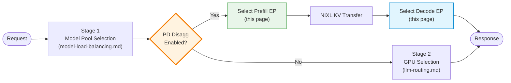
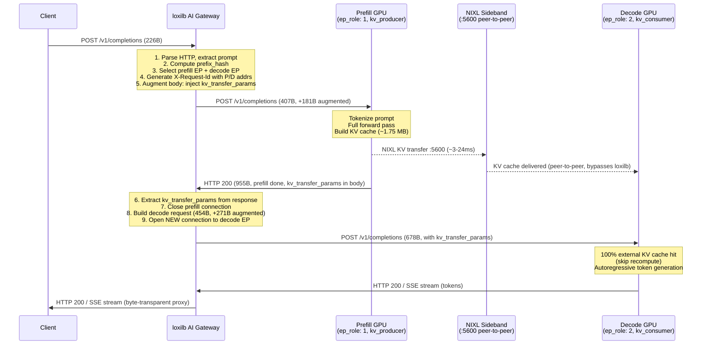
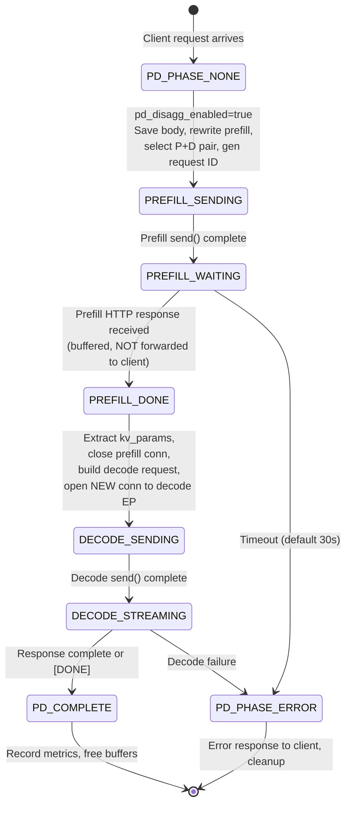
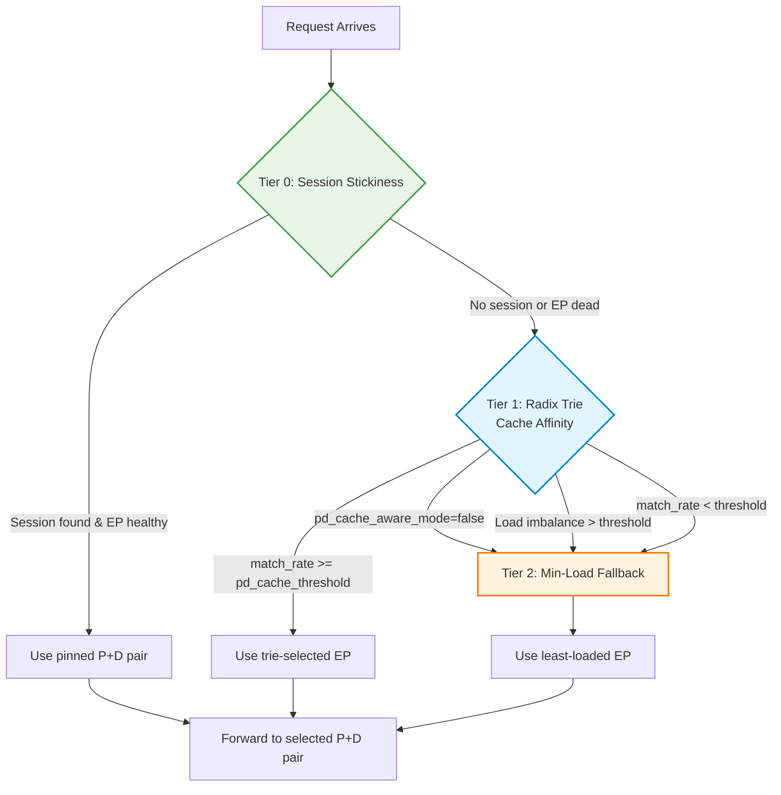

# PD Disaggregation

!!! enterprise "Enterprise Feature"
    This feature requires loxilb-enterprise. It is not available in the community edition.
    See [Installation](../getting-started/installation.md) for enterprise binary setup.

## How This Page Fits Into the Bigger Picture

PD disaggregation is an **advanced routing feature** that splits the LLM inference pipeline across specialized GPU pools. It works alongside the standard routing tiers:



---

## What is PD Disaggregation?

LLM inference has two distinct phases with very different computational profiles:

- **Prefill** (P) -- Processing the input prompt. This is **compute-bound**, like rendering a web page. The GPU processes all input tokens in parallel to build the initial KV cache. Latency depends on prompt length.

- **Decode** (D) -- Generating output tokens one at a time. This is **memory-bandwidth-bound**, like streaming a video. Each new token requires reading the entire KV cache from GPU memory. Throughput depends on memory bandwidth.

**PD disaggregation** separates these phases onto different GPU pools optimized for each workload. Prefill nodes use compute-optimized GPUs (high FLOPS), decode nodes use memory-optimized GPUs (high bandwidth). This specialization can achieve **2-3x throughput improvement** for high-concurrency LLM serving compared to running both phases on the same GPU.

---

## End-to-End Request Lifecycle

When PD disaggregation is enabled, loxilb orchestrates a **two-phase flow** for every client request. This is the actual packet-level sequence observed in production AWS CICD testing:



### Request Body Augmentation Chain

loxilb rewrites the request body at each stage, injecting routing metadata:

```
226B (original client request)
 -> 407B (+181B: kv_transfer_params, prefill role, kv_producer_host, prefix_hash)
      Sent to prefill endpoint
 -> 678B (+271B: decode role, kv_consumer_host, prefill_addr, nixl_port)
      Sent to decode endpoint (includes kv_transfer_params from prefill response)
```

### What Happens at Each Stage

**Prefill request modification** (implemented in `sockproxy_pd.c`):

| Field | Original | Modified | Purpose |
|-------|----------|----------|---------|
| `max_tokens` | Client value (e.g., 200) | `1` | Forces prefill-only execution |
| `max_completion_tokens` | Client value | `1` | OpenAI alias for max_tokens |
| `stream` | `true` or `false` | `false` | Forces non-streaming for JSON response |
| `stream_options` | Present | Removed | Incompatible with stream=false |
| `kv_transfer_params` | Absent | `{"do_remote_decode":true,"do_remote_prefill":false}` | Signals KV should be exported via NIXL |

**Decode request construction**: loxilb restores the original client body (`max_tokens`, `stream`) and injects the `kv_transfer_params` extracted from the prefill response. This contains `remote_engine_id`, `remote_block_ids`, `remote_host`, and `remote_port` -- everything the decode endpoint needs to retrieve the KV cache via NIXL.

---

## loxilb Internal State Machine

Each P/D request progresses through a 7-phase state machine tracked per-connection. This is derived from actual `docker logs loxilb` during traced requests in the AWS CICD testbed:



**Actual loxilb log trace** from a production request:

```
[ACCEPT fd=471]
[HTTP_PARSE: POST /v1/completions detected]
[PREFIX_EXTRACTED: prefix_hash=0xae6128a97a954deb, model=Qwen/Qwen3-0.6B]
[PD_ROUTE: US-PD804: P/D EP selected -- prefill=EP0 decode=EP2]
[PREFILL_SEND: body augmented 112->184 bytes -> ep0:8100]    pd_phase=2
[PREFILL_WAITING: blocking on prefill HTTP response]
[PREFILL_DONE: resp_len=954 received from prefill]
[DECODE_SEND: decode request built 454 bytes -> ep2:8200]    pd_phase=4
[DECODE_DONE: len=718 full completion received]
[CLIENT_RESPOND: HTTP 200 proxied to client fd=471]
[CLOSE: EOF on fds 470/471/472, clean teardown]
```

### Connection Lifecycle

Only one backend connection is active at a time -- prefill and decode are sequential:

```
Timeline    Client pfe          Prefill backend        Decode backend
---------------------------------------------------------------------------
t=0         accept()            --                     --
t=1         parse request       --                     --
t=2         P/D entry           connect()              --
t=3         send prefill        <-- send               --
t=4         wait                receive response       --
t=5         PREFILL_DONE        close()                connect()
t=6         send decode         --                     <-- send
t=7         DECODE_STREAMING    --                     receive response
t=8         stream to client    --                     <-- forward --> client
t=9         COMPLETE            --                     close()
```

---

## NIXL KV Cache Transfer

The KV cache transfer happens **peer-to-peer between GPU nodes via NIXL** -- it bypasses loxilb entirely. loxilb only orchestrates the HTTP routing; actual tensor data moves directly between prefill and decode nodes on port 5600.

### How It Works

1. **Prefill node** builds the KV cache from the prompt (~1.75 MB for Qwen3-0.6B)
2. **NIXL sideband** (port 5600) transfers KV tensors directly: prefill GPU -> decode GPU
3. **Decode node** receives 100% of prompt tokens via `external_kv_transfer` (confirmed by Prometheus metrics)
4. **Decode skips recomputation** -- the KV cache is already present, so decode only does autoregressive token generation

### Transfer Evidence from Production

Prometheus metrics on the decode node confirm true KV transfer:

| Metric | Prefill Node | Decode Node | Interpretation |
|--------|:---:|:---:|----------------|
| `prompt_tokens_by_source{external_kv_transfer}` | 0 | 55 | 100% of decode prompt tokens arrived via NIXL |
| `prompt_tokens_by_source{local_compute}` | 36 | 11 | Prefill computed all; decode only recomputed boundary tokens |
| `generation_tokens_total` | 7 | 152 | All generation on decode; prefill near-zero (correct) |
| External prefix cache hit rate | -- | **100%** | Every request served via KV transfer |

### NIXL Transfer Metrics

From decode node container logs:

```
KV Transfer metrics: Num successful transfers=2, Avg xfer time=2.9ms,
  Avg MB per transfer=1.75, Throughput=596.6 MB/s, Avg descriptors=56
KV Transfer metrics: Num successful transfers=2, Avg xfer time=9.8ms,
  Avg MB per transfer=1.75, Throughput=179.4 MB/s, Avg descriptors=56
```

Transfer time of 3-24ms is consistent with TCP between instances in the same VPC subnet.

### vLLM Connector Requirement

loxilb PD disaggregation requires vLLM's **`NixlConnector`**. Other connectors will fail:

| Connector | Result |
|-----------|--------|
| `NixlConnector` | Works correctly -- reads `kv_transfer_params` from response body |
| `P2pNcclConnector` | Silent failure -- KV transfer fails, decode re-runs full prefill (2x latency, zero error signal) |
| `LMCacheConnectorV1` | Incompatible -- uses its own cache service, ignores `kv_transfer_params` |

---

## X-Request-Id and P/D Correlation

Every P/D request gets a special `X-Request-Id` header that encodes both worker addresses:

```
X-Request-Id: ___prefill_addr_10.0.1.21:5600___decode_addr_10.0.1.31:5600_d87836...
```

The ports in the header are the **NIXL sideband ports** (`nixl_port`), not the HTTP serving ports.

**Key behaviors:**

- **Auto-generated**: loxilb always generates the P/D-formatted ID, even if the client sends an `X-Request-Id`
- **Client ID replaced**: In P/D mode, the client-provided ID is stripped and replaced with the P/D format (required for vLLM routing correlation)
- **Same ID to both backends**: The identical `X-Request-Id` is injected into both the prefill and decode requests, enabling end-to-end correlation
- **Visible in response**: The response `id` field embeds both worker addresses -- this is the fastest way to verify P/D routing is active without any log access

Example response IDs showing both prefill nodes being used in round-robin:

```json
"id": "cmpl-___prefill_addr_10.0.1.21:5600___decode_addr_10.0.1.31:5600_d87836..."
"id": "cmpl-___prefill_addr_10.0.1.22:5600___decode_addr_10.0.1.31:5600_6e7296..."
```

---

## 3-Tier Endpoint Selection

PD disaggregation uses a sophisticated 3-tier selection policy for choosing prefill endpoints:



### Tier 0: Session Stickiness (Always Active)

Multi-turn conversations stick to the same prefill+decode pair:

- **Key**: `X-Conversation-Id` header (priority) or JSON body `"user"` field (fallback)
- **Action**: Return pinned (prefill_ep, decode_ep) pair while TTL valid and EPs healthy
- **TTL**: Configurable via `pd_session_ttl_sec` (default: 300s). Sessions are evicted after TTL expiry
- **Capacity**: 4096-entry LRU table per service. Oldest sessions evicted when full
- **Health check**: If pinned EP is dead, session is evicted and falls through to Tier 1/2

### Tier 1: Radix Trie Cache Affinity (When `pd_cache_aware_mode=true`)

Routes requests with similar system prompts to the same prefill EP for KV cache reuse:

- **Input**: System prompt text extracted from request body
- **Algorithm**: Character-level compressed radix trie storing `(prompt_prefix -> ep_idx)` mappings
- **Guard**: If `(max_active_conns - min_active_conns) > pd_balance_abs_threshold` -> skip to Tier 2 (prevents hotspots)
- **Threshold**: If `match_rate >= pd_cache_threshold` -> use trie-selected EP
- **Capacity**: 8192 nodes max, LRU eviction when exceeded (~800KB memory)

### Tier 2: Min-Load Fallback (Always Available)

Selects the prefill EP with the lowest active connection count among healthy EPs. Used for cold start, novel prompts, and when load imbalance overrides trie affinity.

**Decode EP selection** is always Session -> Min-Load (no trie). Decode EPs receive KV cache via NIXL from the prefill EP, so prefix affinity provides no benefit on the decode side.

---

## Configuration

### REST API Config

Configure PD disaggregation via `POST /netlox/v1/config/loadbalancer`:

```bash
curl -X POST http://loxilb:11111/netlox/v1/config/loadbalancer \
  -H "Authorization: Bearer <token>" \
  -H "Content-Type: application/json" \
  -d '{
    "serviceArguments": {
      "externalIP": "192.168.1.100",
      "port": 443,
      "protocol": "tcp",
      "mode": 4,
      "backend_protocol": "http1",
      "pd_disagg_mode": true,
      "pd_cache_aware_mode": true,
      "pd_session_ttl_sec": 300,
      "pd_cache_threshold": 20,
      "pd_balance_abs_threshold": 3
    },
    "endpoints": [
      {"endpointIP": "10.0.1.10", "targetPort": 8100, "weight": 1, "ep_role": 1, "nixl_port": 5600},
      {"endpointIP": "10.0.1.11", "targetPort": 8100, "weight": 1, "ep_role": 1, "nixl_port": 5600},
      {"endpointIP": "10.0.2.10", "targetPort": 8200, "weight": 1, "ep_role": 2, "nixl_port": 5600},
      {"endpointIP": "10.0.2.11", "targetPort": 8200, "weight": 1, "ep_role": 2, "nixl_port": 5600}
    ]
  }'

# Response (200):
# {"result": "Success"}
```

### Validation Rules

The API enforces these constraints:

| Rule | Error if violated |
|------|-------------------|
| `pd_disagg_mode: true` requires `mode: 4` (FullProxy) | Rejected at API validation |
| `pd_disagg_mode: true` requires at least 1 `ep_role: 1` (prefill) endpoint | Rejected |
| `pd_disagg_mode: true` requires at least 1 `ep_role: 2` (decode) endpoint | Rejected |
| All endpoints must have explicit `ep_role` (1 or 2) when P/D enabled | `ep_role: 0` rejected |
| `pd_cache_aware_mode: true` requires `pd_disagg_mode: true` | Rejected |

---

## Deployment Scenarios

### Scenario 1: Basic P/D Split (AWS CICD Reference Architecture)

This is the exact configuration used in the production AWS CICD testbed that validates P/D disaggregation end-to-end with real vLLM and NIXL:

```
           +----------------------+
           |    Client node       |
           |  10.0.1.11           |
           +----------+-----------+
                      | HTTP /v1/completions
           +----------v-----------+
           |    loxilb LB         |
           |  10.0.1.10           |
           |  LB :9000, API :11111|
           |  pd_disagg_mode:true |
           +--+---------------+---+
              | ep_role:1       | ep_role:2
    +---------+-------+   +----+--------+
    |   Prefill Pool  |   |  Decode Pool |
    |  (kv_producer)  |   | (kv_consumer)|
    +-----------------+   +-------------+
    | l3ep1 (g5.xl)   |   | l3ep3 (g5.xl)|
    | 10.0.1.21:8100  |   | 10.0.1.31:8200|
    | NIXL :5600      |   | NIXL :5600   |
    +-----------------+   +--------------+
    | l3ep2 (g5.xl)   |   | l3ep4 (g5.xl)|
    | 10.0.1.22:8100  |   | 10.0.1.32:8200|
    | NIXL :5600      |   | NIXL :5600   |
    +-----------------+   +--------------+
```

**loxilb LB rule:**

```bash
curl -X POST http://loxilb:11111/netlox/v1/config/loadbalancer \
  -H "Content-Type: application/json" \
  -d '{
    "serviceArguments": {
      "externalIP": "10.0.1.10",
      "port": 9000,
      "protocol": "tcp",
      "mode": 4,
      "pd_disagg_mode": true,
      "pd_cache_aware_mode": false,
      "pd_session_ttl_sec": 30
    },
    "endpoints": [
      {"endpointIP": "10.0.1.21", "targetPort": 8100, "weight": 1, "ep_role": 1, "nixl_port": 5600},
      {"endpointIP": "10.0.1.22", "targetPort": 8100, "weight": 1, "ep_role": 1, "nixl_port": 5600},
      {"endpointIP": "10.0.1.31", "targetPort": 8200, "weight": 1, "ep_role": 2, "nixl_port": 5600},
      {"endpointIP": "10.0.1.32", "targetPort": 8200, "weight": 1, "ep_role": 2, "nixl_port": 5600}
    ]
  }'
```

**vLLM launch configuration (prefill nodes):**

```bash
docker run -d --name vllm --gpus all --network host \
  -e VLLM_NIXL_SIDE_CHANNEL_HOST=10.0.1.21 \
  -e VLLM_NIXL_SIDE_CHANNEL_PORT=5600 \
  -e UCX_TLS=tcp \
  -e UCX_NET_DEVICES=all \
  vllm/vllm-openai:v0.17.0 \
    --model Qwen/Qwen3-0.6B \
    --port 8100 \
    --max-model-len 4096 \
    --gpu-memory-utilization 0.85 \
    --enforce-eager \
    --enable-request-id-headers \
    --kv-transfer-config '{"kv_connector":"NixlConnector","kv_role":"kv_producer","kv_buffer_device":"cpu","kv_load_failure_policy":"fail"}'
```

**vLLM launch configuration (decode nodes):**

```bash
docker run -d --name vllm --gpus all --network host \
  -e VLLM_NIXL_SIDE_CHANNEL_HOST=10.0.1.31 \
  -e VLLM_NIXL_SIDE_CHANNEL_PORT=5600 \
  -e UCX_TLS=tcp \
  -e UCX_NET_DEVICES=all \
  vllm/vllm-openai:v0.17.0 \
    --model Qwen/Qwen3-0.6B \
    --port 8200 \
    --max-model-len 4096 \
    --gpu-memory-utilization 0.85 \
    --enforce-eager \
    --enable-request-id-headers \
    --kv-transfer-config '{"kv_connector":"NixlConnector","kv_role":"kv_consumer","kv_buffer_device":"cpu","kv_load_failure_policy":"fail"}'
```

!!! warning "kv_buffer_device: cpu Required on Most Cloud Instances"
    The default `cuda` value causes UCX to attempt GPU-Direct transfers. On cloud instances without GDRcopy/RDMA (like AWS `g5.xlarge` with A10G), this crashes in `nixlUcxSharedThread::run()` with `memory is detected as host, check that UCX is configured with CUDA support`. Setting `kv_buffer_device: cpu` routes KV tensors through host DRAM (GPU->CPU->TCP->CPU->GPU), which works reliably on any TCP-only instance at the cost of one extra copy.

### Scenario 2: Cache-Aware P/D with Session Stickiness

For multi-turn chatbot workloads where conversations should stick to the same GPU pair and similar system prompts should reuse KV cache:

```bash
curl -X POST http://loxilb:11111/netlox/v1/config/loadbalancer \
  -H "Content-Type: application/json" \
  -d '{
    "serviceArguments": {
      "externalIP": "10.0.0.100",
      "port": 443,
      "protocol": "tcp",
      "mode": 4,
      "pd_disagg_mode": true,
      "pd_cache_aware_mode": true,
      "pd_session_ttl_sec": 600,
      "pd_cache_threshold": 10,
      "pd_balance_abs_threshold": 2
    },
    "endpoints": [
      {"endpointIP": "10.0.1.1", "targetPort": 8080, "weight": 1, "ep_role": 1, "nixl_port": 5600},
      {"endpointIP": "10.0.1.2", "targetPort": 8080, "weight": 1, "ep_role": 1, "nixl_port": 5600},
      {"endpointIP": "10.0.2.1", "targetPort": 8080, "weight": 1, "ep_role": 2, "nixl_port": 5600},
      {"endpointIP": "10.0.2.2", "targetPort": 8080, "weight": 1, "ep_role": 2, "nixl_port": 5600},
      {"endpointIP": "10.0.2.3", "targetPort": 8080, "weight": 1, "ep_role": 2, "nixl_port": 5600}
    ]
  }'
```

**Tuning rationale:**

- `pd_cache_threshold: 10` -- Accept shorter prefix matches (more cache hits, better latency for chatbots)
- `pd_balance_abs_threshold: 2` -- Tighter load balancing (rebalance sooner to prevent hotspots)
- `pd_session_ttl_sec: 600` -- 10-minute session stickiness for long conversations

**Throughput-optimized variant** (batch inference): Use `pd_cache_threshold: 30` (fewer but higher-quality cache hits), `pd_balance_abs_threshold: 5` (tolerate more imbalance for cache reuse), `pd_session_ttl_sec: 60` (short sessions -- batch queries are independent).

---

## Packet-Level Analysis (TCP Trace Evidence)

The following is from actual `tcpdump` on the loxilb node during AWS CICD testing, showing the exact byte-level flow:

### Non-Streaming Request

| Time | Src -> Dst | Flags | Bytes | Meaning |
|------|-----------|-------|-------|---------|
| .712 | client:45720 -> loxilb:9000 | SYN | -- | Client connect |
| .712 | loxilb:9000 -> client:45720 | SYN-ACK | -- | |
| .712 | client:45720 -> loxilb:9000 | PSH | **226** | HTTP request (original body) |
| .718 | loxilb:34872 -> prefill:8100 | SYN | -- | loxilb opens prefill connection |
| .719 | loxilb:34872 -> prefill:8100 | PSH | **407** | +181B augmented body sent to prefill |
| .746 | prefill:8100 -> loxilb:34872 | PSH | **955** | Prefill done (~27ms) |
| **.746** | **loxilb:58210 -> decode:8200** | **SYN** | -- | **Decode conn opens at EXACT ms prefill responds** |
| .747 | loxilb:58210 -> decode:8200 | PSH | **678** | +271B augmented decode request |
| +1s | decode:8200 -> loxilb:58210 | PSH | **693** | Decode response (tokens generated, ~271ms) |
| +1s | loxilb:9000 -> client:45720 | PSH | **693** | Proxied to client (byte-identical) |
| +1s | All 3 connections | FIN | -- | Simultaneous clean close |

**Critical observation**: The decode TCP SYN fires at the **same millisecond** as the prefill response arrives. loxilb triggers the decode leg only after prefill completes -- this is the sequential gating behavior.

### SSE Streaming Request

Same two-phase structure. On the decode->client leg, loxilb acts as a **byte-transparent stream proxy** with ~0ms added latency:

```
decode->loxilb  149B -> loxilb->client  150B  (Δ=4ms)
decode->loxilb  340B -> loxilb->client  340B  (Δ=1ms)
decode->loxilb  342B -> loxilb->client  342B  (Δ=0ms)
... (17 more pairs, every ~16ms, ~340-370 bytes each)
decode->loxilb  369B -> loxilb->client  369B  <- [DONE] chunk
```

### Concurrent Request Isolation

Three simultaneous requests maintain correct per-flow P/D state with no cross-contamination:

| Client | Prefill Node | Decode Node | Prefill Latency | Total |
|--------|-------------|-------------|-----------------|-------|
| :45732 | l3ep2 | l3ep3 | 47ms | 219ms |
| :45742 | l3ep1 | l3ep3 | 26ms | 219ms |
| :45748 | l3ep2 | **l3ep4** | 37ms | 188ms |

Both prefill nodes are used (round-robin), and the previously idle decode node (l3ep4) gets utilized -- correct load spread.

### What Is NOT Visible in loxilb tcpdump

**No traffic on port 5600 (NIXL)** -- this is expected and correct. The NIXL KV cache transfer goes **directly** between prefill and decode nodes (peer-to-peer), bypassing loxilb entirely. loxilb only orchestrates the HTTP legs.

---

## Performance Tuning

### When P/D Helps vs Hurts

| Scenario | P/D Benefit | Recommendation |
|----------|------------|----------------|
| High concurrency, short prompts | High -- compute and bandwidth requirements decouple well | Use P/D with 1:3 prefill:decode ratio |
| Low concurrency, long prompts | Moderate -- prefill dominates, but NIXL transfer adds overhead | Use P/D only if you have >4 GPUs total |
| Single-turn batch queries | Low -- no session stickiness benefit, NIXL overhead per-request | Consider standard routing (`sel: 9`) instead |
| Multi-turn chat with shared system prompts | High -- cache-aware decode reuses system prompt KV cache | Use P/D with `pd_cache_aware_mode: true` |

### Minimum Fleet Size

P/D disaggregation requires at least **2 prefill + 2 decode** endpoints (4 GPUs total) to provide meaningful benefit. With fewer GPUs:

- 2 GPUs: Use standard routing -- NIXL transfer overhead negates the specialization benefit
- 3 GPUs: Marginal benefit -- 1 prefill + 2 decode provides some throughput improvement
- 4+ GPUs: P/D starts showing clear throughput gains

---

## Endpoint Roles

| ep_role | Value | Description | GPU Profile |
|---------|-------|-------------|-------------|
| Normal | `0` | Standard endpoint (default) | General purpose |
| Prefill | `1` | Prompt processing -- compute-bound | High FLOPS (e.g., A100, H100) |
| Decode | `2` | Token generation -- memory-bandwidth-bound | High bandwidth (e.g., A100-80GB, H100) |

!!! warning "Required: Set ep_role on Every Endpoint"
    PD disaggregation enabled (`pd_disagg_mode: true`) but endpoints with `ep_role: 0` (default/normal) will **NOT** participate in P/D routing. You MUST set `ep_role: 1` for prefill and `ep_role: 2` for decode endpoints explicitly. Forgetting this causes the API to reject the configuration.

---

## Configuration Reference

| Field | Type | Valid Values | Default | Description |
|-------|------|-------------|---------|-------------|
| `pd_disagg_mode` | bool | `true`, `false` | `false` | Enable PD disaggregation. Requires `mode: 4` (FullProxy). Source: `sockproxy_pd.c` |
| `pd_cache_aware_mode` | bool | `true`, `false` | `false` | Enable 3-tier selection: session stickiness + radix trie matching + min-load. Requires `pd_disagg_mode: true`. Source: `sockproxy_pd_trie.c` |
| `pd_session_ttl_sec` | int | >= 0 | `300` | Session stickiness TTL for P/D endpoint pairs (seconds). `0` = use default 300s |
| `pd_cache_threshold` | int | 0-100 | `20` | Minimum trie match percentage to prefer cache-affinity EP over min-load. Lower = more cache hits, higher = stricter matches. Source: `sockproxy_pd.c` |
| `pd_balance_abs_threshold` | int | >= 0 | `3` | Maximum active connection difference before trie affinity is overridden by min-load. Prevents hotspots. Source: `sockproxy_pd.c` |
| `ep_role` | int | `0`, `1`, `2` | `0` | Endpoint role: 0=normal, 1=prefill (kv_producer), 2=decode (kv_consumer) |
| `nixl_port` | int | 1-65535, `0` | `0` | NIXL sideband port for KV cache transfer. `0` = use `targetPort` (backward compatible). Standard: `5600` |

**Critical constants** (internal, not API-configurable):

| Constant | Value | Description |
|----------|-------|-------------|
| `PD_SESSION_MAX_ENTRIES` | 4096 | Maximum session table entries per service (LRU eviction) |
| `pd_trie max_nodes` | 8192 | Maximum radix trie nodes (~800KB memory per service) |
| `pd_prefill_timeout_sec` | 30 | Default prefill phase timeout (configurable per service) |
| `pd_decode_timeout_sec` | 120 | Decode phase timeout |
| `PD_KV_PARAMS_MAX_LEN` | 64 KB | Maximum kv_transfer_params buffer size |

---

## Monitoring

PD disaggregation exposes Prometheus metrics for performance tracking:

| Metric | Type | Description |
|--------|------|-------------|
| `loxilb_ai_pd_requests_total` | Counter | Total P/D requests processed (labels: `model`, `phase`, `status`) |
| `loxilb_ai_pd_prefill_duration_seconds` | Histogram | Time spent in prefill phase per request |
| `loxilb_ai_pd_decode_ttft_seconds` | Histogram | Decode time-to-first-token |
| `loxilb_ai_pd_sessions_active` | Gauge | Current active P/D sessions |
| `loxilb_ai_pd_trie_nodes` | Gauge | Current radix trie node count |
| `loxilb_ai_pd_kv_params_overflow` | Counter | KV params buffer overflow events |
| `loxilb_ai_pd_kv_params_missing_total` | Counter | Graceful degradation events (kv_params not found in prefill response) |
| `loxilb_ai_pd_cb_flips` | Counter | Circuit breaker state transitions |
| `loxilb_ai_pd_fallback_to_normal` | Counter | Fallback to normal routing (P/D failure) |
| `loxilb_ai_pd_session_hits_total` | Counter | Session stickiness cache hits |

---

## Verify

### Quick Verification via Response ID

The fastest way to confirm P/D routing is active -- check the response `id` field:

```bash
curl -s http://loxilb:9000/v1/completions \
  -H "Content-Type: application/json" \
  -d '{"model":"Qwen/Qwen3-0.6B","prompt":"hello","max_tokens":8}' \
  | jq -r '.id'

# P/D active:
#   cmpl-___prefill_addr_10.0.1.21:5600___decode_addr_10.0.1.31:5600_d87836...
#
# P/D NOT active (standard mode):
#   cmpl-abc123def456...  (plain UUID)
```

If the `id` contains `___prefill_addr_` and `___decode_addr_`, P/D disaggregation is working.

### Full End-to-End Verification

```bash
# 1. Verify LB rule has P/D config
curl -s http://loxilb:11111/netlox/v1/config/loadbalancer/all | jq '.lbAttr[] | select(.serviceArguments.pd_disagg_mode==true)'

# 2. Send a request and check P/D format in response headers
curl -i http://loxilb:9000/v1/completions \
  -H "Content-Type: application/json" \
  -d '{"model":"Qwen/Qwen3-0.6B","prompt":"hello","max_tokens":8}'
# Look for X-Request-Id in response headers with P/D format

# 3. Verify NIXL transfer on decode node (Prometheus)
curl -s http://decode-node:8200/metrics | grep 'prompt_tokens_by_source.*external_kv_transfer'
# Should show non-zero count = KV cache received via NIXL
```

---

## Troubleshooting

### Endpoint Counter Shows 0:0 on Decode Endpoints

This is **expected and correct** in `pd_disagg_mode`. The `counter` field in the LB rule tracks client connections forwarded through the service rule:

- **Prefill leg**: The original client TCP connection is forwarded to the prefill endpoint -> counter increments normally (e.g., `"counter": "25:9719"`)
- **Decode leg**: loxilb opens a **new internally-originated TCP connection** (source IP: loxilb's own IP) to the decode endpoint. This is a sockproxy-internal leg, not a forwarded client connection -> counter stays `"0:0"`

Use vLLM Prometheus metrics on the decode node to verify real activity, not the LB counter.

### Prefill Endpoints Not Sticky

- Verify `pd_cache_aware_mode: true` is set in the service rule
- Check `pd_session_ttl_sec` is high enough for your conversation patterns
- Ensure the client sends `X-Conversation-Id` or `X-Session-ID` header for session stickiness
- Check `pd_cache_threshold` is not too high -- lower values (e.g., 10-20) allow stickiness with partial cache matches

### Decode Load Imbalanced

- Check `pd_balance_abs_threshold` -- lower values trigger rebalancing sooner
- Verify all decode endpoints (`ep_role: 2`) are healthy and accepting connections
- If one decode GPU is consistently slower, investigate GPU memory bandwidth or thermal throttling

### P/D Routing Falling Back to Basic Selection

- Confirm all endpoints have explicit `ep_role` values set (1 or 2)
- Verify `pd_disagg_mode: true` is set in `serviceArguments`
- Check the `pd_fallback_to_normal` Prometheus counter -- if incrementing, P/D failures are causing fallback

### NIXL Transfer Failures

- Verify `nixl_port` is set on prefill endpoints and the port is accessible from decode endpoints
- Ensure both prefill and decode vLLM instances use matching `--kv-transfer-config` with `NixlConnector`
- Check that `VLLM_NIXL_SIDE_CHANNEL_HOST` is set to the node's **private IP** (not `0.0.0.0`)
- On cloud instances without RDMA: set `kv_buffer_device: cpu` in the `--kv-transfer-config`
- Monitor `pd_kv_params_overflow` counter -- if incrementing, the KV params buffer is too small
- Verify AWS Security Groups allow inter-node communication on ports 8100, 8200, and 5600

### Full Response Latency Despite P/D (No KV Transfer Benefit)

This usually means the **wrong vLLM connector** is deployed:

- Check that prefill response contains non-null `kv_transfer_params` with block IDs
- Verify both nodes use `NixlConnector` (not `P2pNcclConnector` which silently fails)
- Check decode node Prometheus: `prompt_tokens_by_source{external_kv_transfer}` should be > 0
- If `local_compute` tokens are high on decode node, KV transfer is not working

---

## Next Steps

- [KV Caching](kv-caching.md) -- KV-exact routing for non-disaggregated deployments
- [vLLM Integration](vllm-integration.md) -- GPU metrics scraping
- [AWS KV Cache Deployment](aws-kv-cache.md) -- Deploy P/D disaggregation on AWS EKS GPU nodes
- [Configuration Reference](configuration-reference.md) -- All AI Gateway config fields
