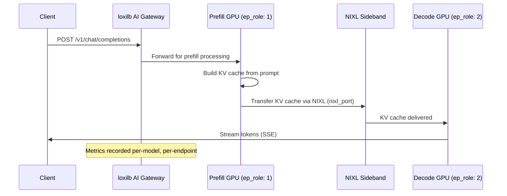

# PD Disaggregation

!!! enterprise "Enterprise Feature"
    This feature requires loxilb-enterprise. It is not available in the community edition.
    See [Installation](../getting-started/installation.md) for enterprise binary setup.

## What is PD Disaggregation?

LLM inference has two distinct phases with very different computational profiles:

- **Prefill** (P) — Processing the input prompt. This is **compute-bound**, like rendering a web page. The GPU processes all input tokens in parallel to build the initial KV cache. Latency depends on prompt length.

- **Decode** (D) — Generating output tokens one at a time. This is **memory-bandwidth-bound**, like streaming a video. Each new token requires reading the entire KV cache from GPU memory. Throughput depends on memory bandwidth.

**PD disaggregation** separates these phases onto different GPU pools optimized for each workload. Prefill nodes use compute-optimized GPUs (high FLOPS), decode nodes use memory-optimized GPUs (high bandwidth). This specialization can achieve **2-3x throughput improvement** for high-concurrency LLM serving compared to running both phases on the same GPU.

## How loxilb Routes P/D Traffic

When PD disaggregation is enabled, loxilb orchestrates the two-phase flow:



### Cache-Aware Variant

When `pd_cache_aware_mode: true`, the decode endpoint selection adds intelligence:

1. **Session stickiness** — Return conversations to the same decode GPU that has the KV cache from previous turns
2. **Radix trie prefix matching** — Match prompt prefixes against known cached content on each decode GPU
3. **Min-load balancing** — Among decode GPUs with cache hits, pick the least loaded

This combines the benefits of PD disaggregation with KV cache locality for decode endpoints.

## Configuration

```yaml
# PD Disaggregation — Full Config
# Source: common/common.go:884-895
serviceArguments:
  vip: "192.168.1.100"
  port: 443
  protocol: "tcp"
  mode: 4                       # LBModeFullProxy required
  backend_protocol: "http1"     # http2 not supported for P/D
  pd_disagg_mode: true          # enable P/D disaggregation (Source: common/common.go:886)
  pd_cache_aware_mode: true     # session + trie + min-load routing (Source: common/common.go:889)
  pd_session_ttl_sec: 300       # stickiness TTL in seconds (Source: common/common.go:891)
  pd_cache_threshold: 20        # min cache match % to stick (Source: common/common.go:893)
  pd_balance_abs_threshold: 3   # max load imbalance tolerance (Source: common/common.go:895)
endpoints:
  # Prefill endpoints — compute-optimized GPUs
  - endpointIP: "10.0.1.10"
    targetPort: 8080
    ep_role: 1                  # prefill (Source: common/common.go:941)
    nixl_port: 5001             # NIXL KV transfer port (Source: common/common.go:943)
  - endpointIP: "10.0.1.11"
    targetPort: 8080
    ep_role: 1
    nixl_port: 5001
  # Decode endpoints — memory-optimized GPUs
  - endpointIP: "10.0.2.10"
    targetPort: 8081
    ep_role: 2                  # decode (Source: common/common.go:941)
  - endpointIP: "10.0.2.11"
    targetPort: 8081
    ep_role: 2
```

## Endpoint Roles

!!! warning "Required: Set ep_role on Every Endpoint"
    PD disaggregation enabled (`pd_disagg_mode: true`) but endpoints with `ep_role: 0` (default/normal) will **NOT** participate in P/D routing. You MUST set `ep_role: 1` for prefill and `ep_role: 2` for decode endpoints explicitly. Forgetting this causes P/D routing to fall back to basic first-healthy selection with no disaggregation benefit.

    Source: Pitfall 5 from research — common/common.go:941

| ep_role | Value | Description | GPU Profile |
|---------|-------|-------------|-------------|
| Normal | `0` | Standard endpoint (default) | General purpose |
| Prefill | `1` | Prompt processing — compute-bound | High FLOPS (e.g., A100, H100) |
| Decode | `2` | Token generation — memory-bandwidth-bound | High bandwidth (e.g., A100-80GB, H100) |

## Configuration Reference

| Field | Type | Default | Description | Source |
|-------|------|---------|-------------|--------|
| `pd_disagg_mode` | bool | `false` | Enable PD disaggregation | common/common.go:886 |
| `pd_cache_aware_mode` | bool | `false` | Enable session + trie + min-load for decode selection | common/common.go:889 |
| `pd_session_ttl_sec` | int | `300` | Session stickiness TTL for decode endpoints (seconds) | common/common.go:891 |
| `pd_cache_threshold` | int | `20` | Minimum cache match percentage to stick to a decode endpoint | common/common.go:893 |
| `pd_balance_abs_threshold` | int | `3` | Maximum load imbalance tolerance before rebalancing | common/common.go:895 |
| `ep_role` | int | `0` | Endpoint role: 0=normal, 1=prefill, 2=decode | common/common.go:941 |
| `nixl_port` | int | - | NIXL sideband port for KV cache transfer (prefill endpoints only) | common/common.go:943 |

## Monitoring

PD disaggregation exposes Prometheus metrics for performance tracking:

- **`llb_ai_pd_record()`** — Per-model P/D latency histograms (overall prefill and decode times)
- **`llb_ai_pd_record_ep()`** — Per-endpoint P/D latency histograms (individual GPU performance)

These metrics help identify:

- Prefill bottlenecks (compute-bound) vs decode bottlenecks (memory-bound)
- Imbalanced GPU pools (one endpoint consistently slower)
- NIXL transfer overhead between prefill and decode nodes

(Source: ai_gateway_dp.go:511-575)

## See Also

- [KV Caching](kv-caching.md) — KV-exact routing for non-disaggregated deployments
- [vLLM Integration](vllm-integration.md) — GPU metrics scraping
- [Configuration Reference](configuration-reference.md) — All AI Gateway config fields
