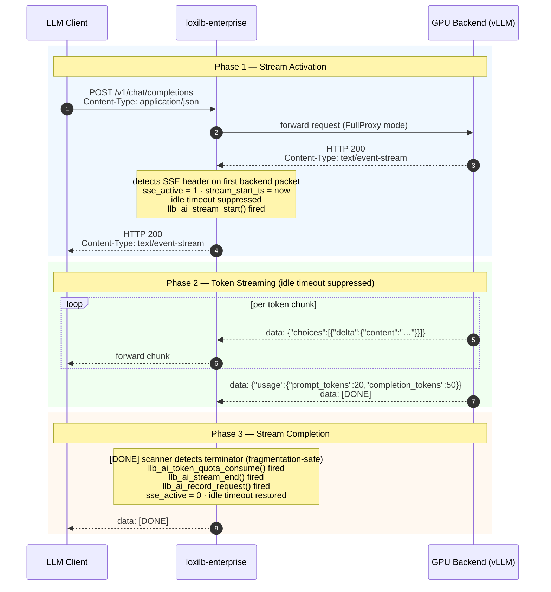
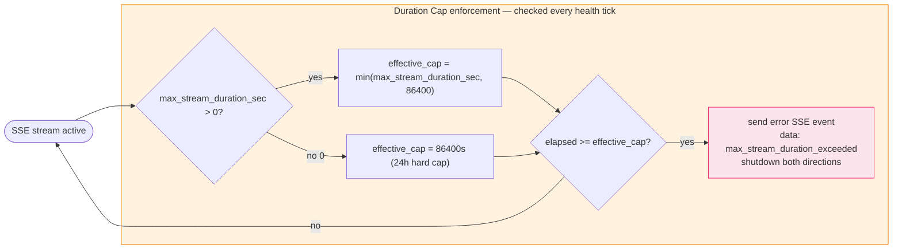
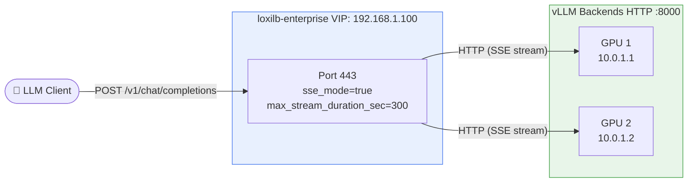
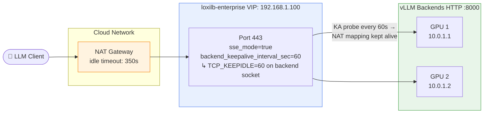
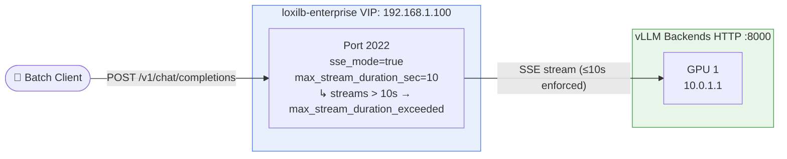

# SSE Streaming and Quota Management

!!! enterprise "Enterprise Feature"
    This feature requires loxilb-enterprise. It is not available in the community edition.
    See [Installation](../getting-started/installation.md) for enterprise binary setup.

loxilb-enterprise keeps LLM streaming responses alive through the full token generation cycle — suppressing idle timeouts during active SSE streams, enforcing per-tenant token quotas, and protecting against runaway connections with configurable duration caps. This page explains how each mechanism works and how to configure them.

---

## Why Standard Load Balancers Break LLM Streaming

LLM inference streams tokens over **Server-Sent Events (SSE)** — a long-lived HTTP connection where the backend pushes one `data: <token>` event per generated token. Generation can take seconds to minutes. Between tokens, the TCP connection carries no bytes.

The problem: standard load balancers apply an **idle timeout** — if no data arrives for N seconds, the connection is killed. A 10-second idle timeout terminates a 30-second LLM response mid-sentence. Users see a truncated response and have no way to recover.

| Approach | What Happens |
|---|---|
| Standard L4 proxy (no SSE mode) | Idle timeout fires during token gaps → connection killed mid-stream |
| Increased global timeout | All connections held open forever → TCP connection table exhaustion |
| loxilb `sse_mode: true` | Idle timeout suppressed only while `Content-Type: text/event-stream` is active; normal timeout resumes after `[DONE]` |

loxilb solves this in the FullProxy data plane: `sse_mode` detects streaming responses and suppresses idle timeout only for the duration of the SSE stream — without affecting non-SSE connections on the same VIP.

---

## How SSE-Mode Works

loxilb operates in **FullProxy mode**, which gives it full L7 visibility into HTTP response headers and body content. SSE handling happens in three phases:



!!! info "SSE activation is triggered by the backend response, not the request"
    loxilb only sets `sse_active = 1` when the backend replies with `Content-Type: text/event-stream`. Requests that do not trigger a streaming response (e.g. non-streaming completions, embeddings) pass through normally — their idle timeout is never suppressed.

---

## SSE Stream Lifecycle

Every SSE stream passes through four checkpoints wired in `sockproxy_http.c`. These checkpoints drive metrics, quota accounting, and observability:

| Checkpoint | C Function | Trigger | Effect |
|---|---|---|---|
| Stream start | `llb_ai_stream_start()` | `Content-Type: text/event-stream` detected in first backend response packet | Starts stream gauge; `sse_active = 1`; idle timeout suppressed |
| `[DONE]` detected | `llb_ai_token_quota_consume()` | `data: [DONE]` or `data:[DONE]` found in SSE tail buffer | Extracts `usage.prompt_tokens` + `completion_tokens` from final chunk; charges tenant quota |
| Stream end | `llb_ai_stream_end()` | Immediately after `[DONE]` detection | Decrements stream gauge; `sse_active = 0`; idle timeout restored |
| Request record | `llb_ai_record_request()` | Immediately after stream end | Records latency, status, model name to metrics pipeline |

### Fragmentation-Safe `[DONE]` Detection

The `data: [DONE]` terminator can be split across two TCP segments. loxilb maintains a 20-byte **tail buffer** (`sse_tail`) that slides with each incoming chunk — the window always contains the last 20 bytes received. Both `data:[DONE]\n\n` and `data: [DONE]\n\n` variants are matched against this window, so a terminator split at any byte boundary is always detected.

---

## Stream Duration Cap

`sse_mode` suppresses idle timeout, but it does not let streams run forever. Two limits apply:



When the cap fires, loxilb sends one final SSE event before closing:

```
data: {"error":"max_stream_duration_exceeded"}

```

The client receives a well-formed SSE event it can parse and display — distinguishing a cap-enforced close from a network failure.

!!! warning "Hard cap cannot be overridden"
    `PROXY_SSE_HARD_CAP_SEC = 86400` (24 hours) is compiled into loxilb. `max_stream_duration_sec = 0` resolves to this cap. Setting `max_stream_duration_sec > 86400` is rejected at the CLI and API layer.

---

## Prerequisites

!!! warning "Required: FullProxy Mode"
    All SSE streaming features require `mode: 4` (FullProxy) and `backend_protocol: "http1"`. L4 modes cannot inspect HTTP response headers and will not detect SSE streams.

| What You Want | Where to Go |
|---|---|
| Set up per-tenant quotas and API key auth | [API Key Management](api-key-management.md) — `--userservice` flag, key creation, rate limits |
| Configure LLM routing (model pools, KV cache) | [LLM Routing](llm-routing.md) — `sel` field, GPU-aware routing, session stickiness |
| Route MCP agent sessions | [MCP Routing](mcp-gateway.md) — session learning, SSE affinity |
| See all config fields | [Configuration Reference](configuration-reference.md) — complete field reference |

---

## Configuration

!!! tip "CLI vs REST API"
    Every example below shows both the [`loxicmd` CLI](../cmd.md) and the equivalent REST API call (`POST /netlox/v1/config/loadbalancer`). Use whichever fits your automation workflow.

---

### Option 1 — Basic SSE Streaming

Minimum configuration for LLM streaming endpoints. Suppresses idle timeout for the duration of each SSE stream.



=== "loxicmd"

    ```bash
    loxicmd create lb 192.168.1.100 \
      --tcp=443:8000 \
      --mode=fullproxy \
      --host=llm.example.com \
      --path-prefix=/v1/chat/completions \
      --path-match-mode=prefix \
      --model-name=llama-70b \
      --sse-mode \
      --max-stream-duration-sec=300 \
      --endpoints=10.0.1.1:1,10.0.1.2:1
    ```

=== "REST API"

    ```bash
    curl -X POST http://loxilb-host:11111/netlox/v1/config/loadbalancer \
      -H "Content-Type: application/json" \
      -d '{
        "serviceArguments": {
          "externalIP":             "192.168.1.100",
          "port":                    443,
          "protocol":               "tcp",
          "sel":                     0,
          "mode":                    4,
          "backend_protocol":       "http1",
          "host":                   "llm.example.com",
          "path_prefix":            "/v1/chat/completions",
          "path_match_mode":        "prefix",
          "model_name":             "llama-70b",
          "sse_mode":                true,
          "max_stream_duration_sec": 300
        },
        "endpoints": [
          {"endpointIP": "10.0.1.1", "targetPort": 8000, "weight": 1},
          {"endpointIP": "10.0.1.2", "targetPort": 8000, "weight": 1}
        ]
      }'
    ```

Clients connect to: `http://192.168.1.100:443/v1/chat/completions`

---

### Option 2 — SSE with TCP Keepalive (Cloud Environments)

Cloud NAT gateways (AWS NAT Gateway, GCP Cloud NAT) silently drop idle TCP connections after 60–350 seconds, even when loxilb's idle timeout is suppressed. Use `backend_keepalive_interval_sec` to set `TCP_KEEPIDLE` on the backend socket so the OS sends TCP keepalive probes, keeping the NAT mapping alive throughout the stream.



=== "loxicmd"

    ```bash
    loxicmd create lb 192.168.1.100 \
      --tcp=443:8000 \
      --mode=fullproxy \
      --host=llm.example.com \
      --path-prefix=/v1/chat/completions \
      --path-match-mode=prefix \
      --model-name=llama-70b \
      --sse-mode \
      --max-stream-duration-sec=300 \
      --backend-keepalive-interval-sec=60 \
      --endpoints=10.0.1.1:1,10.0.1.2:1
    ```

=== "REST API"

    ```bash
    curl -X POST http://loxilb-host:11111/netlox/v1/config/loadbalancer \
      -H "Content-Type: application/json" \
      -d '{
        "serviceArguments": {
          "externalIP":                     "192.168.1.100",
          "port":                            443,
          "protocol":                       "tcp",
          "sel":                             0,
          "mode":                            4,
          "backend_protocol":               "http1",
          "host":                           "llm.example.com",
          "path_prefix":                    "/v1/chat/completions",
          "path_match_mode":               "prefix",
          "model_name":                    "llama-70b",
          "sse_mode":                        true,
          "max_stream_duration_sec":         300,
          "backend_keepalive_interval_sec":  60
        },
        "endpoints": [
          {"endpointIP": "10.0.1.1", "targetPort": 8000, "weight": 1},
          {"endpointIP": "10.0.1.2", "targetPort": 8000, "weight": 1}
        ]
      }'
    ```

Recommended value: `60` for most cloud environments. Set `0` to disable keepalives.

---

### Option 3 — Short Duration Cap (Batch or Development Environments)

Bind streams to a short hard cap to prevent runaway connections in batch pipelines or development clusters where generation is expected to complete quickly.



=== "loxicmd"

    ```bash
    loxicmd create lb 192.168.1.100 \
      --tcp=2022:8000 \
      --mode=fullproxy \
      --host=192.168.1.100 \
      --path-prefix=/ \
      --path-match-mode=prefix \
      --model-name=cap-test \
      --sse-mode \
      --max-stream-duration-sec=10 \
      --endpoints=10.0.1.1:1
    ```

=== "REST API"

    ```bash
    curl -X POST http://loxilb-host:11111/netlox/v1/config/loadbalancer \
      -H "Content-Type: application/json" \
      -d '{
        "serviceArguments": {
          "externalIP":             "192.168.1.100",
          "port":                    2022,
          "protocol":               "tcp",
          "sel":                     0,
          "mode":                    4,
          "backend_protocol":       "http1",
          "host":                   "192.168.1.100",
          "path_prefix":            "/",
          "path_match_mode":        "prefix",
          "model_name":             "cap-test",
          "sse_mode":                true,
          "max_stream_duration_sec": 10
        },
        "endpoints": [
          {"endpointIP": "10.0.1.1", "targetPort": 8000, "weight": 1}
        ]
      }'
    ```

When the cap fires the client receives:

```
data: {"error":"max_stream_duration_exceeded"}

```

---

## Key Configuration Fields

The following fields are used across all SSE deployment options. For the complete parameter reference see the [CLI Reference](../cmd.md) and [Configuration Reference](configuration-reference.md).

| CLI flag | REST API field | Values | Description |
|---|---|---|---|
| `--mode=fullproxy` | `mode: 4` | `4` = FullProxy | Required for L7 SSE header inspection. |
| `--sse-mode` | `sse_mode: true` | `true` / `false` | Suppress idle timeout while `Content-Type: text/event-stream` is active. Default `false`. |
| `--max-stream-duration-sec=N` | `max_stream_duration_sec: N` | `0`–`86400` | Absolute wall-clock cap for SSE streams. `0` = 24-hour hard cap (`PROXY_SSE_HARD_CAP_SEC`). Values > 86400 are rejected. |
| `--backend-keepalive-interval-sec=N` | `backend_keepalive_interval_sec: N` | `0`–`3600` | Sets `SO_KEEPALIVE` + `TCP_KEEPIDLE` on the backend socket. Keeps TCP NAT entries alive during long streams. `0` = disabled. Recommended: `60` in cloud environments. |
| `--inactive-timeout=N` | `inactiveTimeOut: N` | seconds | Per-rule idle timeout. When `sse_mode: true`, this timeout is suppressed while `sse_active = 1` and resumes after `[DONE]`. |

---

## Token Quota Management

!!! info "Quota Timing: After Stream Completion"
    Token quotas are consumed **AFTER** the SSE stream completes, not mid-stream. A stream that exhausts the remaining quota will complete — the **NEXT** request from that tenant is blocked with `429 Too Many Requests`.

    This means a user's response is never cut off due to quota. The quota check prevents the next request, not the current one.

!!! warning "Requires `--userservice`"
    Per-tenant quota enforcement requires loxilb started with `--userservice`. Without it, token counts are tracked internally but no `429` is returned. See [API Key Management](api-key-management.md).

### How Token Counting Works

After `[DONE]` is detected, loxilb extracts the usage fields from the **final SSE chunk** (the chunk immediately before `[DONE]` that carries `"usage": {...}`):

```
data: {"usage":{"prompt_tokens":20,"completion_tokens":50,"total_tokens":70}, ...}

data: [DONE]

```

The `prompt_tokens` + `completion_tokens` values are passed to `llb_ai_token_quota_consume()` and charged against the tenant's `tokens_per_min` bucket.

| Step | What Happens |
|---|---|
| 1. `[DONE]` detected | `sse_tail` window matches `data: [DONE]\n\n` |
| 2. Usage extracted | Parse final chunk for `usage.prompt_tokens` + `usage.completion_tokens` |
| 3. Quota charged | `llb_ai_token_quota_consume(tenant_id, model, prompt_tokens, completion_tokens)` |
| 4. Stream gauge decremented | `llb_ai_stream_end()` |
| 5. Metrics recorded | `llb_ai_record_request()` — latency, status, model name |

### Missing Usage Chunk

Some vLLM configurations omit the usage fields from the final SSE chunk. When both `prompt_tokens` and `completion_tokens` are `0`:

- **Quota is NOT charged** — best-effort mode only
- **`loxilb_ai_tokens_missing_total`** Prometheus counter is incremented

Monitor this counter to detect vLLM configurations that consistently omit usage data and cannot be quota-enforced.

### Set Tenant Rate Limit

=== "loxicmd"

    ```bash
    # Not available via loxicmd — use REST API
    ```

=== "REST API"

    ```bash
    curl -X POST http://loxilb-host:11111/netlox/v1/config/ai/tenant/ratelimit \
      -H "Authorization: Bearer <token>" \
      -H "Content-Type: application/json" \
      -d '{
        "tenant_id":      "acme-corp",
        "rps":             500,
        "tokens_per_min":  1000000
      }'
    # Response 204: upsert applied
    ```

### Get Tenant Rate Limit

=== "REST API"

    ```bash
    curl http://loxilb-host:11111/netlox/v1/config/ai/tenant/ratelimit/acme-corp \
      -H "Authorization: Bearer <token>"

    # Response 200:
    # {
    #   "tenant_id":      "acme-corp",
    #   "rps":             500,
    #   "tokens_per_min":  1000000,
    #   "updated_at":     "2026-03-18T10:30:00Z"
    # }
    ```

### Tenant Rate Limit Fields

| Field | Type | Valid Values | Default | Description |
|---|---|---|---|---|
| `tenant_id` | string | any | — | Tenant identifier (must match API key `tenant_id`) |
| `rps` | int | > 0 | `0` (unlimited) | Maximum requests per second across all keys for this tenant |
| `tokens_per_min` | int | > 0 | `0` (unlimited) | Maximum LLM tokens per minute for this tenant |

---

## Verify

Confirm SSE mode, stream duration cap, and keepalive settings are active on your rule:

```bash
loxicmd get lb -o wide
```

The wide output includes three SSE-related columns:

| Column | Meaning | When `--sse-mode` absent |
|---|---|---|
| `SSE-Mode` | `on` = `sse_mode=true` | `-` |
| `MaxStream-Sec` | configured `max_stream_duration_sec` value | `-` |
| `KA-Sec` | configured `backend_keepalive_interval_sec` value | `-` |

Confirm tenant rate limits are configured:

```bash
curl http://loxilb-host:11111/netlox/v1/config/ai/tenant/ratelimit/acme-corp \
  -H "Authorization: Bearer <token>"
```

Confirm the `loxilb_ai_tokens_total` Prometheus counter is incrementing after completed streams:

```bash
curl http://loxilb-host:2112/metrics | grep loxilb_ai_tokens_total
```

---

## Troubleshooting

**Streams killed mid-response (truncated before `[DONE]`)**

- **`sse_mode` not set** — confirm `loxicmd get lb -o wide` shows `SSE-Mode: on` for the rule.
- **`max_stream_duration_sec` too low** — a stream terminated by the cap delivers `data: {"error":"max_stream_duration_exceeded"}` as its final event. If responses are truncated without this event, an upstream proxy or AWS NLB is applying its own idle timeout.
- **Intermediate proxies** — nginx default `proxy_read_timeout` is 60 seconds. AWS NLB idle timeout default is 350 seconds. Set these above your longest expected generation time.
- **No keepalive in cloud** — if backend sockets drop silently in AWS or GCP, add `--backend-keepalive-interval-sec=60`.

**Stream duration cap not firing**

- Confirm `max_stream_duration_sec` is set and non-zero: `loxicmd get lb -o wide` → `MaxStream-Sec` column.
- The cap is enforced on the health-check tick interval (approximately every second). Streams ending within one tick of the cap may not receive the error event.

**Quota not enforced — tenants exceed `tokens_per_min` without `429`**

- **`--userservice` required** — quota enforcement is disabled without this startup flag. See [API Key Management](api-key-management.md).
- **Rate limit not configured** — verify with `GET /netlox/v1/config/ai/tenant/ratelimit/<tenant_id>`. A `404` means no limit is set.
- **Missing usage chunks** — check `loxilb_ai_tokens_missing_total`. If vLLM omits usage fields, quotas cannot be charged.

**`loxilb_ai_tokens_missing_total` is increasing**

- Enable usage reporting in vLLM: pass `--enable-chunked-prefill` and ensure the final SSE chunk includes `"usage": {"prompt_tokens": N, "completion_tokens": M}`.
- The final chunk must arrive **before** `data: [DONE]`, not in the same write. Some vLLM versions merge the usage chunk and the `[DONE]` line — verify with `curl -N` and inspect the raw SSE body.

---

## Next Steps

- [LLM Routing](llm-routing.md) — route requests to different LLM backends by model name, KV cache, or GPU load
- [MCP Routing](mcp-gateway.md) — session-sticky routing and SSE connection handling for MCP agents
- [API Key Management](api-key-management.md) — per-key rate limiting and the `--userservice` prerequisite
- [Configuration Reference](configuration-reference.md) — all AI Gateway configuration fields
