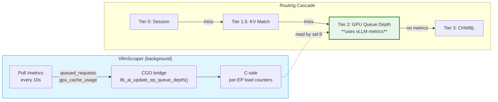
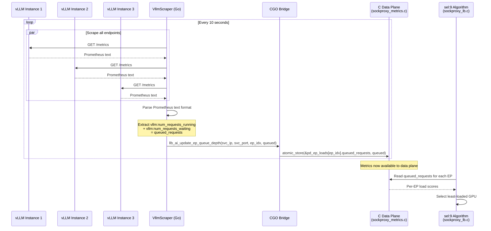

# vLLM Integration

!!! enterprise "Enterprise Feature"
    This feature requires loxilb-enterprise. It is not available in the community edition.
    See [Installation](../getting-started/installation.md) for enterprise binary setup.

## How This Page Fits Into the Bigger Picture

vLLM metrics power **Tier 2** (GPU Queue-Depth Scoring) in the [four-tier routing architecture](llm-routing.md). The metrics scraper runs independently and feeds real-time GPU utilization data into the routing cascade:



---

## What is vLLM?

vLLM is an open-source LLM inference engine that runs on GPUs. Think of it as the **application server** behind your load balancer -- it receives prompts, runs them through the language model on the GPU, and returns generated text. loxilb's AI Gateway integrates with vLLM's Prometheus metrics endpoint to make intelligent routing decisions based on real-time GPU utilization.

---

## How loxilb Scrapes vLLM Metrics

The `VllmScraper` component polls each backend vLLM instance's `/metrics` HTTP endpoint at a regular interval (default: every 10 seconds). It extracts three key metrics that inform endpoint selection:

| Metric | Type | What It Measures | Used For |
|--------|------|-----------------|----------|
| `vllm:num_requests_running` | Gauge | Active requests currently being processed | Combined into `queued_requests` score |
| `vllm:num_requests_waiting` | Gauge | Requests queued waiting for GPU time | Combined into `queued_requests` score |
| `vllm:gpu_cache_usage_perc` | Gauge | GPU KV cache fill percentage (**0-100** scale, not 0.0-1.0) | Cache pressure detection |

loxilb computes `queued_requests = num_requests_running + num_requests_waiting` for endpoint scoring.

### Scraper Architecture



After scraping, the `VllmScraper` updates the C-side queue depth via `llb_ai_update_ep_queue_depth()` CGO call defined in `sockproxy_metrics.c`. This function:

1. Locks the proxy structure
2. Finds the service matching `(service_ip, service_port)`
3. Atomically stores `queued_requests` for the given `ep_index`
4. Unlocks and returns

This makes real-time GPU metrics available to the data-plane endpoint selection algorithm without additional latency on the request path.

**Scraper details:**

- Scrape interval: 10 seconds (configurable via `NewVllmScraper` interval parameter)
- Timeout per scrape request: 5 seconds
- Prometheus text format parsing: Standard `metric_name value` line parsing

---

## Deep Internals: GPU-Aware Selection Algorithm (sel:9)

With vLLM metrics available, you can enable **GPU-aware endpoint selection** using `sel: 9` (`LbSelGPUAware`). This mode uses the scraped metrics to find the least-loaded, most-available GPU for each request.

### Scoring Formula

The selection algorithm in `sockproxy_lb.c` combines queue depth and cache usage to produce a composite load score for each endpoint:

| Factor | Weight | Source | Interpretation |
|--------|--------|--------|---------------|
| **Queue depth** (`queued_requests`) | Primary | `vllm:num_requests_running + vllm:num_requests_waiting` | Lower is better -- GPU has capacity |
| **Cache usage** (`gpu_cache_usage_perc`) | Secondary | `vllm:gpu_cache_usage_perc` (0-100) | High usage means less room for new KV cache entries |

The endpoint with the **lowest combined load score** is selected. If multiple endpoints have identical scores, the selection falls through to the CHWBL consistent hash (Tier 3) for stable distribution.

### Health Integration

Before scoring, endpoints are filtered by health status:

1. **Inactive endpoints** (`eps[i].inv == 1`) are skipped entirely
2. **Circuit breaker OPEN** endpoints are skipped -- these have exceeded their failure threshold
3. Only healthy, active endpoints participate in the scoring

### When sel:9 Falls Through

If the vLLM scraper has not yet connected (no metrics available), `sel: 9` produces no differentiation between endpoints. In this case, routing automatically falls through to Tier 3 (CHWBL consistent hash), which provides stable distribution without metrics.

---

## GPU-Aware Load Balancing

### When to Use GPU-Aware vs CHWBL

| Selection Mode | `sel` Value | Best For | Trade-off |
|---------------|-------------|----------|-----------|
| **LbSelCHWBL** (Consistent Hash) | `8` | Conversational workloads | Preserves KV cache locality via consistent hash. Same prompt -> same GPU. Best when cache reuse matters. |
| **LbSelGPUAware** | `9` | Batch/independent queries | Optimizes for throughput by routing to least-loaded GPU. Better when each request is independent (no conversation continuity). |
| **LbSelWrrHash** (Weighted Hash) | `10` | Heterogeneous GPU fleets | Weighted consistent hash with bounded loads. Distributes proportionally to endpoint weights while tracking active connections. |

**Guideline:** If your users have multi-turn conversations (chat applications), use `sel: 8` with KV-exact routing. If your workload is primarily independent single-shot queries (batch inference, RAG pipelines), use `sel: 9` for throughput optimization.

### When NOT to Use vLLM Integration (sel:9)

Consider alternative selection algorithms in these cases:

| Scenario | Better Choice | Why |
|----------|--------------|-----|
| **Multi-turn chat** | `sel: 8` (CHWBL) + `kvExactMode: 1` | Cache locality matters more than instantaneous load balance |
| **Long-running sessions** | `sel: 3` (persist) | Session stickiness is the primary requirement |
| **Heterogeneous GPUs** | `sel: 10` (WRR Hash) | Weight-proportional distribution handles mixed A100/L4 fleets better |
| **No vLLM backends** | `sel: 0` (round-robin) or `sel: 8` | Metrics are not available without vLLM |

---

## REST API Config

The vLLM scraper auto-activates when AI Gateway endpoints are configured -- there is no separate scraper configuration in the LB rule. Configure GPU-aware load balancing via `POST /netlox/v1/config/loadbalancer`:

```bash
curl -X POST http://loxilb:11111/netlox/v1/config/loadbalancer \
  -H "Authorization: Bearer <token>" \
  -H "Content-Type: application/json" \
  -d '{
    "serviceArguments": {
      "externalIP": "192.168.1.100",
      "port": 443,
      "protocol": "tcp",
      "mode": 4,
      "sel": 9,
      "backend_protocol": "http1"
    },
    "endpoints": [
      {"endpointIP": "10.0.1.10", "targetPort": 8080, "weight": 1},
      {"endpointIP": "10.0.1.11", "targetPort": 8080, "weight": 1},
      {"endpointIP": "10.0.1.12", "targetPort": 8080, "weight": 1}
    ]
  }'

# Response (200):
# {"result": "Success"}
```

### Configuration Options

| Field | Type | Valid Values | Default | Description |
|-------|------|-------------|---------|-------------|
| `sel` | int | `0`, `3`, `8`, `9`, `10` | `8` | Endpoint selection algorithm. `9` = GPU-aware (uses vLLM metrics). `8` = CHWBL. `10` = Weighted hash. |
| `mode` | int | `4` | - | Must be `4` (FullProxy) for AI Gateway features |
| `backend_protocol` | string | `http1` | - | Must be `http1` for AI Gateway |

**vLLM side requirements:** vLLM exposes `/metrics` by default -- no extra flag is needed. Add `--enable-request-id-headers` so loxilb can correlate requests:

```bash
docker run ghcr.io/vllm-project/vllm-openai:latest \
  --model meta-llama/Llama-3-8B \
  --host 0.0.0.0 \
  --port 8080 \
  --enable-request-id-headers
```

---

## Deployment Scenarios

### Scenario 1: Basic GPU-Aware Load Balancing (3 vLLM Instances)

Three vLLM instances serving the same model, with `sel: 9` routing to the least-loaded GPU. No KV cache routing -- optimized for independent, single-shot queries.

```bash
curl -X POST http://loxilb:11111/netlox/v1/config/loadbalancer \
  -H "Authorization: Bearer <token>" \
  -H "Content-Type: application/json" \
  -d '{
    "serviceArguments": {
      "externalIP": "192.168.1.100",
      "port": 443,
      "protocol": "tcp",
      "mode": 4,
      "sel": 9,
      "backend_protocol": "http1"
    },
    "endpoints": [
      {"endpointIP": "10.0.1.10", "targetPort": 8080, "weight": 1},
      {"endpointIP": "10.0.1.11", "targetPort": 8080, "weight": 1},
      {"endpointIP": "10.0.1.12", "targetPort": 8080, "weight": 1}
    ]
  }'
```

**vLLM launch** (each instance):
```bash
python -m vllm.entrypoints.openai.api_server \
  --model meta-llama/Llama-3-8B \
  --host 0.0.0.0 --port 8080 \
  --enable-request-id-headers
```

**What happens at runtime:**

1. VllmScraper polls `http://10.0.1.10:8080/metrics`, `http://10.0.1.11:8080/metrics`, `http://10.0.1.12:8080/metrics` every 10 seconds
2. Extracts `vllm:num_requests_running` + `vllm:num_requests_waiting` for each endpoint
3. Updates C-side load counters via `llb_ai_update_ep_queue_depth()`
4. When a request arrives, `sel: 9` selects the endpoint with the lowest `queued_requests`

### Scenario 2: Production Setup with Custom Scrape Interval and Health Checks

A production deployment with tuned scrape interval, health check integration, and failover behavior.

```bash
curl -X POST http://loxilb:11111/netlox/v1/config/loadbalancer \
  -H "Authorization: Bearer <token>" \
  -H "Content-Type: application/json" \
  -d '{
    "serviceArguments": {
      "externalIP": "10.0.0.100",
      "port": 443,
      "protocol": "tcp",
      "mode": 4,
      "sel": 9,
      "backend_protocol": "http1",
      "security": 1,
      "llm_type": "chat-interactive",
      "monitor": true,
      "httpchk": "/health"
    },
    "endpoints": [
      {"endpointIP": "10.0.1.10", "targetPort": 8080, "weight": 3},
      {"endpointIP": "10.0.1.11", "targetPort": 8080, "weight": 3},
      {"endpointIP": "10.0.1.12", "targetPort": 8080, "weight": 1},
      {"endpointIP": "10.0.1.13", "targetPort": 8080, "weight": 1}
    ]
  }'
```

**What this configuration does:**

- `sel: 9` -- GPU-aware selection using vLLM metrics
- `security: 1` -- TLS termination on the VIP
- `monitor: true` + `httpchk: "/health"` -- Active health checks against each backend's `/health` endpoint
- **Mixed weights** -- Endpoints 10/11 (weight 3, likely A100-80GB) get more traffic than 12/13 (weight 1, likely L4), but GPU metrics can override weights when one endpoint is overloaded
- `llm_type: "chat-interactive"` -- Enables SSE streaming and conversation tracking

**Failover behavior:**

1. If a vLLM instance crashes, the health check marks it inactive (`eps[i].inv = 1`)
2. `sel: 9` skips inactive endpoints during scoring
3. Traffic redistributes to remaining healthy endpoints
4. When the failed instance recovers and passes health checks, it is added back to the scoring pool
5. The scraper resumes collecting metrics from the recovered instance

---

## Verify

Confirm GPU monitoring is active:

```bash
curl http://loxilb:11111/netlox/v1/config/gpu/status

# Expected response:
# {
#   "enabled": true,
#   "routing_mode": "gpu_aware",
#   "worker_count": 3,
#   "last_metrics_update": "2025-01-15T10:23:45Z",
#   "ebpf_map_loaded": true
# }
```

Verify the load balancer rule has `sel: 9`:

```bash
curl http://loxilb:11111/netlox/v1/config/loadbalancer/all
```

Check that your service shows `sel: 9` in the response.

---

## Troubleshooting

### Scraper Not Connecting

**Symptoms:** GPU-aware selection (`sel: 9`) behaves like round-robin -- no differentiation between endpoints.

**Check:**

1. **Metrics endpoint reachable** -- Verify from the loxilb host: `curl http://<vllm-ip>:8080/metrics`. Should return Prometheus-format text.
2. **vLLM --enable-metrics flag** -- If `/metrics` returns 404, vLLM was started without `--enable-metrics`.
3. **Network connectivity** -- Ensure the vLLM serving port (8080) is accessible from the loxilb host. Check security groups and firewall rules.

### Metrics Returning Zero

**Symptoms:** Scraper connects but all endpoints show zero queue depth.

**Check:**

1. **No traffic to vLLM** -- Queue depth is zero when vLLM has no pending requests. This is normal under low load.
2. **vLLM version** -- Older vLLM versions may not expose `vllm:num_requests_waiting`. Upgrade to a version that supports Prometheus metrics.

### High Queue Depth on All Endpoints

**Symptoms:** All endpoints show high queue depth despite having GPUs available.

**Check:**

1. **Insufficient GPU capacity** -- Add more vLLM instances to handle the load.
2. **Enable KV routing** -- KV cache-aware routing ([KV Caching](kv-caching.md)) improves cache hit rates, reducing per-request processing time and queue depth.
3. **Model optimization** -- Consider using a smaller model or enabling quantization on vLLM to increase throughput per GPU.

### Stale Metrics After Instance Recovery

**Symptoms:** An instance was restarted but its metrics seem stale or show old values.

**Check:**

1. **Scrape cycle** -- Metrics are updated every 10 seconds. Wait at least one full cycle after recovery.
2. **Health check status** -- If health checks have not yet marked the instance as healthy, it will be skipped regardless of metrics.
3. **C-side counter reset** -- The `queued_requests` counter is atomically overwritten on each scrape, so stale data self-corrects within one cycle.

---

## Next Steps

- [LLM Routing](llm-routing.md) -- Three-tier routing architecture (Tier 2 uses vLLM metrics)
- [KV Caching](kv-caching.md) -- KV-exact routing configuration (Tier 1.5)
- [PD Disaggregation](pd-disaggregation.md) -- Separate prefill/decode GPU pools
- [Model Load Balancing](model-load-balancing.md) -- Per-model endpoint pools
- [Configuration Reference](configuration-reference.md) -- All AI Gateway config fields
