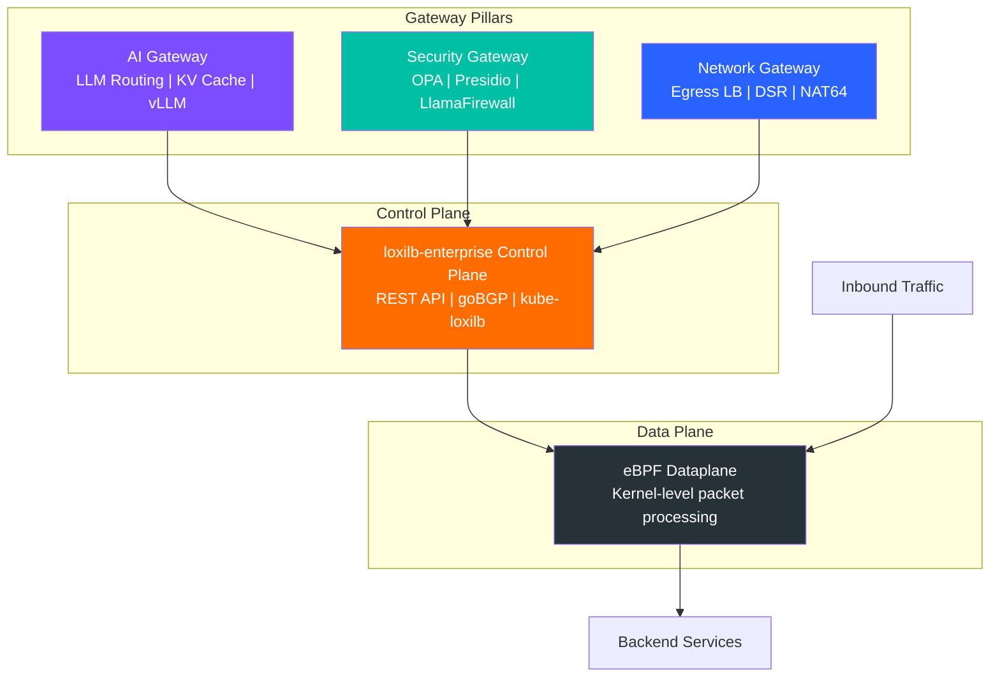

# Unified Gateway Platform

## From Load Balancer to Unified Gateway

loxilb started as a high-performance eBPF-based L4 load balancer for Kubernetes and edge environments. It solved a real problem: on-premises and edge clusters lacked a performant, protocol-aware service load balancer comparable to what public cloud providers offer. The eBPF dataplane delivered line-rate packet processing without dedicated CPU cores, and the project gained adoption across telco, edge, and enterprise Kubernetes deployments.

loxilb-enterprise builds three gateway capability layers on that proven foundation. Rather than bolting on separate proxy services for AI traffic, security enforcement, and advanced networking, loxilb-enterprise integrates all three into a single binary that shares the same eBPF dataplane. This means AI inference traffic, security policy enforcement, and network-level operations all benefit from the same kernel-level acceleration — without the overhead of chaining multiple proxies.

The result is a **unified gateway platform** that addresses the full spectrum of enterprise traffic management in one deployment.

## The Three Pillars

### AI Gateway

The AI Gateway pillar handles the unique challenges of LLM inference traffic at the gateway layer. Traditional load balancers treat all HTTP traffic identically — they cannot account for KV cache locality, model-specific routing, or the long-lived streaming connections that characterize LLM serving.

loxilb-enterprise provides:

- **LLM Routing** — Route inference requests to the optimal backend based on model, token count, and cache state
- **KV Cache-Aware Load Balancing** — Direct requests to backends that already hold relevant KV cache entries, reducing time-to-first-token
- **vLLM Integration** — Native integration with vLLM serving infrastructure for metrics-driven routing decisions
- **Model Load Balancing** — Distribute traffic across model replicas with awareness of GPU utilization and queue depth
- **PD Disaggregation** — Separate prefill and decode phases across different backend pools for optimal resource utilization

[:octicons-arrow-right-24: AI Gateway Documentation](../ai-gateway/overview.md)

### Security Gateway

The Security Gateway pillar provides enterprise-grade traffic inspection and policy enforcement at the gateway layer. Rather than requiring separate sidecar proxies or application-level middleware for each security function, loxilb-enterprise centralizes security enforcement where all traffic already passes.

loxilb-enterprise provides:

- **OPA Policy Enforcement** — Evaluate Open Policy Agent (Rego) policies against every request, with networking-engineer-friendly policy examples
- **PII Detection with Presidio** — Intercept and redact personally identifiable information at the gateway layer before it reaches backend services
- **LlamaFirewall** — Filter AI-generated content for prompt injection, unsafe outputs, and policy violations
- **Rate Limiting** — Per-endpoint, per-client rate limiting with token bucket and sliding window algorithms
- **Secure Dataplane** — IPsec tunnel encryption, mTLS between services, and eBPF-accelerated packet filtering

[:octicons-arrow-right-24: Security Gateway Documentation](../security-gateway/overview.md)

### Network Gateway

The Network Gateway pillar represents the evolution of loxilb's original L4 load-balancing capabilities into a comprehensive network data plane for enterprise deployments. These features address advanced networking requirements that go beyond standard Kubernetes service load balancing.

loxilb-enterprise provides:

- **Egress Load Balancing** — Distribute outbound traffic across multiple uplinks with health-aware failover
- **Direct Server Return (DSR)** — Bypass the load balancer on the return path for latency-sensitive workloads
- **NAT64** — Expose IPv4 services to IPv6 clients transparently at the gateway
- **HTTPS/HTTP2 Proxy** — L7 proxy modes for TLS termination, HTTP/2 multiplexing, and protocol upgrade
- **SCTP Multi-homing** — Multi-homed SCTP load balancing for telco and mission-critical workloads

[:octicons-arrow-right-24: Network Gateway Documentation](../network-gateway/overview.md)

## Architecture Overview

The following diagram shows how the three gateway pillars sit above a shared eBPF dataplane, with a unified control plane coordinating traffic decisions:

**Key architectural properties:**

- **Single binary** — All three pillars, the control plane, and the eBPF dataplane compile into one binary. No sidecar injection, no external dependencies.
- **Shared dataplane** — AI traffic inspection, security policy evaluation, and network-level operations all execute in the same eBPF program chain, avoiding redundant packet copies.
- **Kubernetes-native control** — kube-loxilb watches Kubernetes resources and configures the gateway automatically. Works with any CNI.
- **Horizontal scaling** — Deploy multiple loxilb-enterprise instances behind BGP ECMP or Kubernetes service abstractions for high availability.

## Community Edition vs Enterprise

The community edition of loxilb remains a fully functional, open-source L4 load balancer. loxilb-enterprise is a superset — every community feature works identically, with the three gateway pillars and enterprise operations features added on top.

| Capability | Community | Enterprise |
|---|:---:|:---:|
| L4 Load Balancing (TCP, UDP, SCTP) | :material-check: | :material-check: |
| High Availability / Clustering | :material-check: | :material-check: |
| Kubernetes Integration (kube-loxilb) | :material-check: | :material-check: |
| eBPF Dataplane | :material-check: | :material-check: |
| BGP / ECMP | :material-check: | :material-check: |
| Ingress / Egress Controller | :material-check: | :material-check: |
| **AI Gateway** (LLM routing, KV caching, vLLM) | :material-close: | :material-check: |
| **Security Gateway** (OPA, Presidio, LlamaFirewall) | :material-close: | :material-check: |
| **Advanced Networking** (Egress LB, DSR, NAT64) | :material-close: | :material-check: |
| **Rate Limiting** (per-endpoint, per-client) | :material-close: | :material-check: |
| **Secure Dataplane** (IPsec, mTLS) | :material-close: | :material-check: |
| **User Management / RBAC** | :material-close: | :material-check: |
| **Enterprise Support** | :material-close: | :material-check: |

Existing community edition users can migrate to enterprise with full backward compatibility. See the [Migration Guide](../getting-started/migration-from-community.md) for details.
