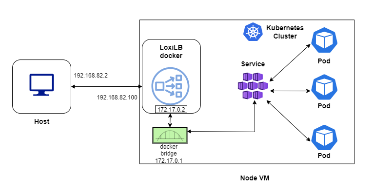

## LoxiLB Quick Start Guide with K3s/Flannel

This document will explain how to install a K3s cluster with default flannel networking and loxilb as an external load balancer.   

### Prerequisite

[Install](https://docs.docker.com/engine/install/ubuntu/) docker runtime to manage loxilb.    

### Topology   

For quickly bringing up loxilb with K3s/Flannel, we will be deploying all components in a single node :   



loxilb is run as a docker and will use macvlan for the incoming traffic. This is to mimic a topology close to cloud-hosted k8s where LB nodes run outside a cluster. loxilb can be used in more complex [in-cluster](https://www.loxilb.io/post/k8s-nuances-of-in-cluster-external-service-lb-with-loxilb) mode as well, but not used here for simplicity.   

## Install loxilb docker
```
## Set underlying interface of the VM/cluster-node to promisc mode for mac-vlan to work
sudo ifconfig eth1 promisc

## Run loxilb
sudo docker run -u root --cap-add SYS_ADMIN --restart unless-stopped --privileged --entrypoint /root/loxilb-io/loxilb/loxilb -dit -v /dev/log:/dev/log  --name loxilb ghcr.io/loxilb-io/loxilb:latest

# Create mac-vlan on top of underlying eth1 interface
sudo docker network create -d macvlan -o parent=eth1 --subnet 192.168.82.0/24   --gateway 192.168.82.1 --aux-address 'host=192.168.82.252' llbnet

# Assign mac-vlan to loxilb docker with specified IP (which will be used as LB VIP)
# Please note that this node should already have an IP assigned belonging to the same subnet on underlying interface
sudo docker network connect llbnet loxilb --ip=192.168.82.100

# Add iptables rule to allow traffic from source/host IP(192.168.82.1) to loxilb
sudo iptables -A DOCKER -s 192.168.82.1 -j ACCEPT

```

All the above steps related to docker setup can be further automated using docker-compose.   

## Setup K3s/Flannel
```
#K3s installation
curl -sfL https://get.k3s.io | INSTALL_K3S_EXEC="server --disable traefik --disable servicelb --disable-cloud-controller --kube-proxy-arg metrics-bind-address=0.0.0.0 --kubelet-arg cloud-provider=external" K3S_KUBECONFIG_MODE="644" sh -

# Remove taints in k3s if any (usually happens if started without cloud-manager)
sudo kubectl taint nodes --all node.cloudprovider.kubernetes.io/uninitialized=false:NoSchedule-

```

## How to deploy kube-loxilb ?
[kube-loxilb](https://github.com/loxilb-io/kube-loxilb) is used to deploy loxilb with Kubernetes.
```
wget https://raw.githubusercontent.com/loxilb-io/kube-loxilb/main/manifest/ext-cluster/kube-loxilb.yaml
```

kube-loxilb.yaml
```
        args:
            - --loxiURL=http://172.17.0.2:11111
            - --externalCIDR=192.168.82.100/32
            - --setMode=1
```
In the above snippet, loxiURL uses docker interface IP of loxilb, which can be different for each setup.    

Apply in k8s:
```
kubectl apply -f kube-loxilb.yaml
```

## Create the service
```
kubectl apply -f https://raw.githubusercontent.com/loxilb-io/loxilb/main/cicd/docker-k3s-cilium/tcp-svc-lb.yml
```

## Check the status
In k3s:
```
kubectl get svc
NAME            TYPE           CLUSTER-IP      EXTERNAL-IP          PORT(S)           AGE
kubernetes      ClusterIP      10.43.0.1       <none>               443/TCP           80m
tcp-lb-onearm   LoadBalancer   10.43.183.123   llb-192.168.82.100   56002:30001/TCP   6m50s
```
In loxilb docker:
```
$ sudo docker exec -it loxilb loxicmd get lb -o wide
|   EXT IP       | SEC IPS | PORT  | PROTO |         NAME          | MARK | SEL |  MODE  | ENDPOINT  | EPORT | WEIGHT | STATE  | COUNTERS |
|----------------|---------|-------|-------|-----------------------|------|-----|--------|-----------|-------|--------|--------|----------|
| 192.168.82.100 |         | 56002 | tcp   | default_tcp-lb-onearm |    0 | rr  | onearm | 10.0.2.15 | 30001 |      1 | active | 12:880   |
```

## Connect from host/client
```
$ curl http://192.168.82.100:56002
<!DOCTYPE html>
<html>
<head>
<title>Welcome to nginx!</title>
<style>
html { color-scheme: light dark; }
body { width: 35em; margin: 0 auto;
font-family: Tahoma, Verdana, Arial, sans-serif; }
</style>
</head>
<body>
<h1>Welcome to nginx!</h1>
<p>If you see this page, the nginx web server is successfully installed and
working. Further configuration is required.</p>

<p>For online documentation and support please refer to
<a href="http://nginx.org/">nginx.org</a>.<br/>
Commercial support is available at
<a href="http://nginx.com/">nginx.com</a>.</p>

<p><em>Thank you for using nginx.</em></p>
</body>
</html>

```
