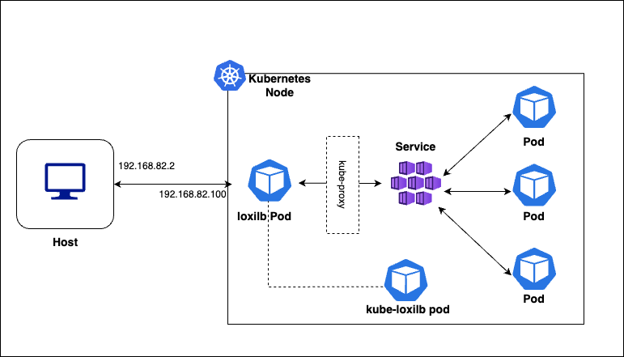

## Quick Start Guide with K3s and LoxiLB in-cluster mode

This document will explain how to install a K3s cluster with loxilb as a serviceLB provider running in-cluster mode.     

### Topology   

For quickly bringing up loxilb in-cluster and K3s, we will be deploying all components in a single node :   



loxilb and kube-loxilb components run as pods managed by kubernetes  in this scenario.

## Setup K3s
```
# K3s installation
$ curl -sfL https://get.k3s.io | INSTALL_K3S_EXEC="server --disable traefik --disable servicelb --disable-cloud-controller --kube-proxy-arg metrics-bind-address=0.0.0.0 --kubelet-arg cloud-provider=external" K3S_KUBECONFIG_MODE="644" sh -

# Remove taints in k3s if any (usually happens if started without cloud-manager)
$ sudo kubectl taint nodes --all node.cloudprovider.kubernetes.io/uninitialized=false:NoSchedule-

```
## How to deploy loxilb ?
loxilb can be deloyed by using the following command in the K3s node
```
sudo kubectl apply -f https://raw.githubusercontent.com/loxilb-io/loxilb/main/cicd/k3s-incluster/loxilb.yml
```

## How to deploy kube-loxilb ?
[kube-loxilb](https://github.com/loxilb-io/kube-loxilb) is used as an operator to manage loxilb.
```
wget https://raw.githubusercontent.com/loxilb-io/loxilb/main/cicd/k3s-incluster/kube-loxilb.yml
```

kube-loxilb.yaml
```
       args:
         #- --loxiURL=http://172.17.0.2:11111
         - --externalCIDR=192.168.82.100/32
         - --setRoles=0.0.0.0
         #- --monitor
         #- --setBGP

```
In the above snippet, loxiURL is commented out which denotes to utilize in-cluster mode to discover loxilb pods automatically. External CIDR represents the IP pool from where serviceLB VIP will be allocated.

Apply after making changes (if any) :
```
sudo kubectl apply -f kube-loxilb.yaml
```

## Create the service
```
sudo kubectl apply -f https://raw.githubusercontent.com/loxilb-io/loxilb/main/cicd/k3s-incluster/tcp-svc-lb.yml
```

## Check the status
In k3s node:
```
## Check the pods created
$ sudo kubectl get pods -A
NAMESPACE     NAME                                      READY   STATUS    RESTARTS   AGE
kube-system   local-path-provisioner-6c86858495-snvcm   1/1     Running   0          4m37s
kube-system   coredns-6799fbcd5-cpj6x                   1/1     Running   0          4m37s
kube-system   metrics-server-67c658944b-42ptz           1/1     Running   0          4m37s
kube-system   loxilb-lb-8l85d                           1/1     Running   0          3m40s
kube-system   kube-loxilb-6f44cdcdf5-5fdtl              1/1     Running   0          2m19s
default       tcp-onearm-test                           1/1     Running   0          88s


## Check the services created
$ sudo kubectl get svc
NAME            TYPE           CLUSTER-IP    EXTERNAL-IP          PORT(S)           AGE
kubernetes      ClusterIP      10.43.0.1     <none>               443/TCP           5m12s
tcp-lb-onearm   LoadBalancer   10.43.47.60   llb-192.168.82.100   56002:30001/TCP   108s
```
In loxilb pod, we can check internal LB rules:
```
$ sudo kubectl exec -it -n kube-system loxilb-lb-8l85d -- loxicmd get lb -o wide
|     EXT IP     | SEC IPS | PORT  | PROTO |         NAME          | MARK | SEL |  MODE  | ENDPOINT  | EPORT | WEIGHT | STATE  | COUNTERS |
|----------------|---------|-------|-------|-----------------------|------|-----|--------|-----------|-------|--------|--------|----------|
| 192.168.82.100 |         | 56002 | tcp   | default_tcp-lb-onearm |    0 | rr  | onearm | 10.0.2.15 | 30001 |      1 | active | 39:2874  |
```

## Connect from host/client
```
$ curl http://192.168.82.100:56002
<!DOCTYPE html>
<html>
<head>
<title>Welcome to nginx!</title>
<style>
html { color-scheme: light dark; }
body { width: 35em; margin: 0 auto;
font-family: Tahoma, Verdana, Arial, sans-serif; }
</style>
</head>
<body>
<h1>Welcome to nginx!</h1>
<p>If you see this page, the nginx web server is successfully installed and
working. Further configuration is required.</p>

<p>For online documentation and support please refer to
<a href="http://nginx.org/">nginx.org</a>.<br/>
Commercial support is available at
<a href="http://nginx.com/">nginx.com</a>.</p>

<p><em>Thank you for using nginx.</em></p>
</body>
</html>

```
