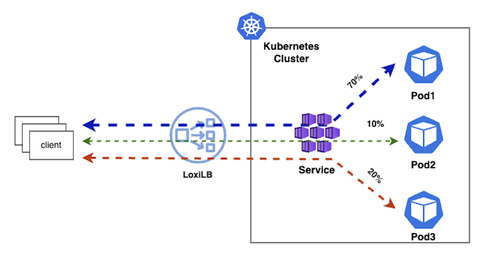
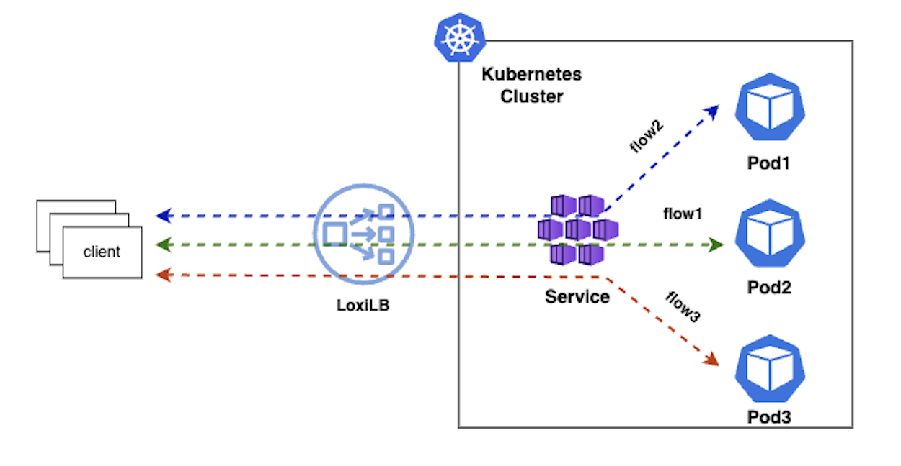
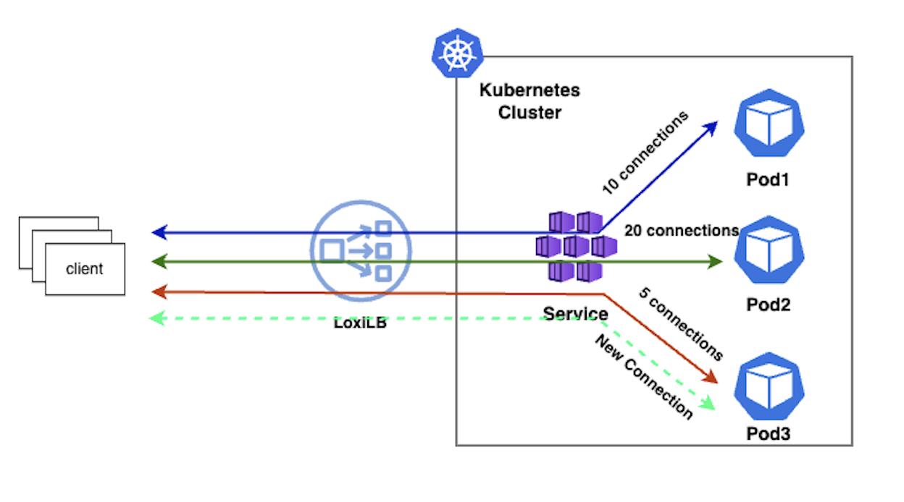

## Load-balancer algorithms in loxilb 

loxilb implements a variety of algortihms to achieve load-balancing and distribute incoming traffic to the server end-points 

### 1. Round-Robin (rr)

This is default algo used by loxilb. In this mode, loxilb selects the end-points configured for a service in simple round-robin fashion for each new incoming connection

In this mode, original source IP is preserved till the end-point and provides best visibility for anyone needing it. Finally, this also means the end-points should know how to reach the source.    

### 2. Weighted round-robin (wrr)

In this mode, loxilb selects the end-points as per weight(in terms of percentage of overall traffic connections) associated with the end-points of a service. For example, if we have three end-points, we can have 70%, 10% and 20% distribution.    

### 3. Persistence (persist)  

In this mode, every client (sourceIP) will always be get connected to a particular end-point. In essence there is no real load-balancing involved but it can be useful for applications which require client session-affinity e.g FTP which requires two connections with the end-point.   

### 4. Flow hash (hash)

In this mode, loxilb will select the end-point based on 5-tuple hash on incoming traffic. This 5-tuple consists of SourceIP, SourcePort, DestinationIP, DestinationPort and IP protocol number. Please note that in this mode even if connections from same client will get mapped to different end-points since SourcePort is usually selected randomly by operating systems.   

### 5. Least-Connections (lc)

In this mode, loxilb will select end-point which has the least active connections (or least loaded) at a given point of time.   

