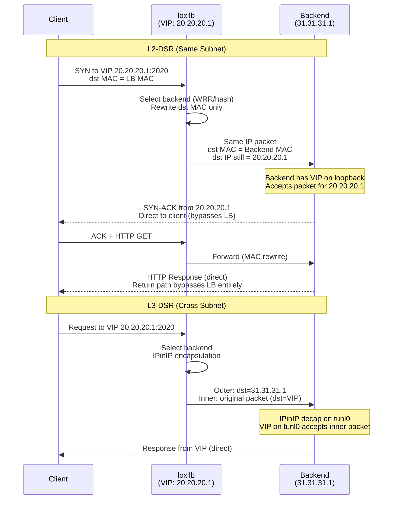
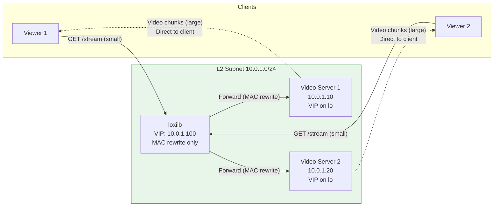
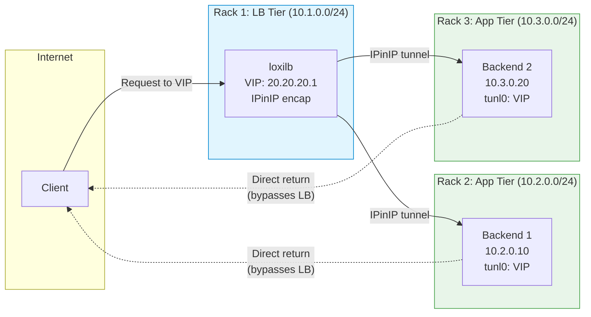

# Direct Server Return (DSR)

!!! enterprise "Enterprise Feature"
    This feature requires loxilb-enterprise. It is not available in the community edition.
    See [Installation](../getting-started/installation.md) for enterprise binary setup.

Direct Server Return (DSR) eliminates the load balancer from the return path, reducing latency and LB bandwidth consumption. This is essential for high-throughput applications — video streaming, large file transfers, backup replication — where asymmetric traffic patterns dominate (small requests, large responses).

loxilb supports two DSR modes:

- **L2-DSR** — Rewrites the destination MAC address only. The backend must be in the same L2 subnet as the load balancer. No encapsulation overhead, lowest latency.
- **L3-DSR** — Uses IP-in-IP tunneling to reach backends in different subnets. Adds an IPinIP encapsulation header but enables cross-subnet DSR topologies.

In both modes, the client sends requests to the VIP. The load balancer forwards the packet to a backend (with MAC rewrite or IPinIP encap), and the backend responds **directly to the client**, bypassing the load balancer entirely on the return path.

---

## How It Works Internally

When `mode: 3` is set on a load balancer rule, loxilb activates DSR forwarding in the eBPF data plane. The key difference from standard DNAT (mode 0) is that **only the forward path passes through loxilb** — the return path goes directly from the backend to the client.

### Asymmetric Forwarding Path



**Key implementation details:**

1. **Mode value `3`**: In swagger.yml and source code, `mode: 3` activates DSR. The eBPF data plane detects this mode and applies MAC-only rewrite (L2-DSR) or IPinIP encapsulation (L3-DSR) depending on whether the backend is on the same L2 subnet.

2. **Port constraint**: DSR does **not** rewrite port numbers. The backend receives traffic on the original service port. Therefore, `targetPort` **must equal** the service `port`. If they differ, loxilb returns: `malformed-service dsr-port error`.

3. **Backend VIP requirement**: Backends must have the VIP configured on a loopback interface (`ip addr add <VIP>/32 dev lo`) so they accept packets destined for the VIP. Without this, the kernel drops packets for an unknown destination.

4. **ARP suppression**: Backends must suppress ARP responses for the VIP (`arp_ignore=1`, `arp_announce=2`) to prevent multiple nodes from answering ARP requests for the same VIP.

5. **Return path**: The backend sends responses directly to the client using the VIP as source IP. The client sees no difference — it communicates with the VIP throughout.

---

## Prerequisites

- **L2-DSR**: Backends must be in the same L2 subnet as the loxilb node
- **Both modes**: Backends must have the VIP configured on a loopback interface
- **Both modes**: ARP suppression for the VIP on backend nodes
- **L3-DSR**: IPinIP tunnel interface configured on backends for decapsulation

---

## REST API Configuration

### Option Details

| Field | Type | Valid Values | Default | Description |
|-------|------|-------------|---------|-------------|
| `mode` | int | `0` (DNAT), `3` (DSR), `4` (fullproxy), `5` (fullnat) | `0` | LB operating mode — use `3` for DSR. |
| `sel` | int | `0` (rr), `1` (hash), `2` (wrr), `3` (persist) | `0` | Load balancing algorithm for backend selection. |
| `targetPort` | int | 0-65535 | (required) | **Must equal service `port`** in DSR mode. DSR does not rewrite ports. |

!!! warning "Port Constraint"
    In DSR mode, the endpoint target port **MUST** equal the service port. DSR does not rewrite packets — the backend receives traffic on the original service port. If ports differ, loxilb returns: `malformed-service dsr-port error`.

!!! note "Common Fields"
    For common fields (`externalIP`, `port`, `protocol`, `endpoints`), see [Network Gateway Overview](overview.md).

### Basic DSR Rule

=== "REST API"

    ```bash
    curl -X POST http://loxilb:11111/netlox/v1/config/loadbalancer \
      -H "Authorization: Bearer <token>" \
      -H "Content-Type: application/json" \
      -d '{
        "serviceArguments": {
          "externalIP": "20.20.20.1",
          "port": 2020,
          "protocol": "tcp",
          "mode": 3
        },
        "endpoints": [
          {"endpointIP": "31.31.31.1", "targetPort": 2020, "weight": 1},
          {"endpointIP": "32.32.32.1", "targetPort": 2020, "weight": 1}
        ]
      }'

    # Response (200):
    # {"result": "Success"}
    ```

=== "loxicmd"

    ```bash
    # L2-DSR (same subnet, MAC rewrite)
    # NOTE: endpoint port MUST equal service port
    loxicmd create lb 20.20.20.1 --tcp=2020:2020 \
      --endpoints=31.31.31.1:1,32.32.32.1:1 --mode=dsr

    # L3-DSR with hash-based selection
    loxicmd create lb 20.20.20.1 --tcp=2020:2020 \
      --endpoints=31.31.31.1:1,32.32.32.1:1 --mode=dsr --select=hash
    ```

---

## Deployment Scenarios

### Scenario 1: Same-Subnet L2-DSR (Video Streaming)

A video streaming service where response payloads (video chunks) are 100-1000x larger than requests. L2-DSR eliminates the load balancer from the return path, saving massive bandwidth on the LB node.



**Configuration:**

```bash
# L2-DSR for video streaming — same subnet, no encapsulation
curl -X POST http://loxilb:11111/netlox/v1/config/loadbalancer \
  -H "Authorization: Bearer <token>" \
  -H "Content-Type: application/json" \
  -d '{
    "serviceArguments": {
      "externalIP": "10.0.1.100",
      "port": 443,
      "protocol": "tcp",
      "mode": 3
    },
    "endpoints": [
      {"endpointIP": "10.0.1.10", "targetPort": 443, "weight": 1},
      {"endpointIP": "10.0.1.20", "targetPort": 443, "weight": 1}
    ]
  }'
```

**Backend setup (each video server):**

```bash
# Add VIP to loopback
ip addr add 10.0.1.100/32 dev lo

# Suppress ARP for VIP
sysctl -w net.ipv4.conf.all.arp_ignore=1
sysctl -w net.ipv4.conf.all.arp_announce=2
```

**Performance impact:** If the LB handles 10 Gbps of video, without DSR the LB would need 20 Gbps capacity (10 in + 10 out). With DSR, the LB only handles 10 Mbps of small requests — a 1000x bandwidth reduction.

### Scenario 2: Cross-Subnet L3-DSR (Multi-Rack Deployment)

Backends are in different racks/subnets from the load balancer. IPinIP tunneling enables DSR across L3 boundaries. This is common in large data center deployments where the LB tier and application tiers are in separate network segments.



**Configuration:**

```bash
# L3-DSR for cross-subnet backends
curl -X POST http://loxilb:11111/netlox/v1/config/loadbalancer \
  -H "Authorization: Bearer <token>" \
  -H "Content-Type: application/json" \
  -d '{
    "serviceArguments": {
      "externalIP": "20.20.20.1",
      "port": 2020,
      "protocol": "tcp",
      "mode": 3
    },
    "endpoints": [
      {"endpointIP": "10.2.0.10", "targetPort": 2020, "weight": 1},
      {"endpointIP": "10.3.0.20", "targetPort": 2020, "weight": 1}
    ]
  }'
```

**Backend setup (each cross-subnet backend):**

```bash
# Create IPinIP tunnel for L3-DSR decapsulation
ip tunnel add tunl0 mode ipip local 10.2.0.10
ip link set tunl0 up
ip addr add 20.20.20.1/32 dev tunl0

# Suppress ARP for VIP
sysctl -w net.ipv4.conf.all.arp_ignore=1
sysctl -w net.ipv4.conf.all.arp_announce=2
```

**How L3-DSR works:** loxilb wraps the original packet (dst = VIP 20.20.20.1) inside an IPinIP header (dst = backend 10.2.0.10). The backend's `tunl0` interface decapsulates the outer header, and the inner packet is accepted because the VIP is configured on `tunl0`.

---

## Performance Characteristics

DSR is the recommended mode for services with asymmetric traffic patterns:

| Metric | Standard DNAT (mode 0) | DSR (mode 3) | Impact |
|--------|----------------------|--------------|--------|
| LB bandwidth | Handles both directions | Forward path only | 50-99% LB bandwidth savings |
| LB latency | Both paths traverse LB | Only forward path | Lower return latency |
| Connection tracking | Full conntrack | Forward-only conntrack | Reduced LB memory |
| Port translation | Supported | Not supported | DSR requires port match |
| Return traffic inspection | Available | Not available | Cannot inspect/modify return |

**When to use DSR:**

| Scenario | Recommendation |
|----------|---------------|
| High-throughput responses (video, file download) | **Use DSR** — saves LB bandwidth |
| Backends in same subnet | **L2-DSR** — lowest latency, no encap overhead |
| Backends in different subnets | **L3-DSR** — IPinIP tunnel required |
| Need port translation (service port != backend port) | **Do NOT use DSR** — use default NAT mode |
| Need return traffic inspection at LB | **Do NOT use DSR** — return path bypasses LB |
| TLS termination required | **Do NOT use DSR** — use fullproxy mode (4) |

---

## DSR with SCTP

DSR also works with the SCTP protocol for telco/5G workloads:

```bash
# SCTP DSR — endpoint port must equal service port
loxicmd create lb 192.168.0.200 \
  --sctp=38412:38412 --mode=dsr \
  --endpoints=10.212.0.1:1,10.212.0.2:1
```

See [SCTP Multi-homing](sctp-multihoming.md) for full SCTP documentation including multi-homing configuration.

---

## Verify

```bash
curl http://loxilb:11111/netlox/v1/config/loadbalancer/all \
  -H "Authorization: Bearer <token>"

# Response (200): array of LB rule objects including your DSR rule
```

```bash
# Confirm DSR rule is active
loxicmd get lb

# On the backend, verify direct return path
# (traffic from backend goes directly to client, not through LB)
tcpdump -i eth0 src host 20.20.20.1

# From client, verify service is reachable
curl http://20.20.20.1:2020/
```

---

## Troubleshoot

**Port mismatch error**
:   DSR requires `targetPort` to equal the service `port`. If they differ, the POST returns `malformed-service dsr-port error`. Ensure all endpoint `targetPort` values match the service port exactly.

**Backends not responding**
:   DSR backends must have the VIP configured on their loopback interface (`ip addr add <VIP>/32 dev lo`). Without this, the backend drops packets destined for the VIP. Also verify ARP suppression is active (`arp_ignore=1`, `arp_announce=2`).

**L3-DSR tunnel not established**
:   For cross-subnet DSR, backends need an IPinIP tunnel interface with the VIP assigned. Verify with `ip tunnel show` and `ip addr show dev tunl0`. The tunnel `local` address must match the backend's own IP.

**Asymmetric routing issues**
:   In some network topologies, return traffic from backends may be dropped by stateful firewalls that did not see the original request. Ensure firewalls in the return path allow established connections or are configured for asymmetric routing.

---

## See Also

- [API Reference — Load Balancer](../reference/api.md#community-api-baseline)
- [Community API Reference (SwaggerHub)](https://app.swaggerhub.com/apis-docs/ADMIN_111/loxilb/1.0.0)
- [Egress LB](egress-lb.md) — Outbound traffic management
- [SCTP Multi-homing](sctp-multihoming.md) — SCTP DSR for telco workloads
- [Network Gateway Overview](overview.md) — All Network Gateway features and unified API reference
