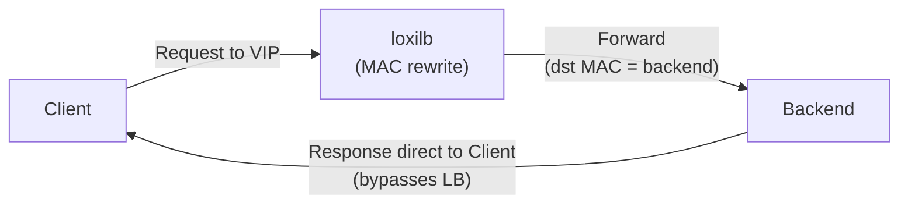
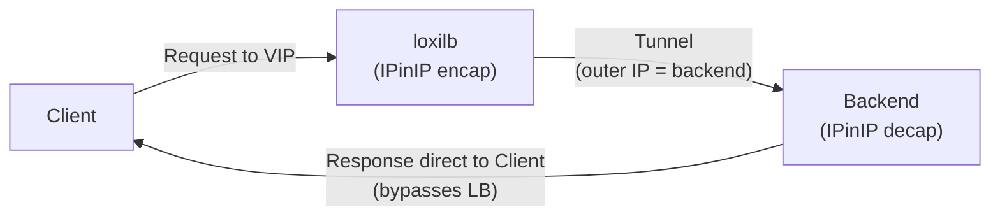

# Direct Server Return (DSR)

!!! enterprise "Enterprise Feature"
    This feature requires loxilb-enterprise. It is not available in the community edition.
    See [Installation](../getting-started/installation.md) for enterprise binary setup.

## Overview

Direct Server Return (DSR) eliminates the load balancer from the return path, reducing latency and LB bandwidth consumption. This is essential for high-throughput applications — video streaming, large file transfers, backup replication — where asymmetric traffic patterns dominate (small requests, large responses).

loxilb supports two DSR modes:

- **L2-DSR** — Rewrites the destination MAC address only. The backend must be in the same L2 subnet as the load balancer. No encapsulation overhead, lowest latency.
- **L3-DSR** — Uses IP-in-IP tunneling to reach backends in different subnets. Adds an IPinIP encapsulation header but enables cross-subnet DSR topologies.

In both modes, the client sends requests to the VIP. The load balancer forwards the packet to a backend (with MAC rewrite or IPinIP encap), and the backend responds **directly to the client**, bypassing the load balancer entirely on the return path.

## Architecture

### L2-DSR (Same Subnet)



### L3-DSR (Cross Subnet)



!!! warning "Port Constraint"
    In DSR mode, the endpoint target port **MUST** equal the service port. DSR does not rewrite packets — the backend receives traffic on the original service port. If ports differ, loxilb returns: `malformed-service dsr-port error`.

## Prerequisites

- **L2-DSR**: Backends must be in the same L2 subnet as the loxilb node
- **Both modes**: Backends must have the VIP configured on a loopback interface
- **Both modes**: ARP suppression for the VIP on backend nodes (prevent backends from answering ARP for the VIP)
- **L3-DSR**: IPinIP tunnel interface configured on backends for decapsulation

## REST API Configuration

=== "REST API"

    ```bash
    curl -X POST http://loxilb:11111/netlox/v1/config/loadbalancer \
      -H "Authorization: Bearer <token>" \
      -H "Content-Type: application/json" \
      -d '{
        "serviceArguments": {
          "externalIP": "20.20.20.1",
          "port": 2020,
          "protocol": "tcp",
          "mode": 3
        },
        "endpoints": [
          {"endpointIP": "31.31.31.1", "targetPort": 2020, "weight": 1},
          {"endpointIP": "32.32.32.1", "targetPort": 2020, "weight": 1}
        ]
      }'

    # Response (200):
    # {"result": "Success"}
    ```

=== "loxicmd"

    ```bash
    # L2-DSR (same subnet, MAC rewrite)
    # NOTE: endpoint port MUST equal service port
    loxicmd create lb 20.20.20.1 --tcp=2020:2020 \
      --endpoints=31.31.31.1:1,32.32.32.1:1 --mode=dsr

    # L3-DSR (different subnets, IPinIP tunnel)
    loxicmd create lb 20.20.20.1 --tcp=2020:2020 \
      --endpoints=31.31.31.1:1,32.32.32.1:1 --mode=dsr --select=hash
    ```

### Option Details

| Field | Type | Valid Values | Default | Description |
|-------|------|-------------|---------|-------------|
| `mode` | int | `0` (default NAT), `3` (DSR), `4` (fullproxy), `5` (fullnat) | `0` | LB operating mode — use `3` for DSR |
| `select` | string | `rr`, `hash`, `persist`, `n2` | `rr` | Load balancing algorithm |

!!! note "Common Fields"
    For common fields (`externalIP`, `port`, `protocol`, `endpoints`), see [Network Gateway Overview](overview.md).

## Backend Configuration

Each backend server must be configured to accept traffic destined for the VIP:

```bash
# Step 1: Add VIP to loopback interface
ip addr add 20.20.20.1/32 dev lo

# Step 2: Suppress ARP responses for the VIP
# (prevents backends from answering ARP for the VIP)
sysctl -w net.ipv4.conf.all.arp_ignore=1
sysctl -w net.ipv4.conf.all.arp_announce=2
```

For **L3-DSR**, additionally configure the IPinIP tunnel interface:

```bash
# Create IPinIP tunnel for L3-DSR decapsulation
ip tunnel add tunl0 mode ipip local 31.31.31.1
ip link set tunl0 up
ip addr add 20.20.20.1/32 dev tunl0
```

## Verify

```bash
curl http://loxilb:11111/netlox/v1/config/loadbalancer/all \
  -H "Authorization: Bearer <token>"

# Response (200): array of LB rule objects including your DSR rule
```

```bash
# Confirm DSR rule is active
loxicmd get lb

# On the backend, verify direct return path
# (traffic from backend goes directly to client, not through LB)
tcpdump -i eth0 src host 20.20.20.1

# From client, verify service is reachable
curl http://20.20.20.1:2020/
```

## Troubleshoot

**Port mismatch error**
:   DSR requires `targetPort` to equal the service `port`. If they differ, the POST returns `malformed-service dsr-port error`. Ensure all endpoint `targetPort` values match the service port exactly.

**Backends not responding**
:   DSR backends must have the VIP configured on their loopback interface (`ip addr add <VIP>/32 dev lo`). Without this, the backend drops packets destined for the VIP. Also verify ARP suppression is active (`arp_ignore=1`, `arp_announce=2`).

**L3-DSR tunnel not established**
:   For cross-subnet DSR, backends need an IPinIP tunnel interface with the VIP assigned. Verify with `ip tunnel show` and `ip addr show dev tunl0`. The tunnel `local` address must match the backend's own IP.

## DSR with SCTP

DSR also works with the SCTP protocol for telco/5G workloads:

```bash
# SCTP DSR — endpoint port must equal service port
loxicmd create lb 192.168.0.200 \
  --sctp=38412:38412 --mode=dsr \
  --endpoints=10.212.0.1:1,10.212.0.2:1
```

See [SCTP Multi-homing](sctp-multihoming.md) for full SCTP documentation including multi-homing configuration.

## When to Use DSR

| Scenario | Recommendation |
|----------|---------------|
| High-throughput responses (video, file download) | Use DSR — saves LB bandwidth |
| Backends in same subnet | L2-DSR — lowest latency, no encap overhead |
| Backends in different subnets | L3-DSR — IPinIP tunnel required |
| Need port translation (service port != backend port) | Do NOT use DSR — use default NAT mode |
| Need return traffic inspection at LB | Do NOT use DSR — return path bypasses LB |

## See Also

- [API Reference — Load Balancer](../reference/api.md#community-api-baseline)
- [Community API Reference (SwaggerHub)](https://app.swaggerhub.com/apis-docs/ADMIN_111/loxilb/1.0.0)
- [Egress LB](egress-lb.md) — Outbound traffic management
- [SCTP Multi-homing](sctp-multihoming.md) — SCTP DSR for telco workloads
- [Network Gateway Overview](overview.md) — All Network Gateway features
