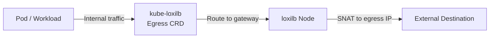

# Egress Load Balancing

!!! enterprise "Enterprise Feature"
    This feature requires loxilb-enterprise. It is not available in the community edition.
    See [Installation](../getting-started/installation.md) for enterprise binary setup.

## Overview

Egress Load Balancing enables outbound traffic from cluster workloads to exit through designated gateway nodes with source NAT (SNAT). This allows centralized control of egress traffic for security monitoring, IP allowlisting, and compliance — ensuring all outbound connections appear to originate from known gateway IPs rather than ephemeral pod addresses.

The `--egress` flag on `loxicmd create lb` creates a special load balancer rule where traffic originating from internal networks is routed through loxilb with SNAT to specified egress IPs. In Kubernetes environments, kube-loxilb provides a native Egress CRD (`egress.loxilb.io/v1`) for declarative egress policy management.

## Architecture



When a workload sends traffic to an external destination, loxilb intercepts it at the gateway node, applies source NAT to replace the pod IP with the configured egress IP, and forwards it. Return traffic follows the reverse SNAT path back to the originating workload.

## Prerequisites

- loxilb-enterprise installed with egress support
- For Kubernetes deployments: kube-loxilb with egress CRD permissions
- Egress gateway node must have connectivity to both internal workloads and external destinations

## REST API Configuration

=== "REST API"

    ```bash
    curl -X POST http://loxilb:11111/netlox/v1/config/loadbalancer \
      -H "Authorization: Bearer <token>" \
      -H "Content-Type: application/json" \
      -d '{
        "serviceArguments": {
          "externalIP": "0.0.0.0",
          "port": 0,
          "protocol": "tcp",
          "egress": true
        },
        "endpoints": [
          {"endpointIP": "10.0.0.1", "weight": 1},
          {"endpointIP": "10.0.0.2", "weight": 1}
        ]
      }'

    # Response (200):
    # {"result": "Success"}
    ```

=== "loxicmd"

    ```bash
    loxicmd create lb 0.0.0.0 --tcp=0:0 --egress \
      --endpoints=10.0.0.1:1,10.0.0.2:1
    ```

    The `0.0.0.0` VIP with port `0:0` indicates a catch-all egress rule. The endpoints specify the egress gateway IPs through which traffic will be SNATed.

=== "Kubernetes CRD"

    ```yaml
    apiVersion: "egress.loxilb.io/v1"
    kind: Egress
    metadata:
      name: loxilb-egress-svc
    spec:
      addresses:
        - 10.0.0.10
        - 10.0.0.11
      vip: 192.168.1.200
    ```

    The Kubernetes CRD approach requires kube-loxilb running with egress CRD permissions. The `addresses` field specifies egress IPs and `vip` is the virtual IP for the egress service.

### Option Details

| Field | Type | Valid Values | Default | Description |
|-------|------|-------------|---------|-------------|
| `egress` | bool | `true`, `false` | `false` | Enable egress SNAT mode |

!!! note "Common Fields"
    For common fields (`externalIP`, `port`, `protocol`, `endpoints`), see [Network Gateway Overview](overview.md).

## Verify

```bash
curl http://loxilb:11111/netlox/v1/config/loadbalancer/all \
  -H "Authorization: Bearer <token>"

# Response (200): array of LB rule objects including your egress rule
```

```bash
# List egress LB rules via CLI
loxicmd get lb

# Verify from an external destination that traffic arrives
# with the egress IP as source address
tcpdump -i eth0 src host 10.0.0.1
```

Confirm that the external destination sees the configured egress IP (e.g., `10.0.0.1`) as the source address, not the original pod IP.

## Troubleshoot

**Egress SNAT not applying**
:   Verify that `egress: true` is set in the POST request body. Without this flag, the rule behaves as a standard inbound load balancer. Check the rule with `GET /netlox/v1/config/loadbalancer/all` and confirm the egress field is present.

**Endpoint unreachable**
:   Confirm that the egress gateway endpoint IPs are reachable from the loxilb node. Verify endpoint health with `ping` or `curl` from the loxilb host.

**Conflict with existing LB rules**
:   If egress rules overlap with existing VIP:port combinations, the POST may return an error. Check for overlapping rules with `loxicmd get lb` and remove conflicting entries before creating the egress rule.

## Use Cases

- **IP Allowlisting** — External services that restrict access by source IP can allowlist a small set of egress gateway IPs instead of tracking dynamic pod IPs.
- **Compliance Auditing** — All outbound traffic flows through a known set of gateway nodes, enabling centralized logging and inspection.
- **Multi-Tenant Egress** — Different tenants can be assigned different egress IPs for traffic attribution and billing.

## See Also

- [API Reference — Load Balancer](../reference/api.md#community-api-baseline)
- [Community API Reference (SwaggerHub)](https://app.swaggerhub.com/apis-docs/ADMIN_111/loxilb/1.0.0)
- [DSR](dsr.md) — Direct Server Return for high-throughput inbound traffic
- [Network Gateway Overview](overview.md) — All Network Gateway features
