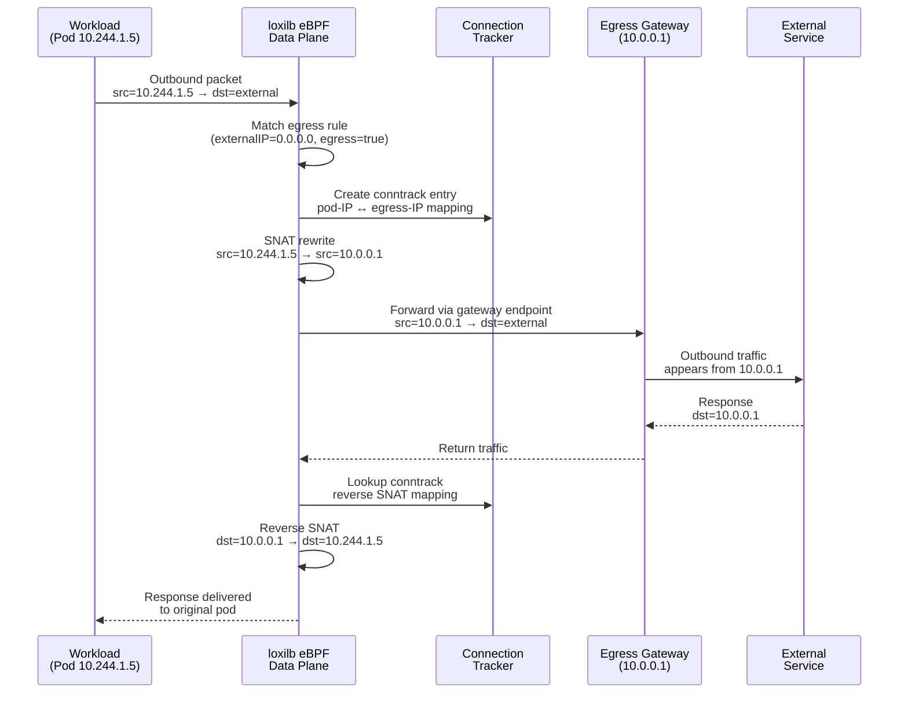
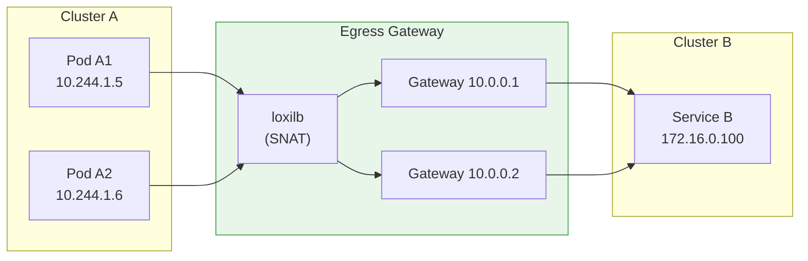
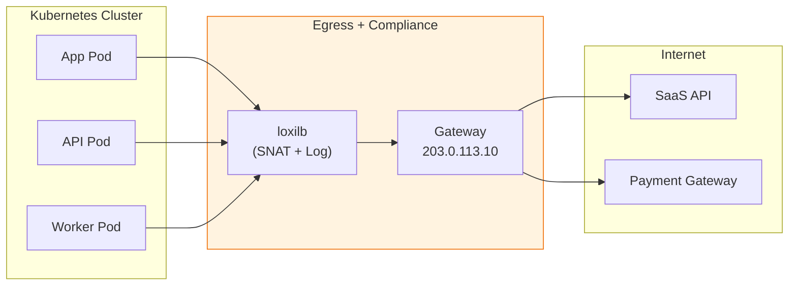

# Egress Load Balancing

!!! enterprise "Enterprise Feature"
    This feature requires loxilb-enterprise. It is not available in the community edition.
    See [Installation](../getting-started/installation.md) for enterprise binary setup.

Egress Load Balancing enables outbound traffic from cluster workloads to exit through designated gateway nodes with source NAT (SNAT). This allows centralized control of egress traffic for security monitoring, IP allowlisting, and compliance — ensuring all outbound connections appear to originate from known gateway IPs rather than ephemeral pod addresses.

---

## How It Works Internally

When `egress: true` is set on a load balancer rule, loxilb activates a special SNAT forwarding path in the eBPF data plane. Unlike standard inbound load balancing (where external clients reach backend services), egress mode intercepts **outbound** traffic from internal workloads and routes it through the configured gateway endpoints with source address rewriting.

### SNAT Forwarding Path



**Key implementation details:**

1. **Catch-all rule**: Egress rules typically use `externalIP: "0.0.0.0"` with `port: 0` to match all outbound traffic, but specific IP/port combinations can be used for selective egress policies.

2. **Connection tracking**: The eBPF data plane creates a conntrack entry for every SNAT'd connection, mapping the original pod source IP to the egress gateway IP. Return traffic uses this mapping for reverse SNAT.

3. **Endpoint selection**: When multiple egress endpoints are configured, loxilb selects one using the configured load balancing algorithm (default: round-robin). Weights allow traffic distribution preferences.

4. **Transparent to workloads**: Pods send traffic normally — the SNAT rewrite happens in the kernel eBPF path without any application-level changes.

---

## Prerequisites

- loxilb-enterprise installed with egress support
- For Kubernetes deployments: kube-loxilb with egress CRD permissions
- Egress gateway node must have connectivity to both internal workloads and external destinations

---

## REST API Configuration

### Option Details

| Field | Type | Valid Values | Default | Description |
|-------|------|-------------|---------|-------------|
| `egress` | bool | `true`, `false` | `false` | Enable egress SNAT mode. When `true`, the rule applies source NAT to outbound traffic. |
| `externalIP` | string | IPv4 address | (required) | VIP for the egress rule. Use `0.0.0.0` for catch-all egress. |
| `port` | int | 0-65535 | (required) | Service port. Use `0` for all-ports catch-all. |
| `protocol` | string | `tcp`, `udp` | (required) | Transport protocol for egress traffic. |
| `sel` | int | `0` (rr), `1` (hash), `2` (wrr) | `0` | Algorithm for selecting among multiple egress gateways. |

!!! note "Common Fields"
    For endpoint fields (`endpointIP`, `targetPort`, `weight`), see [Network Gateway Overview](overview.md).

### Basic Egress Rule

=== "REST API"

    ```bash
    curl -X POST http://loxilb:11111/netlox/v1/config/loadbalancer \
      -H "Authorization: Bearer <token>" \
      -H "Content-Type: application/json" \
      -d '{
        "serviceArguments": {
          "externalIP": "0.0.0.0",
          "port": 0,
          "protocol": "tcp",
          "egress": true
        },
        "endpoints": [
          {"endpointIP": "10.0.0.1", "weight": 1},
          {"endpointIP": "10.0.0.2", "weight": 1}
        ]
      }'

    # Response (200):
    # {"result": "Success"}
    ```

=== "loxicmd"

    ```bash
    loxicmd create lb 0.0.0.0 --tcp=0:0 --egress \
      --endpoints=10.0.0.1:1,10.0.0.2:1
    ```

    The `0.0.0.0` VIP with port `0:0` indicates a catch-all egress rule. The endpoints specify the egress gateway IPs through which traffic will be SNATed.

=== "Kubernetes CRD"

    ```yaml
    apiVersion: "egress.loxilb.io/v1"
    kind: Egress
    metadata:
      name: loxilb-egress-svc
    spec:
      addresses:
        - 10.0.0.10
        - 10.0.0.11
      vip: 192.168.1.200
    ```

    The Kubernetes CRD approach requires kube-loxilb running with egress CRD permissions. The `addresses` field specifies egress IPs and `vip` is the virtual IP for the egress service.

---

## Deployment Scenarios

### Scenario 1: East-West Egress (Cross-Cluster Access)

Workloads in one Kubernetes cluster need to access services in another cluster through a centralized egress gateway. This pattern is common in multi-cluster service mesh architectures where cross-cluster traffic must flow through designated gateway nodes for security and observability.



**Configuration:**

```bash
# East-west egress: all TCP traffic from Cluster A exits through gateway pool
curl -X POST http://loxilb:11111/netlox/v1/config/loadbalancer \
  -H "Authorization: Bearer <token>" \
  -H "Content-Type: application/json" \
  -d '{
    "serviceArguments": {
      "externalIP": "0.0.0.0",
      "port": 0,
      "protocol": "tcp",
      "egress": true
    },
    "endpoints": [
      {"endpointIP": "10.0.0.1", "weight": 1},
      {"endpointIP": "10.0.0.2", "weight": 1}
    ]
  }'
```

**Why this works:** Cluster B's firewall only needs to allowlist `10.0.0.1` and `10.0.0.2`, not every pod IP in Cluster A.

### Scenario 2: North-South Egress (Internet Access with Compliance)

All workload traffic to the internet flows through designated egress nodes for centralized logging, DLP inspection, and compliance auditing. This is required in regulated environments (PCI-DSS, HIPAA, SOC2) where every outbound connection must be recorded.



**Configuration:**

```bash
# North-south egress: internet-bound traffic through compliance gateway
curl -X POST http://loxilb:11111/netlox/v1/config/loadbalancer \
  -H "Authorization: Bearer <token>" \
  -H "Content-Type: application/json" \
  -d '{
    "serviceArguments": {
      "externalIP": "0.0.0.0",
      "port": 0,
      "protocol": "tcp",
      "egress": true
    },
    "endpoints": [
      {"endpointIP": "203.0.113.10", "weight": 2},
      {"endpointIP": "203.0.113.11", "weight": 1}
    ]
  }'
```

**Why weights matter:** The primary gateway (`203.0.113.10`, weight 2) handles 2/3 of traffic while the secondary (`203.0.113.11`, weight 1) handles 1/3 — useful when one gateway has higher capacity or a faster upstream link.

---

## Kubernetes Integration

In Kubernetes environments, kube-loxilb provides a native Egress CRD for declarative egress management:

```yaml
apiVersion: "egress.loxilb.io/v1"
kind: Egress
metadata:
  name: loxilb-egress-compliance
  namespace: production
spec:
  addresses:
    - 203.0.113.10
    - 203.0.113.11
  vip: 192.168.1.200
```

The CRD controller translates this into the equivalent `POST /netlox/v1/config/loadbalancer` API call with `egress: true`.

---

## Verify

```bash
curl http://loxilb:11111/netlox/v1/config/loadbalancer/all \
  -H "Authorization: Bearer <token>"

# Response (200): array of LB rule objects including your egress rule
```

```bash
# List egress LB rules via CLI
loxicmd get lb

# Verify from an external destination that traffic arrives
# with the egress IP as source address
tcpdump -i eth0 src host 10.0.0.1
```

Confirm that the external destination sees the configured egress IP (e.g., `10.0.0.1`) as the source address, not the original pod IP.

---

## Troubleshoot

**Egress SNAT not applying**
:   Verify that `egress: true` is set in the POST request body. Without this flag, the rule behaves as a standard inbound load balancer. Check the rule with `GET /netlox/v1/config/loadbalancer/all` and confirm the egress field is present.

**Endpoint unreachable**
:   Confirm that the egress gateway endpoint IPs are reachable from the loxilb node. Verify endpoint health with `ping` or `curl` from the loxilb host.

**Conflict with existing LB rules**
:   If egress rules overlap with existing VIP:port combinations, the POST may return an error. Check for overlapping rules with `loxicmd get lb` and remove conflicting entries before creating the egress rule.

**Traffic not being intercepted**
:   Ensure loxilb is in the data path for the workload's outbound traffic. In Kubernetes, this requires kube-loxilb to be properly configured and the egress CRD to be applied. Verify with `loxicmd get lb` that the egress rule exists.

---

## Use Cases

| Use Case | Description | Key Benefit |
|----------|-------------|-------------|
| **IP Allowlisting** | External services restrict access by source IP | Allowlist small set of gateway IPs instead of dynamic pod IPs |
| **Compliance Auditing** | All outbound traffic flows through known gateways | Centralized logging and inspection point |
| **Multi-Tenant Egress** | Different tenants use different egress IPs | Traffic attribution and billing per tenant |
| **DLP Inspection** | Outbound traffic passes through inspection proxy | Data loss prevention at egress point |
| **Cost Optimization** | Route egress through specific NAT gateways | Control cloud NAT gateway costs by consolidating egress |

---

## See Also

- [API Reference — Load Balancer](../reference/api.md#community-api-baseline)
- [Community API Reference (SwaggerHub)](https://app.swaggerhub.com/apis-docs/ADMIN_111/loxilb/1.0.0)
- [DSR](dsr.md) — Direct Server Return for high-throughput inbound traffic
- [Network Gateway Overview](overview.md) — All Network Gateway features and unified API reference
