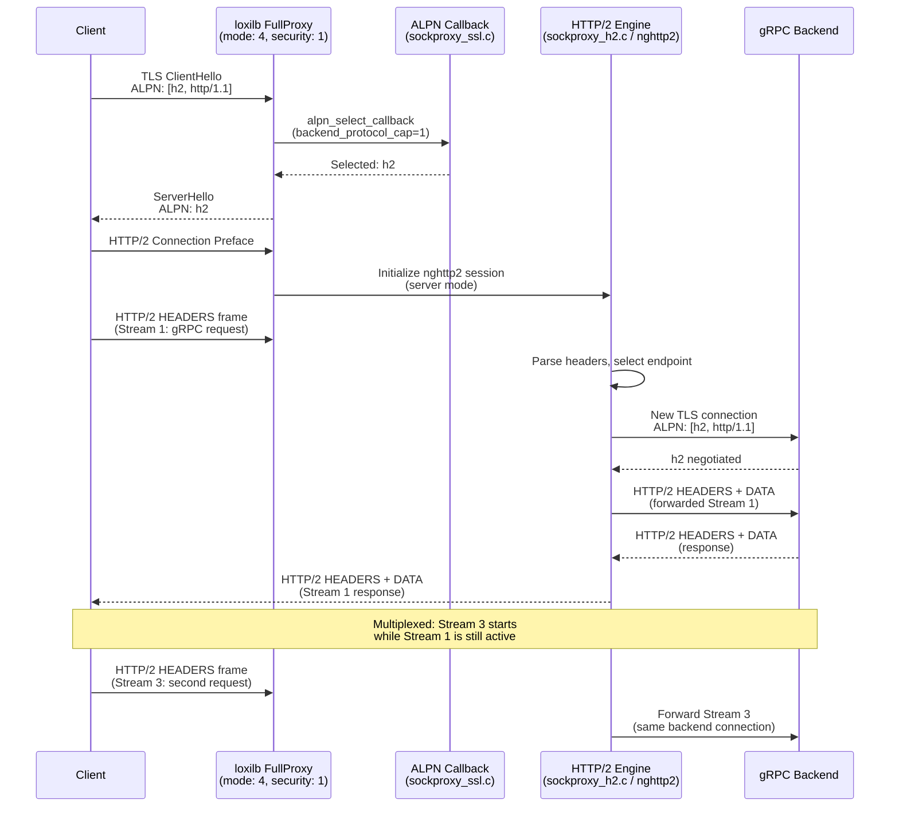
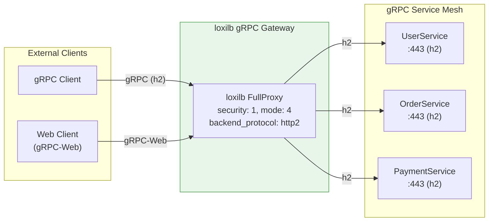
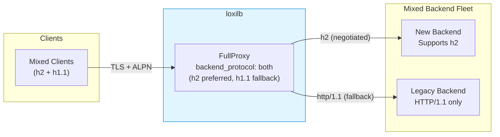

# HTTP/2 Proxy

!!! enterprise "Enterprise Feature"
    This feature requires loxilb-enterprise. It is not available in the community edition.
    See [Installation](../getting-started/installation.md) for enterprise binary setup.

HTTP/2 proxy enables loxilb to load balance gRPC and HTTP/2 backends with ALPN (Application-Layer Protocol Negotiation). This is critical for microservices architectures using gRPC for inter-service communication and modern HTTP/2 APIs that require multiplexed streams, header compression, and server push.

The `backendProtocol` field (called `backend_protocol` in the API) controls ALPN negotiation between loxilb and backend servers. This field is mapped to an internal `backend_protocol_cap` value in `sockproxy_ssl.c` that drives the ALPN callback behavior.

---

## How It Works Internally

HTTP/2 proxy support is implemented across two source files:

- **`sockproxy_ssl.c`** — ALPN selection callback (`alpn_select_callback`) that negotiates protocol during TLS handshake
- **`sockproxy_h2.c`** — HTTP/2 frame handling using the nghttp2 library for stream multiplexing and flow control

### ALPN Negotiation (from sockproxy_ssl.c)

The `alpn_select_callback` function is called by OpenSSL during the TLS handshake to select the application protocol. It respects the `backend_protocol_cap` configuration:

| `backend_protocol_cap` | API `backend_protocol` | ALPN Behavior |
|:-----------------------:|----------------------|---------------|
| `0` | `http1` | HTTP/1.1 only — forces `http/1.1` even if client supports h2 |
| `1` | `http2` | HTTP/2 only — selects `h2`; returns fatal alert if client does not support it |
| `2` | `both` (default) | HTTP/2 preferred, HTTP/1.1 fallback — tries `h2` first, falls back to `http/1.1` |

**Protocol selection logic** (verified from `alpn_select_callback` in sockproxy_ssl.c):

1. If `backend_protocol_cap == 0` (http1): Force HTTP/1.1 selection regardless of client ALPN list
2. If `backend_protocol_cap == 1` (http2): Select `h2` from client ALPN list; if client does not advertise `h2`, return `SSL_TLSEXT_ERR_ALERT_FATAL`
3. If `backend_protocol_cap == 2` (both/default): Try `h2` first; if not available, fall back to `http/1.1`; if neither matches, default to `http/1.1` for maximum compatibility

### HTTP/2 Connection Architecture



### HTTP/2 Backpressure (from sockproxy_h2.c)

The HTTP/2 engine implements backpressure watermarks to prevent memory exhaustion under heavy load:

| Parameter | Value | Description |
|-----------|-------|-------------|
| `H2_SESSION_HIGH_WATER` | 50 MB | When total buffered response data exceeds this, nghttp2 pauses backend reads |
| `H2_SESSION_LOW_WATER` | 10 MB | When buffered data drops below this, nghttp2 resumes backend reads |

These watermarks are scaled for HTTP/2 multi-stream sessions (up to 100 concurrent streams). HTTP/1.1 uses 12 MB / 4 MB for comparison.

---

## Backend Protocol Options

| API Value | `backend_protocol_cap` | ALPN Behavior | Use Case |
|-----------|:---------------------:|--------------|----------|
| `http1` (default) | `0` | HTTP/1.1 only | Standard web backends that don't support HTTP/2 |
| `http2` | `1` | HTTP/2 only (h2) | Pure gRPC services — fails if client doesn't support h2 |
| `both` | `2` | h2 preferred, http/1.1 fallback | Mixed backend fleet, gradual HTTP/2 migration |

!!! warning "Requires FullProxy Mode"
    HTTP/2 backend protocol requires `mode: 4` (fullproxy) for ALPN negotiation. Without fullproxy mode, the `backendProtocol` field has no effect — the proxy cannot perform the TLS handshake needed for ALPN.

---

## REST API Configuration

### Option Details

| Field | Type | Valid Values | Default | Description |
|-------|------|-------------|---------|-------------|
| `backend_protocol` | string | `http1`, `http2`, `both` | `http1` | Backend ALPN protocol negotiation. Maps to internal `backend_protocol_cap` (0/1/2). |
| `mode` | int | `4` (fullproxy) | (required) | Must be fullproxy for ALPN negotiation to function. |
| `security` | int | `0`, `1` (HTTPS), `2` (E2EHTTPS) | `0` | TLS mode. HTTP/2 works with any security level but ALPN requires TLS. |
| `host` | string | FQDN | (optional) | Combine with SNI routing for per-hostname h2 configuration. |
| `path_prefix` | string | URL path | (optional) | Combine with URL prefix routing for path-based gRPC service routing. |

!!! note "`backend_protocol` requires fullproxy"
    `backend_protocol` is only effective when `mode: 4` (fullproxy). Without fullproxy, backend protocol is determined automatically.

!!! note "Common Fields"
    For common fields (`externalIP`, `port`, `protocol`, `endpoints`), see [Network Gateway Overview](overview.md).

### Basic HTTP/2 Proxy

=== "REST API"

    ```bash
    curl -X POST http://loxilb:11111/netlox/v1/config/loadbalancer \
      -H "Authorization: Bearer <token>" \
      -H "Content-Type: application/json" \
      -d '{
        "serviceArguments": {
          "externalIP": "192.168.0.200",
          "port": 443,
          "protocol": "tcp",
          "security": 1,
          "mode": 4,
          "backend_protocol": "http2"
        },
        "endpoints": [
          {"endpointIP": "10.212.0.1", "targetPort": 443, "weight": 1},
          {"endpointIP": "10.212.0.2", "targetPort": 443, "weight": 1}
        ]
      }'

    # Response (200):
    # {"result": "Success"}
    ```

=== "loxicmd"

    ```bash
    # Pure HTTP/2 backend (gRPC services)
    loxicmd create lb 192.168.0.200 --tcp=443:443 \
      --security=https --mode=fullproxy \
      --backend-protocol=http2 \
      --endpoints=10.212.0.1:1,10.212.0.2:1

    # Mixed backend (auto-negotiate HTTP/1.1 or HTTP/2)
    loxicmd create lb 192.168.0.200 --tcp=443:443 \
      --security=https --mode=fullproxy \
      --backend-protocol=both \
      --endpoints=10.212.0.1:1,10.212.0.2:1
    ```

### HTTP/2 with Prefix Routing

HTTP/2 proxy can be combined with URL prefix routing for path-based gRPC service routing:

```bash
# Route /api prefix to HTTP/2 backends
curl -X POST http://loxilb:11111/netlox/v1/config/loadbalancer \
  -H "Authorization: Bearer <token>" \
  -H "Content-Type: application/json" \
  -d '{
    "serviceArguments": {
      "externalIP": "192.168.0.200",
      "port": 443,
      "protocol": "tcp",
      "security": 1,
      "mode": 4,
      "backend_protocol": "http2",
      "path_prefix": "/api",
      "path_match_mode": "prefix"
    },
    "endpoints": [
      {"endpointIP": "10.212.0.1", "targetPort": 8443, "weight": 1},
      {"endpointIP": "10.212.0.2", "targetPort": 8443, "weight": 1}
    ]
  }'
```

---

## Deployment Scenarios

### Scenario 1: gRPC Backend Proxy

A microservices platform where all inter-service communication uses gRPC. loxilb terminates TLS from external clients and connects to gRPC backends using HTTP/2.



**Configuration:**

```bash
# gRPC gateway — HTTP/2 only to backends
curl -X POST http://loxilb:11111/netlox/v1/config/loadbalancer \
  -H "Authorization: Bearer <token>" \
  -H "Content-Type: application/json" \
  -d '{
    "serviceArguments": {
      "externalIP": "203.0.113.10",
      "port": 443,
      "protocol": "tcp",
      "security": 1,
      "mode": 4,
      "backend_protocol": "http2"
    },
    "endpoints": [
      {"endpointIP": "10.0.1.10", "targetPort": 443, "weight": 1},
      {"endpointIP": "10.0.1.20", "targetPort": 443, "weight": 1},
      {"endpointIP": "10.0.1.30", "targetPort": 443, "weight": 1}
    ]
  }'
```

### Scenario 2: Mixed Protocol (Gradual HTTP/2 Migration)

An organization migrating from HTTP/1.1 to HTTP/2 where some backends have been upgraded and others have not. Using `backend_protocol: both` allows ALPN auto-negotiation per connection.



**Configuration:**

```bash
# Mixed protocol — auto-negotiate per backend connection
curl -X POST http://loxilb:11111/netlox/v1/config/loadbalancer \
  -H "Authorization: Bearer <token>" \
  -H "Content-Type: application/json" \
  -d '{
    "serviceArguments": {
      "externalIP": "192.168.0.200",
      "port": 443,
      "protocol": "tcp",
      "security": 1,
      "mode": 4,
      "backend_protocol": "both"
    },
    "endpoints": [
      {"endpointIP": "10.0.1.10", "targetPort": 443, "weight": 2},
      {"endpointIP": "10.0.1.20", "targetPort": 443, "weight": 1}
    ]
  }'
```

The higher weight on the new h2-capable backend gradually shifts traffic toward the upgraded infrastructure.

---

## When to Use Each Protocol

| Backend Type | `backend_protocol` | Rationale |
|-------------|-------------------|-----------|
| Pure gRPC services | `http2` | All backends speak HTTP/2; fail fast if h2 unavailable |
| Standard web servers | `http1` (default) | HTTP/1.1 is sufficient; avoid ALPN overhead |
| Mixed fleet (web + gRPC) | `both` | Auto-negotiate per connection for gradual migration |
| Migrating to HTTP/2 | `both` | Gradual rollout without breaking HTTP/1.1 backends |
| AI/LLM inference | `http2` | gRPC streaming for model inference benefits from h2 multiplexing |

---

## Verify

```bash
curl http://loxilb:11111/netlox/v1/config/loadbalancer/all \
  -H "Authorization: Bearer <token>"
```

```bash
# Confirm backend protocol setting
loxicmd get lb

# Test HTTP/2 negotiation
curl --http2 -k https://192.168.0.200/

# Verify ALPN result
openssl s_client -connect 192.168.0.200:443 -alpn h2,http/1.1 2>&1 | grep "ALPN"

# For gRPC, use grpcurl
grpcurl -insecure 192.168.0.200:443 list
```

---

## Troubleshoot

**`backend_protocol` ignored without fullproxy**
:   The `backend_protocol` field only works with `mode: 4` (fullproxy). Without fullproxy, loxilb cannot perform ALPN negotiation. Verify your rule has `mode: 4` with `GET /netlox/v1/config/loadbalancer/all`.

**ALPN negotiation failing**
:   The backend server must support the specified protocol. If `backend_protocol: http2`, the backend must accept HTTP/2 connections. Check the backend's TLS configuration and verify HTTP/2 is enabled (e.g., `h2` in ALPN).

**gRPC streams not multiplexing**
:   Ensure `backend_protocol` is set to `http2` (not `both`). With `both`, ALPN may negotiate HTTP/1.1 if the backend advertises it. Also verify the backend supports TLS-based HTTP/2 (h2) as appropriate.

**HTTP/2 connection reset under load**
:   Check if the H2 backpressure watermarks are being hit. When buffered response data exceeds 50 MB, nghttp2 pauses backend reads. This is protective behavior to prevent OOM. Scale backend capacity if this occurs regularly.

**Client does not support h2 (fatal alert)**
:   If `backend_protocol: http2` is configured and the client does not advertise `h2` in its ALPN list, the TLS handshake fails with a fatal alert. Switch to `backend_protocol: both` for backward compatibility, or ensure all clients support HTTP/2.

---

## See Also

- [API Reference — Load Balancer](../reference/api.md#community-api-baseline)
- [Community API Reference (SwaggerHub)](https://app.swaggerhub.com/apis-docs/ADMIN_111/loxilb/1.0.0)
- [HTTPS Proxy Modes](https-proxy.md) — TLS termination, SNI routing, and session persistence
- [Network Gateway Overview](overview.md) — All Network Gateway features and unified API reference
