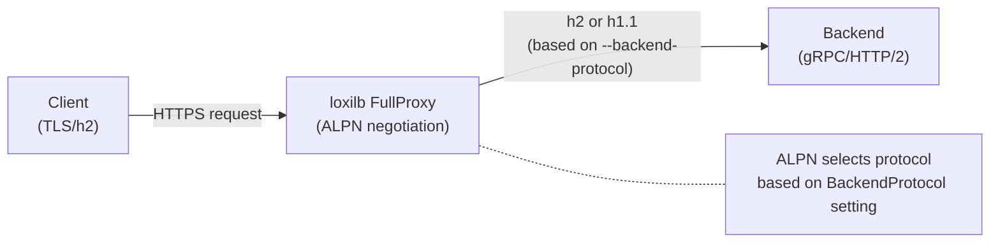

# HTTP/2 Proxy

!!! enterprise "Enterprise Feature"
    This feature requires loxilb-enterprise. It is not available in the community edition.
    See [Installation](../getting-started/installation.md) for enterprise binary setup.

## Overview

HTTP/2 proxy enables loxilb to load balance gRPC and HTTP/2 backends with ALPN (Application-Layer Protocol Negotiation). This is critical for microservices architectures using gRPC for inter-service communication and modern HTTP/2 APIs that require multiplexed streams, header compression, and server push.

The `--backend-protocol` flag controls ALPN negotiation between loxilb and backend servers: `http1` (default, HTTP/1.1 only), `http2` (HTTP/2 only), or `both` (auto-negotiate). This allows loxilb to match the protocol capabilities of the backend fleet.

Source: `LbServiceArg:864-867` — `BackendProtocol string`

!!! warning "Requires FullProxy Mode"
    HTTP/2 backend protocol requires `--mode=fullproxy` for ALPN negotiation. Without fullproxy mode, the `--backend-protocol` flag has no effect — the proxy cannot perform the TLS handshake needed for ALPN.

    Source: `create_loadbalancer.go:411`

## Backend Protocol Options

| Value | ALPN Behavior | Use Case |
|-------|--------------|----------|
| `http1` (default) | HTTP/1.1 only | Standard web backends |
| `http2` | HTTP/2 only (h2) | Pure gRPC services |
| `both` | Auto-negotiate h2 or http/1.1 | Mixed backend fleet |

Source: `create_loadbalancer.go:411` — "Backend protocol capability: http1 (HTTP/1.1 only, default), http2 (HTTP/2 only), both (supports both)"

## Architecture



The FullProxy mode performs a full TLS handshake with the backend, during which ALPN negotiation determines whether to use HTTP/2 or HTTP/1.1 for the backend connection.

## Configuration

=== "loxicmd"

    ```bash
    # Source: create_loadbalancer.go:411
    # Pure HTTP/2 backend (gRPC services)
    loxicmd create lb 192.168.0.200 --tcp=443:443 \
      --security=https --mode=fullproxy \
      --backend-protocol=http2 \
      --endpoints=10.212.0.1:1,10.212.0.2:1

    # Mixed backend (auto-negotiate HTTP/1.1 or HTTP/2)
    loxicmd create lb 192.168.0.200 --tcp=443:443 \
      --security=https --mode=fullproxy \
      --backend-protocol=both \
      --endpoints=10.212.0.1:1,10.212.0.2:1
    ```

=== "REST API"

    ```json
    POST /netlox/v1/config/loadbalancer
    {
      "serviceArguments": {
        "externalIP": "192.168.0.200",
        "port": 443,
        "protocol": "tcp",
        "security": 1,
        "mode": 4,
        "backendProtocol": "http2"
      },
      "endpoints": [
        {"endpointIP": "10.212.0.1", "targetPort": 443, "weight": 1},
        {"endpointIP": "10.212.0.2", "targetPort": 443, "weight": 1}
      ]
    }
    ```

    <!-- Source: common/common.go:864-867 — BackendProtocol string -->

## HTTP/2 with Prefix Routing

HTTP/2 proxy can be combined with URL prefix routing for path-based gRPC service routing:

```bash
# Route /api prefix to HTTP/2 backends
loxicmd create lb 192.168.0.200 --tcp=443:8443 \
  --security=https --mode=fullproxy \
  --backend-protocol=http2 \
  --path-prefix=/api --path-match-mode=prefix \
  --endpoints=10.212.0.1:1,10.212.0.2:1
```

This is useful for routing different gRPC services behind a single VIP based on the request path.

## Verification

```bash
# Confirm backend protocol setting
loxicmd get lb

# Test HTTP/2 negotiation
curl --http2 -k https://192.168.0.200/

# For gRPC, use grpcurl
grpcurl -insecure 192.168.0.200:443 list
```

## When to Use Each Protocol

| Backend Type | `--backend-protocol` | Rationale |
|-------------|---------------------|-----------|
| Pure gRPC services | `http2` | All backends speak HTTP/2 |
| Standard web servers | `http1` (default) | HTTP/1.1 is sufficient |
| Mixed fleet (web + gRPC) | `both` | Auto-negotiate per connection |
| Migrating to HTTP/2 | `both` | Gradual rollout without breaking HTTP/1.1 backends |

## See Also

- [HTTPS Proxy Modes](https-proxy.md) — TLS termination, SNI routing, and session persistence
- [Network Gateway Overview](overview.md) — All Network Gateway features
