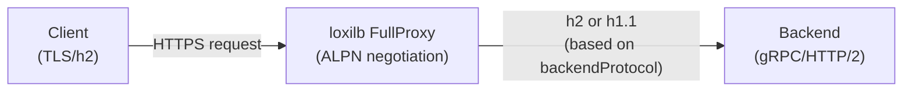

# HTTP/2 Proxy

!!! enterprise "Enterprise Feature"
    This feature requires loxilb-enterprise. It is not available in the community edition.
    See [Installation](../getting-started/installation.md) for enterprise binary setup.

## Overview

HTTP/2 proxy enables loxilb to load balance gRPC and HTTP/2 backends with ALPN (Application-Layer Protocol Negotiation). This is critical for microservices architectures using gRPC for inter-service communication and modern HTTP/2 APIs that require multiplexed streams, header compression, and server push.

The `backendProtocol` field controls ALPN negotiation between loxilb and backend servers: `http1` (default, HTTP/1.1 only), `http2` (HTTP/2 only), or `both` (auto-negotiate). This allows loxilb to match the protocol capabilities of the backend fleet.

!!! warning "Requires FullProxy Mode"
    HTTP/2 backend protocol requires `mode: 4` (fullproxy) for ALPN negotiation. Without fullproxy mode, the `backendProtocol` field has no effect — the proxy cannot perform the TLS handshake needed for ALPN.

## Backend Protocol Options

| Value | ALPN Behavior | Use Case |
|-------|--------------|----------|
| `http1` (default) | HTTP/1.1 only | Standard web backends |
| `http2` | HTTP/2 only (h2) | Pure gRPC services |
| `both` | Auto-negotiate h2 or http/1.1 | Mixed backend fleet |

## Architecture



The FullProxy mode performs a full TLS handshake with the backend, during which ALPN negotiation determines whether to use HTTP/2 or HTTP/1.1 for the backend connection.

## REST API Configuration

=== "REST API"

    ```bash
    curl -X POST http://loxilb:11111/netlox/v1/config/loadbalancer \
      -H "Authorization: Bearer <token>" \
      -H "Content-Type: application/json" \
      -d '{
        "serviceArguments": {
          "externalIP": "192.168.0.200",
          "port": 443,
          "protocol": "tcp",
          "security": 1,
          "mode": 4,
          "backendProtocol": "http2"
        },
        "endpoints": [
          {"endpointIP": "10.212.0.1", "targetPort": 443, "weight": 1},
          {"endpointIP": "10.212.0.2", "targetPort": 443, "weight": 1}
        ]
      }'

    # Response (200):
    # {"result": "Success"}
    ```

=== "loxicmd"

    ```bash
    # Pure HTTP/2 backend (gRPC services)
    loxicmd create lb 192.168.0.200 --tcp=443:443 \
      --security=https --mode=fullproxy \
      --backend-protocol=http2 \
      --endpoints=10.212.0.1:1,10.212.0.2:1

    # Mixed backend (auto-negotiate HTTP/1.1 or HTTP/2)
    loxicmd create lb 192.168.0.200 --tcp=443:443 \
      --security=https --mode=fullproxy \
      --backend-protocol=both \
      --endpoints=10.212.0.1:1,10.212.0.2:1
    ```

### Option Details

| Field | Type | Valid Values | Default | Description |
|-------|------|-------------|---------|-------------|
| `backendProtocol` | string | `http1`, `http2`, `both` | `http1` | Backend ALPN protocol negotiation |
| `mode` | int | `4` (fullproxy) | (required) | Must be fullproxy for HTTP/2 backend protocol selection |
| `security` | int | `0` (HTTP), `1` (HTTPS), `2` (E2EHTTPS) | `0` | TLS mode (HTTP/2 works with any security level) |

!!! note "`backendProtocol` requires fullproxy"
    `backendProtocol` is only effective when `mode: 4` (fullproxy). Without fullproxy, backend protocol is determined automatically.

!!! note "Common Fields"
    For common fields (`externalIP`, `port`, `protocol`, `endpoints`), see [Network Gateway Overview](overview.md).

## HTTP/2 with Prefix Routing

HTTP/2 proxy can be combined with URL prefix routing for path-based gRPC service routing:

```bash
# Route /api prefix to HTTP/2 backends
loxicmd create lb 192.168.0.200 --tcp=443:8443 \
  --security=https --mode=fullproxy \
  --backend-protocol=http2 \
  --path-prefix=/api --path-match-mode=prefix \
  --endpoints=10.212.0.1:1,10.212.0.2:1
```

This is useful for routing different gRPC services behind a single VIP based on the request path.

## Verify

```bash
curl http://loxilb:11111/netlox/v1/config/loadbalancer/all \
  -H "Authorization: Bearer <token>"

# Response (200): array of LB rule objects including your HTTP/2 proxy rule
```

```bash
# Confirm backend protocol setting
loxicmd get lb

# Test HTTP/2 negotiation
curl --http2 -k https://192.168.0.200/

# For gRPC, use grpcurl
grpcurl -insecure 192.168.0.200:443 list
```

## Troubleshoot

**`backendProtocol` ignored without fullproxy**
:   The `backendProtocol` field only works with `mode: 4` (fullproxy). Without fullproxy, loxilb cannot perform ALPN negotiation. Verify your rule has `mode: 4` with `GET /netlox/v1/config/loadbalancer/all`.

**ALPN negotiation failing**
:   The backend server must support the specified protocol. If `backendProtocol: http2`, the backend must accept HTTP/2 connections. Check the backend's TLS configuration and verify HTTP/2 is enabled (e.g., `h2` in ALPN).

**gRPC streams not multiplexing**
:   Ensure `backendProtocol` is set to `http2` (not `both`). With `both`, ALPN may negotiate HTTP/1.1 if the backend advertises it. Also verify the backend supports HTTP/2 cleartext (h2c) or TLS-based HTTP/2 (h2) as appropriate.

## When to Use Each Protocol

| Backend Type | `backendProtocol` | Rationale |
|-------------|-------------------|-----------|
| Pure gRPC services | `http2` | All backends speak HTTP/2 |
| Standard web servers | `http1` (default) | HTTP/1.1 is sufficient |
| Mixed fleet (web + gRPC) | `both` | Auto-negotiate per connection |
| Migrating to HTTP/2 | `both` | Gradual rollout without breaking HTTP/1.1 backends |

## See Also

- [API Reference — Load Balancer](../reference/api.md#community-api-baseline)
- [Community API Reference (SwaggerHub)](https://app.swaggerhub.com/apis-docs/ADMIN_111/loxilb/1.0.0)
- [HTTPS Proxy Modes](https-proxy.md) — TLS termination, SNI routing, and session persistence
- [Network Gateway Overview](overview.md) — All Network Gateway features
