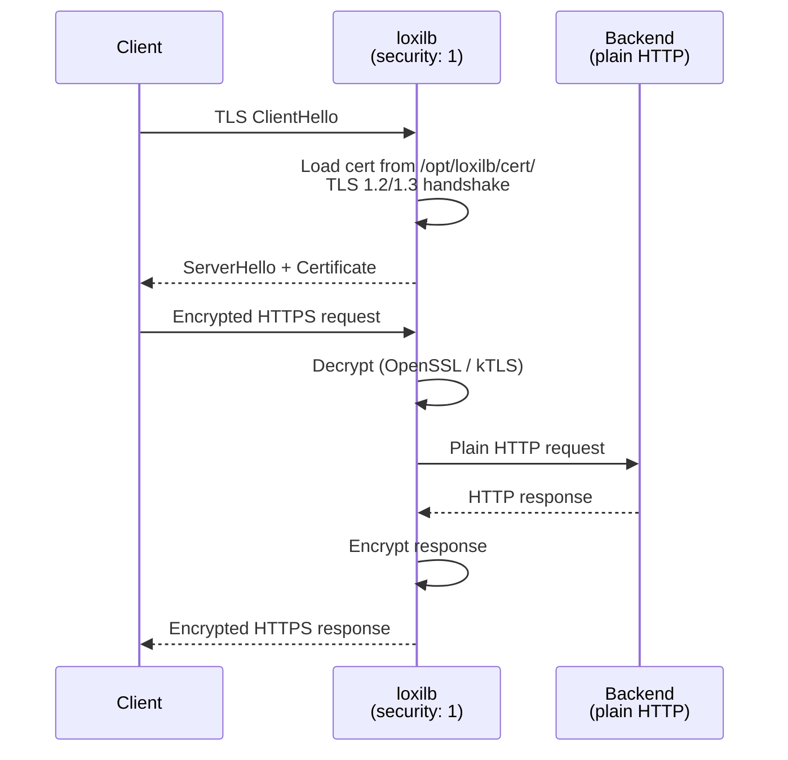
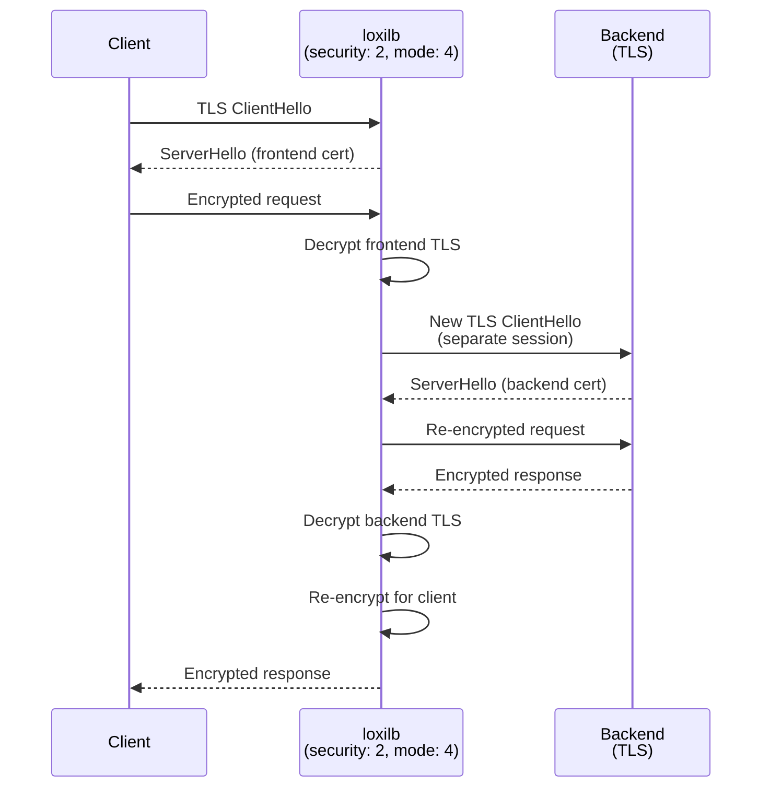
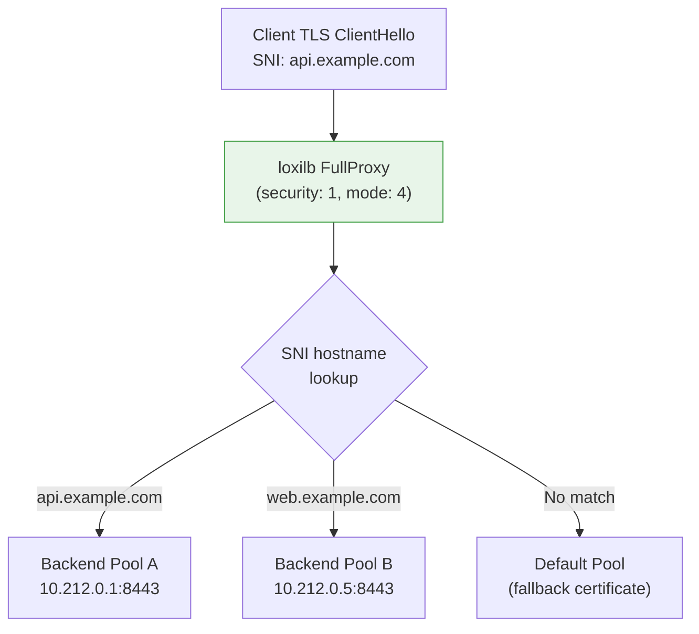

# HTTPS Proxy Modes

!!! enterprise "Enterprise Feature"
    This feature requires loxilb-enterprise. It is not available in the community edition.
    See [Installation](../getting-started/installation.md) for enterprise binary setup.

loxilb supports multiple HTTPS proxy modes for TLS traffic handling — from simple TLS termination to full L7 proxy with SNI-based hostname routing, URL prefix routing, and session persistence. These modes are configured through combinations of the `security` and `mode` fields in the load balancer API.

HTTPS proxy uses the **FullProxy mode** (`mode=4`) for advanced L7 features including SNI routing, prefix routing, and session persistence. Basic HTTPS termination works in any mode. End-to-end HTTPS (E2E) re-encrypts traffic to backends, providing full TLS coverage from client to backend.

---

## How It Works Internally

The HTTPS proxy is implemented in `sockproxy_ssl.c` using OpenSSL for TLS operations. The proxy operates in two distinct modes based on the `security` field value:

### TLS Implementation Details (from sockproxy_ssl.c)

**TLS Protocol Support:**

- **Minimum version**: TLS 1.2 (`SSL_CTX_set_min_proto_version(ctx, TLS1_2_VERSION)`)
- **Maximum version**: TLS 1.3 (`SSL_CTX_set_max_proto_version(ctx, TLS1_3_VERSION)`)
- **kTLS acceleration**: Enabled via `SSL_OP_ENABLE_KTLS` — offloads TLS record processing to the kernel for TLS 1.2 + AES-GCM combinations when kernel support is available

**Security hardening applied by default:**

- `SSL_OP_NO_SSLv2 | SSL_OP_NO_SSLv3` — Disables legacy insecure protocols
- `SSL_OP_NO_COMPRESSION` — Prevents CRIME attack
- `SSL_OP_CIPHER_SERVER_PREFERENCE` — Server selects cipher, not client
- `SSL_OP_NO_RENEGOTIATION` — Prevents renegotiation attacks (also required for kTLS)
- TLS 1.3 early data (0-RTT) disabled — Prevents replay attacks

**Certificate loading:**

- Default path: `/opt/loxilb/cert/server.crt` and `/opt/loxilb/cert/server.key`
- Per-hostname path: `/opt/loxilb/cert/{hostname}/server.crt` and `/opt/loxilb/cert/{hostname}/server.key`
- Uses `SSL_CTX_use_certificate_chain_file()` to load full chain (leaf + intermediate CAs)
- Certificate chain is sent to clients during TLS handshake

---

## Mode Combination Matrix

| Mode | `security` | `mode` | Description |
|------|-----------|--------|-------------|
| HTTPS termination | `1` (HTTPS) | any | LB terminates TLS; backend gets plain HTTP |
| HTTPS E2E proxy | `2` (E2EHTTPS) | `4` (fullproxy) | LB terminates and re-encrypts TLS to backend |
| SNI routing | `1` or `2` | `4` (fullproxy) | `host` field routes by Server Name Indication |
| Prefix routing | `1` or `2` | `4` (fullproxy) | `pathPrefix` + `pathMatchMode` for URL routing |
| Session persistence | `1` or `2` | `4` (fullproxy) | `sel: persist` + `sessionHeaderName` |
| mTLS frontend | `1` or `2` | `4` (fullproxy) | Client certificate verification |

!!! warning "mTLS Requires FullProxy Mode"
    `MTLSFrontend` and `MTLSBackend` settings only work with `security=1` (HTTPS) or `security=2` (E2EHTTPS) **AND** `mode=4` (fullproxy). In DSR or default NAT mode, mTLS configuration is silently ignored.

---

## Architecture

### HTTPS Termination (security: 1)



### HTTPS End-to-End Proxy (security: 2)



### SNI Routing (host field)



SNI routing uses the `sni_servername_callback` in sockproxy_ssl.c. When the client sends a TLS ClientHello with the SNI extension, loxilb looks up the hostname in a global certificate store (thread-safe hash map). If found, it switches the SSL context to the hostname-specific certificate and routes to the corresponding backend pool. Multiple LB rules can share the same VIP:port — each `host` value routes to a different backend pool.

---

## Cipher Suite Reference (from sockproxy_ssl.c)

### TLS 1.3 Cipher Suites

| Cipher Suite | Key Size | Notes |
|-------------|----------|-------|
| `TLS_AES_256_GCM_SHA384` | 256-bit | Strongest, preferred |
| `TLS_CHACHA20_POLY1305_SHA256` | 256-bit | Best for mobile/ARM |
| `TLS_AES_128_GCM_SHA256` | 128-bit | Fastest |

### TLS 1.2 Cipher Suites

| Cipher Suite | Key Exchange | Notes |
|-------------|--------------|-------|
| `ECDHE-RSA-AES256-GCM-SHA384` | ECDHE-RSA | Strong (256-bit) |
| `ECDHE-ECDSA-AES256-GCM-SHA384` | ECDHE-ECDSA | Strong (ECDSA) |
| `ECDHE-RSA-AES128-GCM-SHA256` | ECDHE-RSA | Fast, allows kTLS |
| `ECDHE-ECDSA-AES128-GCM-SHA256` | ECDHE-ECDSA | Fast (ECDSA) |
| `ECDHE-RSA-CHACHA20-POLY1305` | ECDHE-RSA | Mobile-optimized |
| `ECDHE-ECDSA-CHACHA20-POLY1305` | ECDHE-ECDSA | Mobile-optimized (ECDSA) |

All TLS 1.2 cipher suites use ECDHE key exchange for forward secrecy and AEAD encryption (GCM or POLY1305). No CBC-mode ciphers or RSA key exchange are supported.

---

## REST API Configuration

### Option Details

| Field | Type | Valid Values | Default | Description |
|-------|------|-------------|---------|-------------|
| `security` | int | `0` (none), `1` (HTTPS termination), `2` (E2E HTTPS) | `0` | TLS security mode |
| `mode` | int | `0` (default), `4` (fullproxy) | `0` | Must be `4` for SNI routing, prefix routing, session persistence |
| `host` | string | FQDN | (optional) | SNI hostname for routing. Multiple rules can share same VIP:port with different hosts. |
| `pathPrefix` | string | URL path prefix | (optional) | URL prefix for L7 routing. Must start with `/`. |
| `pathMatchMode` | string | `disabled`, `prefix`, `exact` | `disabled` | How `pathPrefix` is matched: `prefix` (starts-with), `exact` (exact match). |
| `sel` | int | `0` (rr), `1` (hash), `3` (persist) | `0` | Load balancing algorithm. Use `3` (persist) for session persistence. |
| `sessionHeaderName` | string | HTTP header name | (optional) | Custom header for session persistence (requires `sel: persist`). |
| `proxyprotocolv2` | bool | `true`, `false` | `false` | Enable PROXY protocol v2 for passing original client IP to backends. |
| `inactiveTimeOut` | int | seconds | (default) | Inactivity timeout for proxy connections. |

!!! note "Common Fields"
    For common fields (`externalIP`, `port`, `protocol`, `endpoints`), see [Network Gateway Overview](overview.md).

### Mode 1: HTTPS Termination

=== "REST API"

    ```bash
    curl -X POST http://loxilb:11111/netlox/v1/config/loadbalancer \
      -H "Authorization: Bearer <token>" \
      -H "Content-Type: application/json" \
      -d '{
        "serviceArguments": {
          "externalIP": "192.168.0.200",
          "port": 443,
          "protocol": "tcp",
          "security": 1
        },
        "endpoints": [
          {"endpointIP": "10.212.0.1", "targetPort": 80, "weight": 1},
          {"endpointIP": "10.212.0.2", "targetPort": 80, "weight": 1}
        ]
      }'
    ```

=== "loxicmd"

    ```bash
    loxicmd create lb 192.168.0.200 --tcp=443:80 \
      --security=https --endpoints=10.212.0.1:1,10.212.0.2:1
    ```

### Mode 2: HTTPS End-to-End Proxy

=== "REST API"

    ```bash
    curl -X POST http://loxilb:11111/netlox/v1/config/loadbalancer \
      -H "Authorization: Bearer <token>" \
      -H "Content-Type: application/json" \
      -d '{
        "serviceArguments": {
          "externalIP": "192.168.0.200",
          "port": 443,
          "protocol": "tcp",
          "security": 2,
          "mode": 4
        },
        "endpoints": [
          {"endpointIP": "10.212.0.1", "targetPort": 443, "weight": 1},
          {"endpointIP": "10.212.0.2", "targetPort": 443, "weight": 1}
        ]
      }'
    ```

=== "loxicmd"

    ```bash
    loxicmd create lb 192.168.0.200 --tcp=443:443 \
      --security=e2ehttps --mode=fullproxy \
      --endpoints=10.212.0.1:1,10.212.0.2:1
    ```

### Mode 3: SNI + Prefix Routing

=== "REST API"

    ```bash
    curl -X POST http://loxilb:11111/netlox/v1/config/loadbalancer \
      -H "Authorization: Bearer <token>" \
      -H "Content-Type: application/json" \
      -d '{
        "serviceArguments": {
          "externalIP": "192.168.0.200",
          "port": 443,
          "protocol": "tcp",
          "security": 1,
          "mode": 4,
          "host": "api.example.com",
          "path_prefix": "/v1/api",
          "path_match_mode": "prefix"
        },
        "endpoints": [
          {"endpointIP": "10.212.0.1", "targetPort": 8443, "weight": 1},
          {"endpointIP": "10.212.0.2", "targetPort": 8443, "weight": 1}
        ]
      }'
    ```

=== "loxicmd"

    ```bash
    loxicmd create lb 192.168.0.200 --tcp=443:8443 \
      --security=https --mode=fullproxy \
      --host=api.example.com \
      --path-prefix=/v1/api --path-match-mode=prefix \
      --endpoints=10.212.0.1:1,10.212.0.2:1
    ```

Multiple SNI rules can share the same VIP — each `host` value routes to a different backend pool, enabling virtual hosting on a single IP address.

### Mode 4: Session Persistence

=== "REST API"

    ```bash
    curl -X POST http://loxilb:11111/netlox/v1/config/loadbalancer \
      -H "Authorization: Bearer <token>" \
      -H "Content-Type: application/json" \
      -d '{
        "serviceArguments": {
          "externalIP": "192.168.0.200",
          "port": 443,
          "protocol": "tcp",
          "security": 1,
          "mode": 4,
          "sel": 3,
          "session_header_name": "x-session-id"
        },
        "endpoints": [
          {"endpointIP": "10.212.0.1", "targetPort": 8080, "weight": 1},
          {"endpointIP": "10.212.0.2", "targetPort": 8080, "weight": 1}
        ]
      }'
    ```

=== "loxicmd"

    ```bash
    loxicmd create lb 192.168.0.200 --tcp=443:8080 \
      --security=https --mode=fullproxy --select=persist \
      --session-header-name=x-session-id \
      --endpoints=10.212.0.1:1,10.212.0.2:1
    ```

Session persistence pins a client to the same backend based on a configurable HTTP header value. This is useful for stateful applications that store session data locally.

---

## Deployment Scenarios

### Scenario 1: TLS Termination Gateway (Enterprise API)

An enterprise API gateway that terminates TLS at loxilb and forwards plain HTTP to backend microservices. This centralizes certificate management and offloads TLS processing from application servers.

```bash
# Enterprise API gateway — TLS termination with re-encryption disabled
curl -X POST http://loxilb:11111/netlox/v1/config/loadbalancer \
  -H "Authorization: Bearer <token>" \
  -H "Content-Type: application/json" \
  -d '{
    "serviceArguments": {
      "externalIP": "203.0.113.10",
      "port": 443,
      "protocol": "tcp",
      "security": 1,
      "mode": 4,
      "host": "api.enterprise.com"
    },
    "endpoints": [
      {"endpointIP": "10.0.1.10", "targetPort": 8080, "weight": 2},
      {"endpointIP": "10.0.1.20", "targetPort": 8080, "weight": 1}
    ]
  }'
```

Place the certificate at `/opt/loxilb/cert/api.enterprise.com/server.crt` and the key at `/opt/loxilb/cert/api.enterprise.com/server.key`.

### Scenario 2: Multi-Tenant SNI Routing (SaaS Platform)

A SaaS platform hosting multiple customers on a single VIP. SNI routing sends each customer's traffic to their dedicated backend pool based on the hostname in the TLS ClientHello.

```bash
# Customer A: api.customer-a.com → Pool A
curl -X POST http://loxilb:11111/netlox/v1/config/loadbalancer \
  -H "Authorization: Bearer <token>" \
  -H "Content-Type: application/json" \
  -d '{
    "serviceArguments": {
      "externalIP": "203.0.113.10",
      "port": 443,
      "protocol": "tcp",
      "security": 1,
      "mode": 4,
      "host": "api.customer-a.com"
    },
    "endpoints": [
      {"endpointIP": "10.0.1.10", "targetPort": 8443, "weight": 1}
    ]
  }'

# Customer B: api.customer-b.com → Pool B
curl -X POST http://loxilb:11111/netlox/v1/config/loadbalancer \
  -H "Authorization: Bearer <token>" \
  -H "Content-Type: application/json" \
  -d '{
    "serviceArguments": {
      "externalIP": "203.0.113.10",
      "port": 443,
      "protocol": "tcp",
      "security": 1,
      "mode": 4,
      "host": "api.customer-b.com"
    },
    "endpoints": [
      {"endpointIP": "10.0.2.10", "targetPort": 8443, "weight": 1}
    ]
  }'
```

Both rules share VIP `203.0.113.10:443`. Each customer's certificate is loaded from `/opt/loxilb/cert/{hostname}/`.

---

## Verify

```bash
curl http://loxilb:11111/netlox/v1/config/loadbalancer/all \
  -H "Authorization: Bearer <token>"
```

```bash
# Test TLS termination
curl -k https://192.168.0.200/

# Test SNI routing (specify hostname)
curl -k --resolve api.example.com:443:192.168.0.200 \
  https://api.example.com/v1/api/health

# Verify ALPN negotiation
openssl s_client -connect 192.168.0.200:443 -alpn h2,http/1.1

# Check cipher suite
openssl s_client -connect 192.168.0.200:443 -cipher 'ECDHE+AESGCM'
```

---

## Troubleshoot

**mTLS silently ignored in non-fullproxy mode**
:   mTLS requires `mode: 4` (fullproxy). Without fullproxy, mTLS settings are silently ignored. Verify with `GET /netlox/v1/config/loadbalancer/all` that `mode` is `4`.

**Certificate path errors**
:   Verify that certificate files exist at `/opt/loxilb/cert/server.crt` and `/opt/loxilb/cert/server.key`. For hostname-specific certificates, check `/opt/loxilb/cert/{hostname}/server.crt`. Files must be in PEM format and readable by the loxilb process.

**SNI hostname not matching**
:   The `host` field must exactly match the SNI value in the client TLS ClientHello. Verify the client is sending the correct SNI with `openssl s_client -connect <VIP>:443 -servername <hostname>`. Wildcard matching is not supported.

**Path prefix routing not activating**
:   Ensure `path_prefix` starts with `/` and `path_match_mode` is set correctly (`prefix` for starts-with matching, `exact` for exact match). Path routing requires `mode: 4` (fullproxy).

**kTLS not activating**
:   kTLS requires TLS 1.2 + AES-GCM cipher + kernel support (`CONFIG_TLS` enabled). TLS 1.3 uses userspace crypto. Verify with `openssl s_client -connect <VIP>:443` and check the negotiated protocol version.

---

## See Also

- [API Reference — Load Balancer](../reference/api.md#community-api-baseline)
- [Community API Reference (SwaggerHub)](https://app.swaggerhub.com/apis-docs/ADMIN_111/loxilb/1.0.0)
- [HTTP/2 Proxy](http2-proxy.md) — HTTP/2 and gRPC backend load balancing (combines with HTTPS proxy)
- [mTLS Configuration](../security-gateway/mtls.md) — Mutual TLS setup for client certificate verification
- [Network Gateway Overview](overview.md) — All Network Gateway features and unified API reference
