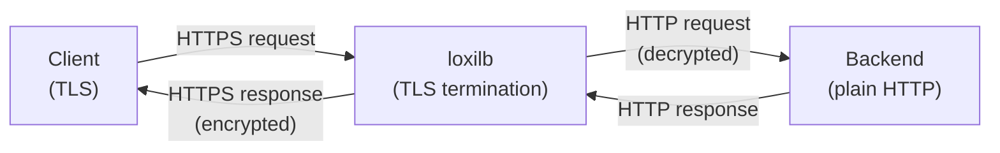
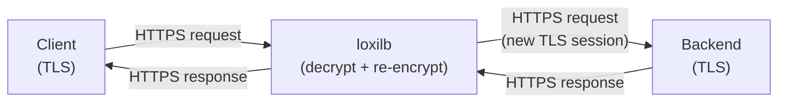

# HTTPS Proxy Modes

!!! enterprise "Enterprise Feature"
    This feature requires loxilb-enterprise. It is not available in the community edition.
    See [Installation](../getting-started/installation.md) for enterprise binary setup.

## Overview

loxilb supports multiple HTTPS proxy modes for TLS traffic handling — from simple TLS termination to full L7 proxy with SNI-based hostname routing, URL prefix routing, and session persistence. These modes are configured through combinations of the `security` and `mode` fields in the load balancer API.

HTTPS proxy uses the **FullProxy mode** (`mode=4`) for advanced L7 features including SNI routing, prefix routing, and session persistence. Basic HTTPS termination works in any mode. End-to-end HTTPS (E2E) re-encrypts traffic to backends, providing full TLS coverage from client to backend.

## Mode Combination Matrix

The following table shows all valid HTTPS proxy mode combinations:

| Mode | `security` | `mode` | Description |
|------|-----------|--------|-------------|
| HTTPS termination | `1` (HTTPS) | any | LB terminates TLS; backend gets plain HTTP |
| HTTPS E2E proxy | `2` (E2EHTTPS) | `4` (fullproxy) | LB terminates and re-encrypts TLS to backend |
| SNI routing | `1` or `2` | `4` (fullproxy) | `host` field routes by Server Name Indication |
| Prefix routing | `1` or `2` | `4` (fullproxy) | `pathPrefix` + `pathMatchMode` for URL routing |
| Session persistence | `1` or `2` | `4` (fullproxy) | `select: persist` + `sessionHeaderName` |
| mTLS frontend | `1` or `2` | `4` (fullproxy) | Client certificate verification |

!!! warning "mTLS Requires FullProxy Mode"
    `MTLSFrontend` and `MTLSBackend` settings only work with `security=1` (HTTPS) or `security=2` (E2EHTTPS) **AND** `mode=4` (fullproxy). In DSR or default NAT mode, mTLS configuration is silently ignored.

## Architecture

### HTTPS Termination



### HTTPS End-to-End Proxy



## TLS Certificate Setup

loxilb loads TLS certificates from the following default paths:

- **Server certificate**: `/opt/loxilb/cert/server.crt`
- **Server private key**: `/opt/loxilb/cert/server.key`

Ensure certificates are in PEM format and readable by the loxilb process.

## REST API Configuration

### Mode 1: HTTPS Termination

=== "REST API"

    ```bash
    curl -X POST http://loxilb:11111/netlox/v1/config/loadbalancer \
      -H "Authorization: Bearer <token>" \
      -H "Content-Type: application/json" \
      -d '{
        "serviceArguments": {
          "externalIP": "192.168.0.200",
          "port": 443,
          "protocol": "tcp",
          "security": 1
        },
        "endpoints": [
          {"endpointIP": "10.212.0.1", "targetPort": 80, "weight": 1},
          {"endpointIP": "10.212.0.2", "targetPort": 80, "weight": 1}
        ]
      }'

    # Response (200):
    # {"result": "Success"}
    ```

=== "loxicmd"

    ```bash
    # LB terminates TLS, sends plain HTTP to backend
    loxicmd create lb 192.168.0.200 --tcp=443:80 \
      --security=https --endpoints=10.212.0.1:1,10.212.0.2:1
    ```

### Mode 2: HTTPS End-to-End Proxy

=== "REST API"

    ```bash
    curl -X POST http://loxilb:11111/netlox/v1/config/loadbalancer \
      -H "Authorization: Bearer <token>" \
      -H "Content-Type: application/json" \
      -d '{
        "serviceArguments": {
          "externalIP": "192.168.0.200",
          "port": 443,
          "protocol": "tcp",
          "security": 2,
          "mode": 4
        },
        "endpoints": [
          {"endpointIP": "10.212.0.1", "targetPort": 443, "weight": 1},
          {"endpointIP": "10.212.0.2", "targetPort": 443, "weight": 1}
        ]
      }'

    # Response (200):
    # {"result": "Success"}
    ```

=== "loxicmd"

    ```bash
    # LB re-encrypts traffic to backend (full TLS coverage)
    loxicmd create lb 192.168.0.200 --tcp=443:443 \
      --security=e2ehttps --mode=fullproxy \
      --endpoints=10.212.0.1:1,10.212.0.2:1
    ```

### Mode 3: SNI + Prefix Routing

=== "REST API"

    ```bash
    curl -X POST http://loxilb:11111/netlox/v1/config/loadbalancer \
      -H "Authorization: Bearer <token>" \
      -H "Content-Type: application/json" \
      -d '{
        "serviceArguments": {
          "externalIP": "192.168.0.200",
          "port": 443,
          "protocol": "tcp",
          "security": 1,
          "mode": 4,
          "host": "api.example.com",
          "pathPrefix": "/v1/api",
          "pathMatchMode": "prefix"
        },
        "endpoints": [
          {"endpointIP": "10.212.0.1", "targetPort": 8443, "weight": 1},
          {"endpointIP": "10.212.0.2", "targetPort": 8443, "weight": 1}
        ]
      }'

    # Response (200):
    # {"result": "Success"}
    ```

=== "loxicmd"

    ```bash
    # Route by hostname (SNI) AND URL prefix
    loxicmd create lb 192.168.0.200 --tcp=443:8443 \
      --security=https --mode=fullproxy \
      --host=api.example.com \
      --path-prefix=/v1/api --path-match-mode=prefix \
      --endpoints=10.212.0.1:1,10.212.0.2:1
    ```

Multiple SNI rules can share the same VIP — each `host` value routes to a different backend pool, enabling virtual hosting on a single IP address.

### Mode 4: Session Persistence

=== "REST API"

    ```bash
    curl -X POST http://loxilb:11111/netlox/v1/config/loadbalancer \
      -H "Authorization: Bearer <token>" \
      -H "Content-Type: application/json" \
      -d '{
        "serviceArguments": {
          "externalIP": "192.168.0.200",
          "port": 443,
          "protocol": "tcp",
          "security": 1,
          "mode": 4,
          "select": "persist",
          "sessionHeaderName": "x-session-id"
        },
        "endpoints": [
          {"endpointIP": "10.212.0.1", "targetPort": 8080, "weight": 1},
          {"endpointIP": "10.212.0.2", "targetPort": 8080, "weight": 1}
        ]
      }'

    # Response (200):
    # {"result": "Success"}
    ```

=== "loxicmd"

    ```bash
    # Header-based session persistence
    loxicmd create lb 192.168.0.200 --tcp=443:8080 \
      --security=https --mode=fullproxy --select=persist \
      --session-header-name=x-session-id \
      --endpoints=10.212.0.1:1,10.212.0.2:1
    ```

Session persistence pins a client to the same backend based on a configurable HTTP header value. This is useful for stateful applications that store session data locally.

### Option Details

| Field | Type | Valid Values | Default | Description |
|-------|------|-------------|---------|-------------|
| `security` | int | `0` (none), `1` (HTTPS termination), `2` (E2E HTTPS) | `0` | TLS security mode |
| `mode` | int | `0` (default), `4` (fullproxy) | `0` | Must be `4` for HTTPS proxy features |
| `host` | string | FQDN | (optional) | SNI hostname for routing |
| `pathPrefix` | string | URL path prefix | (optional) | URL path prefix for routing |
| `pathMatchMode` | string | `prefix`, `exact` | `prefix` | How `pathPrefix` is matched |
| `select` | string | `rr`, `hash`, `persist`, `n2` | `rr` | Load balancing algorithm |
| `sessionHeaderName` | string | HTTP header name | (optional) | Custom header for session persistence |

!!! note "Common Fields"
    For common fields (`externalIP`, `port`, `protocol`, `endpoints`), see [Network Gateway Overview](overview.md).

## Verify

```bash
curl http://loxilb:11111/netlox/v1/config/loadbalancer/all \
  -H "Authorization: Bearer <token>"

# Response (200): array of LB rule objects including your HTTPS proxy rules
```

```bash
# Confirm HTTPS rule with security mode
loxicmd get lb

# Test TLS termination
curl -k https://192.168.0.200/

# Test SNI routing (specify hostname)
curl -k --resolve api.example.com:443:192.168.0.200 \
  https://api.example.com/v1/api/health

# Check Prometheus metrics for HTTPS proxy
curl http://loxilb:11111/netlox/v1/metrics | grep sockproxy
```

## Troubleshoot

**mTLS silently ignored in non-fullproxy mode**
:   mTLS requires `mode: 4` (fullproxy). Without fullproxy, mTLS settings (`MTLSFrontend`, `MTLSBackend`) are silently ignored. Verify with `GET /netlox/v1/config/loadbalancer/all` that `mode` is `4`.

**Certificate path errors**
:   Verify that certificate files exist at `/opt/loxilb/cert/server.crt` and `/opt/loxilb/cert/server.key`. Files must be in PEM format and readable by the loxilb process. For E2E HTTPS, backend certificates are handled by the backend server — loxilb initiates a new TLS session.

**SNI hostname not matching**
:   The `host` field must exactly match the SNI value in the client TLS ClientHello. Verify the client is sending the correct SNI with `openssl s_client -connect <VIP>:443 -servername <hostname>`. Wildcard matching is not supported — each hostname needs its own rule.

**Path prefix routing not activating**
:   Ensure `pathPrefix` starts with `/` and `pathMatchMode` is set correctly (`prefix` for starts-with matching, `exact` for exact match). Path routing requires `mode: 4` (fullproxy).

## See Also

- [API Reference — Load Balancer](../reference/api.md#community-api-baseline)
- [Community API Reference (SwaggerHub)](https://app.swaggerhub.com/apis-docs/ADMIN_111/loxilb/1.0.0)
- [HTTP/2 Proxy](http2-proxy.md) — HTTP/2 and gRPC backend load balancing (combines with HTTPS proxy)
- [mTLS Configuration](../security-gateway/mtls.md) — Mutual TLS setup for client certificate verification
- [Network Gateway Overview](overview.md) — All Network Gateway features
