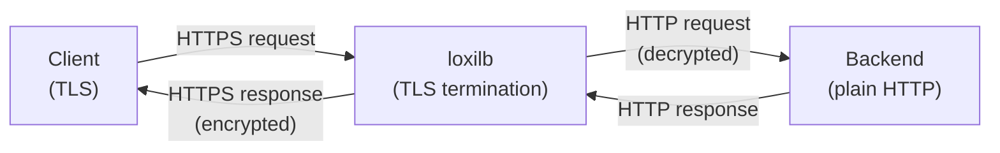
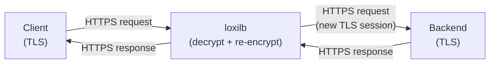

# HTTPS Proxy Modes

!!! enterprise "Enterprise Feature"
    This feature requires loxilb-enterprise. It is not available in the community edition.
    See [Installation](../getting-started/installation.md) for enterprise binary setup.

## Overview

loxilb supports multiple HTTPS proxy modes for TLS traffic handling — from simple TLS termination to full L7 proxy with SNI-based hostname routing, URL prefix routing, and session persistence. These modes are configured through combinations of the `--security` and `--mode` flags on `loxicmd create lb`.

HTTPS proxy uses the **FullProxy mode** (`mode=4`) for advanced L7 features including SNI routing, prefix routing, and session persistence. Basic HTTPS termination works in any mode. End-to-end HTTPS (E2E) re-encrypts traffic to backends, providing full TLS coverage from client to backend.

## Mode Combination Matrix

The following table shows all valid HTTPS proxy mode combinations:

| Mode | `--security` | `--mode` | Description |
|------|-------------|---------|-------------|
| HTTPS termination | `https` | any | LB terminates TLS; backend gets plain HTTP |
| HTTPS E2E proxy | `e2ehttps` | `fullproxy` | LB terminates and re-encrypts TLS to backend |
| SNI routing | `https` or `e2ehttps` | `fullproxy` | `--host=<hostname>` routes by Server Name Indication |
| Prefix routing | `https` or `e2ehttps` | `fullproxy` | `--path-prefix` + `--path-match-mode=prefix|exact` |
| Session persistence | `https` or `e2ehttps` | `fullproxy` | `--select=persist` + `--session-header-name` |
| mTLS frontend | `https` or `e2ehttps` | `fullproxy` | Client certificate verification |

Source: `common/common.go:738-741` — `LBServHTTPS`, `LBServE2EHTTPS`; `LBModeFullProxy` (mode=4)

!!! warning "mTLS Requires FullProxy Mode"
    `MTLSFrontend` and `MTLSBackend` settings only work with `security=https` or `security=e2ehttps` **AND** `mode=fullproxy`. In DSR or default NAT mode, mTLS configuration is silently ignored.

    Source: `common/common.go:921-929` — comments explicitly state mTLS is "Only valid with Security=LBServHTTPS or LBServE2EHTTPS and Mode=LBModeFullProxy".

## Architecture

### HTTPS Termination



### HTTPS End-to-End Proxy



## TLS Certificate Setup

loxilb loads TLS certificates from the following default paths:

- **Server certificate**: `/opt/loxilb/cert/server.crt`
- **Server private key**: `/opt/loxilb/cert/server.key`

Source: `options/options.go:21-22`

Ensure certificates are in PEM format and readable by the loxilb process.

## Configuration Examples

### Mode 1: HTTPS Termination

=== "loxicmd"

    ```bash
    # Source: create_loadbalancer.go:147
    # LB terminates TLS, sends plain HTTP to backend
    loxicmd create lb 192.168.0.200 --tcp=443:80 \
      --security=https --endpoints=10.212.0.1:1,10.212.0.2:1
    ```

=== "REST API"

    ```json
    POST /netlox/v1/config/loadbalancer
    {
      "serviceArguments": {
        "externalIP": "192.168.0.200",
        "port": 443,
        "protocol": "tcp",
        "security": 1
      },
      "endpoints": [
        {"endpointIP": "10.212.0.1", "targetPort": 80, "weight": 1},
        {"endpointIP": "10.212.0.2", "targetPort": 80, "weight": 1}
      ]
    }
    ```

    <!-- Source: common/common.go:738 — LBServHTTPS = 1 -->

### Mode 2: HTTPS End-to-End Proxy

=== "loxicmd"

    ```bash
    # Source: create_loadbalancer.go:151
    # LB re-encrypts traffic to backend (full TLS coverage)
    loxicmd create lb 192.168.0.200 --tcp=443:443 \
      --security=e2ehttps --mode=fullproxy \
      --endpoints=10.212.0.1:1,10.212.0.2:1
    ```

=== "REST API"

    ```json
    POST /netlox/v1/config/loadbalancer
    {
      "serviceArguments": {
        "externalIP": "192.168.0.200",
        "port": 443,
        "protocol": "tcp",
        "security": 2,
        "mode": 4
      },
      "endpoints": [
        {"endpointIP": "10.212.0.1", "targetPort": 443, "weight": 1},
        {"endpointIP": "10.212.0.2", "targetPort": 443, "weight": 1}
      ]
    }
    ```

    <!-- Source: common/common.go:741 — LBServE2EHTTPS = 2 -->

### Mode 3: SNI + Prefix Routing

=== "loxicmd"

    ```bash
    # Source: create_loadbalancer.go:402
    # Route by hostname (SNI) AND URL prefix
    loxicmd create lb 192.168.0.200 --tcp=443:8443 \
      --security=https --mode=fullproxy \
      --host=api.example.com \
      --path-prefix=/v1/api --path-match-mode=prefix \
      --endpoints=10.212.0.1:1,10.212.0.2:1
    ```

Multiple SNI rules can share the same VIP — each `--host` value routes to a different backend pool, enabling virtual hosting on a single IP address.

### Mode 4: Session Persistence

=== "loxicmd"

    ```bash
    # Header-based session persistence
    loxicmd create lb 192.168.0.200 --tcp=443:8080 \
      --security=https --mode=fullproxy --select=persist \
      --session-header-name=x-session-id \
      --endpoints=10.212.0.1:1,10.212.0.2:1
    ```

Session persistence pins a client to the same backend based on a configurable HTTP header value. This is useful for stateful applications that store session data locally.

## Verification

```bash
# Confirm HTTPS rule with security mode
loxicmd get lb

# Test TLS termination
curl -k https://192.168.0.200/

# Test SNI routing (specify hostname)
curl -k --resolve api.example.com:443:192.168.0.200 \
  https://api.example.com/v1/api/health

# Check Prometheus metrics for HTTPS proxy
curl http://loxilb:11111/netlox/v1/metrics | grep sockproxy
```

## See Also

- [HTTP/2 Proxy](http2-proxy.md) — HTTP/2 and gRPC backend load balancing (combines with HTTPS proxy)
- [mTLS Configuration](../security-gateway/mtls.md) — Mutual TLS setup for client certificate verification
- [Network Gateway Overview](overview.md) — All Network Gateway features
