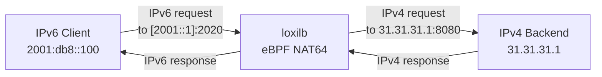

# NAT64

!!! enterprise "Enterprise Feature"
    This feature requires loxilb-enterprise. It is not available in the community edition.
    See [Installation](../getting-started/installation.md) for enterprise binary setup.

## Overview

NAT64 enables IPv6-only clients to access IPv4 backend services through loxilb. As enterprises transition to dual-stack or IPv6-only networks, NAT64 bridges the gap without requiring backend service changes — IPv4 backends continue operating unchanged while IPv6 clients reach them transparently.

In loxilb, NAT64 is achieved by creating a load balancer rule with an **IPv6 VIP and IPv4 endpoints**. The eBPF dataplane handles protocol translation using the `bpf_skb_change_proto` helper — no special NAT64 module, DNS64 configuration, or userspace proxy is needed. The translation happens entirely in the kernel data path at wire speed.

## Architecture



!!! note "Kernel Requirement"
    NAT64 relies on the eBPF helper `bpf_skb_change_proto` for protocol translation. Requires **Linux kernel 4.18 or later**. Verify your kernel version with `uname -r`.

## Prerequisites

IPv6 must be enabled on the loxilb host:

```bash
sysctl net.ipv6.conf.all.disable_ipv6=0
sysctl net.ipv6.conf.default.disable_ipv6=0
```

- Linux kernel 4.18+ (eBPF `bpf_skb_change_proto` support)
- IPv6 connectivity between clients and the loxilb node
- IPv4 connectivity between loxilb and backend servers

## REST API Configuration

=== "REST API"

    ```bash
    curl -X POST http://loxilb:11111/netlox/v1/config/loadbalancer \
      -H "Authorization: Bearer <token>" \
      -H "Content-Type: application/json" \
      -d '{
        "serviceArguments": {
          "externalIP": "2001::1",
          "port": 2020,
          "protocol": "tcp"
        },
        "endpoints": [
          {"endpointIP": "31.31.31.1", "targetPort": 8080, "weight": 1},
          {"endpointIP": "32.32.32.1", "targetPort": 8080, "weight": 1},
          {"endpointIP": "33.33.33.1", "targetPort": 8080, "weight": 1}
        ]
      }'

    # Response (200):
    # {"result": "Success"}
    ```

=== "loxicmd"

    ```bash
    loxicmd create lb 2001::1 --tcp=2020:8080 \
      --endpoints=31.31.31.1:1,32.32.32.1:1,33.33.33.1:1
    ```

    The key pattern is straightforward: specify an **IPv6 address as the VIP** and **IPv4 addresses as endpoints**. loxilb automatically detects the address family mismatch and enables NAT64 translation.

### Option Details

| Field | Type | Valid Values | Default | Description |
|-------|------|-------------|---------|-------------|
| `externalIP` | string | IPv6 address | (required) | **Must be IPv6** to trigger NAT64 translation |
| `port` | int | 0-65535 | (required) | Service port number |
| `protocol` | string | `tcp`, `udp`, `sctp` | (required) | Transport protocol |

!!! note "NAT64 Activation"
    NAT64 is activated automatically when `externalIP` is an IPv6 address and endpoint IPs are IPv4. No explicit NAT64 flag exists.

!!! note "Common Fields"
    For endpoint fields and other common options, see [Network Gateway Overview](overview.md).

## Verify

```bash
curl http://loxilb:11111/netlox/v1/config/loadbalancer/all \
  -H "Authorization: Bearer <token>"

# Response (200): array of LB rule objects including your NAT64 rule
```

```bash
# Confirm IPv6 VIP is listed in LB rules
loxicmd get lb

# Test NAT64 from an IPv6 client
curl -6 http://[2001::1]:2020/

# Verify on the backend that traffic arrives as IPv4
tcpdump -i eth0 dst port 8080
```

The backend server will see traffic arriving from an IPv4 address (loxilb's IPv4 interface), not from the original IPv6 client address.

## Troubleshoot

**IPv6 not enabled on host**
:   Check `sysctl net.ipv6.conf.all.disable_ipv6` — if it returns `1`, IPv6 is disabled. Set to `0` with `sysctl -w net.ipv6.conf.all.disable_ipv6=0` and also for the default interface.

**Kernel version too old for NAT64**
:   NAT64 requires Linux kernel 4.18+ for the `bpf_skb_change_proto` eBPF helper. Check with `uname -r`. Upgrade the kernel if running an older version.

**DNS64 confusion**
:   loxilb NAT64 operates at Layer 4 (transport) — it translates IPv6 packets to IPv4 at the load balancer. DNS64 is a separate DNS-level mechanism that synthesizes AAAA records. loxilb does not provide DNS64; if your IPv6 clients need DNS resolution of IPv4-only services, configure DNS64 separately.

## Dual-Stack Considerations

NAT64 works alongside standard IPv4 load balancer rules. For full dual-stack availability, deploy both an IPv4 and an IPv6 VIP pointing to the same backend pool:

```bash
# IPv4 clients
loxicmd create lb 10.10.10.1 --tcp=2020:8080 \
  --endpoints=31.31.31.1:1,32.32.32.1:1

# IPv6 clients (NAT64)
loxicmd create lb 2001::1 --tcp=2020:8080 \
  --endpoints=31.31.31.1:1,32.32.32.1:1
```

Both rules load balance to the same IPv4 backends, but the IPv6 rule includes automatic protocol translation.

!!! note "NAT66 Support"
    loxilb also supports NAT66 (IPv6-to-IPv6) load balancing using IPv6 VIPs with IPv6 endpoints. NAT66/NAT64 support is a shipped feature in loxilb.

## See Also

- [API Reference — Load Balancer](../reference/api.md#community-api-baseline)
- [Community API Reference (SwaggerHub)](https://app.swaggerhub.com/apis-docs/ADMIN_111/loxilb/1.0.0)
- [DSR](dsr.md) — Direct Server Return for high-throughput traffic
- [HTTPS Proxy](https-proxy.md) — TLS termination and proxy modes
- [Network Gateway Overview](overview.md) — All Network Gateway features
