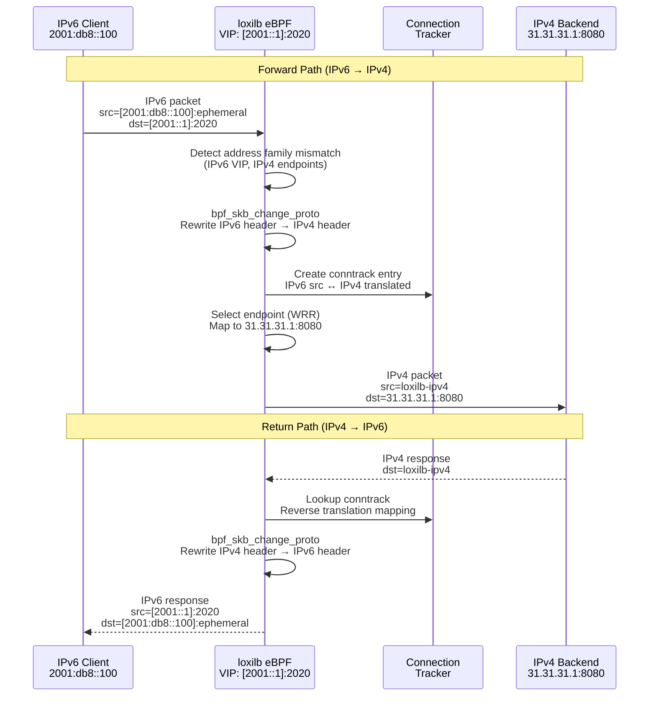
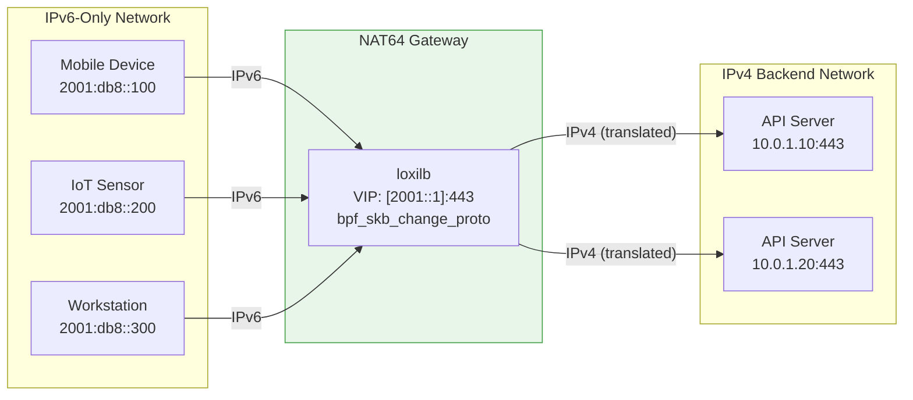
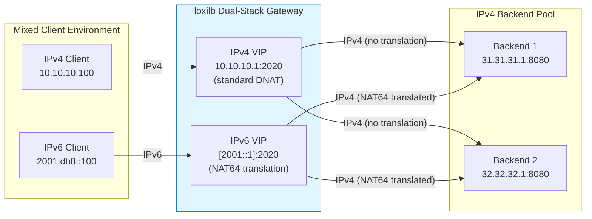

# NAT64

!!! enterprise "Enterprise Feature"
    This feature requires loxilb-enterprise. It is not available in the community edition.
    See [Installation](../getting-started/installation.md) for enterprise binary setup.

NAT64 enables IPv6-only clients to access IPv4 backend services through loxilb. As enterprises transition to dual-stack or IPv6-only networks, NAT64 bridges the gap without requiring backend service changes — IPv4 backends continue operating unchanged while IPv6 clients reach them transparently.

In loxilb, NAT64 is achieved by creating a load balancer rule with an **IPv6 VIP and IPv4 endpoints**. The eBPF dataplane handles protocol translation using the `bpf_skb_change_proto` helper — no special NAT64 module, DNS64 configuration, or userspace proxy is needed. The translation happens entirely in the kernel data path at wire speed.

---

## How It Works Internally

NAT64 translation is activated automatically when loxilb detects an address family mismatch: IPv6 `externalIP` with IPv4 endpoint IPs. There is no explicit NAT64 flag — the address family combination is the trigger.

### IPv6-to-IPv4 Translation Path



**Key implementation details:**

1. **`bpf_skb_change_proto` helper**: This eBPF helper function changes the protocol of a packet (IPv6 ↔ IPv4) in the kernel data path. It handles the header transformation including length adjustments. Requires **Linux kernel 4.18 or later**.

2. **Automatic detection**: No explicit NAT64 flag exists in the API. loxilb detects the NAT64 scenario when `externalIP` is an IPv6 address and endpoint IPs are IPv4. The eBPF data plane then enables protocol translation for this rule.

3. **Connection tracking**: Each translated connection creates a conntrack entry that maps the IPv6 source address/port to the translated IPv4 state. Return traffic uses this mapping for the reverse IPv4→IPv6 translation.

4. **Protocol support**: NAT64 works with TCP, UDP, and SCTP. The translation handles transport-layer checksum recalculation automatically.

5. **No DNS64**: loxilb NAT64 operates at Layer 4 (transport). DNS64 is a separate DNS-level mechanism that synthesizes AAAA records from A records — it is not part of loxilb and must be configured separately if needed.

---

## Prerequisites

IPv6 must be enabled on the loxilb host:

```bash
sysctl net.ipv6.conf.all.disable_ipv6=0
sysctl net.ipv6.conf.default.disable_ipv6=0
```

- Linux kernel 4.18+ (eBPF `bpf_skb_change_proto` support)
- IPv6 connectivity between clients and the loxilb node
- IPv4 connectivity between loxilb and backend servers

!!! note "Kernel Requirement"
    NAT64 relies on the eBPF helper `bpf_skb_change_proto` for protocol translation. Requires **Linux kernel 4.18 or later**. Verify your kernel version with `uname -r`.

---

## REST API Configuration

### Option Details

| Field | Type | Valid Values | Default | Description |
|-------|------|-------------|---------|-------------|
| `externalIP` | string | IPv6 address | (required) | **Must be IPv6** to trigger NAT64 translation |
| `port` | int | 0-65535 | (required) | Service port number |
| `protocol` | string | `tcp`, `udp`, `sctp` | (required) | Transport protocol |
| `mode` | int | `0`, `2`, `3`, `5` | `0` | Operating mode. NAT64 works with DNAT (0), fullnat (2), DSR (3). |
| `sel` | int | `0`-`10` | `0` | Load balancing algorithm for endpoint selection |

!!! note "NAT64 Activation"
    NAT64 is activated automatically when `externalIP` is an IPv6 address and endpoint IPs are IPv4. No explicit NAT64 flag exists.

!!! note "Common Fields"
    For endpoint fields and other common options, see [Network Gateway Overview](overview.md).

### Basic NAT64 Rule

=== "REST API"

    ```bash
    curl -X POST http://loxilb:11111/netlox/v1/config/loadbalancer \
      -H "Authorization: Bearer <token>" \
      -H "Content-Type: application/json" \
      -d '{
        "serviceArguments": {
          "externalIP": "2001::1",
          "port": 2020,
          "protocol": "tcp"
        },
        "endpoints": [
          {"endpointIP": "31.31.31.1", "targetPort": 8080, "weight": 1},
          {"endpointIP": "32.32.32.1", "targetPort": 8080, "weight": 1},
          {"endpointIP": "33.33.33.1", "targetPort": 8080, "weight": 1}
        ]
      }'

    # Response (200):
    # {"result": "Success"}
    ```

=== "loxicmd"

    ```bash
    loxicmd create lb 2001::1 --tcp=2020:8080 \
      --endpoints=31.31.31.1:1,32.32.32.1:1,33.33.33.1:1
    ```

    The key pattern is straightforward: specify an **IPv6 address as the VIP** and **IPv4 addresses as endpoints**. loxilb automatically detects the address family mismatch and enables NAT64 translation.

---

## Deployment Scenarios

### Scenario 1: IPv6-Only Clients to IPv4 Backends

The classic NAT64 use case: an enterprise has migrated client networks (mobile, IoT, internal workstations) to IPv6-only, but backend services still run on IPv4. NAT64 bridges the gap without modifying backends.



**Configuration:**

```bash
# IPv6-only clients accessing IPv4 API backends
curl -X POST http://loxilb:11111/netlox/v1/config/loadbalancer \
  -H "Authorization: Bearer <token>" \
  -H "Content-Type: application/json" \
  -d '{
    "serviceArguments": {
      "externalIP": "2001::1",
      "port": 443,
      "protocol": "tcp"
    },
    "endpoints": [
      {"endpointIP": "10.0.1.10", "targetPort": 443, "weight": 1},
      {"endpointIP": "10.0.1.20", "targetPort": 443, "weight": 1}
    ]
  }'
```

**Why no backend changes:** IPv4 backends see standard IPv4 traffic from loxilb's IPv4 interface. They have no awareness that the original client was IPv6.

### Scenario 2: Dual-Stack Migration

An enterprise is gradually migrating to IPv6. During the transition, both IPv4 and IPv6 clients need to access the same backend pool. Deploy parallel VIPs — one IPv4 (standard LB) and one IPv6 (NAT64) — pointing to the same IPv4 backends.



**Configuration:**

```bash
# IPv4 clients (standard LB, no translation)
curl -X POST http://loxilb:11111/netlox/v1/config/loadbalancer \
  -H "Authorization: Bearer <token>" \
  -H "Content-Type: application/json" \
  -d '{
    "serviceArguments": {
      "externalIP": "10.10.10.1",
      "port": 2020,
      "protocol": "tcp"
    },
    "endpoints": [
      {"endpointIP": "31.31.31.1", "targetPort": 8080, "weight": 1},
      {"endpointIP": "32.32.32.1", "targetPort": 8080, "weight": 1}
    ]
  }'

# IPv6 clients (NAT64 — same backends)
curl -X POST http://loxilb:11111/netlox/v1/config/loadbalancer \
  -H "Authorization: Bearer <token>" \
  -H "Content-Type: application/json" \
  -d '{
    "serviceArguments": {
      "externalIP": "2001::1",
      "port": 2020,
      "protocol": "tcp"
    },
    "endpoints": [
      {"endpointIP": "31.31.31.1", "targetPort": 8080, "weight": 1},
      {"endpointIP": "32.32.32.1", "targetPort": 8080, "weight": 1}
    ]
  }'
```

**Migration path:** Start with this dual-VIP setup. As backends are upgraded to IPv6, transition endpoints to IPv6 addresses and retire the NAT64 rule. The IPv4 rule can coexist as long as IPv4 clients remain.

---

## DNS64 Integration Note

loxilb NAT64 operates at Layer 4 (transport) — it translates IPv6 packets to IPv4 at the load balancer. **DNS64** is a separate DNS-level mechanism that synthesizes AAAA records from A records, allowing IPv6-only clients to resolve IPv4-only domains.

If your IPv6 clients need DNS resolution of IPv4-only services, configure DNS64 separately on your DNS infrastructure. loxilb does not provide DNS64.

**Typical DNS64 + NAT64 flow:**

1. IPv6 client queries DNS for `api.example.com`
2. DNS64 server synthesizes AAAA record: `2001::1` (the loxilb VIP)
3. Client sends IPv6 traffic to `[2001::1]:443`
4. loxilb NAT64 translates to IPv4 and forwards to backend

!!! note "NAT66 Support"
    loxilb also supports NAT66 (IPv6-to-IPv6) load balancing using IPv6 VIPs with IPv6 endpoints. NAT66/NAT64 support is a shipped feature in loxilb.

---

## Verify

```bash
curl http://loxilb:11111/netlox/v1/config/loadbalancer/all \
  -H "Authorization: Bearer <token>"

# Response (200): array of LB rule objects including your NAT64 rule
```

```bash
# Confirm IPv6 VIP is listed in LB rules
loxicmd get lb

# Test NAT64 from an IPv6 client
curl -6 http://[2001::1]:2020/

# Verify on the backend that traffic arrives as IPv4
tcpdump -i eth0 dst port 8080
```

The backend server will see traffic arriving from an IPv4 address (loxilb's IPv4 interface), not from the original IPv6 client address.

---

## Troubleshoot

**IPv6 not enabled on host**
:   Check `sysctl net.ipv6.conf.all.disable_ipv6` — if it returns `1`, IPv6 is disabled. Set to `0` with `sysctl -w net.ipv6.conf.all.disable_ipv6=0` and also for the default interface.

**Kernel version too old for NAT64**
:   NAT64 requires Linux kernel 4.18+ for the `bpf_skb_change_proto` eBPF helper. Check with `uname -r`. Upgrade the kernel if running an older version.

**DNS64 confusion**
:   loxilb NAT64 operates at Layer 4 (transport) — it translates IPv6 packets to IPv4 at the load balancer. DNS64 is a separate DNS-level mechanism that synthesizes AAAA records. loxilb does not provide DNS64; if your IPv6 clients need DNS resolution of IPv4-only services, configure DNS64 separately.

**IPv6 client cannot reach VIP**
:   Verify IPv6 routing between the client and loxilb. Check `ip -6 route` on the loxilb host to confirm the VIP is reachable. Ensure no firewall blocks IPv6 traffic on the path.

**Checksum errors after translation**
:   The eBPF data plane recalculates transport-layer checksums during protocol translation. If you see checksum errors, verify your kernel version supports the `bpf_skb_change_proto` helper properly (kernel 4.18+).

---

## See Also

- [API Reference — Load Balancer](../reference/api.md#community-api-baseline)
- [Community API Reference (SwaggerHub)](https://app.swaggerhub.com/apis-docs/ADMIN_111/loxilb/1.0.0)
- [DSR](dsr.md) — Direct Server Return for high-throughput traffic
- [HTTPS Proxy](https-proxy.md) — TLS termination and proxy modes
- [Network Gateway Overview](overview.md) — All Network Gateway features and unified API reference
