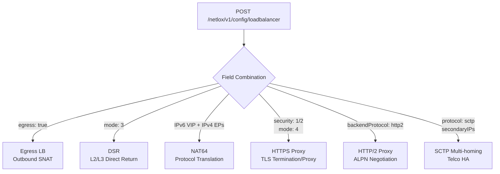

# Network Gateway Overview

!!! enterprise "Enterprise Feature"
    This feature requires loxilb-enterprise. It is not available in the community edition.
    See [Installation](../getting-started/installation.md) for enterprise binary setup.

## What is the Network Gateway?

loxilb-enterprise provides a **high-performance eBPF-accelerated network gateway** that goes far beyond basic L4 load balancing. The Network Gateway pillar covers advanced traffic patterns required in modern data centers, telco/5G networks, and cloud-native environments — from outbound traffic management and direct server return to dual-stack IPv6 translation and intelligent HTTPS proxy modes.

Where the [AI Gateway](../ai-gateway/overview.md) handles LLM routing and the [Security Gateway](../security-gateway/overview.md) enforces policy and encryption, the Network Gateway is the **high-performance data plane foundation** that all traffic flows through.

The Network Gateway covers six feature areas: outbound traffic management (Egress LB), high-performance direct return paths (DSR), dual-stack protocol translation (NAT64), intelligent HTTPS proxy modes (full proxy, SNI routing, prefix routing), HTTP/2 backend support for gRPC workloads, and SCTP multi-homing for telco high availability.

## Network Gateway Architecture

The following diagram shows how the unified load balancer API branches to different network modes based on field combinations:



## REST API Configuration

All Network Gateway features use a single unified endpoint: `POST /netlox/v1/config/loadbalancer`. Different features are activated by specific field combinations in the request body. This section documents the common API structure; feature-specific fields are documented on each feature's page.

### Feature-to-Field Mapping

| Feature | Key Fields | Example |
|---------|-----------|---------|
| [Egress LB](egress-lb.md) | `egress: true` | SNAT for outbound traffic |
| [DSR](dsr.md) | `mode: 3` | Direct Server Return |
| [NAT64](nat64.md) | IPv6 `externalIP` + IPv4 endpoints | IPv6-to-IPv4 translation |
| [HTTPS Proxy](https-proxy.md) | `security: 1` or `2`, `mode: 4` | TLS termination/E2E |
| [HTTP/2 Proxy](http2-proxy.md) | `backendProtocol: http2` | HTTP/2 backend support |
| [SCTP Multi-homing](sctp-multihoming.md) | `protocol: sctp`, `secondaryIPs` | SCTP association multi-homing |

### Common POST Structure

```bash
curl -X POST http://loxilb:11111/netlox/v1/config/loadbalancer \
  -H "Authorization: Bearer <token>" \
  -H "Content-Type: application/json" \
  -d '{
    "serviceArguments": {
      "externalIP": "<VIP>",
      "port": <port>,
      "protocol": "<tcp|udp|sctp>",
      ...feature-specific fields...
    },
    "endpoints": [
      {"endpointIP": "<backend-ip>", "targetPort": <port>, "weight": 1}
    ]
  }'

# Response (200):
# {"result": "Success"}
```

### Common Fields Reference

| Field | Type | Valid Values | Default | Description |
|-------|------|-------------|---------|-------------|
| `externalIP` | string | Any IPv4/IPv6 address | (required) | Virtual IP address for the service |
| `port` | int | 0-65535 | (required) | Service port number |
| `protocol` | string | `tcp`, `udp`, `sctp` | (required) | Transport protocol |
| `mode` | int | `0` (default NAT), `3` (DSR), `4` (fullproxy), `5` (fullnat) | `0` | Load balancer operating mode |
| `security` | int | `0` (none), `1` (HTTPS), `2` (E2EHTTPS) | `0` | TLS security mode |
| `egress` | bool | `true`, `false` | `false` | Enable egress SNAT mode |
| `backendProtocol` | string | `http1`, `http2`, `both` | `http1` | Backend ALPN protocol (fullproxy only) |
| `select` | string | `rr`, `hash`, `persist`, `n2` | `rr` | Load balancing algorithm |
| `secondaryIPs` | array | `[{"secondaryIP": "<ip>"}]` | (optional) | Additional VIPs for SCTP multi-homing |
| `host` | string | FQDN | (optional) | SNI hostname for HTTPS routing |
| `endpointIP` | string | IPv4/IPv6 address | (required) | Backend server IP |
| `targetPort` | int | 0-65535 | (required) | Backend server port |
| `weight` | int | 1-100 | `1` | Backend weight for load distribution |

This unified design means that features can be combined where appropriate — for example, HTTPS termination with HTTP/2 backend protocol, or SCTP load balancing with DSR mode. Each feature page documents which combinations are valid and which constraints apply.

## Verify

List all Network Gateway rules across all feature types:

```bash
curl http://loxilb:11111/netlox/v1/config/loadbalancer/all \
  -H "Authorization: Bearer <token>"

# Response (200): array of all LB rules
```

This returns all load balancer rules regardless of feature type (egress, DSR, HTTPS proxy, etc.).

## Feature Pages

### Traffic Management

- **[Egress Load Balancing](egress-lb.md)** — Outbound traffic routing through designated gateway nodes with source NAT. Supports loxicmd, REST API, and Kubernetes CRD configuration.
- **[Direct Server Return (DSR)](dsr.md)** — L2-DSR (MAC rewrite) and L3-DSR (IPinIP tunnel) modes for eliminating the load balancer from the return path. Critical for high-throughput workloads.
- **[NAT64](nat64.md)** — IPv6-to-IPv4 protocol translation using eBPF `bpf_skb_change_proto`. Enables IPv6-only clients to access IPv4 backend services.

### Application Layer

- **[HTTPS Proxy Modes](https-proxy.md)** — Four TLS proxy modes: termination, end-to-end, SNI routing, and URL prefix routing. Includes session persistence and mTLS integration.
- **[HTTP/2 Proxy](http2-proxy.md)** — ALPN-based HTTP/2 and gRPC backend load balancing with auto-negotiation support.

### Telco / 5G

- **[SCTP Multi-homing](sctp-multihoming.md)** — SCTP load balancing with multi-homed secondary IPs for 5G N2 interface (gNB to AMF) high availability.

## See Also

- [API Reference — Load Balancer](../reference/api.md#community-api-baseline)
- [Community API Reference (SwaggerHub)](https://app.swaggerhub.com/apis-docs/ADMIN_111/loxilb/1.0.0)
- [AI Gateway Overview](../ai-gateway/overview.md) — AI Gateway features for LLM routing and inference optimization
- [Security Gateway Overview](../security-gateway/overview.md) — Security policy enforcement, data protection, and encrypted transport
- [Getting Started](../getting-started/installation.md) — Enterprise binary installation and initial setup
