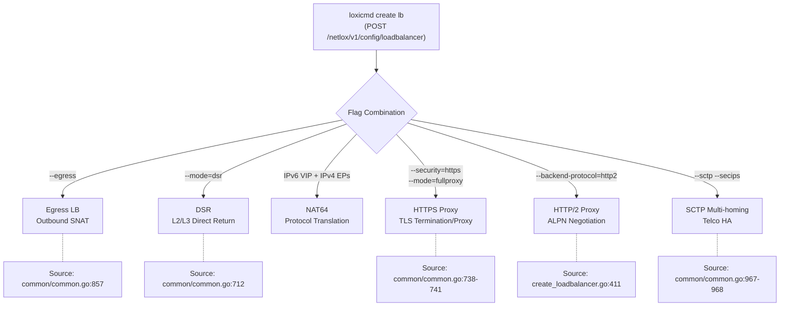

# Network Gateway Overview

!!! enterprise "Enterprise Feature"
    This feature requires loxilb-enterprise. It is not available in the community edition.
    See [Installation](../getting-started/installation.md) for enterprise binary setup.

## What is the Network Gateway?

loxilb-enterprise provides a **high-performance eBPF-accelerated network gateway** that goes far beyond basic L4 load balancing. The Network Gateway pillar covers advanced traffic patterns required in modern data centers, telco/5G networks, and cloud-native environments — from outbound traffic management and direct server return to dual-stack IPv6 translation and intelligent HTTPS proxy modes.

Where the [AI Gateway](../ai-gateway/overview.md) handles LLM routing and the [Security Gateway](../security-gateway/overview.md) enforces policy and encryption, the Network Gateway is the **high-performance data plane foundation** that all traffic flows through. Every feature documented here is configured via the unified `loxicmd create lb` command with specific flag combinations, or through the equivalent REST API at `POST /netlox/v1/config/loadbalancer`.

The Network Gateway covers six feature areas: outbound traffic management (Egress LB), high-performance direct return paths (DSR), dual-stack protocol translation (NAT64), intelligent HTTPS proxy modes (full proxy, SNI routing, prefix routing), HTTP/2 backend support for gRPC workloads, and SCTP multi-homing for telco high availability.

## Network Gateway Architecture

The following diagram shows how the unified load balancer API branches to different network modes based on flag combinations:

## Feature Summary

| Feature | Use Case | Key Flag | Page |
|---------|----------|----------|------|
| Egress LB | Outbound traffic through gateway with SNAT | `--egress` | [Egress LB](egress-lb.md) |
| DSR | Bypass LB on return path for high throughput | `--mode=dsr` | [DSR](dsr.md) |
| NAT64 | IPv6 clients accessing IPv4 backends | IPv6 VIP | [NAT64](nat64.md) |
| HTTPS Proxy | TLS termination, SNI routing, prefix routing | `--security=https` | [HTTPS Proxy](https-proxy.md) |
| HTTP/2 Proxy | gRPC and HTTP/2 backend load balancing | `--backend-protocol=http2` | [HTTP/2 Proxy](http2-proxy.md) |
| SCTP Multi-homing | 5G/telco SCTP HA with secondary IPs | `--sctp --secips` | [SCTP Multi-homing](sctp-multihoming.md) |

## Common Configuration Pattern

All Network Gateway features are configured through the same load balancer API (`POST /netlox/v1/config/loadbalancer`) with different combinations of `mode`, `security`, `backend-protocol`, and protocol flags. The `LbServiceArg` struct in `common/common.go` contains all fields; `rules.go` validates flag combinations and enforces constraints (such as DSR requiring matching service and endpoint ports).

This unified design means that features can be combined where appropriate — for example, HTTPS termination with HTTP/2 backend protocol, or SCTP load balancing with DSR mode. Each feature page documents which combinations are valid and which constraints apply.

## Feature Pages

### Traffic Management

- **[Egress Load Balancing](egress-lb.md)** — Outbound traffic routing through designated gateway nodes with source NAT. Supports loxicmd, REST API, and Kubernetes CRD configuration.
- **[Direct Server Return (DSR)](dsr.md)** — L2-DSR (MAC rewrite) and L3-DSR (IPinIP tunnel) modes for eliminating the load balancer from the return path. Critical for high-throughput workloads.
- **[NAT64](nat64.md)** — IPv6-to-IPv4 protocol translation using eBPF `bpf_skb_change_proto`. Enables IPv6-only clients to access IPv4 backend services.

### Application Layer

- **[HTTPS Proxy Modes](https-proxy.md)** — Four TLS proxy modes: termination, end-to-end, SNI routing, and URL prefix routing. Includes session persistence and mTLS integration.
- **[HTTP/2 Proxy](http2-proxy.md)** — ALPN-based HTTP/2 and gRPC backend load balancing with auto-negotiation support.

### Telco / 5G

- **[SCTP Multi-homing](sctp-multihoming.md)** — SCTP load balancing with multi-homed secondary IPs for 5G N2 interface (gNB to AMF) high availability.

## See Also

- [AI Gateway Overview](../ai-gateway/overview.md) — AI Gateway features for LLM routing and inference optimization
- [Security Gateway Overview](../security-gateway/overview.md) — Security policy enforcement, data protection, and encrypted transport
- [Getting Started](../getting-started/installation.md) — Enterprise binary installation and initial setup
