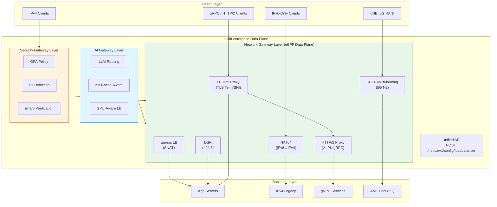
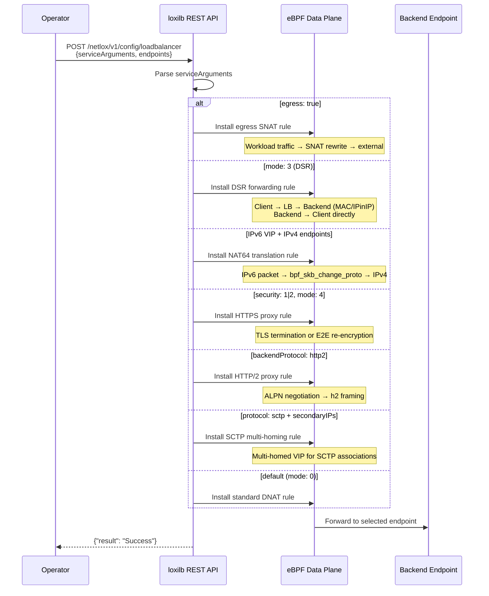

# Network Gateway Overview

!!! enterprise "Enterprise Feature"
    This feature requires loxilb-enterprise. It is not available in the community edition.
    See [Installation](../getting-started/installation.md) for enterprise binary setup.

loxilb-enterprise provides a **high-performance eBPF-accelerated network gateway** that goes far beyond basic L4 load balancing. The Network Gateway pillar covers advanced traffic patterns required in modern data centers, telco/5G networks, and cloud-native environments — from outbound traffic management and direct server return to dual-stack IPv6 translation and intelligent HTTPS proxy modes.

Where the [AI Gateway](../ai-gateway/overview.md) handles LLM routing and the [Security Gateway](../security-gateway/overview.md) enforces policy and encryption, the Network Gateway is the **high-performance data plane foundation** that all traffic flows through.

---

## Network Gateway Architecture

The Network Gateway sits at the core of the loxilb-enterprise data plane, providing the forwarding infrastructure that AI Gateway and Security Gateway features build upon:



**Key architectural principle:** The Network Gateway is the eBPF data plane that processes every packet. Security Gateway features (OPA, PII, mTLS) and AI Gateway features (LLM routing, GPU-aware balancing) are layered on top of the Network Gateway's forwarding infrastructure. All features share the same unified load balancer API.

---

## Data Plane Feature Map

The Network Gateway covers six distinct feature areas. Each is activated by specific field combinations on the unified load balancer endpoint:

| Feature | Traffic Pattern | Key Fields | Protocol | Primary Use Case |
|---------|----------------|------------|----------|------------------|
| [Egress LB](egress-lb.md) | Outbound (workload → external) | `egress: true` | TCP/UDP | Centralized egress for compliance and IP allowlisting |
| [DSR](dsr.md) | Inbound with direct return | `mode: 3` | TCP/UDP/SCTP | High-throughput services where return traffic dominates |
| [NAT64](nat64.md) | IPv6 → IPv4 translation | IPv6 `externalIP` + IPv4 endpoints | TCP/UDP/SCTP | Dual-stack migration, IPv6-only client access |
| [HTTPS Proxy](https-proxy.md) | L7 TLS proxy | `security: 1\|2`, `mode: 4` | TCP | TLS termination, SNI routing, URL prefix routing |
| [HTTP/2 Proxy](http2-proxy.md) | L7 HTTP/2 proxy | `backendProtocol: http2` | TCP | gRPC services, HTTP/2 multiplexing |
| [SCTP Multi-homing](sctp-multihoming.md) | Telco signaling | `protocol: sctp`, `secondaryIPs` | SCTP | 5G N2 interface (gNB → AMF) high availability |

---

## Unified API Design

All Network Gateway features use a single endpoint: **`POST /netlox/v1/config/loadbalancer`**. The same JSON structure serves every feature — different field combinations activate different data plane behaviors. This unified design has several advantages:

1. **One endpoint to learn** — operators use the same API for egress, DSR, NAT64, HTTPS proxy, HTTP/2, and SCTP
2. **Composable features** — valid combinations can be mixed (e.g., HTTPS termination + HTTP/2 backend, SCTP + DSR mode)
3. **Consistent monitoring** — all rules appear in `GET /netlox/v1/config/loadbalancer/all` regardless of feature type

### Request Lifecycle

The following sequence shows how a single API call flows through the loxilb data plane, branching based on field values:



### Common POST Structure

```bash
curl -X POST http://loxilb:11111/netlox/v1/config/loadbalancer \
  -H "Authorization: Bearer <token>" \
  -H "Content-Type: application/json" \
  -d '{
    "serviceArguments": {
      "externalIP": "<VIP>",
      "port": <port>,
      "protocol": "<tcp|udp|sctp>",
      ...feature-specific fields...
    },
    "secondaryIPs": [
      {"secondaryIP": "<ip>"}
    ],
    "endpoints": [
      {"endpointIP": "<backend-ip>", "targetPort": <port>, "weight": 1}
    ]
  }'

# Response (200):
# {"result": "Success"}
```

---

## Common Fields Reference

These fields are shared across all Network Gateway features. Feature-specific fields are documented on each feature page.

### Service Arguments

| Field | Type | Valid Values | Default | Description |
|-------|------|-------------|---------|-------------|
| `externalIP` | string | Any IPv4/IPv6 address | (required) | Virtual IP address for the service. IPv6 triggers NAT64 when endpoints are IPv4. |
| `port` | int | 0-65535 | (required) | Service port number. Use `0` with `egress: true` for catch-all egress rules. |
| `protocol` | string | `tcp`, `udp`, `sctp`, `icmp` | (required) | Transport protocol. `sctp` required for `secondaryIPs`. |
| `mode` | int | `0` (DNAT), `1` (onearm), `2` (fullnat), `3` (DSR), `4` (fullproxy), `5` (hostonearm) | `0` | Load balancer operating mode. Each mode determines packet transformation behavior. |
| `security` | int | `0` (plain), `1` (HTTPS termination), `2` (E2E HTTPS) | `0` | TLS security mode. `1` terminates TLS; `2` re-encrypts to backend. |
| `sel` | int | `0` (rr), `1` (hash), `2` (priority/wrr), `3` (persist), `4` (lc), `5` (n2), `6` (n3), `8` (chwbl), `9` (gpuaware), `10` (wrr-hash) | `0` | Load balancing algorithm. `5` (n2) is optimized for 5G N2/NGAP. |
| `egress` | bool | `true`, `false` | `false` | Enable egress SNAT mode for outbound traffic. |
| `backendProtocol` | string | `http1`, `http2`, `both` | `http1` | Backend ALPN protocol negotiation (fullproxy mode only). |
| `host` | string | FQDN | (optional) | SNI hostname for HTTPS routing (fullproxy mode only). |
| `pathPrefix` | string | URL path | (optional) | URL prefix for L7 routing (fullproxy mode only). |
| `pathMatchMode` | string | `disabled`, `prefix`, `exact` | `disabled` | How `pathPrefix` is matched against request URLs. |
| `sessionHeaderName` | string | HTTP header name | (optional) | Custom header for session persistence (with `sel: persist`). |
| `proxyprotocolv2` | bool | `true`, `false` | `false` | Enable PROXY protocol v2 for passing client info to backends. |
| `inactiveTimeOut` | int | seconds | (default) | Inactivity timeout for connections. |

### Secondary IPs (SCTP Multi-homing)

| Field | Type | Valid Values | Default | Description |
|-------|------|-------------|---------|-------------|
| `secondaryIPs` | array | `[{"secondaryIP": "<ip>"}]` | (optional) | Additional VIPs for SCTP multi-homing. Only valid with `protocol: sctp`. |

### Endpoints

| Field | Type | Valid Values | Default | Description |
|-------|------|-------------|---------|-------------|
| `endpointIP` | string | IPv4/IPv6 address | (required) | Backend server IP address. |
| `targetPort` | int | 0-65535 | (required) | Backend server port. Must equal service port in DSR mode. |
| `weight` | int | 1-100 | `1` | Backend weight for weighted load distribution. |

---

## Mode Compatibility Matrix

Not all field combinations are valid. This matrix shows which features can be combined:

| Feature A | Feature B | Compatible | Notes |
|-----------|-----------|:----------:|-------|
| HTTPS termination (`security: 1`) | HTTP/2 backend (`backendProtocol: http2`) | Yes | TLS terminate + h2 to backend |
| E2E HTTPS (`security: 2`) | HTTP/2 backend | Yes | Re-encrypt + h2 |
| DSR (`mode: 3`) | SCTP (`protocol: sctp`) | Yes | SCTP DSR for telco |
| DSR (`mode: 3`) | Egress (`egress: true`) | No | DSR is inbound, egress is outbound |
| Fullproxy (`mode: 4`) | SNI routing (`host`) | Yes | Requires fullproxy for L7 |
| Fullproxy (`mode: 4`) | Session persistence | Yes | Header-based affinity |
| DSR (`mode: 3`) | TLS (`security: 1\|2`) | No | DSR cannot terminate TLS |
| NAT64 (IPv6 VIP) | Any mode | Yes | Works with DNAT, DSR, fullnat |

---

## Load Balancing Algorithms

The `sel` field selects the backend selection algorithm. These algorithms apply across all Network Gateway features:

| `sel` Value | Name | Description | Best For |
|:-----------:|------|-------------|----------|
| `0` | Round Robin | Cycles through backends sequentially | General purpose, equal-capacity backends |
| `1` | Hash | Source IP hash for session affinity | Stateful services needing client-backend binding |
| `2` | WRR (Priority) | Weighted round-robin (NGINX-style smooth) | Backends with different capacities |
| `3` | Persist | HTTP header-based session persistence | Stateful web apps with custom session headers |
| `4` | Least Connections | Routes to backend with fewest active connections | Variable-latency backends |
| `5` | N2 | 5G N2 interface optimized SCTP affinity | NGAP signaling (gNB ↔ AMF) |
| `8` | CHWBL | Consistent hash with bounded loads | GPU-aware AI inference routing |
| `9` | GPU-Aware | Queue-depth scoring for GPU workloads | AI/LLM inference with heterogeneous GPUs |
| `10` | WRR-Hash | Weighted consistent hash with load tracking | Mixed-capacity GPU fleets |

The WRR algorithm uses an NGINX-style smooth distribution that avoids traffic bursts. For example, weights `[5,1,1]` produce the sequence EP0, EP0, EP1, EP0, EP2, EP0, EP0 (smooth) rather than EP0, EP0, EP0, EP0, EP0, EP1, EP2 (bursty).

---

## Health Checking

All Network Gateway features support endpoint health monitoring. Configure health checks with:

| Field | Type | Description |
|-------|------|-------------|
| `monitor` | bool | Enable health monitoring for this rule |
| `probetype` | string | Probe type: `tcp`, `udp`, `sctp`, `http`, `https`, `ping`, `none` |
| `probeport` | int | Port to probe (if different from service port) |
| `probereq` | string | Probe request string (for HTTP/HTTPS probes) |
| `proberesp` | string | Expected probe response string |
| `probeTimeout` | int | Probe timeout in seconds |
| `probeRetries` | int | Number of retries before marking unhealthy |

Unhealthy endpoints are automatically skipped during load balancing selection. The WRR algorithm skips both inactive endpoints (health check failure) and circuit breaker OPEN endpoints.

---

## Verify

List all Network Gateway rules across all feature types:

```bash
curl http://loxilb:11111/netlox/v1/config/loadbalancer/all \
  -H "Authorization: Bearer <token>"

# Response (200): array of all LB rules
```

This returns all load balancer rules regardless of feature type (egress, DSR, HTTPS proxy, etc.).

---

## Feature Pages

### Traffic Management

- **[Egress Load Balancing](egress-lb.md)** — Outbound traffic routing through designated gateway nodes with source NAT. Supports loxicmd, REST API, and Kubernetes CRD configuration.
- **[Direct Server Return (DSR)](dsr.md)** — L2-DSR (MAC rewrite) and L3-DSR (IPinIP tunnel) modes for eliminating the load balancer from the return path. Critical for high-throughput workloads.
- **[NAT64](nat64.md)** — IPv6-to-IPv4 protocol translation using eBPF `bpf_skb_change_proto`. Enables IPv6-only clients to access IPv4 backend services.

### Application Layer

- **[HTTPS Proxy Modes](https-proxy.md)** — Four TLS proxy modes: termination, end-to-end, SNI routing, and URL prefix routing. Includes session persistence and mTLS integration.
- **[HTTP/2 Proxy](http2-proxy.md)** — ALPN-based HTTP/2 and gRPC backend load balancing with auto-negotiation support.

### Telco / 5G

- **[SCTP Multi-homing](sctp-multihoming.md)** — SCTP load balancing with multi-homed secondary IPs for 5G N2 interface (gNB to AMF) high availability.

---

## See Also

- [API Reference — Load Balancer](../reference/api.md#community-api-baseline)
- [Community API Reference (SwaggerHub)](https://app.swaggerhub.com/apis-docs/ADMIN_111/loxilb/1.0.0)
- [AI Gateway Overview](../ai-gateway/overview.md) — AI Gateway features for LLM routing and inference optimization
- [Security Gateway Overview](../security-gateway/overview.md) — Security policy enforcement, data protection, and encrypted transport
- [Getting Started](../getting-started/installation.md) — Enterprise binary installation and initial setup
