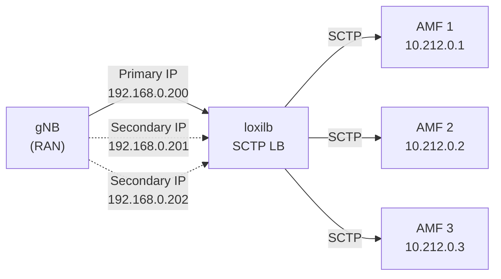

# SCTP Multi-homing

!!! enterprise "Enterprise Feature"
    This feature requires loxilb-enterprise. It is not available in the community edition.
    See [Installation](../getting-started/installation.md) for enterprise binary setup.

## Overview

SCTP (Stream Control Transmission Protocol) is essential for telco and 5G networks, particularly for control plane interfaces such as N2/NGAP between gNB (base station) and AMF (Access and Mobility Management Function). loxilb provides SCTP load balancing with multi-homing support for high availability.

SCTP multi-homing allows an SCTP association to span multiple IP addresses for redundancy. If the primary path fails, traffic automatically switches to a secondary address without disrupting the association. The `secondaryIPs` field configures secondary service IPs that participate in the SCTP association, enabling seamless failover at the gateway layer.

The `n2` load balancing selector is specifically designed for 5G N2 interface SCTP load balancing, providing optimized session affinity for NGAP signaling.

!!! warning "SCTP Only"
    The `secondaryIPs` field is restricted to SCTP protocol only. If used with TCP or UDP, loxilb returns: `Secondary IPs allowed in SCTP only`.

## Architecture

The following diagram shows a typical 5G deployment with SCTP multi-homing:



The gNB establishes an SCTP association with the loxilb VIP using both the primary IP and secondary IPs. If the primary path becomes unreachable, SCTP automatically fails over to a secondary IP. loxilb load balances the SCTP traffic across the AMF pool.

## Prerequisites

- SCTP kernel module loaded:

    ```bash
    modprobe sctp
    ```

- For 5G deployments: N2 interface connectivity between gNB and loxilb
- Multiple IP addresses assigned to the loxilb node interface for multi-homing

## REST API Configuration

### Basic SCTP Multi-homing

=== "REST API"

    ```bash
    curl -X POST http://loxilb:11111/netlox/v1/config/loadbalancer \
      -H "Authorization: Bearer <token>" \
      -H "Content-Type: application/json" \
      -d '{
        "serviceArguments": {
          "externalIP": "192.168.0.200",
          "port": 37412,
          "protocol": "sctp",
          "secondaryIPs": [
            {"secondaryIP": "192.168.0.201"},
            {"secondaryIP": "192.168.0.202"}
          ]
        },
        "endpoints": [
          {"endpointIP": "10.212.0.1", "targetPort": 38412, "weight": 1},
          {"endpointIP": "10.212.0.2", "targetPort": 38412, "weight": 1},
          {"endpointIP": "10.212.0.3", "targetPort": 38412, "weight": 1}
        ]
      }'

    # Response (200):
    # {"result": "Success"}
    ```

=== "loxicmd"

    ```bash
    # SCTP LB with multi-homing (two secondary IPs)
    loxicmd create lb 192.168.0.200 \
      --sctp=37412:38412 \
      --secips=192.168.0.201,192.168.0.202 \
      --endpoints=10.212.0.1:1,10.212.0.2:1,10.212.0.3:1
    ```

    - `192.168.0.200` — Primary VIP for the SCTP service
    - `--secips=192.168.0.201,192.168.0.202` — Secondary IPs for multi-homing
    - `--sctp=37412:38412` — SCTP service port 37412, backend target port 38412
    - `--endpoints` — AMF backend pool with equal weights

### SCTP with DSR Mode

For high-throughput SCTP workloads, DSR mode eliminates the load balancer from the return path:

=== "REST API"

    ```bash
    curl -X POST http://loxilb:11111/netlox/v1/config/loadbalancer \
      -H "Authorization: Bearer <token>" \
      -H "Content-Type: application/json" \
      -d '{
        "serviceArguments": {
          "externalIP": "192.168.0.200",
          "port": 38412,
          "protocol": "sctp",
          "mode": 3,
          "secondaryIPs": [
            {"secondaryIP": "192.168.0.201"},
            {"secondaryIP": "192.168.0.202"}
          ]
        },
        "endpoints": [
          {"endpointIP": "10.212.0.1", "targetPort": 38412, "weight": 1},
          {"endpointIP": "10.212.0.2", "targetPort": 38412, "weight": 1}
        ]
      }'

    # Response (200):
    # {"result": "Success"}
    ```

=== "loxicmd"

    ```bash
    # SCTP DSR — endpoint port must equal service port
    loxicmd create lb 192.168.0.200 \
      --sctp=38412:38412 --mode=dsr \
      --endpoints=10.212.0.1:1,10.212.0.2:1
    ```

!!! note "DSR Port Constraint"
    When using DSR with SCTP, the endpoint target port must equal the service port. See [DSR](dsr.md) for details on the port constraint and backend configuration.

### SCTP with FullNAT Mode

For 5G AMF deployments where full address translation is needed:

=== "REST API"

    ```bash
    curl -X POST http://loxilb:11111/netlox/v1/config/loadbalancer \
      -H "Authorization: Bearer <token>" \
      -H "Content-Type: application/json" \
      -d '{
        "serviceArguments": {
          "externalIP": "88.88.88.1",
          "port": 38412,
          "protocol": "sctp",
          "mode": 5
        },
        "endpoints": [
          {"endpointIP": "192.168.70.3", "targetPort": 38412, "weight": 1}
        ]
      }'

    # Response (200):
    # {"result": "Success"}
    ```

=== "loxicmd"

    ```bash
    loxicmd create lb 88.88.88.1 \
      --sctp=38412:38412 --mode=fullnat \
      --endpoints=192.168.70.3:1
    ```

FullNAT mode rewrites both source and destination addresses, allowing loxilb to operate between networks that cannot route directly to each other.

### Option Details

| Field | Type | Valid Values | Default | Description |
|-------|------|-------------|---------|-------------|
| `protocol` | string | `sctp` | (required) | Must be `sctp` for multi-homing |
| `secondaryIPs` | array | `[{"secondaryIP": "<ip>"}]` | (optional) | Additional VIPs for SCTP multi-homing associations |
| `mode` | int | `0` (default), `3` (DSR), `5` (fullnat) | `0` | Operating mode — combine with SCTP for DSR or FullNAT variants |

!!! note "`secondaryIPs` requires SCTP"
    `secondaryIPs` is only supported with `protocol: sctp`. Using it with TCP or UDP will be rejected.

!!! note "Common Fields"
    For common fields (`externalIP`, `port`, `endpoints`), see [Network Gateway Overview](overview.md).

## Verify

```bash
curl http://loxilb:11111/netlox/v1/config/loadbalancer/all \
  -H "Authorization: Bearer <token>"

# Response (200): array of LB rule objects — confirm SCTP rule exists with secondaryIPs
```

```bash
# Verify multi-homing IPs are listed in the rule
loxicmd get lb

# Check SCTP association establishment
ss -s | grep sctp
```

For DSR-specific verification, see the [DSR Verify section](dsr.md#verify). For FullNAT-specific verification, verify the `mode` value in the GET response confirms `5` (fullnat).

## Troubleshoot

**`secondaryIPs` rejected with non-SCTP protocol**
:   The `secondaryIPs` field only works with `protocol: sctp`. If used with TCP or UDP, the POST returns an error. Ensure `protocol` is set to `sctp` in the request body.

**SCTP kernel module not loaded**
:   Run `lsmod | grep sctp` — if empty, load the module with `modprobe sctp`. The SCTP kernel module is required on both the loxilb node and backend servers.

**Multi-homing failover not working**
:   Verify all secondary IPs are reachable from the client (gNB). Check that SCTP heartbeat is enabled on the client side. Use `ss -s` to confirm the SCTP association is established with multiple addresses.

## Monitoring

SCTP-specific metrics are available when Prometheus is enabled (`--prometheus` flag):

- `active_flow_count_sctp` — Active SCTP flows through the load balancer

See [Monitoring Setup](../operations/monitoring.md) for Prometheus configuration and scrape setup.

## 5G Deployment Considerations

| Interface | Protocol | Typical Port | Endpoint |
|-----------|----------|-------------|----------|
| N2 (NGAP) | SCTP | 38412 | AMF |
| N4 (PFCP) | UDP | 8805 | SMF/UPF |
| Xn | SCTP | 38422 | Neighboring gNB |

For N2 interface load balancing, the `n2` selector provides optimized session affinity that maintains NGAP signaling context across SCTP associations.

## See Also

- [API Reference — Load Balancer](../reference/api.md#community-api-baseline)
- [Community API Reference (SwaggerHub)](https://app.swaggerhub.com/apis-docs/ADMIN_111/loxilb/1.0.0)
- [DSR](dsr.md) — Direct Server Return mode details and port constraint
- [Network Gateway Overview](overview.md) — All Network Gateway features
