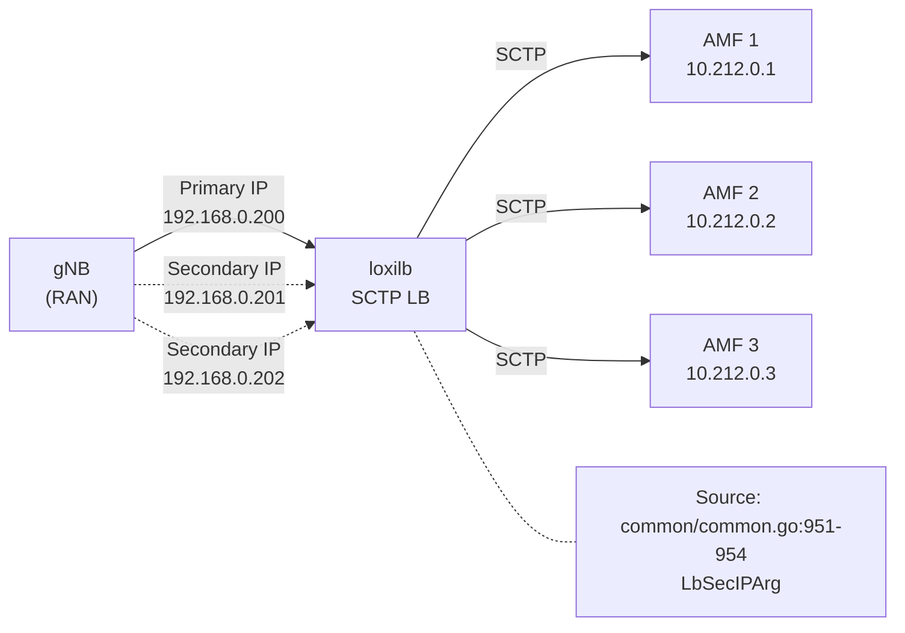

# SCTP Multi-homing

!!! enterprise "Enterprise Feature"
    This feature requires loxilb-enterprise. It is not available in the community edition.
    See [Installation](../getting-started/installation.md) for enterprise binary setup.

## Overview

SCTP (Stream Control Transmission Protocol) is essential for telco and 5G networks, particularly for control plane interfaces such as N2/NGAP between gNB (base station) and AMF (Access and Mobility Management Function). loxilb provides SCTP load balancing with multi-homing support for high availability.

SCTP multi-homing allows an SCTP association to span multiple IP addresses for redundancy. If the primary path fails, traffic automatically switches to a secondary address without disrupting the association. loxilb's `--secips` flag configures secondary service IPs that participate in the SCTP association, enabling seamless failover at the gateway layer.

Source: `common/common.go:967-968` — `SecIPs []LbSecIPArg`

The `LbSelN2` selector is specifically designed for 5G N2 interface SCTP load balancing, providing optimized session affinity for NGAP signaling.

!!! warning "SCTP Only"
    The `--secips` flag is restricted to SCTP protocol only. If used with `--tcp` or `--udp`, loxilb prints: `Secondary IPs allowed in SCTP only`.

    Source: `create_loadbalancer.go:255`

## Architecture

The following diagram shows a typical 5G deployment with SCTP multi-homing:



The gNB establishes an SCTP association with the loxilb VIP using both the primary IP and secondary IPs. If the primary path becomes unreachable, SCTP automatically fails over to a secondary IP. loxilb load balances the SCTP traffic across the AMF pool.

## Prerequisites

- SCTP kernel module loaded:

    ```bash
    modprobe sctp
    ```

- For 5G deployments: N2 interface connectivity between gNB and loxilb
- Multiple IP addresses assigned to the loxilb node interface for multi-homing

## Configuration

=== "loxicmd"

    ```bash
    # Source: create_loadbalancer.go:394,209
    # SCTP LB with multi-homing (two secondary IPs)
    loxicmd create lb 192.168.0.200 \
      --sctp=37412:38412 \
      --secips=192.168.0.201,192.168.0.202 \
      --endpoints=10.212.0.1:1,10.212.0.2:1,10.212.0.3:1
    ```

    - `192.168.0.200` — Primary VIP for the SCTP service
    - `--secips=192.168.0.201,192.168.0.202` — Secondary IPs for multi-homing
    - `--sctp=37412:38412` — SCTP service port 37412, backend target port 38412
    - `--endpoints` — AMF backend pool with equal weights

=== "REST API"

    ```json
    POST /netlox/v1/config/loadbalancer
    {
      "serviceArguments": {
        "externalIP": "192.168.0.200",
        "port": 37412,
        "protocol": "sctp",
        "secondaryIPs": [
          {"secondaryIP": "192.168.0.201"},
          {"secondaryIP": "192.168.0.202"}
        ]
      },
      "endpoints": [
        {"endpointIP": "10.212.0.1", "targetPort": 38412, "weight": 1},
        {"endpointIP": "10.212.0.2", "targetPort": 38412, "weight": 1},
        {"endpointIP": "10.212.0.3", "targetPort": 38412, "weight": 1}
      ]
    }
    ```

    <!-- Source: common/common.go:951-954 — LbSecIPArg -->

## SCTP with DSR Mode

For high-throughput SCTP workloads, DSR mode eliminates the load balancer from the return path:

```bash
# SCTP DSR — endpoint port must equal service port
loxicmd create lb 192.168.0.200 \
  --sctp=38412:38412 --mode=dsr \
  --endpoints=10.212.0.1:1,10.212.0.2:1
```

!!! note "DSR Port Constraint"
    When using DSR with SCTP, the endpoint target port must equal the service port. See [DSR](dsr.md) for details on the port constraint and backend configuration.

## SCTP with FullNAT Mode

For 5G AMF deployments where full address translation is needed:

```bash
# Source: common/common.go — fullnat mode for 5G AMF
loxicmd create lb 88.88.88.1 \
  --sctp=38412:38412 --mode=fullnat \
  --endpoints=192.168.70.3:1
```

FullNAT mode rewrites both source and destination addresses, allowing loxilb to operate between networks that cannot route directly to each other.

## Monitoring

SCTP-specific metrics are available when Prometheus is enabled (`--prometheus` flag):

- `active_flow_count_sctp` — Active SCTP flows through the load balancer
- `SCTPEvents` in conntrack statistics — SCTP association events (Source: `common/common.go:1392`)

See [Monitoring Setup](../operations/monitoring.md) for Prometheus configuration and scrape setup.

## 5G Deployment Considerations

| Interface | Protocol | Typical Port | Endpoint |
|-----------|----------|-------------|----------|
| N2 (NGAP) | SCTP | 38412 | AMF |
| N4 (PFCP) | UDP | 8805 | SMF/UPF |
| Xn | SCTP | 38422 | Neighboring gNB |

For N2 interface load balancing, the `LbSelN2` selector provides optimized session affinity that maintains NGAP signaling context across SCTP associations.

## See Also

- [DSR](dsr.md) — Direct Server Return mode details and port constraint
- [Network Gateway Overview](overview.md) — All Network Gateway features
