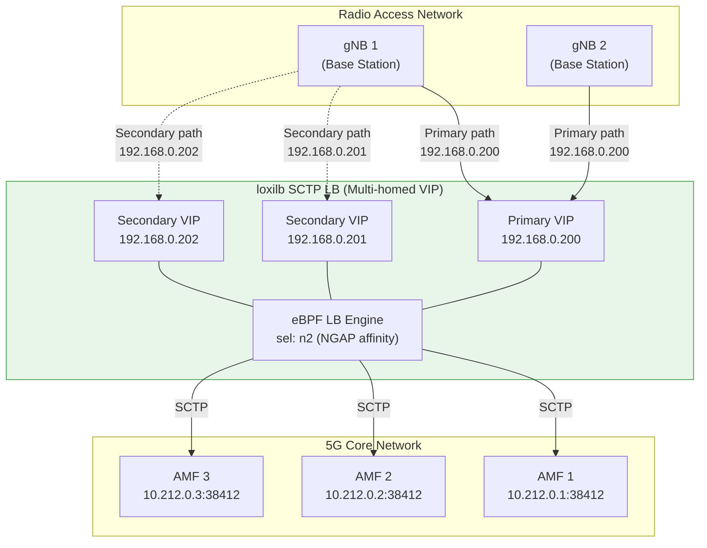
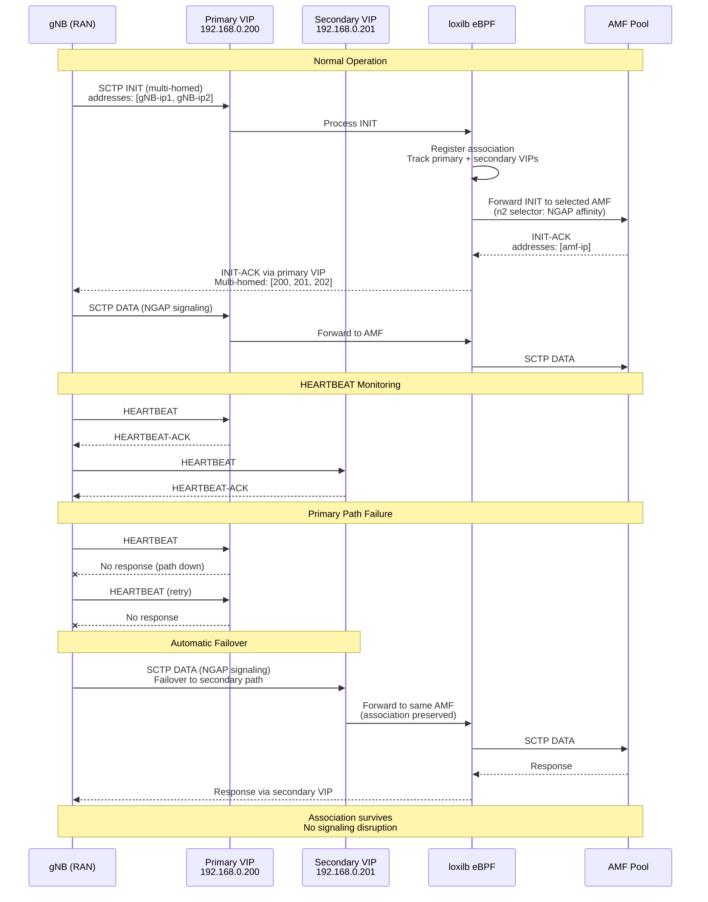
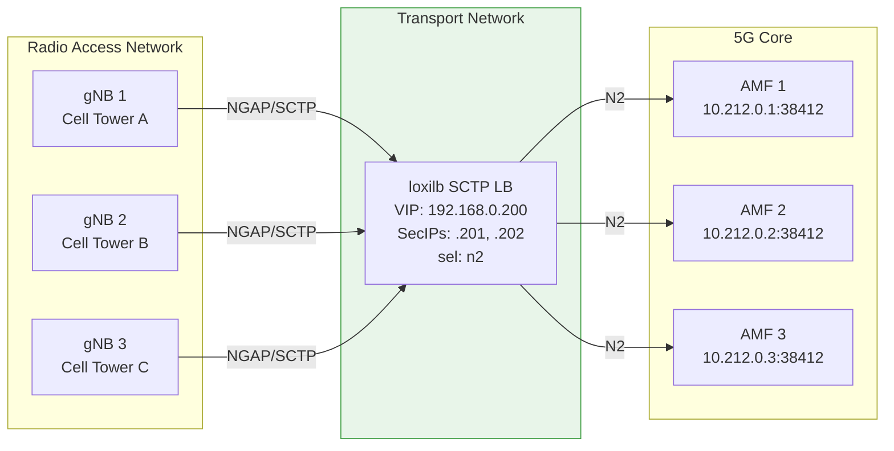
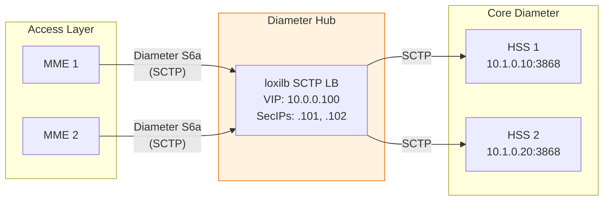

# SCTP Multi-homing

!!! enterprise "Enterprise Feature"
    This feature requires loxilb-enterprise. It is not available in the community edition.
    See [Installation](../getting-started/installation.md) for enterprise binary setup.

SCTP (Stream Control Transmission Protocol) is essential for telco and 5G networks, particularly for control plane interfaces such as N2/NGAP between gNB (base station) and AMF (Access and Mobility Management Function). loxilb provides SCTP load balancing with multi-homing support for high availability.

SCTP multi-homing allows an SCTP association to span multiple IP addresses for redundancy. If the primary path fails, traffic automatically switches to a secondary address without disrupting the association. The `secondaryIPs` field configures secondary service IPs that participate in the SCTP association, enabling seamless failover at the gateway layer.

The `n2` load balancing selector (`sel: 5`) is specifically designed for 5G N2 interface SCTP load balancing, providing optimized session affinity for NGAP signaling.

---

## How It Works Internally

### SCTP Multi-homing Architecture



When a gNB establishes an SCTP association with the loxilb VIP, it sees all three addresses (primary + secondary) as reachable endpoints for the association. SCTP HEARTBEAT messages monitor path liveness. If the primary path fails, SCTP automatically fails over to a secondary IP — the association survives without disruption.

### SCTP Failover Sequence



**Key implementation details:**

1. **`secondaryIPs` field**: When `secondaryIPs` is specified with `protocol: sctp`, loxilb registers all secondary VIP addresses as part of the SCTP service. The eBPF data plane recognizes traffic arriving on any of these addresses as belonging to the same service.

2. **SCTP-only restriction**: The `secondaryIPs` field is restricted to SCTP protocol only. If used with TCP or UDP, loxilb returns the error: `Secondary IPs allowed in SCTP only`.

3. **`n2` selector (`sel: 5`)**: The N2 selector is optimized for 5G N2 interface (NGAP) signaling. It provides session affinity that maintains NGAP context across SCTP associations, ensuring that signaling for the same UE stays on the same AMF.

4. **SCTP INIT processing**: When loxilb receives an SCTP INIT chunk, it processes the multi-homed addresses from both the client (gNB) and the response (AMF), maintaining association state that spans the primary and secondary paths.

5. **Protocol validation**: The eBPF data plane validates that `secondaryIPs` is only used with SCTP protocol, rejecting the configuration at rule creation time if a mismatch is detected.

---

## Prerequisites

- SCTP kernel module loaded:

    ```bash
    modprobe sctp
    ```

- For 5G deployments: N2 interface connectivity between gNB and loxilb
- Multiple IP addresses assigned to the loxilb node interface for multi-homing
- Verify SCTP module: `lsmod | grep sctp`

---

## REST API Configuration

### Option Details

| Field | Type | Valid Values | Default | Description |
|-------|------|-------------|---------|-------------|
| `protocol` | string | `sctp` | (required) | Must be `sctp` for multi-homing support. |
| `secondaryIPs` | array | `[{"secondaryIP": "<ip>"}]` | (optional) | Additional VIPs for SCTP multi-homing. Only valid with `protocol: sctp`. |
| `mode` | int | `0` (DNAT), `3` (DSR), `5` (fullnat) | `0` | Operating mode. DSR requires port match; fullnat rewrites both src/dst. |
| `sel` | int | `0` (rr), `1` (hash), `5` (n2) | `0` | LB algorithm. Use `5` (n2) for 5G N2/NGAP session affinity. |

!!! warning "SCTP Only"
    The `secondaryIPs` field is restricted to SCTP protocol only. If used with TCP or UDP, loxilb returns: `Secondary IPs allowed in SCTP only`.

!!! note "Common Fields"
    For common fields (`externalIP`, `port`, `endpoints`), see [Network Gateway Overview](overview.md).

### Basic SCTP Multi-homing

=== "REST API"

    ```bash
    curl -X POST http://loxilb:11111/netlox/v1/config/loadbalancer \
      -H "Authorization: Bearer <token>" \
      -H "Content-Type: application/json" \
      -d '{
        "serviceArguments": {
          "externalIP": "192.168.0.200",
          "port": 38412,
          "protocol": "sctp",
          "sel": 5
        },
        "secondaryIPs": [
          {"secondaryIP": "192.168.0.201"},
          {"secondaryIP": "192.168.0.202"}
        ],
        "endpoints": [
          {"endpointIP": "10.212.0.1", "targetPort": 38412, "weight": 1},
          {"endpointIP": "10.212.0.2", "targetPort": 38412, "weight": 1},
          {"endpointIP": "10.212.0.3", "targetPort": 38412, "weight": 1}
        ]
      }'

    # Response (200):
    # {"result": "Success"}
    ```

=== "loxicmd"

    ```bash
    # SCTP LB with multi-homing and N2 selector
    loxicmd create lb 192.168.0.200 \
      --sctp=38412:38412 --select=n2 \
      --secips=192.168.0.201,192.168.0.202 \
      --endpoints=10.212.0.1:1,10.212.0.2:1,10.212.0.3:1
    ```

    - `192.168.0.200` — Primary VIP for the SCTP service
    - `--secips=192.168.0.201,192.168.0.202` — Secondary IPs for multi-homing
    - `--sctp=38412:38412` — SCTP port 38412 (standard NGAP port)
    - `--select=n2` — 5G N2 interface optimized selector
    - `--endpoints` — AMF backend pool with equal weights

### SCTP with DSR Mode

For high-throughput SCTP workloads, DSR mode eliminates the load balancer from the return path:

=== "REST API"

    ```bash
    curl -X POST http://loxilb:11111/netlox/v1/config/loadbalancer \
      -H "Authorization: Bearer <token>" \
      -H "Content-Type: application/json" \
      -d '{
        "serviceArguments": {
          "externalIP": "192.168.0.200",
          "port": 38412,
          "protocol": "sctp",
          "mode": 3
        },
        "secondaryIPs": [
          {"secondaryIP": "192.168.0.201"},
          {"secondaryIP": "192.168.0.202"}
        ],
        "endpoints": [
          {"endpointIP": "10.212.0.1", "targetPort": 38412, "weight": 1},
          {"endpointIP": "10.212.0.2", "targetPort": 38412, "weight": 1}
        ]
      }'
    ```

=== "loxicmd"

    ```bash
    # SCTP DSR — endpoint port must equal service port
    loxicmd create lb 192.168.0.200 \
      --sctp=38412:38412 --mode=dsr \
      --secips=192.168.0.201,192.168.0.202 \
      --endpoints=10.212.0.1:1,10.212.0.2:1
    ```

!!! note "DSR Port Constraint"
    When using DSR with SCTP, the endpoint target port must equal the service port. See [DSR](dsr.md) for details on the port constraint and backend configuration.

### SCTP with FullNAT Mode

For 5G AMF deployments where full address translation is needed:

=== "REST API"

    ```bash
    curl -X POST http://loxilb:11111/netlox/v1/config/loadbalancer \
      -H "Authorization: Bearer <token>" \
      -H "Content-Type: application/json" \
      -d '{
        "serviceArguments": {
          "externalIP": "88.88.88.1",
          "port": 38412,
          "protocol": "sctp",
          "mode": 5
        },
        "endpoints": [
          {"endpointIP": "192.168.70.3", "targetPort": 38412, "weight": 1}
        ]
      }'
    ```

=== "loxicmd"

    ```bash
    loxicmd create lb 88.88.88.1 \
      --sctp=38412:38412 --mode=fullnat \
      --endpoints=192.168.70.3:1
    ```

FullNAT mode rewrites both source and destination addresses, allowing loxilb to operate between networks that cannot route directly to each other.

---

## Deployment Scenarios

### Scenario 1: 5G N2 Interface (gNB to AMF)

The primary telco use case: multiple gNBs send NGAP signaling through loxilb to an AMF pool. Multi-homing ensures that if a network path fails, the SCTP association survives and signaling continuity is maintained.



**Configuration:**

```bash
# 5G N2 interface — SCTP multi-homing with N2 selector
curl -X POST http://loxilb:11111/netlox/v1/config/loadbalancer \
  -H "Authorization: Bearer <token>" \
  -H "Content-Type: application/json" \
  -d '{
    "serviceArguments": {
      "externalIP": "192.168.0.200",
      "port": 38412,
      "protocol": "sctp",
      "sel": 5
    },
    "secondaryIPs": [
      {"secondaryIP": "192.168.0.201"},
      {"secondaryIP": "192.168.0.202"}
    ],
    "endpoints": [
      {"endpointIP": "10.212.0.1", "targetPort": 38412, "weight": 1},
      {"endpointIP": "10.212.0.2", "targetPort": 38412, "weight": 1},
      {"endpointIP": "10.212.0.3", "targetPort": 38412, "weight": 1}
    ]
  }'
```

**Why multi-homing matters for 5G:** The N2 interface carries control plane signaling (attach, handover, paging). If an SCTP association drops, all UEs served by that gNB-AMF pair lose connectivity until re-establishment. Multi-homing provides path redundancy that prevents association loss during network failures.

### Scenario 2: Diameter/SIP Signaling (Legacy Telco)

SCTP load balancing for legacy telco protocols that use SCTP for transport — Diameter S6a (HSS ↔ MME), SIP over SCTP, and SS7/SIGTRAN.



**Configuration:**

```bash
# Diameter S6a hub — SCTP multi-homing for HSS access
curl -X POST http://loxilb:11111/netlox/v1/config/loadbalancer \
  -H "Authorization: Bearer <token>" \
  -H "Content-Type: application/json" \
  -d '{
    "serviceArguments": {
      "externalIP": "10.0.0.100",
      "port": 3868,
      "protocol": "sctp"
    },
    "secondaryIPs": [
      {"secondaryIP": "10.0.0.101"},
      {"secondaryIP": "10.0.0.102"}
    ],
    "endpoints": [
      {"endpointIP": "10.1.0.10", "targetPort": 3868, "weight": 1},
      {"endpointIP": "10.1.0.20", "targetPort": 3868, "weight": 1}
    ]
  }'
```

**Difference from 5G scenario:** Diameter uses standard round-robin (`sel: 0`) rather than the N2 selector (`sel: 5`), since Diameter does not have NGAP-specific session requirements.

---

## SCTP vs TCP Comparison

| Feature | SCTP | TCP |
|---------|------|-----|
| Multi-homing | Native — multiple IPs per association | Not supported |
| Multi-streaming | Multiple independent streams per association | Single byte stream |
| Message boundaries | Preserved (message-oriented) | Not preserved (byte stream) |
| Head-of-line blocking | Per-stream only | Entire connection |
| Connection setup | 4-way handshake (SYN-flood resistant) | 3-way handshake |
| Path failover | Automatic (HEARTBEAT monitoring) | Application must reconnect |

SCTP is preferred for telco signaling because multi-homing provides automatic path failover, and multi-streaming prevents a slow message on one stream from blocking messages on other streams.

---

## 5G Interface Reference

| Interface | Protocol | Typical Port | Endpoint | Use Case |
|-----------|----------|-------------|----------|----------|
| N2 (NGAP) | SCTP | 38412 | AMF | gNB ↔ AMF signaling |
| N4 (PFCP) | UDP | 8805 | SMF/UPF | Session management |
| Xn | SCTP | 38422 | Neighboring gNB | Inter-gNB handover |
| S1-MME | SCTP | 36412 | MME | 4G evolved gNB ↔ MME |

For N2 interface load balancing, the `n2` selector (`sel: 5`) provides optimized session affinity that maintains NGAP signaling context across SCTP associations.

---

## Monitoring

SCTP-specific metrics are available when Prometheus is enabled (`--prometheus` flag):

- `active_flow_count_sctp` — Active SCTP flows through the load balancer

See [Monitoring Setup](../operations/monitoring.md) for Prometheus configuration and scrape setup.

---

## Verify

```bash
curl http://loxilb:11111/netlox/v1/config/loadbalancer/all \
  -H "Authorization: Bearer <token>"

# Response (200): array of LB rule objects — confirm SCTP rule exists with secondaryIPs
```

```bash
# Verify multi-homing IPs are listed in the rule
loxicmd get lb

# Check SCTP association establishment
ss -s | grep sctp

# Verify SCTP kernel module
lsmod | grep sctp
```

---

## Troubleshoot

**`secondaryIPs` rejected with non-SCTP protocol**
:   The `secondaryIPs` field only works with `protocol: sctp`. If used with TCP or UDP, the POST returns an error. Ensure `protocol` is set to `sctp` in the request body.

**SCTP kernel module not loaded**
:   Run `lsmod | grep sctp` — if empty, load the module with `modprobe sctp`. The SCTP kernel module is required on both the loxilb node and backend servers.

**Multi-homing failover not working**
:   Verify all secondary IPs are reachable from the client (gNB). Check that SCTP heartbeat is enabled on the client side. Use `ss -s` to confirm the SCTP association is established with multiple addresses.

**Asymmetric routing blocking secondary paths**
:   In some network topologies, traffic arriving on a secondary VIP may be dropped because the return path differs from the forward path. Ensure firewalls and routers along secondary paths allow SCTP traffic and do not enforce strict path symmetry.

**HEARTBEAT timeouts causing false failovers**
:   If network jitter causes HEARTBEAT packets to be delayed, SCTP may trigger unnecessary failovers. Tune the HEARTBEAT interval on the client (gNB) side. Typical values: 30-second interval with 5-second timeout and 5 retries.

---

## See Also

- [API Reference — Load Balancer](../reference/api.md#community-api-baseline)
- [Community API Reference (SwaggerHub)](https://app.swaggerhub.com/apis-docs/ADMIN_111/loxilb/1.0.0)
- [DSR](dsr.md) — Direct Server Return mode details and port constraint
- [Network Gateway Overview](overview.md) — All Network Gateway features and unified API reference
