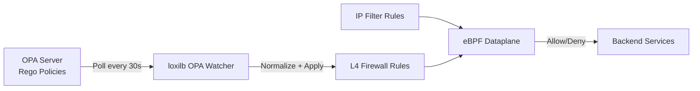
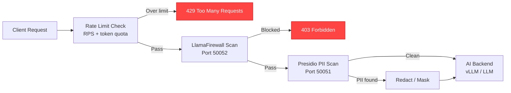
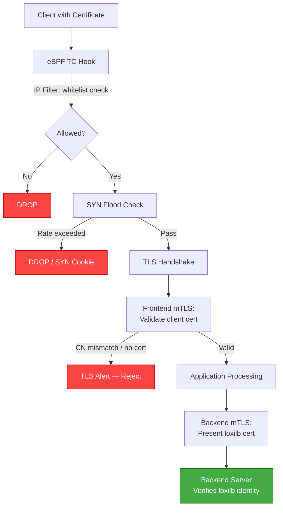
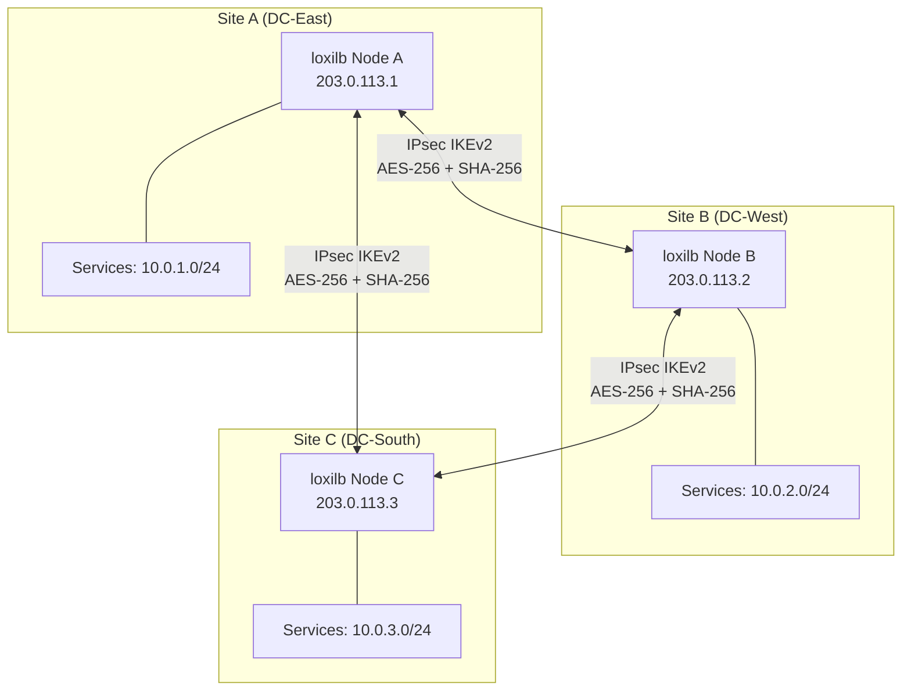
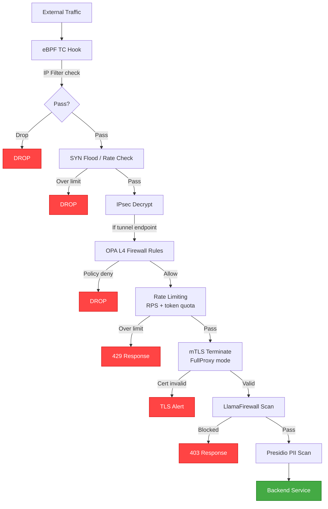

# Security Gateway Deployment Scenarios

!!! enterprise "Enterprise Feature"
    This feature requires loxilb-enterprise. It is not available in the community edition.
    See [Installation](../getting-started/installation.md) for enterprise binary setup.

## Overview

Security Gateway features can be combined in different patterns depending on deployment requirements. The following scenarios represent common enterprise architectures, progressing from single-purpose deployments to a full security gateway with all features active. Each scenario includes a Mermaid architecture diagram and complete API configuration you can copy and apply.

## Scenario Selection Guide

Use this table to choose the right deployment scenario based on your requirements:

| I need... | Recommended Scenario |
|-----------|---------------------|
| Network policy only (ACLs, segmentation) | [Scenario 1: OPA-Driven Network Firewall](#scenario-1-opa-driven-network-firewall) |
| AI/LLM protection (prompt injection, PII, cost) | [Scenario 2: AI Security Gateway](#scenario-2-ai-security-gateway) |
| mTLS zero-trust + IP filtering | [Scenario 3: mTLS Zero-Trust Gateway](#scenario-3-mtls-zero-trust-gateway) |
| Encryption in transit between sites | [Scenario 4: Multi-Site Encrypted Mesh](#scenario-4-multi-site-encrypted-mesh) |
| Maximum security (all controls active) | [Scenario 5: Full Enterprise Security Gateway](#scenario-5-full-enterprise-security-gateway) |

### Feature Matrix

| Feature | Scenario 1 | Scenario 2 | Scenario 3 | Scenario 4 | Scenario 5 |
|---------|:----------:|:----------:|:----------:|:----------:|:----------:|
| OPA Policy | **Active** | — | — | — | **Active** |
| IP Filtering | **Active** | — | **Active** | — | **Active** |
| Rate Limiting | — | **Active** | — | — | **Active** |
| LlamaFirewall | — | **Active** | — | — | **Active** |
| Presidio PII | — | **Active** | — | — | **Active** |
| mTLS | — | — | **Active** | — | **Active** |
| SYN Flood | — | — | **Active** | **Active** | **Active** |
| IPsec | — | — | — | **Active** | **Active** |

### Compliance Mapping

| Compliance | Required Features | Recommended Scenario |
|-----------|-------------------|---------------------|
| PCI-DSS | Encryption in transit, access controls | Scenario 4 or 5 |
| HIPAA | PHI protection, encryption, audit | Scenario 5 |
| SOC 2 | Access controls, monitoring | Scenario 1 + 3 |
| GDPR/CCPA | PII detection and redaction | Scenario 2 or 5 |
| Zero Trust | Mutual authentication, identity verification | Scenario 3 or 5 |

---

## Scenario 1: OPA-Driven Network Firewall

**Features active:** OPA Watcher + L4 Firewall Rules + IP Filtering

**When to choose this:** You need centralized, auditable network policy management. Security teams define firewall policies in Rego (version-controlled, reviewable), and loxilb automatically enforces them as L4 firewall rules.



### Complete Configuration

```bash
# Step 1: Enable OPA watcher
curl -X POST http://loxilb:11111/netlox/v1/config/opa/watcher \
  -H "Authorization: Bearer <token>" \
  -H "Content-Type: application/json" \
  -d '{
    "opa_url": "http://opa-server:8181",
    "policy_path": "loxilb/l4",
    "poll_interval_sec": 30,
    "fail_open": false,
    "initial_delay_sec": 10,
    "loxilb_url": "http://localhost:11111"
  }'

# Step 2: Add IP filter rules
curl -X POST http://loxilb:11111/netlox/v1/config/ipfilter \
  -H "Authorization: Bearer <token>" \
  -H "Content-Type: application/json" \
  -d '{"filterType": "whitelist", "cidr": "10.0.0.0/8", "zone": 0, "priority": 100, "action": "allow"}'

curl -X POST http://loxilb:11111/netlox/v1/config/ipfilter \
  -H "Authorization: Bearer <token>" \
  -H "Content-Type: application/json" \
  -d '{"filterType": "blacklist", "cidr": "192.0.2.0/24", "zone": 0, "priority": 200, "action": "drop"}'
```

### Verify

```bash
curl http://loxilb:11111/netlox/v1/config/opa/watcher -H "Authorization: Bearer <token>"
curl http://loxilb:11111/netlox/v1/config/ipfilter/all -H "Authorization: Bearer <token>"
```

---

## Scenario 2: AI Security Gateway

**Features active:** LlamaFirewall + Presidio + Rate Limiting (token quota)

**When to choose this:** You are deploying AI/LLM endpoints and need to protect against prompt injection, PII leakage, and cost overrun. This is the security layer for AI Gateway deployments.



### Complete Configuration

```bash
# Step 1: Create API key with rate limits
curl -X POST http://loxilb:11111/netlox/v1/config/ai/apikey \
  -H "Authorization: Bearer <token>" \
  -H "Content-Type: application/json" \
  -d '{
    "key_name": "production-key",
    "rate_limit_rps": 10,
    "burst_size": 20,
    "daily_token_quota": 1000000,
    "concurrent_limit": 5
  }'

# Step 2: Enable LlamaFirewall
curl -X POST http://loxilb:11111/netlox/v1/config/llamafirewall/enable \
  -H "Authorization: Bearer <token>" \
  -H "Content-Type: application/json" \
  -d '{
    "server_url": "localhost:50052",
    "timeout_sec": 15,
    "fail_closed": 0,
    "block_threshold": 0.9,
    "cache_ttl": 300
  }'

# Step 3: Configure LlamaFirewall scanners
curl -X POST http://loxilb:11111/netlox/v1/config/llamafirewall/scanners \
  -H "Authorization: Bearer <token>" \
  -H "Content-Type: application/json" \
  -d '{
    "prompt_guard": true,
    "code_shield": true,
    "regex": true,
    "hidden_ascii": true,
    "agent_alignment": false,
    "pii_detection": false
  }'

# Step 4: Enable Presidio PII detection
curl -X POST http://loxilb:11111/netlox/v1/config/pii/enable \
  -H "Authorization: Bearer <token>" \
  -H "Content-Type: application/json" \
  -d '{"presidio_url": "http://localhost:50051"}'

curl -X POST http://loxilb:11111/netlox/v1/config/pii/configure \
  -H "Authorization: Bearer <token>" \
  -H "Content-Type: application/json" \
  -d '{
    "score_threshold": 0.7,
    "entities": ["PHONE_NUMBER", "EMAIL_ADDRESS", "CREDIT_CARD", "US_SSN"],
    "action": "redact",
    "direction": "both"
  }'
```

### Verify

```bash
curl http://loxilb:11111/netlox/v1/config/llamafirewall/status -H "Authorization: Bearer <token>"
curl http://loxilb:11111/netlox/v1/config/pii/status -H "Authorization: Bearer <token>"
```

!!! warning "Port allocation"
    LlamaFirewall (50052) and Presidio (50051) must run on different ports. Verify port assignments when deploying both services.

---

## Scenario 3: mTLS Zero-Trust Gateway

**Features active:** mTLS (frontend + backend) + IP Filtering + SYN Flood Protection

**When to choose this:** You need per-service mutual authentication with certificate-based identity, combined with eBPF-level DDoS protection. Common in financial services and healthcare.



### Complete Configuration

```bash
# Step 1: IP filtering — whitelist trusted ranges
curl -X POST http://loxilb:11111/netlox/v1/config/ipfilter \
  -H "Authorization: Bearer <token>" \
  -H "Content-Type: application/json" \
  -d '{"filterType": "whitelist", "cidr": "10.0.0.0/8", "zone": 0, "priority": 100, "action": "allow"}'

# Step 2: SYN flood protection
curl -X POST http://loxilb:11111/netlox/v1/config/securityrate \
  -H "Authorization: Bearer <token>" \
  -H "Content-Type: application/json" \
  -d '{
    "synEnabled": true, "synThreshold": 100, "cookieThreshold": 50,
    "connRateEnabled": true, "ratePerSec": 50, "concurrentLimit": 200,
    "udpEnabled": false, "udpPktThreshold": 0, "udpBandwidthMB": 0,
    "whitelistIps": ["10.0.0.0/8"]
  }'

# Step 3: Create HTTPS LB rule with full mTLS
curl -X PUT http://loxilb:11111/netlox/v1/config/loadbalancer/zero-trust-svc \
  -H "Authorization: Bearer <token>" \
  -H "Content-Type: application/json" \
  -d '{
    "name": "zero-trust-svc",
    "host": "api.internal.corp.com",
    "port": 443,
    "protocol": "https",
    "mode": 4,
    "security": 2,
    "mtls_frontend": {
      "client_cert_mode": "required",
      "client_ca_path": "/opt/loxilb/cert/internal_ca.crt",
      "require_client_cn": true,
      "client_cn_pattern": "*.internal.corp.com"
    },
    "mtls_backend": {
      "verify_server_cert": true,
      "backend_ca_path": "/opt/loxilb/cert/internal_ca.crt",
      "client_cert_path": "/opt/loxilb/cert/loxilb.crt",
      "client_key_path": "/opt/loxilb/cert/loxilb.key"
    },
    "endpoints": [
      {"ep_address": "10.0.1.10", "ep_port": 8443},
      {"ep_address": "10.0.1.11", "ep_port": 8443}
    ]
  }'
```

### Verify

```bash
curl http://loxilb:11111/netlox/v1/config/loadbalancer/zero-trust-svc -H "Authorization: Bearer <token>"
curl http://loxilb:11111/netlox/v1/config/securityrate/all -H "Authorization: Bearer <token>"
curl http://loxilb:11111/netlox/v1/config/ipfilter/all -H "Authorization: Bearer <token>"
```

---

## Scenario 4: Multi-Site Encrypted Mesh

**Features active:** IPsec tunnels between all sites + SYN Flood Protection

**When to choose this:** You need encrypted connectivity between data centers or cluster nodes for regulatory compliance (PCI-DSS, HIPAA), with DDoS protection at each site.



### Complete Configuration (Site A)

```bash
# Step 1: SYN flood protection at edge
curl -X POST http://loxilb:11111/netlox/v1/config/securityrate \
  -H "Authorization: Bearer <token>" \
  -H "Content-Type: application/json" \
  -d '{
    "synEnabled": true, "synThreshold": 500, "cookieThreshold": 250,
    "connRateEnabled": true, "ratePerSec": 200, "concurrentLimit": 1000,
    "udpEnabled": true, "udpPktThreshold": 5000, "udpBandwidthMB": 500,
    "whitelistIps": ["203.0.113.2/32", "203.0.113.3/32"]
  }'

# Step 2: IPsec tunnel to Site B
curl -X POST http://loxilb:11111/netlox/v1/config/ipsec/tunnels \
  -H "Authorization: Bearer <token>" \
  -H "Content-Type: application/json" \
  -d '{
    "name": "siteA-to-siteB",
    "local_ip": "203.0.113.1",
    "remote_ip": "203.0.113.2",
    "auth_method": "psk",
    "ike_version": 2,
    "encryption": "aes256",
    "integrity": "sha256",
    "dh_group": "modp2048",
    "esp_encryption": "aes256",
    "esp_integrity": "sha256",
    "local_subnet": "10.0.1.0/24",
    "remote_subnet": "10.0.2.0/24",
    "auto": "start"
  }'

# Step 3: IPsec tunnel to Site C
curl -X POST http://loxilb:11111/netlox/v1/config/ipsec/tunnels \
  -H "Authorization: Bearer <token>" \
  -H "Content-Type: application/json" \
  -d '{
    "name": "siteA-to-siteC",
    "local_ip": "203.0.113.1",
    "remote_ip": "203.0.113.3",
    "auth_method": "psk",
    "ike_version": 2,
    "encryption": "aes256",
    "integrity": "sha256",
    "dh_group": "modp2048",
    "esp_encryption": "aes256",
    "esp_integrity": "sha256",
    "local_subnet": "10.0.1.0/24",
    "remote_subnet": "10.0.3.0/24",
    "auto": "start"
  }'
```

### Verify

```bash
curl http://loxilb:11111/netlox/v1/config/ipsec/tunnels/all -H "Authorization: Bearer <token>"
# Check that each tunnel shows "status": "established"
```

!!! tip "IPsec performance"
    Enable `hw_offload_enabled: true` in global IPsec config if QAT or DPAA2 hardware is available. This reduces crypto CPU overhead by 80-90% for high-throughput encrypted tunnels.

---

## Scenario 5: Full Enterprise Security Gateway

**Features active:** All Security Gateway features combined

**When to choose this:** Maximum security posture for regulated industries (finance, healthcare, government). Every security layer is active — eBPF filtering, IPsec encryption, OPA policy enforcement, rate limiting, mTLS, content inspection.



### Processing Order

When all features are active, requests pass through security checks in this order:

1. **eBPF IP Filter** — Fastest check, kernel-level, O(log 32) LPM trie lookup
2. **eBPF SYN Flood / Rate** — Kernel-level SYN cookie and rate limiting
3. **IPsec Decrypt** — L3 tunnel decryption (if applicable)
4. **OPA L4 Firewall** — Policy-driven L4 rules from OPA
5. **API Rate Limiting** — Per-key RPS, burst, and token quota
6. **mTLS** — Certificate validation and mutual authentication
7. **LlamaFirewall** — AI safety scanning (prompt injection, code shield)
8. **Presidio PII** — PII detection and redaction

Each layer is independently configurable. Disabling any layer removes it from the pipeline without affecting others.

### Resource Planning

| Service | Port | CPU | Memory | Notes |
|---------|------|-----|--------|-------|
| loxilb core | 11111 | 2-4 cores | 1-2 GB | Main process |
| OPA Server | 8181 | 0.5 core | 256 MB | Low resource usage |
| Presidio Analyzer | 50051 | 1-2 cores | 512 MB-1 GB | NER models loaded in memory |
| LlamaFirewall | 50052 | 1-2 cores | 512 MB-1 GB | Scanner models loaded in memory |
| strongSwan (IPsec) | — | 1-2 cores | 256 MB | CPU for crypto (offload available) |

### Verify All Components

```bash
# eBPF layer
curl http://loxilb:11111/netlox/v1/config/ipfilter/all -H "Authorization: Bearer <token>"
curl http://loxilb:11111/netlox/v1/config/securityrate/all -H "Authorization: Bearer <token>"

# IPsec layer
curl http://loxilb:11111/netlox/v1/config/ipsec/tunnels/all -H "Authorization: Bearer <token>"

# Policy layer
curl http://loxilb:11111/netlox/v1/config/opa/watcher -H "Authorization: Bearer <token>"

# Content inspection layer
curl http://loxilb:11111/netlox/v1/config/llamafirewall/status -H "Authorization: Bearer <token>"
curl http://loxilb:11111/netlox/v1/config/pii/status -H "Authorization: Bearer <token>"
```

---

## Progressive Deployment

These scenarios are not mutually exclusive — you can start with a simple scenario and add features progressively:

```
Scenario 1 (OPA + IP Filter)
    ↓ Add mTLS for zero-trust
Scenario 3 (mTLS + IP Filter + SYN Flood)
    ↓ Add IPsec for encryption
Scenario 4 features added
    ↓ Add AI security for LLM endpoints
Scenario 5 (Full Enterprise)
```

!!! tip "Start simple, add incrementally"
    Each Security Gateway feature is independently configurable. Start with the scenario that addresses your primary security requirement, then add layers as compliance needs grow. The features compose cleanly — adding a new layer does not require reconfiguring existing ones.

## See Also

- [Security Gateway Overview](overview.md) — Feature map, fail-mode table, port allocation
- [Secure Dataplane Overview](secure-dataplane.md) — How IPsec, mTLS, and eBPF layers combine
- [Configuration Reference](configuration-reference.md) — Quick-reference for all config fields
- [Full API Reference](../reference/api.md) — Complete REST API documentation
