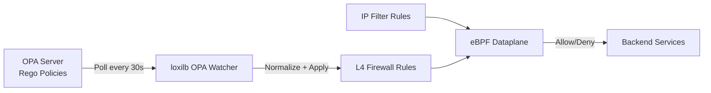
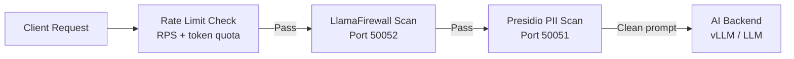
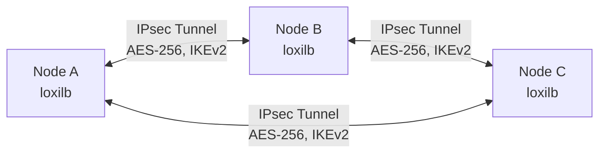
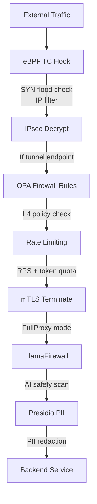

# Security Gateway Deployment Scenarios

!!! enterprise "Enterprise Feature"
    This feature requires loxilb-enterprise. It is not available in the community edition.
    See [Installation](../getting-started/installation.md) for enterprise binary setup.

## Overview

Security Gateway features can be combined in different patterns depending on deployment requirements. The following four scenarios represent common enterprise architectures, progressing from single-purpose deployments to a full security gateway with all features active.

## Scenario 1: OPA-Driven Network Firewall

**Features active:** OPA Watcher + L4 Firewall Rules + IP Filtering

**Use case:** Centralized policy management for network segmentation. Security teams define firewall policies in Rego (version-controlled, reviewable), and loxilb automatically enforces them as L4 firewall rules.

**Key configuration:**

- OPA watcher: `opa_url`, `policy_path: loxilb/l4`, `fail_open: false` (fail-closed)
- IP filtering: Blacklist known-bad CIDRs, whitelist trusted ranges
- No encryption or content inspection needed

**Best for:** Organizations that need centralized, auditable network policy management without the complexity of content inspection or encryption.

## Scenario 2: AI Security Gateway

**Features active:** LlamaFirewall + Presidio + Rate Limiting (token quota)

**Use case:** Protecting AI/LLM endpoints from prompt injection, PII leakage, and cost overrun. This is the security layer for AI Gateway deployments.

**Key configuration:**

- Rate limiting: `rate_limit_rps`, `burst_size`, `tokens_per_min` per API key
- LlamaFirewall: Port 50052, `fail_closed: false` (fail-open default)
- Presidio: Port 50051, shared memory config at `/dev/shm/loxilb_presidio_config`

!!! warning "Port allocation"
    LlamaFirewall (50052) and Presidio (50051) must run on different ports. Verify port assignments when deploying both services.

**Best for:** Organizations deploying AI/LLM services that need to protect against prompt injection, enforce PII compliance (GDPR/CCPA), and control inference costs.

## Scenario 3: Encrypted Node Mesh

**Features active:** IPsec tunnels between all nodes

**Use case:** Regulatory-mandated encryption in transit between data centers or cluster nodes. All traffic between loxilb nodes is encrypted transparently via IPsec tunnels.

**Key configuration:**

- IKEv2 with AES-256 encryption, SHA-256 integrity, modp2048 DH group
- Authentication: PSK for small deployments, X.509 certificates for production
- DPD: `action: restart`, `delay: 30`, `timeout: 120` for automatic recovery
- MTU: 1400 (default, accounting for IPsec overhead)

**Best for:** Organizations with regulatory compliance requirements (PCI-DSS, HIPAA) mandating encryption in transit, or multi-site deployments needing secure connectivity between data centers.

## Scenario 4: Full Enterprise Security Gateway

**Features active:** All Security Gateway features combined

**Use case:** Maximum security posture for regulated industries (finance, healthcare, government). Every security layer is active — eBPF filtering, IPsec encryption, OPA policy enforcement, rate limiting, mTLS, content inspection.

**Resource planning:**

| Service | Port | Resource Notes |
|---------|------|----------------|
| OPA Server | 8181 | Low CPU, low memory |
| Presidio Analyzer | 50051 | Moderate CPU (NER models) |
| LlamaFirewall | 50052 | Moderate CPU (scanner models) |
| strongSwan (IPsec) | — | CPU for crypto (offload available) |

**Key considerations:**

- Enable `hwOffloadEnabled` for IPsec if QAT/DPAA2 hardware is available
- Set appropriate `fail_open` / `fail_closed` per component based on security policy
- Monitor port allocation to prevent conflicts between Presidio and LlamaFirewall
- mTLS requires `mode=4` (FullProxy) — ensure load balancer rules are configured correctly

**Best for:** Organizations in highly regulated industries that need defense-in-depth across all security layers, with full audit trails and compliance documentation.

## Choosing a Deployment Pattern

| Requirement | Recommended Scenario |
|-------------|---------------------|
| Network policy only (ACLs, segmentation) | Scenario 1: OPA-Driven Network Firewall |
| AI/LLM protection (prompt injection, PII, cost) | Scenario 2: AI Security Gateway |
| Encryption in transit (compliance) | Scenario 3: Encrypted Node Mesh |
| Regulatory compliance (all controls) | Scenario 4: Full Enterprise Security Gateway |

These scenarios are not mutually exclusive — you can start with Scenario 1 and add features progressively. The Security Gateway features are independently configurable and compose cleanly.

## See Also

- [Security Gateway Overview](overview.md) — Feature map, fail-mode table, port allocation
- [Secure Dataplane Overview](secure-dataplane.md) — How IPsec, mTLS, and eBPF layers combine
- [Configuration Reference](configuration-reference.md) — Quick-reference for all config fields
