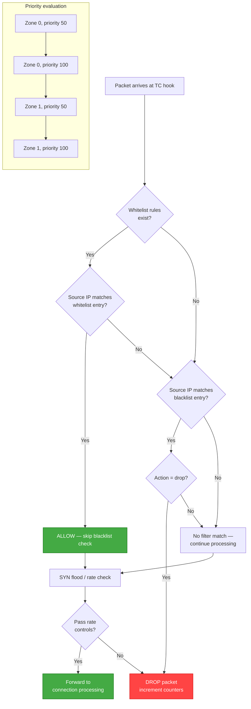

# IP Filtering

!!! enterprise "Enterprise Feature"
    This feature requires loxilb-enterprise. It is not available in the community edition.
    See [Installation](../getting-started/installation.md) for enterprise binary setup.

## What is IP Filtering?

IP filtering provides IP-based access control at the eBPF dataplane level. You can whitelist trusted CIDR ranges or blacklist known-bad IP ranges, and rules are enforced in the **kernel fast path** before any application processing occurs.

This is the first line of defense — packets matching blacklist rules are dropped at the TC hook with minimal CPU overhead. For network administrators, IP filtering provides the equivalent of edge firewall ACLs, but implemented in eBPF for high-throughput environments.

## Packet Flow Through eBPF Filter

The following diagram shows how IP filter rules are evaluated in the eBPF TC hook, including the interaction with SYN flood protection and connection processing:



!!! info "Whitelist takes precedence"
    When whitelist rules exist, a matching whitelist entry immediately allows the packet — blacklist rules are not evaluated. If no whitelist match is found, blacklist rules are checked. This ensures trusted sources are never accidentally blocked.

## REST API Configuration

### Adding a Filter Rule

```bash
curl -X POST http://loxilb:11111/netlox/v1/config/ipfilter \
  -H "Authorization: Bearer <token>" \
  -H "Content-Type: application/json" \
  -d '{
    "filterType": "blacklist",
    "cidr": "192.0.2.0/24",
    "zone": 0,
    "priority": 100,
    "action": "drop"
  }'

# Response (204): No Content — rule created successfully
```

### Field Reference

| Field | Type | Valid Values | Default | Description |
|-------|------|-------------|---------|-------------|
| `filterType` | string | `"whitelist"`, `"blacklist"` | (required) | Filter list type |
| `cidr` | string | CIDR notation (e.g., `"192.0.2.0/24"`) | (required) | IP range to filter |
| `zone` | integer (int64) | `0` to N | `0` | Security zone. `0` = all zones (global rule). |
| `priority` | integer (int64) | `> 0` (higher = more important) | `100` | Rule priority within the same zone. Higher values are evaluated first. |
| `action` | string | `"allow"`, `"drop"` | (required) | Action when rule matches |
| `packets` | integer (int64) | — | `0` | Packet counter (read-only, returned by GET) |
| `bytes` | integer (int64) | — | `0` | Byte counter (read-only, returned by GET) |

### API Operations

| Operation | Method | Endpoint | Description |
|-----------|--------|----------|-------------|
| Add filter rule | POST | `/config/ipfilter` | Create a new IP filter rule |
| Remove filter rule | DELETE | `/config/ipfilter?filterType={type}&cidr={cidr}&zone={zone}` | Remove an existing IP filter rule |
| List all filter rules | GET | `/config/ipfilter/all` | List all rules with packet/byte counters |

### Whitelist Example

Allow only trusted networks:

```bash
curl -X POST http://loxilb:11111/netlox/v1/config/ipfilter \
  -H "Authorization: Bearer <token>" \
  -H "Content-Type: application/json" \
  -d '{
    "filterType": "whitelist",
    "cidr": "10.0.0.0/8",
    "zone": 0,
    "priority": 100,
    "action": "allow"
  }'

# Response (204): No Content
```

### Blacklist Example

Block a known malicious range:

```bash
curl -X POST http://loxilb:11111/netlox/v1/config/ipfilter \
  -H "Authorization: Bearer <token>" \
  -H "Content-Type: application/json" \
  -d '{
    "filterType": "blacklist",
    "cidr": "198.51.100.0/24",
    "zone": 0,
    "priority": 200,
    "action": "drop"
  }'

# Response (204): No Content
```

## Deep Internals

### eBPF Map Storage (LPM Trie)

IP filter rules are stored in **eBPF LPM (Longest Prefix Match) trie maps** — one map for whitelist rules and one for blacklist rules. The LPM trie provides O(log n) lookup time for CIDR matching, where n is the prefix length (max 32 for IPv4). This is significantly faster than linear rule scanning used by traditional iptables.

Each map entry contains:
- **Key:** Prefix length + IP address (for LPM matching)
- **Value:** Action (allow/drop), zone, priority, atomic packet/byte counters

### Whitelist vs Blacklist Evaluation Precedence

The evaluation order in the eBPF TC hook is:

1. **Whitelist check first:** If any whitelist rules exist in the map, the source IP is looked up. A match returns `ALLOW` immediately — no blacklist check occurs.
2. **Blacklist check second:** If no whitelist match (or no whitelist rules exist), the source IP is checked against the blacklist map.
3. **Default action:** If no rule matches in either map, the packet is allowed to continue to the next processing stage (SYN flood check, connection tracking, etc.).

This "whitelist-first" design ensures that trusted IP ranges are never accidentally blocked by a broader blacklist rule.

### Zone Semantics

Zones provide logical grouping for filter rules:

- **Zone 0 (default):** Global rules that apply to all traffic regardless of interface or service.
- **Zone N (> 0):** Rules scoped to a specific network segment or service group. Useful in multi-tenant deployments where different tenants have different filter policies.

When multiple zones apply to the same packet, rules are evaluated in **zone order** (zone 0 first, then zone 1, etc.). Within the same zone, rules are evaluated by **priority** (higher values = higher priority).

### Hit Counter Tracking

Each filter rule maintains per-CPU atomic counters for packets and bytes. These counters are aggregated when read via the GET API. Per-CPU design avoids lock contention at high packet rates — each CPU core updates its own counter, and the API aggregates across all cores for the response.

### Performance Characteristics

- **Lookup time:** O(log 32) ≈ O(1) for IPv4 via LPM trie
- **No lock contention:** Per-CPU counters and RCU-protected map updates
- **Zero userspace overhead:** All filtering occurs in the eBPF TC hook before packets reach the networking stack
- **Rule capacity:** Limited by eBPF map size (configurable, default supports thousands of rules)

## Configuration Scenarios

### Scenario A: Edge Defense — Threat Feed Integration

Blacklist known threat intelligence feeds while whitelisting internal and CDN ranges. This pattern is common for internet-facing gateway deployments.

```bash
# Step 1: Whitelist internal networks and CDN ranges
curl -X POST http://loxilb:11111/netlox/v1/config/ipfilter \
  -H "Authorization: Bearer <token>" \
  -H "Content-Type: application/json" \
  -d '{"filterType": "whitelist", "cidr": "10.0.0.0/8", "zone": 0, "priority": 100, "action": "allow"}'

curl -X POST http://loxilb:11111/netlox/v1/config/ipfilter \
  -H "Authorization: Bearer <token>" \
  -H "Content-Type: application/json" \
  -d '{"filterType": "whitelist", "cidr": "172.16.0.0/12", "zone": 0, "priority": 100, "action": "allow"}'

# Step 2: Blacklist known threat ranges
curl -X POST http://loxilb:11111/netlox/v1/config/ipfilter \
  -H "Authorization: Bearer <token>" \
  -H "Content-Type: application/json" \
  -d '{"filterType": "blacklist", "cidr": "192.0.2.0/24", "zone": 0, "priority": 200, "action": "drop"}'

curl -X POST http://loxilb:11111/netlox/v1/config/ipfilter \
  -H "Authorization: Bearer <token>" \
  -H "Content-Type: application/json" \
  -d '{"filterType": "blacklist", "cidr": "198.51.100.0/24", "zone": 0, "priority": 200, "action": "drop"}'

# Step 3: Verify all rules are active
curl http://loxilb:11111/netlox/v1/config/ipfilter/all \
  -H "Authorization: Bearer <token>"
```

### Scenario B: Multi-Zone Segmentation

Different filter rules per zone for multi-tenant deployments where each tenant has its own security policy.

```bash
# Zone 1: Production environment — strict whitelist only
curl -X POST http://loxilb:11111/netlox/v1/config/ipfilter \
  -H "Authorization: Bearer <token>" \
  -H "Content-Type: application/json" \
  -d '{"filterType": "whitelist", "cidr": "10.0.1.0/24", "zone": 1, "priority": 100, "action": "allow"}'

# Zone 2: Staging environment — broader access with specific blocks
curl -X POST http://loxilb:11111/netlox/v1/config/ipfilter \
  -H "Authorization: Bearer <token>" \
  -H "Content-Type: application/json" \
  -d '{"filterType": "whitelist", "cidr": "10.0.0.0/8", "zone": 2, "priority": 100, "action": "allow"}'

curl -X POST http://loxilb:11111/netlox/v1/config/ipfilter \
  -H "Authorization: Bearer <token>" \
  -H "Content-Type: application/json" \
  -d '{"filterType": "blacklist", "cidr": "10.0.99.0/24", "zone": 2, "priority": 200, "action": "drop"}'
```

!!! tip "Zone design best practices"
    Use zone 0 for global rules that apply everywhere (e.g., blocking known bad actors). Use numbered zones for environment-specific rules. This layered approach keeps global policy separate from tenant-specific policy.

## Operations

### Listing Active Rules with Hit Counters

```bash
curl http://loxilb:11111/netlox/v1/config/ipfilter/all \
  -H "Authorization: Bearer <token>"

# Response (200):
# {
#   "ipFilterAttr": [
#     {
#       "filterType": "blacklist",
#       "cidr": "192.0.2.0/24",
#       "zone": 0,
#       "priority": 100,
#       "action": "drop",
#       "packets": 1547,
#       "bytes": 92820
#     },
#     {
#       "filterType": "whitelist",
#       "cidr": "10.0.0.0/8",
#       "zone": 0,
#       "priority": 100,
#       "action": "allow",
#       "packets": 284521,
#       "bytes": 142260500
#     }
#   ]
# }
```

### Deleting a Rule

```bash
curl -X DELETE "http://loxilb:11111/netlox/v1/config/ipfilter?filterType=blacklist&cidr=192.0.2.0/24&zone=0" \
  -H "Authorization: Bearer <token>"

# Response (204): No Content — rule deleted
```

### Rule Ordering Best Practices

1. **Use whitelist for known-good ranges** — Always whitelist your internal networks, monitoring systems, and CDN ranges first.
2. **Use blacklist for known-bad ranges** — Add threat intelligence feeds as blacklist rules with high priority.
3. **Zone 0 for global policy** — Rules that apply everywhere should use zone 0.
4. **Higher priority = more important** — Set higher priority values for rules that should take precedence within the same zone.
5. **Monitor counters regularly** — Rules with zero hit counts may be unnecessary; rules with very high hit counts may indicate active attacks.

## Troubleshoot

| Symptom | Likely Cause | Resolution |
|---------|-------------|------------|
| Rules not matching traffic | Incorrect CIDR format or wrong zone assignment | Verify CIDR notation is correct and zone matches the target interface |
| Counters not incrementing | Rule priority order incorrect or traffic not reaching the filter | Check rule priority values; verify traffic is reaching the loxilb interface |
| Whitelist bypass not working | `filterType` set to `"blacklist"` instead of `"whitelist"` | Verify `filterType` field value matches intended behavior |
| Cannot delete a rule | Query parameters missing or mismatched | DELETE requires `filterType`, `cidr`, and `zone` as query parameters — all must match exactly |
| Performance degradation with many rules | Excessive rules per zone | LPM trie is efficient, but consider consolidating overlapping CIDRs to reduce map entries |

## See Also

- [Security Controls API Reference](../reference/api.md#security-controls)
- [SYN Flood Protection](syn-flood.md) — Complementary eBPF-level DDoS mitigation
- [OPA Policy Enforcement](opa-policy-enforcement.md) — Dynamic L4 firewall rules driven by OPA policies
- [Secure Dataplane Overview](secure-dataplane.md) — How eBPF security fits in the layered architecture
- [Security Gateway Overview](overview.md) — Full Security Gateway feature map
- [Configuration Reference](configuration-reference.md) — Quick-reference for all Security Gateway config fields
