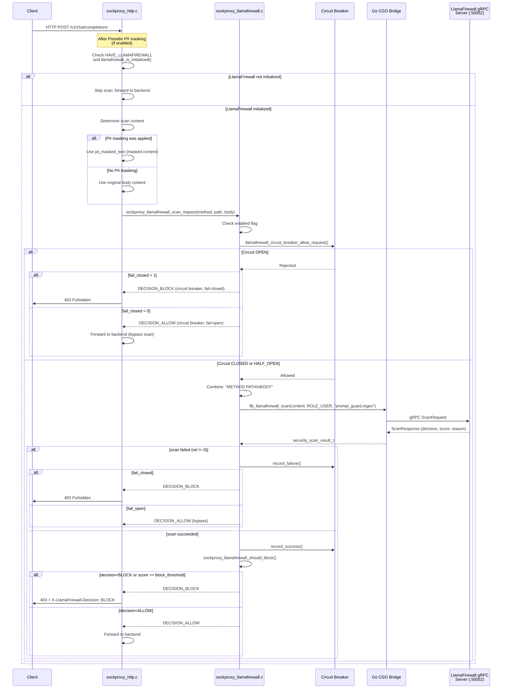

# LlamaFirewall

!!! enterprise "Enterprise Feature"
    This feature requires loxilb-enterprise. It is not available in the community edition.
    See [Installation](../getting-started/installation.md) for enterprise binary setup.

## What is LlamaFirewall?

LlamaFirewall is Meta's open-source AI safety framework that inspects LLM prompts and responses for security threats. loxilb integrates LlamaFirewall as an **inline scanner in the AI Gateway traffic path** — every request passes through LlamaFirewall before reaching the backend LLM, and every response is scanned before being returned to the client.

In the AI Gateway pipeline, LlamaFirewall sits **after Presidio PII masking but before endpoint selection**. This architecture means: Presidio masks PII first, then LlamaFirewall blocks attacks, then the backend processes safe content. Malicious prompts are blocked before they consume GPU resources, and unsafe responses are caught before reaching the client.

## LlamaFirewall Evaluation Path

The following sequence diagram shows the exact evaluation path from request arrival through content scanning to enforcement:



### Response Scanning

Response scanning uses a separate scanner set. Verified from `sockproxy_llamafirewall_scan_response()`:

- **Request scanning** (ROLE_USER): Uses `"prompt_guard,regex"` scanners — detects prompt injection and credential leakage
- **Response scanning** (ROLE_ASSISTANT): Uses `"code_shield,regex"` scanners — detects insecure generated code and credential leakage

## Threat Model

Understanding what threats LlamaFirewall protects against is essential before configuring it. Each scanner targets a specific threat vector:

| Threat | Scanner | Scan String | Description |
|--------|---------|-------------|-------------|
| **Prompt injection** | `prompt_guard` (PromptGuard) | `SCANNER_PROMPT_GUARD` | Detects attempts to override system prompts or inject malicious instructions |
| **Insecure code generation** | `code_shield` (CodeShield) | `SCANNER_CODE_SHIELD` | Identifies generated code with SQL injection, XSS, buffer overflows, hardcoded credentials |
| **Credential leakage** | `regex` (Regex) | `SCANNER_REGEX` | Detects API keys, passwords, access tokens via configurable regex patterns |
| **Hidden character attacks** | `hidden_ascii` (HiddenASCII) | `SCANNER_HIDDEN_ASCII` | Detects invisible Unicode characters (zero-width spaces, RTL overrides) |
| **Agent misalignment** | `agent_alignment` (AgentAlignment) | `SCANNER_AGENT_ALIGNMENT` | Monitors AI agent actions for unauthorized operations (off by default) |
| **PII exposure** | `pii_detection` (PII) | `SCANNER_PII_DETECTION` | Semantic PII detection (off by default — use [Presidio](presidio-pii-detection.md) instead) |

**Default enabled:** prompt_guard, code_shield, regex, hidden_ascii

**Default disabled:** agent_alignment, pii_detection

## Deep Internals

### C-Layer Implementation (sockproxy_llamafirewall.c)

The LlamaFirewall integration is implemented in `sockproxy_llamafirewall.c` (621 lines). Key implementation details verified from source:

**Global configuration structure (`llamafirewall_config_t`):**

| Field | Type | Default | Source Verification |
|-------|------|---------|-------------------|
| `server_url` | char[] | `LLAMAFIREWALL_DEFAULT_SERVER` | `g_llamafirewall_config` initialization |
| `enabled` | int | `0` (disabled) | Must call `sockproxy_llamafirewall_init()` |
| `fail_closed` | int | `0` (fail-open) | Configurable via REST API |
| `scanner_mask` | uint32 | `LLAMAFIREWALL_DEFAULT_SCANNERS` | Bitmask of enabled scanners |
| `block_threshold` | float | `LLAMAFIREWALL_DEFAULT_THRESHOLD` | Score >= threshold triggers block |

**Scan request construction:**

The `sockproxy_llamafirewall_scan_request()` function combines method, path, and body into a single content string:

```c
char content[8192];
snprintf(content, sizeof(content), "%s %s\n%s",
         method ? method : "UNKNOWN",
         path ? path : "/",
         body ? body : "");
```

This 8192-byte buffer is the maximum content size that can be scanned in a single call. Larger bodies are truncated silently.

**Decision logic (`sockproxy_llamafirewall_should_block()`):**

A request is blocked if either:

1. `result->decision == DECISION_BLOCK` — The scanner explicitly blocks
2. `result->score >= g_llamafirewall_config.block_threshold` — The confidence score exceeds the threshold

**Decision values** (verified from `sockproxy_llamafirewall_decision_str()`):

| Value | Constant | Meaning |
|-------|----------|---------|
| `0` | `DECISION_UNSPECIFIED` | No decision made |
| `1` | `DECISION_ALLOW` | Content is safe |
| `2` | `DECISION_BLOCK` | Content is blocked |
| `3` | `DECISION_HUMAN_IN_THE_LOOP` | Flagged for human review (future) |

**HTTP response on block** (verified from sockproxy_http.c, line ~4765):

When LlamaFirewall blocks a request, the proxy sends:

```
HTTP/1.1 403 Forbidden
X-LlamaFirewall-Decision: BLOCK
Content-Type: application/json

{"error":"Request blocked by LlamaFirewall","reason":"Security threat detected"}
```

### Circuit Breaker (Following Presidio Pattern)

LlamaFirewall implements an identical circuit breaker pattern to Presidio. Both use shared memory configuration for:

| Parameter | Field | Default |
|-----------|-------|---------|
| Failure threshold | `circuit_breaker_threshold` | `5` consecutive failures |
| Recovery timeout | `circuit_breaker_timeout_sec` | `60` seconds |
| Success threshold | `circuit_breaker_success_threshold` | `3` consecutive successes in HALF_OPEN |

### Statistics Tracking

Verified from `llamafirewall_stats_t` and `llamafirewall_get_stats()`:

| Metric | Description |
|--------|-------------|
| `requests_scanned` | Total requests scanned |
| `bytes_scanned` | Total bytes processed |
| `threats_detected` | Threats found (decision=BLOCK) |
| `requests_blocked` | Requests blocked |
| `scan_errors` | Scan failures |
| `fail_open_bypasses` | Requests bypassed due to fail-open |
| `fail_closed_blocks` | Requests blocked due to fail-closed |
| `circuit_breaker_opens` | Times circuit breaker opened |
| `circuit_breaker_rejects` | Requests rejected by open circuit |

### Integration in the Security Pipeline (sockproxy_http.c)

LlamaFirewall scanning occurs at line ~4700 in sockproxy_http.c, **after** Presidio PII masking:

1. Check if `HAVE_LLAMAFIREWALL` is compiled in and `llamafirewall_is_initialized()` returns true
2. Determine scan content: if `ent->pii_masked_text` exists, use the PII-masked version; otherwise use the original body
3. Call `sockproxy_llamafirewall_scan_request(method, path, scan_content, &scan_result)`
4. If `sockproxy_llamafirewall_should_block(&scan_result)` returns true: send 403 with `X-LlamaFirewall-Decision: BLOCK` header, shut down the connection
5. If allowed: continue to endpoint selection and backend forwarding

## REST API Configuration

### Enable LlamaFirewall

```bash
curl -X POST http://loxilb:11111/netlox/v1/config/llamafirewall/enable \
  -H "Authorization: Bearer <token>"

# Response (200): {"result": "Success"}
```

### Configure Scanners

```bash
curl -X POST http://loxilb:11111/netlox/v1/config/llamafirewall/scanners \
  -H "Authorization: Bearer <token>" \
  -H "Content-Type: application/json" \
  -d '{
    "scanners": [
      {"name": "prompt-injection", "enabled": true, "threshold": 0.8},
      {"name": "code-shield", "enabled": true},
      {"name": "regex", "enabled": true},
      {"name": "hidden-ascii", "enabled": true},
      {"name": "agent-alignment", "enabled": false}
    ]
  }'

# Response (200): {"result": "Success"}
```

### Scanner Field Reference

| Field | Type | Valid Values | Default | Description |
|-------|------|-------------|---------|-------------|
| `name` | string | Scanner name (see Threat Model table) | (required) | Scanner identifier |
| `enabled` | bool | `true`, `false` | varies by scanner | Whether the scanner is active |
| `threshold` | float | `0.0`–`1.0` | `0.9` | Confidence threshold for blocking |
| `fail_action` | string | `"block"`, `"allow"` | `"allow"` | Action on scanner error |

## Configuration Scenarios

### Scenario 1: Full Content Safety (Block All Threats)

Enable all scanners with fail-closed behavior. Every threat type is scanned, and any violation blocks the request. The gateway blocks traffic if LlamaFirewall is unreachable.

```bash
# Enable LlamaFirewall
curl -X POST http://loxilb:11111/netlox/v1/config/llamafirewall/enable \
  -H "Authorization: Bearer <token>"

# Configure all scanners with strict settings
curl -X POST http://loxilb:11111/netlox/v1/config/llamafirewall/scanners \
  -H "Authorization: Bearer <token>" \
  -H "Content-Type: application/json" \
  -d '{
    "scanners": [
      {"name": "prompt-injection", "enabled": true, "threshold": 0.7},
      {"name": "code-shield", "enabled": true, "threshold": 0.8},
      {"name": "regex", "enabled": true},
      {"name": "hidden-ascii", "enabled": true},
      {"name": "agent-alignment", "enabled": true, "threshold": 0.9},
      {"name": "pii-detection", "enabled": true, "threshold": 0.8}
    ],
    "fail_closed": true
  }'
```

**Key settings:** All 6 scanners enabled. Lower `threshold` (0.7) for prompt injection to catch more attacks. `fail_closed: true` blocks all traffic when LlamaFirewall is down.

**When to use:** Production AI deployments handling sensitive data where security is paramount. Combine with Presidio for defense-in-depth PII protection.

### Scenario 2: Prompt Injection Only (Focused Protection)

Enable only the prompt injection scanner. Log other violations without blocking. Allow traffic if LlamaFirewall is unavailable.

```bash
# Enable LlamaFirewall
curl -X POST http://loxilb:11111/netlox/v1/config/llamafirewall/enable \
  -H "Authorization: Bearer <token>"

# Configure focused protection
curl -X POST http://loxilb:11111/netlox/v1/config/llamafirewall/scanners \
  -H "Authorization: Bearer <token>" \
  -H "Content-Type: application/json" \
  -d '{
    "scanners": [
      {"name": "prompt-injection", "enabled": true, "threshold": 0.9},
      {"name": "code-shield", "enabled": false},
      {"name": "regex", "enabled": true, "fail_action": "allow"},
      {"name": "hidden-ascii", "enabled": false},
      {"name": "agent-alignment", "enabled": false}
    ],
    "fail_closed": false
  }'
```

**Key settings:** Only prompt injection and regex (credential leak) scanners enabled. Higher `threshold` (0.9) reduces false positives. `fail_closed: false` preserves availability.

**When to use:** Initial deployment where you want to protect against the most critical threat (prompt injection) while minimizing latency impact from scanning.

## Deployment

LlamaFirewall runs as a **separate gRPC service** — not embedded in the loxilb process.

```bash
# Run LlamaFirewall on port 50052
docker run -d --name llamafirewall \
  -p 50052:50052 \
  meta-llama/llamafirewall:latest
```

!!! info "Port Allocation"
    LlamaFirewall defaults to port **50052** (not 50051). Port 50051 is reserved for [Presidio](presidio-pii-detection.md). If you run both services, ensure they use different ports.

## Verify

```bash
# Check LlamaFirewall status
curl http://loxilb:11111/netlox/v1/config/llamafirewall/status \
  -H "Authorization: Bearer <token>"

# Check scanning statistics
curl http://loxilb:11111/netlox/v1/config/llamafirewall/stats \
  -H "Authorization: Bearer <token>"

# Response (200):
# {
#   "total_scanned": 15420,
#   "blocked": 23,
#   "passed": 15397,
#   "by_scanner": {
#     "prompt-injection": {"scanned": 15420, "blocked": 12},
#     "regex": {"scanned": 15420, "blocked": 11}
#   }
# }
```

## Troubleshoot

| Symptom | Likely Cause | Resolution |
|---------|-------------|------------|
| Scanners not detecting threats | Scanner `enabled` is false or `threshold` too high | Check scanner config; lower `threshold` |
| High latency | Too many scanners or large payloads | Disable unused scanners; check resource allocation |
| LlamaFirewall health "unhealthy" | gRPC service unreachable or crashed | Check container status; verify port 50052 connectivity |
| Circuit breaker open | LlamaFirewall service unstable | Check service health; circuit auto-recovers after timeout |
| 403 with no threat details | `fail_closed: true` and circuit breaker open | Check circuit breaker state; fix LlamaFirewall service |

## See Also

- [LlamaFirewall API Reference](../reference/api.md#llamafirewall)
- [Security Gateway Overview](overview.md) — Full architecture diagram, fail-mode comparison, circuit breaker configuration
- [PII Detection with Presidio](presidio-pii-detection.md) — Complementary structural PII detection
- [AI Gateway Overview](../ai-gateway/overview.md) — Full traffic flow showing LlamaFirewall position in pipeline
- [Configuration Reference](configuration-reference.md) — Quick-reference for all Security Gateway config fields
