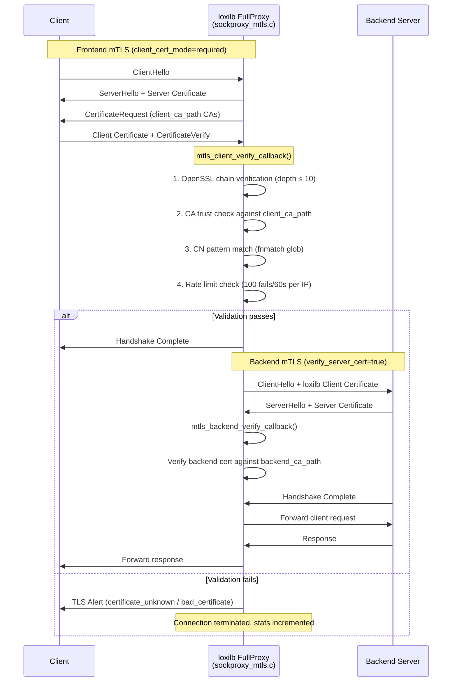

# mTLS Configuration

!!! enterprise "Enterprise Feature"
    This feature requires loxilb-enterprise. It is not available in the community edition.
    See [Installation](../getting-started/installation.md) for enterprise binary setup.

## What is mTLS in loxilb?

Mutual TLS (mTLS) requires both client and server to present certificates during the TLS handshake. In loxilb, mTLS is configured **per load balancer rule** for HTTPS FullProxy mode — enabling fine-grained authentication control at the service level.

Standard TLS only validates the server's identity (the client verifies the server's certificate). mTLS adds the reverse direction: the server also validates the client's certificate. This provides **mutual authentication** — both sides prove their identity before any data is exchanged.

!!! warning "FullProxy mode required"
    mTLS only works with `security=1` (HTTPS) or `security=2` (E2E HTTPS) and `mode=4` (FullProxy). It has **no effect** in DSR or NAT mode.

## mTLS Handshake Flow

The following diagram shows the full mTLS handshake as implemented in `sockproxy_mtls.c`, covering both frontend (client-to-loxilb) and backend (loxilb-to-upstream) authentication:



## REST API Configuration

mTLS fields (`mtls_frontend`, `mtls_backend`) are part of the load balancer service rule. They are applied when creating or updating a load balancer service:

```bash
curl -X PUT http://loxilb:11111/netlox/v1/config/loadbalancer/secure-api \
  -H "Authorization: Bearer <token>" \
  -H "Content-Type: application/json" \
  -d '{
    "name": "secure-api",
    "host": "api.corp.example.com",
    "port": 443,
    "protocol": "https",
    "mode": 4,
    "security": 1,
    "mtls_frontend": {
      "client_cert_mode": "required",
      "client_ca_path": "/opt/loxilb/cert/client_ca.crt",
      "require_client_cn": true,
      "client_cn_pattern": "*.internal.corp.example.com"
    },
    "mtls_backend": {
      "verify_server_cert": true,
      "backend_ca_path": "/opt/loxilb/cert/backend_ca.crt",
      "client_cert_path": "/opt/loxilb/cert/lb_client.crt",
      "client_key_path": "/opt/loxilb/cert/lb_client.key"
    },
    "endpoints": [
      {"ep_address": "10.0.1.10", "ep_port": 8443}
    ]
  }'

# Response (200): {"result": "Success"}
```

This configuration:

1. **Frontend:** Requires all clients to present a certificate signed by `client_ca.crt` with a CN matching `*.internal.corp.example.com`
2. **Backend:** Verifies backend server certificates against `backend_ca.crt` and presents `lb_client.crt` as loxilb's identity to backends

## Frontend mTLS (Client Certificate Validation)

Frontend mTLS controls how loxilb validates **incoming client certificates**. When a client connects to a load-balanced HTTPS service, loxilb can require and validate the client's certificate.

### Frontend Field Reference

| Field | Type | Valid Values | Default | Description |
|-------|------|-------------|---------|-------------|
| `client_cert_mode` | string | `"disabled"`, `"optional"`, `"required"` | `"disabled"` | Client certificate requirement level |
| `client_ca_path` | string | File system path | — | Path to CA bundle for validating client certs (PEM format) |
| `client_ca_cert_data` | string | Base64-encoded PEM | — | Inline CA certificate data (alternative to path, for Kubernetes secrets) |
| `require_client_cn` | bool | `true`, `false` | `false` | Enforce Common Name pattern matching on client certificates |
| `client_cn_pattern` | string | Glob pattern | — | Pattern for allowed CNs (e.g., `"*.corp.example.com"`). Only used if `require_client_cn` is `true` |

**Client certificate modes:**

| Mode | OpenSSL Flag | Behavior |
|------|-------------|----------|
| `disabled` | — | No client certificate requested. Default mode. |
| `optional` | `SSL_VERIFY_PEER` | Client certificate requested but not required — connection proceeds without one. If a cert is provided, it is validated. |
| `required` | `SSL_VERIFY_PEER \| SSL_VERIFY_FAIL_IF_NO_PEER_CERT` | Client **must** present a valid certificate signed by the CA at `client_ca_path`. Connection rejected without one. |

!!! info "Frontend mTLS requires security=1 or security=2"
    Frontend mTLS is only valid with `security=1` (HTTPS termination) or `security=2` (end-to-end HTTPS) and `mode=4` (FullProxy). The `client_cert_mode` field is silently ignored in other modes.

## Backend mTLS (Server Certificate Verification)

Backend mTLS controls how loxilb authenticates to **backend servers** and verifies their certificates. When loxilb forwards traffic to a backend, it can present its own certificate and verify the backend's certificate.

### Backend Field Reference

| Field | Type | Valid Values | Default | Description |
|-------|------|-------------|---------|-------------|
| `verify_server_cert` | bool | `true`, `false` | `false` | Validate backend server certificate (`SSL_VERIFY_PEER`). Default `false` uses `SSL_VERIFY_NONE` for backward compatibility. |
| `backend_ca_path` | string | File system path | — | CA bundle for verifying backend server certs. If empty, the system CA store (`/etc/ssl/certs/`) is used. |
| `client_cert_path` | string | File system path | — | Client certificate loxilb presents to backends |
| `client_key_path` | string | File system path | — | Private key for the client certificate |
| `client_cert_data` | string | Base64-encoded PEM | — | Inline client certificate (alternative to path) |
| `client_key_data` | string | Base64-encoded PEM | — | Inline private key (alternative to path) |

!!! warning "Backend mTLS requires security=2"
    Backend mTLS (loxilb presenting certificates to backends) is only valid with `security=2` (end-to-end HTTPS). With `security=1`, loxilb terminates TLS and connects to backends over plain HTTP.

## Deep Internals

This section documents the mTLS implementation in `sockproxy_mtls.c` for operators and developers who need to understand the verification pipeline.

### Frontend Verification Pipeline

The frontend verification is implemented through OpenSSL's verification callback mechanism:

1. **`mtls_configure_frontend()`** — Called during SSL context setup for a load balancer rule. Sets the verification mode (`SSL_VERIFY_PEER` for optional, `SSL_VERIFY_PEER | SSL_VERIFY_FAIL_IF_NO_PEER_CERT` for required), registers the callback, loads the CA bundle via `SSL_CTX_load_verify_locations()`, and sends the CA list to clients via `SSL_CTX_set_client_CA_list()`.

2. **`mtls_client_verify_callback()`** — Invoked by OpenSSL for **each certificate** in the client's chain (leaf cert at depth 0, intermediates at depth 1+, up to `MTLS_VERIFY_DEPTH_MAX=10`):
    - If OpenSSL's built-in pre-verification fails (`preverify_ok=0`), the certificate is rejected immediately.
    - At depth 0 (the end-entity certificate), additional checks run:
        - **CN pattern matching** — If `require_client_cn` is set, calls `mtls_match_cn_pattern()` which extracts the CN via `X509_NAME_get_text_by_NID()` and matches against the configured pattern using `fnmatch()` (POSIX glob syntax: `*`, `?` wildcards).
        - **Rate limiting** — `mtls_check_rate_limit()` tracks failed verification attempts per client IP. After 100 failures within a 60-second window, the IP is blocked. Uses a hash table (`uthash`) with per-IP sliding window counters.

3. **`mtls_match_cn_pattern()`** — Extracts the certificate's Common Name and matches it against the configured pattern using `fnmatch()`. Supports case-insensitive matching via `FNM_CASEFOLD` on GNU systems.

### Backend Verification Pipeline

1. **`mtls_configure_backend()`** — Configures the outbound SSL context:
    - If `verify_server_cert` is true, sets `SSL_VERIFY_PEER` and registers `mtls_backend_verify_callback()`.
    - Loads the backend CA bundle from `backend_ca_path`, or falls back to the system CA store via `SSL_CTX_set_default_verify_paths()`.
    - If `client_cert_path` and `client_key_path` are configured, loads loxilb's client certificate and private key, then verifies they match via `SSL_CTX_check_private_key()`.

2. **`mtls_backend_verify_callback()`** — Simpler than frontend: logs certificate details and rejects any certificate that fails OpenSSL pre-verification. No CN pattern matching or rate limiting on the backend path.

### SNI and Per-Connection State

When multiple load balancer rules share an SSL context (common with SNI-based routing), the mTLS configuration is resolved per-connection:

- **`sni_servername_callback()`** (in `sockproxy.c`) creates a heap-allocated `mtls_ssl_conn_state_t` snapshot of the mTLS config for the matched rule.
- This snapshot is stored in SSL ex_data (`g_ssl_proxy_arg_index`) and automatically freed by `mtls_ssl_conn_state_cleanup()` when `SSL_free()` is called.
- This design prevents use-after-free races when a load balancer rule is deleted while connections are still active.

### Certificate Chain Verification Order

OpenSSL invokes `mtls_client_verify_callback()` starting from the **root** of the chain and working down to the leaf:

1. **Depth N** (root CA) — Checked against the trust store loaded from `client_ca_path`
2. **Depth N-1** (intermediate CA) — Chain integrity verified
3. **...** (additional intermediates, up to `MTLS_VERIFY_DEPTH_MAX=10`)
4. **Depth 0** (leaf / end-entity) — CA chain verified, then CN pattern and rate limit checks run

If any certificate in the chain fails, the entire handshake is rejected. The `preverify_ok` parameter carries OpenSSL's built-in result; the callback adds CN pattern matching and rate limiting on top.

### Error Handling Behavior

| Condition | sockproxy_mtls.c Behavior |
|-----------|--------------------------|
| CA file missing or unreadable | `mtls_configure_frontend()` returns `-EINVAL`, rule creation fails |
| Client cert expired | OpenSSL pre-verification fails, callback returns 0 (reject) |
| CN mismatch | `mtls_match_cn_pattern()` returns 0, `mtls_hostname_mismatch` counter incremented |
| Rate limit exceeded | `mtls_check_rate_limit()` returns 1, `mtls_rate_limited` counter incremented |
| Backend cert/key mismatch | `SSL_CTX_check_private_key()` fails, `mtls_configure_backend()` returns `-EINVAL` |
| Backend CA path empty | System CA store used via `SSL_CTX_set_default_verify_paths()` |
| SNI rule deleted mid-connection | Per-connection `mtls_ssl_conn_state_t` snapshot remains valid until `SSL_free()` |

### Statistics Counters

The implementation tracks the following atomic counters:

| Counter | Meaning |
|---------|---------|
| `mtls_frontend_verify_success` | Client certificates successfully verified |
| `mtls_frontend_verify_failures` | Client certificate verification failures |
| `mtls_backend_verify_success` | Backend server certificates verified |
| `mtls_backend_verify_failures` | Backend certificate verification failures |
| `mtls_hostname_mismatch` | CN pattern match failures |
| `mtls_rate_limited` | Connections rejected by rate limiter |

## Configuration Scenarios

### Scenario A: Zero-Trust Internal Services

Both frontend and backend mTLS required with strict CN enforcement. Every connection is mutually authenticated end-to-end.

```bash
# Create zero-trust service with full mTLS
curl -X PUT http://loxilb:11111/netlox/v1/config/loadbalancer/zero-trust-api \
  -H "Authorization: Bearer <token>" \
  -H "Content-Type: application/json" \
  -d '{
    "name": "zero-trust-api",
    "host": "api.internal.corp.com",
    "port": 443,
    "protocol": "https",
    "mode": 4,
    "security": 2,
    "mtls_frontend": {
      "client_cert_mode": "required",
      "client_ca_path": "/opt/loxilb/cert/internal_ca.crt",
      "require_client_cn": true,
      "client_cn_pattern": "*.internal.corp.com"
    },
    "mtls_backend": {
      "verify_server_cert": true,
      "backend_ca_path": "/opt/loxilb/cert/internal_ca.crt",
      "client_cert_path": "/opt/loxilb/cert/loxilb.crt",
      "client_key_path": "/opt/loxilb/cert/loxilb.key"
    },
    "endpoints": [
      {"ep_address": "10.0.1.10", "ep_port": 8443},
      {"ep_address": "10.0.1.11", "ep_port": 8443}
    ]
  }'

# Expected response (200): {"result": "Success"}
```

!!! tip "Zero-trust best practices"
    - Use `security=2` (E2E HTTPS) so loxilb connects to backends over TLS.
    - Set `require_client_cn: true` with a strict pattern to prevent rogue certificates.
    - Use the same internal CA for both frontend and backend certificates for simpler PKI management.

### Scenario B: Optional Client Certs for Partner APIs

Frontend uses optional mode (accept connections with or without client certs), no CN enforcement. Backend mTLS presents loxilb's identity to upstream services.

```bash
# Create partner API gateway with optional client certs
curl -X PUT http://loxilb:11111/netlox/v1/config/loadbalancer/partner-api \
  -H "Authorization: Bearer <token>" \
  -H "Content-Type: application/json" \
  -d '{
    "name": "partner-api",
    "host": "api.partner.example.com",
    "port": 443,
    "protocol": "https",
    "mode": 4,
    "security": 2,
    "mtls_frontend": {
      "client_cert_mode": "optional",
      "client_ca_path": "/opt/loxilb/cert/partner_ca_bundle.crt",
      "require_client_cn": false
    },
    "mtls_backend": {
      "verify_server_cert": true,
      "backend_ca_path": "/opt/loxilb/cert/upstream_ca.crt",
      "client_cert_path": "/opt/loxilb/cert/loxilb_partner.crt",
      "client_key_path": "/opt/loxilb/cert/loxilb_partner.key"
    },
    "endpoints": [
      {"ep_address": "10.0.2.20", "ep_port": 8443}
    ]
  }'

# Expected response (200): {"result": "Success"}
```

!!! note "Optional mode use cases"
    Optional mode is useful when some clients present certificates (for enhanced access or logging) while others connect with standard TLS. The application can check whether a client certificate was presented via response headers.

## TLS Version Support

!!! note "TLS configuration is managed at the OpenSSL layer"
    TLS version and cipher suite configuration is managed at the OpenSSL layer in the C data plane (sockproxy). Contact support for cipher suite customization requirements.

## Verify

Confirm mTLS configuration is applied to a load balancer rule:

```bash
curl http://loxilb:11111/netlox/v1/config/loadbalancer/secure-api \
  -H "Authorization: Bearer <token>"

# Response (200):
# {
#   "name": "secure-api",
#   "host": "api.corp.example.com",
#   "port": 443,
#   "protocol": "https",
#   "mode": 4,
#   "security": 1,
#   "mtls_frontend": {
#     "client_cert_mode": "required",
#     "client_ca_path": "/opt/loxilb/cert/client_ca.crt",
#     "require_client_cn": true,
#     "client_cn_pattern": "*.internal.corp.example.com"
#   },
#   "mtls_backend": {
#     "verify_server_cert": true,
#     "backend_ca_path": "/opt/loxilb/cert/backend_ca.crt"
#   }
# }
```

Check that `mtls_frontend.client_cert_mode` is `"required"` and `mtls_backend.verify_server_cert` is `true` if you intend full mutual authentication.

## Troubleshoot

| Symptom | Likely Cause | Resolution |
|---------|-------------|------------|
| mTLS not working in NAT mode | Wrong load balancer mode — mTLS requires FullProxy (`mode=4`) | Ensure `mode: 4` and `security: 1` or `security: 2` in the LB rule |
| Client rejected without certificate | `client_cert_mode` is `"required"` but client not configured for mTLS | Switch to `"optional"` or configure client with proper certificate |
| CN pattern not matching | Glob pattern does not match client certificate CN | Verify `client_cn_pattern` against the actual CN using `openssl x509 -in cert.pem -noout -subject`. Pattern uses `fnmatch` glob syntax (`*`, `?`). |
| Backend certificate verification failing | CA cert path incorrect or cert chain incomplete | Check `backend_ca_path` exists and contains the correct CA; verify full cert chain with `openssl verify -CAfile backend_ca.crt server.crt` |
| Backend client cert rejected | Certificate and private key mismatch | Verify cert/key pair: `openssl x509 -noout -modulus -in cert.crt \| md5sum` must match `openssl rsa -noout -modulus -in key.pem \| md5sum` |
| Connections rate limited | More than 100 failed mTLS attempts from same IP within 60 seconds | Check client certificate validity. Rate limit resets after the 60-second window expires. |
| Empty CA list in CertificateRequest | CA bundle file format incorrect | Ensure `client_ca_path` points to a PEM-format file. DER format is not supported. |

## Testing mTLS Configuration

Use `openssl s_client` to verify frontend mTLS is working:

```bash
# Test with client certificate
openssl s_client -connect loxilb:443 \
  -cert client.crt -key client.key -CAfile ca.crt \
  -servername api.corp.example.com

# Test without client certificate (should fail if mode=required)
openssl s_client -connect loxilb:443 \
  -CAfile ca.crt -servername api.corp.example.com
```

## See Also

- [SNI Certificates API Reference](../reference/api.md#sni-certificates)
- [Secure Dataplane Overview](secure-dataplane.md) — How mTLS fits in the three-layer security architecture
- [IPsec Configuration](ipsec.md) — L3 tunnel encryption (complementary to L7 mTLS)
- [Deployment Scenarios](deployment-scenarios.md) — Full Enterprise Security Gateway deployment pattern
- [Configuration Reference](configuration-reference.md) — Quick-reference for all Security Gateway config fields
