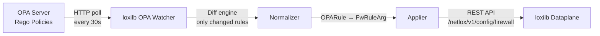

# OPA Policy Enforcement

!!! enterprise "Enterprise Feature"
    This feature requires loxilb-enterprise. It is not available in the community edition.
    See [Installation](../getting-started/installation.md) for enterprise binary setup.

## What is OPA Policy Enforcement?

Open Policy Agent (OPA) is a general-purpose policy engine. loxilb-enterprise integrates OPA as a **dynamic L4 firewall rule source** — you write policies in Rego (OPA's policy language), and loxilb automatically translates them into dataplane firewall rules.

The value of OPA integration is centralized policy management. Instead of manually configuring firewall rules on each loxilb instance, you define policies in Rego (which can live in version control), and the OPA watcher polls for changes and pushes them to the loxilb dataplane. This enables GitOps-compatible network security: policies are code, reviewed in PRs, and applied automatically.

For networking engineers unfamiliar with OPA: **Rego is like a declarative ACL language**. Instead of writing firewall rules directly (allow TCP from 10.0.0.0/8 to port 443), you write conditions that *generate* firewall rules. The OPA watcher handles the translation.

## OPA Watcher Architecture

The OPA watcher is a background process in loxilb that polls an OPA server for policy decisions and translates them into L4 firewall rules:



**Source files:**

- `pkg/opa/watcher.go` — Polling loop, WatcherConfig
- `pkg/opa/fetcher.go` — HTTP client, 5s timeout, circuit breaker guard
- `pkg/opa/normalizer.go` — Rego output (OPARule) to loxilb firewall rule (FwRuleArg) mapping
- `pkg/opa/applier.go` — REST API push to loxilb (`/netlox/v1/config/firewall`)

### Circuit Breaker

If the OPA server becomes unreachable, the circuit breaker prevents repeated failed requests:

| State | Behavior |
|-------|----------|
| **Closed** (normal) | Fetcher queries OPA server on each poll interval |
| **Open** (OPA down) | Fetcher skips OPA queries, uses last known rules |
| **Half-open** (testing) | Fetcher sends a single test query to check recovery |

Source: `pkg/opa/types.go` — CircuitBreakerState

## Configuration

### OPA Watcher — REST API

```json
// Source: pkg/opa/watcher.go:37-53, swagger.yml:9902-9921
POST /config/opa/watcher
{
  "opa_url": "http://opa:8181",
  "policy_path": "loxilb/l4",
  "poll_interval_sec": 30,
  "fail_open": false,
  "initial_delay_sec": 10,
  "loxilb_url": "http://localhost:11111",
  "state_path": "/var/lib/loxilb/opa_state.json"
}
```

**Field reference:**

| Field | Type | Default | Description |
|-------|------|---------|-------------|
| `opa_url` | string | (required) | HTTP endpoint of the OPA server |
| `policy_path` | string | `"loxilb/l4"` | Rego package path to query |
| `poll_interval_sec` | int | `30` | Seconds between policy fetches |
| `fail_open` | bool | `false` | Allow traffic when OPA is unreachable |
| `initial_delay_sec` | int | `10` | Seconds to wait before first poll |
| `loxilb_url` | string | `"http://localhost:11111"` | loxilb REST API base URL for rule push |
| `state_path` | string | `""` | File path for persisting watcher state |

!!! danger "OPA defaults to fail-closed"
    When `fail_open: false` (the default), an unreachable OPA server means **no firewall rules are updated** and existing rules remain. If the watcher has never successfully fetched policies, **no rules will be installed** and default network behavior applies.

    Set `fail_open: true` only if availability is more critical than policy enforcement. See the [fail mode comparison table](overview.md#fail-mode-reference) for how this compares to LlamaFirewall and Presidio defaults.

### Managing the Watcher

| Operation | Method | Endpoint |
|-----------|--------|----------|
| Create/update watcher | POST | `/config/opa/watcher` |
| Get watcher status | GET | `/config/opa/watcher` |
| Remove watcher | DELETE | `/config/opa/watcher` |

The GET endpoint returns `WatcherStatus` with `last_sync` timestamp, `rules_count`, and `circuit_breaker_state`.

## Writing Rego Policies for loxilb

The Rego policy package **must match** the `policy_path` configured in the watcher. The default path is `loxilb/l4`, so the Rego package declaration must be:

```rego
# Source: pkg/opa/watcher.go:33 — defaultOPAPolicy = "loxilb/l4"
package loxilb.l4

import future.keywords.in

# Allow HTTPS from internal network
firewall_access_rules[rule] {
  rule := {
    "sourceIP": "10.0.0.0/8",
    "destinationIP": "0.0.0.0/0",
    "protocol": 6,
    "minSourcePort": 0,
    "maxSourcePort": 65535,
    "minDestinationPort": 443,
    "maxDestinationPort": 443,
    "action": "allow",
    "preference": 100
  }
}

# Block SSH from external networks
firewall_access_rules[rule] {
  rule := {
    "sourceIP": "0.0.0.0/0",
    "destinationIP": "10.0.0.0/8",
    "protocol": 6,
    "minSourcePort": 0,
    "maxSourcePort": 65535,
    "minDestinationPort": 22,
    "maxDestinationPort": 22,
    "action": "deny",
    "preference": 200
  }
}
```

!!! warning "Policy path mismatch causes silent rule removal"
    The Rego package declaration **must match** `policy_path`. If your policy uses `package policy.firewall` but `policy_path` is `loxilb/l4`, the watcher will fetch empty results and **silently remove all firewall rules**. This is the most common misconfiguration.

### OPARule Field Reference

The `firewall_access_rules` array must contain objects matching the `OPARule` struct:

| Field | Type | Description | Example |
|-------|------|-------------|---------|
| `sourceIP` | string (CIDR) | Source IP range | `"10.0.0.0/8"` |
| `destinationIP` | string (CIDR) | Destination IP range | `"192.168.1.100/32"` |
| `protocol` | int | IP protocol number (6=TCP, 17=UDP) | `6` |
| `minSourcePort` | int | Source port range start | `0` |
| `maxSourcePort` | int | Source port range end | `65535` |
| `minDestinationPort` | int | Destination port range start | `80` |
| `maxDestinationPort` | int | Destination port range end | `80` |
| `action` | string | `"allow"` or `"deny"` | `"allow"` |
| `preference` | int | Rule priority (higher = processed first) | `100` |

Source: `pkg/opa/types.go:21-27`

### How the Fetcher Queries OPA

The OPA fetcher sends `GET {opa_url}/v1/data/{policy_path}` and expects a JSON response with this structure:

```json
// Source: pkg/opa/types.go:21-27 (OPAPolicyResponse)
{
  "result": {
    "l4": {
      "firewall_access_rules": [
        {
          "sourceIP": "10.0.0.0/8",
          "destinationIP": "0.0.0.0/0",
          "protocol": 6,
          "minSourcePort": 0,
          "maxSourcePort": 65535,
          "minDestinationPort": 443,
          "maxDestinationPort": 443,
          "action": "allow",
          "preference": 100
        }
      ]
    }
  }
}
```

The normalizer converts each `OPARule` into a `FwRuleArg` that the loxilb dataplane understands, and the applier pushes rules via REST API to `/netlox/v1/config/firewall`.

## Monitoring and Troubleshooting

### Common Issues

| Symptom | Likely Cause | Resolution |
|---------|-------------|------------|
| All rules disappear after watcher starts | Policy path mismatch — Rego package does not match `policy_path` | Verify `package loxilb.l4` matches `policy_path` |
| No rules installed on first start | OPA server not reachable during initial delay + first poll | Check `opa_url` connectivity, increase `initial_delay_sec` |
| Rules not updating | Circuit breaker in open state | Check `GET /config/opa/watcher` for `circuit_breaker_state` |
| Partial rule updates | Diff engine detected only some changes | Expected behavior — only changed rules are applied |

### Checking Watcher Status

```bash
# Check watcher health
curl http://localhost:11111/config/opa/watcher

# Response includes:
# - last_sync: timestamp of last successful policy fetch
# - rules_count: number of active firewall rules from OPA
# - circuit_breaker_state: closed/open/half-open
```

## See Also

- [Security Gateway Overview](overview.md) — Fail-mode comparison table, port allocation
- [Rate Limiting](rate-limiting.md) — Complementary traffic control at the API key level
- [IP Filtering](ip-filtering.md) — IP-based access control at the eBPF dataplane level
- [Configuration Reference](configuration-reference.md) — Quick-reference for all Security Gateway config fields
