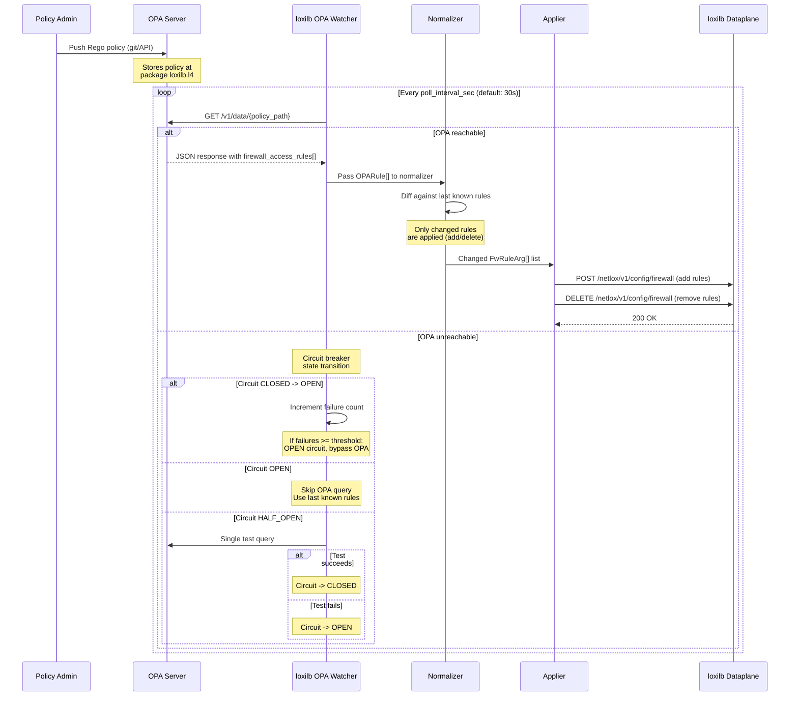

# OPA Policy Enforcement

!!! enterprise "Enterprise Feature"
    This feature requires loxilb-enterprise. It is not available in the community edition.
    See [Installation](../getting-started/installation.md) for enterprise binary setup.

## What is OPA Policy Enforcement?

Open Policy Agent (OPA) is a general-purpose policy engine. loxilb-enterprise integrates OPA as a **dynamic L4 firewall rule source** — you write policies in Rego (OPA's policy language), and loxilb automatically translates them into dataplane firewall rules.

The value of OPA integration is centralized policy management. Instead of manually configuring firewall rules on each loxilb instance, you define policies in Rego (which can live in version control), and the OPA watcher polls for changes and pushes them to the loxilb dataplane. This enables GitOps-compatible network security: policies are code, reviewed in PRs, and applied automatically.

For networking engineers unfamiliar with OPA: **Rego is like a declarative ACL language**. Instead of writing firewall rules directly (allow TCP from 10.0.0.0/8 to port 443), you write conditions that *generate* firewall rules. The OPA watcher handles the translation.

## OPA Evaluation Architecture

The following sequence diagram shows how OPA policy evaluation works end-to-end — from policy authoring to dataplane enforcement:



### Component Roles

| Component | Role | Implementation |
|-----------|------|---------------|
| **Fetcher** | Polls OPA server at `poll_interval_sec` intervals | HTTP GET to `{opa_url}/v1/data/{policy_path}` |
| **Normalizer** | Diffs current rules against last known state | Only applies adds/deletes for changed rules |
| **Applier** | Pushes firewall rules to loxilb dataplane | REST API calls to `/netlox/v1/config/firewall` |
| **Circuit Breaker** | Prevents repeated failed requests to unreachable OPA | 3-state: CLOSED -> OPEN -> HALF_OPEN -> CLOSED |

## Deep Internals

### OPA Watcher Lifecycle

The OPA watcher is a Go goroutine that starts after the configured `initial_delay_sec` and runs continuously:

1. **Initial delay** — Waits `initial_delay_sec` (default: 10s) before the first poll. This allows the OPA server time to start and load policies.

2. **Fetch cycle** — Every `poll_interval_sec` (default: 30s), the fetcher sends `GET {opa_url}/v1/data/{policy_path}` and expects a JSON response containing `firewall_access_rules[]`.

3. **Normalization** — The normalizer converts each `OPARule` into a `FwRuleArg` that the loxilb dataplane understands. It maintains a hash map of currently active rules and computes a diff — only rules that changed since the last poll are sent to the applier.

4. **Application** — The applier pushes rule changes via REST API. New rules are POSTed to `/netlox/v1/config/firewall`; removed rules are DELETEd. This diff-based approach minimizes dataplane churn.

5. **State persistence** — If `state_path` is configured, the watcher serializes its current rule state to disk. This enables faster recovery after restart — the watcher loads the last known state and only applies the diff.

### How OPA Rules Map to Firewall Rules

The OPA `firewall_access_rules` array contains objects matching the `OPARule` struct. The normalizer maps each field:

| OPARule Field | FwRuleArg Field | Purpose |
|---------------|-----------------|---------|
| `sourceIP` | Source CIDR | Traffic source filter |
| `destinationIP` | Destination CIDR | Traffic destination filter |
| `protocol` | IP protocol number | 6=TCP, 17=UDP, 0=any |
| `minSourcePort` / `maxSourcePort` | Source port range | Port range filter |
| `minDestinationPort` / `maxDestinationPort` | Destination port range | Port range filter |
| `action` | Rule action | `"allow"` or `"deny"` |
| `preference` | Rule priority | Higher = processed first |

### Circuit Breaker Behavior

The circuit breaker prevents the watcher from hammering an unreachable OPA server:

| State | Behavior | Transition Trigger |
|-------|----------|-------------------|
| **CLOSED** (normal) | Fetcher queries OPA server on each poll interval | Consecutive failures exceed threshold |
| **OPEN** (OPA down) | Fetcher skips OPA queries, uses last known rules | Timeout period expires |
| **HALF-OPEN** (testing) | Fetcher sends a single test query to check recovery | Success -> CLOSED; Failure -> OPEN |

When `fail_open: false` (default), an unreachable OPA server means no new firewall rules are installed. Existing rules remain in the dataplane. If the watcher has never successfully fetched policies, no rules will be installed.

## REST API Configuration

### Configure OPA Watcher

```bash
curl -X POST http://loxilb:11111/netlox/v1/config/opa/watcher \
  -H "Authorization: Bearer <token>" \
  -H "Content-Type: application/json" \
  -d '{
    "opa_url": "http://opa-server:8181",
    "policy_path": "loxilb/l4",
    "poll_interval_sec": 30,
    "fail_open": false,
    "initial_delay_sec": 10,
    "loxilb_url": "http://localhost:11111",
    "state_path": "/var/lib/loxilb/opa_state.json"
  }'

# Response (200): {"result": "Success"}
```

### Field Reference

These fields are verified against the `OPAWatcherConfig` definition in swagger.yml:

| Field | Type | Valid Values | Default | Description |
|-------|------|-------------|---------|-------------|
| `opa_url` | string | Any HTTP/HTTPS URL | (required) | HTTP endpoint of the OPA server |
| `policy_path` | string | OPA policy path string | `"loxilb/l4"` | Rego package path to query |
| `poll_interval_sec` | integer | `> 0` | `30` | Seconds between policy fetches |
| `fail_open` | boolean | `true`, `false` | `false` | Allow traffic when OPA is unreachable |
| `initial_delay_sec` | integer | `>= 0` | `10` | Seconds to wait before first poll |
| `loxilb_url` | string | Any HTTP/HTTPS URL | `"http://localhost:11111"` | loxilb REST API base URL for rule push |
| `state_path` | string | File system path | `""` | File path for persisting watcher state |

!!! danger "OPA defaults to fail-closed"
    When `fail_open: false` (the default), an unreachable OPA server means **no firewall rules are updated** and existing rules remain. If the watcher has never successfully fetched policies, **no rules will be installed** and default network behavior applies.

    Set `fail_open: true` only if availability is more critical than policy enforcement. See the [fail mode comparison table](overview.md#fail-mode-reference) for how this compares to LlamaFirewall and Presidio defaults.

### OPA Watcher Status Response

The `GET /config/opa/watcher` response includes operational status fields verified against `OPAWatcherStatus` in swagger.yml:

| Field | Type | Description |
|-------|------|-------------|
| `opa_url` | string | Configured OPA server URL |
| `policy_path` | string | Configured OPA policy path |
| `poll_interval_sec` | integer | Configured polling interval |
| `fail_open` | boolean | Fail-open setting |
| `status` | string | Current watcher status: `"running"`, `"stopped"`, or `"not_configured"` |
| `last_sync_at` | string (datetime) | Timestamp of last successful sync |
| `rules_count` | integer | Number of active firewall rules |
| `circuit_breaker_state` | integer | Circuit breaker state: `0`=closed, `1`=half-open, `2`=open |
| `last_error` | string | Last error message (if any) |

### Managing the Watcher

| Operation | Method | Endpoint |
|-----------|--------|----------|
| Create/update watcher | POST | `/config/opa/watcher` |
| Get watcher status | GET | `/config/opa/watcher` |
| Remove watcher | DELETE | `/config/opa/watcher` |

## Writing Rego Policies for loxilb

The Rego policy package **must match** the `policy_path` configured in the watcher. The default path is `loxilb/l4`, so the Rego package declaration must be:

```rego
package loxilb.l4

import future.keywords.in

# Allow HTTPS from internal network
firewall_access_rules[rule] {
  rule := {
    "sourceIP": "10.0.0.0/8",
    "destinationIP": "0.0.0.0/0",
    "protocol": 6,
    "minSourcePort": 0,
    "maxSourcePort": 65535,
    "minDestinationPort": 443,
    "maxDestinationPort": 443,
    "action": "allow",
    "preference": 100
  }
}

# Block SSH from external networks
firewall_access_rules[rule] {
  rule := {
    "sourceIP": "0.0.0.0/0",
    "destinationIP": "10.0.0.0/8",
    "protocol": 6,
    "minSourcePort": 0,
    "maxSourcePort": 65535,
    "minDestinationPort": 22,
    "maxDestinationPort": 22,
    "action": "deny",
    "preference": 200
  }
}
```

!!! warning "Policy path mismatch causes silent rule removal"
    The Rego package declaration **must match** `policy_path`. If your policy uses `package policy.firewall` but `policy_path` is `loxilb/l4`, the watcher will fetch empty results and **silently remove all firewall rules**. This is the most common misconfiguration.

### OPARule Field Reference

The `firewall_access_rules` array must contain objects matching the `OPARule` struct:

| Field | Type | Description | Example |
|-------|------|-------------|---------|
| `sourceIP` | string (CIDR) | Source IP range | `"10.0.0.0/8"` |
| `destinationIP` | string (CIDR) | Destination IP range | `"192.168.1.100/32"` |
| `protocol` | int | IP protocol number (6=TCP, 17=UDP) | `6` |
| `minSourcePort` | int | Source port range start | `0` |
| `maxSourcePort` | int | Source port range end | `65535` |
| `minDestinationPort` | int | Destination port range start | `80` |
| `maxDestinationPort` | int | Destination port range end | `80` |
| `action` | string | `"allow"` or `"deny"` | `"allow"` |
| `preference` | int | Rule priority (higher = processed first) | `100` |

### How the Fetcher Queries OPA

The OPA fetcher sends `GET {opa_url}/v1/data/{policy_path}` and expects a JSON response with this structure:

```json
{
  "result": {
    "l4": {
      "firewall_access_rules": [
        {
          "sourceIP": "10.0.0.0/8",
          "destinationIP": "0.0.0.0/0",
          "protocol": 6,
          "minSourcePort": 0,
          "maxSourcePort": 65535,
          "minDestinationPort": 443,
          "maxDestinationPort": 443,
          "action": "allow",
          "preference": 100
        }
      ]
    }
  }
}
```

The normalizer converts each `OPARule` into a `FwRuleArg` that the loxilb dataplane understands, and the applier pushes rules via REST API to `/netlox/v1/config/firewall`.

## Configuration Scenarios

### Scenario 1: Strict Policy Mode (Fail-Closed)

For security-critical deployments where no traffic should flow without explicit OPA policy authorization. All traffic is blocked if OPA is unreachable.

```bash
curl -X POST http://loxilb:11111/netlox/v1/config/opa/watcher \
  -H "Authorization: Bearer <token>" \
  -H "Content-Type: application/json" \
  -d '{
    "opa_url": "http://opa-server:8181",
    "policy_path": "loxilb/l4",
    "poll_interval_sec": 10,
    "fail_open": false,
    "initial_delay_sec": 5,
    "state_path": "/var/lib/loxilb/opa_state.json"
  }'
```

**Key settings:**

- `fail_open: false` — No traffic allowed if OPA is unreachable and no rules are cached
- `poll_interval_sec: 10` — Faster polling for quicker policy convergence
- `initial_delay_sec: 5` — Shorter delay for faster startup
- `state_path` configured — Persists rules across restarts, reducing window of no-rules-applied

**When to use:** Compliance-mandated environments (PCI-DSS, SOC2) where all network access must be explicitly authorized by policy.

### Scenario 2: Availability-First Mode (Fail-Open)

For deployments where availability is more critical than strict policy enforcement. Traffic flows even if OPA is unreachable.

```bash
curl -X POST http://loxilb:11111/netlox/v1/config/opa/watcher \
  -H "Authorization: Bearer <token>" \
  -H "Content-Type: application/json" \
  -d '{
    "opa_url": "http://opa-server:8181",
    "policy_path": "loxilb/l4",
    "poll_interval_sec": 60,
    "fail_open": true,
    "initial_delay_sec": 30
  }'
```

**Key settings:**

- `fail_open: true` — Traffic flows without firewall rules if OPA is unreachable
- `poll_interval_sec: 60` — Less frequent polling reduces load on OPA server
- `initial_delay_sec: 30` — Longer delay gives OPA more time to start
- No `state_path` — Stateless operation; relies on OPA availability for rules

**When to use:** Development/staging environments, or production deployments where OPA is advisory rather than mandatory.

## Verify

Confirm the OPA watcher is running and policies are being applied:

```bash
curl http://loxilb:11111/netlox/v1/config/opa/watcher \
  -H "Authorization: Bearer <token>"

# Response (200):
# {
#   "opa_url": "http://opa-server:8181",
#   "policy_path": "loxilb/l4",
#   "poll_interval_sec": 30,
#   "fail_open": false,
#   "status": "running",
#   "last_sync_at": "2025-01-15T10:30:00Z",
#   "rules_count": 5,
#   "circuit_breaker_state": 0
# }
```

Check that `status` is `"running"`, `last_sync_at` shows a recent timestamp, and `circuit_breaker_state` is `0` (closed). If `circuit_breaker_state` is `2` (open), the OPA server is unreachable.

## Troubleshoot

| Symptom | Likely Cause | Resolution |
|---------|-------------|------------|
| All rules disappear after watcher starts | Policy path mismatch — Rego package does not match `policy_path` | Verify `package loxilb.l4` matches `policy_path` |
| No rules installed on first start | OPA server not reachable during initial delay + first poll | Check `opa_url` connectivity; increase `initial_delay_sec` |
| Rules not updating | Circuit breaker in open state | Check `GET /config/opa/watcher` for `circuit_breaker_state: 2` |
| Partial rule updates | Diff engine detected only some changes | Expected behavior — only changed rules are applied |
| `circuit_breaker_state: 1` (half-open) | OPA recovering from outage | Normal — watcher is testing single requests |
| `rules_count: 0` but OPA has policies | Wrong `policy_path` or empty Rego result set | Verify `policy_path` matches Rego package; test OPA directly with `curl {opa_url}/v1/data/{policy_path}` |

## See Also

- [OPA Policy Watcher API Reference](../reference/api.md#opa-policy-watcher)
- [Security Gateway Overview](overview.md) — Full architecture diagram, fail-mode comparison table, port allocation
- [Rate Limiting](rate-limiting.md) — Complementary traffic control at the API key level
- [IP Filtering](ip-filtering.md) — IP-based access control at the eBPF dataplane level
- [Configuration Reference](configuration-reference.md) — Quick-reference for all Security Gateway config fields
