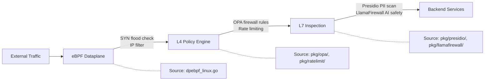

# Security Gateway Overview

!!! enterprise "Enterprise Feature"
    This feature requires loxilb-enterprise. It is not available in the community edition.
    See [Installation](../getting-started/installation.md) for enterprise binary setup.

## What is the Security Gateway?

loxilb-enterprise provides a **unified security control plane** at the gateway layer. Instead of scattering security logic across applications, the Security Gateway enforces network policy, data protection, and encrypted transport at a single enforcement point — the eBPF-accelerated data plane.

The Security Gateway organizes its capabilities into three pillars:

- **Policy Enforcement** — OPA-driven L4 firewall rules, rate limiting, SYN flood protection, and IP filtering. These features control who can access what, how fast, and from where.
- **Data Protection** — Presidio PII detection/redaction and LlamaFirewall AI content safety. These features inspect traffic content for sensitive data and malicious AI prompts before it reaches backends.
- **Secure Transport** — IPsec tunnels, mTLS mutual authentication, and eBPF kernel-level protections. These features encrypt and authenticate traffic between nodes and services.

For security architects evaluating loxilb-enterprise, this page serves as the starting point. Each pillar links to detailed feature pages with source-traced configuration examples.

## Security Architecture

The following diagram shows how traffic flows through the three security layers:

Traffic passes through layers in order: kernel-level eBPF filtering first (fastest, drops obvious attacks), then L4 policy enforcement (OPA rules, rate limits), then L7 content inspection (PII detection, AI safety). Each layer can independently drop or pass traffic.

## Fail Mode Reference

!!! warning "Verify fail mode settings before production deployment"
    OPA defaults to **fail-closed** while LlamaFirewall defaults to **fail-open**. These opposite defaults reflect different security philosophies — access control blocks by default, content scanning preserves availability by default. Confirm that fail mode settings match your organization's security policy.

| Component | Default Fail Mode | Behavior When Service Down | Config Field |
|-----------|-------------------|---------------------------|--------------|
| OPA Watcher | **Fail-closed** | Blocks all traffic (no firewall rules updated) | `fail_open: false` |
| LlamaFirewall | **Fail-open** | Passes traffic without AI safety scan | `fail_closed: 0` |
| Presidio | **Configurable** | Depends on `fail_mode` setting | `fail_mode` |

## Port Allocation

When deploying multiple security services, ensure no port conflicts:

| Service | Default Port | Protocol | Config Location |
|---------|-------------|----------|-----------------|
| OPA Server | 8181 | HTTP | `opa_url` in watcher config |
| Presidio Analyzer | 50051 | gRPC | `analyzer_addr` |
| LlamaFirewall | 50052 | gRPC | `server_url` |

## Feature Pages

### Policy Enforcement

- **[OPA Policy Enforcement](opa-policy-enforcement.md)** — Write Rego policies that translate to L4 firewall rules. Centralized policy management with GitOps-compatible workflow.
- **[Rate Limiting](rate-limiting.md)** — Per-key RPS/burst limits and per-key token quotas for AI inference cost control. Token-bucket algorithm at the gateway layer.
- **[SYN Flood Protection](syn-flood.md)** — eBPF-level DDoS mitigation with unified API for SYN flood, connection rate, and UDP flood protection.
- **[IP Filtering](ip-filtering.md)** — IP-based access control with whitelist/blacklist modes, enforced in the kernel fast path before any application processing.

### Data Protection

- **[Presidio PII Detection](presidio-pii-detection.md)** — Gateway-layer PII detection and redaction for GDPR/CCPA compliance. Supports detect, mask, redact, and anonymize modes.
- **[LlamaFirewall AI Safety](llamafirewall.md)** — AI content safety scanning for prompt injection, jailbreak attempts, and other LLM threats. Six configurable scanner types.

### Secure Transport

- **[Secure Dataplane Overview](secure-dataplane.md)** — Architectural comparison of IPsec, mTLS, and eBPF security layers with decision guide for choosing the right approach.
- **[IPsec Configuration](ipsec.md)** — L3 tunnel encryption between nodes using strongSwan integration. Supports PSK and X.509 certificate authentication.
- **[mTLS Configuration](mtls.md)** — Mutual TLS authentication per load balancer rule in FullProxy mode. Frontend client cert validation and backend server cert verification.

### Operations

- **[Deployment Scenarios](deployment-scenarios.md)** — Four deployment patterns showing how Security Gateway features combine for different compliance requirements.
- **[Configuration Reference](configuration-reference.md)** — Cross-feature quick-reference table with all config fields, defaults, and source file locations.

## See Also

- [AI Gateway Overview](../ai-gateway/overview.md) — AI Gateway features that complement Security Gateway data protection
- [Getting Started](../getting-started/installation.md) — Enterprise binary installation and initial setup
