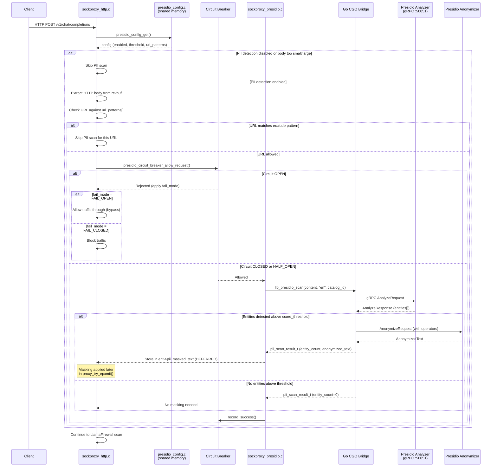

# PII Detection with Presidio

!!! enterprise "Enterprise Feature"
    This feature requires loxilb-enterprise. It is not available in the community edition.
    See [Installation](../getting-started/installation.md) for enterprise binary setup.

## What is Presidio PII Detection?

Microsoft Presidio is an open-source PII (Personally Identifiable Information) detection and anonymization framework. loxilb integrates Presidio as a **gateway-layer PII interceptor** — detecting and optionally redacting sensitive data (names, emails, credit card numbers, SSNs) in LLM prompts before they reach the backend model.

Why at the gateway? PII detection at the gateway layer means **no individual application needs PII scanning logic**. One enforcement point protects all LLM traffic flowing through loxilb, regardless of which application or client originated the request.

## PII Detection Evaluation Path

The following sequence diagram shows how Presidio PII detection processes each request, from body extraction through entity detection to masking application:



### Key Architecture Decisions

- **Deferred masking**: PII-masked text is stored in `ent->pii_masked_text` and applied later in `proxy_try_epxmit()` rather than modifying the receive buffer in-place. This prevents corruption of HTTP header parsing for subsequent pipeline stages.
- **URL pattern filtering**: Not all endpoints need PII scanning. The URL pattern matching system supports include-list and exclude-list modes, allowing operators to target only AI-related endpoints.
- **Circuit breaker resilience**: If the Presidio analyzer becomes unreachable, the circuit breaker opens and applies the configured fail mode rather than blocking on timeouts.

## What Presidio Detects

Presidio uses **structural and pattern-based detection** to identify PII entities:

| PII Type | Examples | Detection Method |
|----------|----------|-----------------|
| Person names | "John Smith", "Maria Garcia" | Named Entity Recognition (NER) models |
| Email addresses | "user@example.com" | Pattern matching |
| Phone numbers | "+1-555-0123", "(555) 555-1234" | Pattern matching |
| Credit card numbers | "4111-1111-1111-1111" | Pattern matching + Luhn validation |
| Social Security Numbers | "123-45-6789" | Pattern matching |
| Physical addresses | "123 Main St, City, State 12345" | NER models |

### Presidio vs LlamaFirewall for PII

Presidio and [LlamaFirewall](llamafirewall.md) take different approaches to PII detection. They are **complementary, not competing**:

| Aspect | Presidio | LlamaFirewall PIIDetection |
|--------|----------|---------------------------|
| **Detection method** | Structural — regex patterns, NER models | Semantic — context-based understanding |
| **Strength** | Catches formatted PII (emails, SSNs, credit cards) | Catches contextual PII exposure ("my boss John told me...") |
| **False positives** | Low for structured data | Higher, but catches more subtle leakage |
| **Recommendation** | Enable for all deployments | Enable for defense-in-depth |

## Deep Internals

### C-Layer Implementation (sockproxy_presidio.c)

The Presidio integration is implemented in `sockproxy_presidio.c` (1376 lines) following the **xSync Consumer Pattern** used consistently across loxilb's external service integrations. Key implementation details:

**Initialization flow:**

1. `presidio_init()` calls `presidio_config_init()` to set up shared memory at `/dev/shm/loxilb_presidio_config`
2. Initializes the Go CGO bridge via `llb_presidio_init(analyzer_url, anonymizer_url)`
3. Sets `g_initialized = 1` — even if the Go bridge fails (proxy starts without Presidio; scans retry on demand)

**Scan flow (`presidio_scan()`):**

1. Check `presidio_is_enabled()` — atomic read, 2ns overhead when disabled
2. Check circuit breaker via `presidio_circuit_breaker_allow_request()`
3. If circuit open, apply `fail_mode` (FAIL_OPEN bypasses, FAIL_CLOSED blocks)
4. Truncate body if `content_len > max_body_size` and `scan_mode == PRESIDIO_SCAN_MODE_TRUNCATE`
5. Call `presidio_scan_with_retry()` with exponential backoff (`retry_backoff_ms * attempt`)
6. The Go bridge calls `llb_presidio_scan(content, "en", catalog_id)` via gRPC to the Presidio analyzer
7. If entities are detected above `score_threshold`, the anonymizer applies configured operators (replace, redact, hash, encrypt, mask)

**URL pattern matching:**

The module supports OpenAI-style selective detection via URL patterns configured in shared memory:

- `url_mode = 0`: Scan all URLs (default)
- `url_mode = 1`: Include-list — only scan URLs matching configured patterns
- `url_mode = 2`: Exclude-list — scan all URLs except those matching patterns

Pattern matching uses `fnmatch()` with first-match-wins semantics. Each pattern entry has `enabled` and `is_exclude` flags.

**Body extraction:**

`presidio_should_scan_http()` checks Content-Type before scanning:

- Scans: `application/json`, `text/*`, `application/xml`, `application/x-www-form-urlencoded`
- Skips: `image/*`, `video/*`, `audio/*`, `application/octet-stream`
- Bodies smaller than `min_body_size` (default: 100 bytes) are skipped
- Bodies larger than `max_body_size` (default: 65536 bytes) are either skipped (FULL mode) or truncated (TRUNCATE mode)

### Anonymization Operators

Verified from `sockproxy_presidio.c` operator functions (`presidio_operator_to_string`, `presidio_operator_from_string`):

| Operator | String Value | Description |
|----------|-------------|-------------|
| `PRESIDIO_OP_REPLACE` | `"replace"` | Replace PII with entity type label (e.g., `<PERSON>`) |
| `PRESIDIO_OP_REDACT` | `"redact"` | Remove PII entirely |
| `PRESIDIO_OP_HASH` | `"hash"` | Replace PII with cryptographic hash |
| `PRESIDIO_OP_ENCRYPT` | `"encrypt"` | Encrypt PII with configured key |
| `PRESIDIO_OP_MASK` | `"mask"` | Mask PII with characters (e.g., `****`) |

Per-entity operator configuration is supported via `presidio_operators_t`:

- `default_op` — Applied to all entity types unless overridden
- `email_op`, `ssn_op`, `credit_card_op`, `phone_op`, `person_op` — Per-entity type overrides

### Statistics Tracking

The module tracks comprehensive statistics via atomic counters (verified from `presidio_get_stats()`):

| Metric | Description |
|--------|-------------|
| `requests_scanned` | Total requests scanned |
| `entities_detected` | Total PII entities found |
| `requests_masked` | Requests where masking was applied |
| `scan_errors` | Scan failures (non-timeout, non-connection) |
| `scan_timeouts` | Timeout errors |
| `connection_errors` | Connection failures to Presidio |
| `grpc_errors` | gRPC-level errors |
| `bytes_scanned` | Total bytes processed |
| `bytes_masked` | Total bytes after masking |
| `total_latency_us` | Cumulative scan latency in microseconds |
| `fail_open_bypasses` | Requests bypassed due to fail-open |
| `fail_closed_blocks` | Requests blocked due to fail-closed |
| `circuit_breaker_opens` | Times circuit breaker opened |
| `circuit_breaker_rejects` | Requests rejected by open circuit |
| `retry_attempts` | Total retry attempts |
| `retry_successes` | Retries that succeeded |
| `bodies_skipped_size` | Bodies skipped due to size limits |
| `bodies_truncated` | Bodies truncated before scanning |

## REST API Configuration

### Enable PII Detection

```bash
curl -X POST http://loxilb:11111/netlox/v1/config/pii/enable \
  -H "Authorization: Bearer <token>"

# Response (200): {"result": "Success"}
```

### Configure PII Detection

```bash
curl -X POST http://loxilb:11111/netlox/v1/config/pii/configure \
  -H "Authorization: Bearer <token>" \
  -H "Content-Type: application/json" \
  -d '{
    "presidio_url": "http://presidio-analyzer:5002",
    "score_threshold": 0.7,
    "entities": ["PERSON", "EMAIL_ADDRESS", "PHONE_NUMBER", "CREDIT_CARD"],
    "action": "redact"
  }'

# Response (200): {"result": "Success"}
```

### Configuration Field Reference

| Field | Type | Valid Values | Default | Source | Description |
|-------|------|-------------|---------|--------|-------------|
| `presidio_url` | string | Any HTTP/HTTPS URL | (required) | REST API | Presidio analyzer service endpoint |
| `analyzer_url` | string | gRPC address | `""` | shared memory | gRPC analyzer endpoint (used by C layer) |
| `anonymizer_url` | string | gRPC address | `""` | shared memory | gRPC anonymizer endpoint |
| `score_threshold` | float | `0.0`–`1.0` | `0.7` | shared memory | Minimum confidence score to flag PII |
| `entities` | string[] | PII entity type names | All entities | REST API | PII entity types to detect |
| `action` | string | `"replace"`, `"redact"`, `"hash"`, `"encrypt"`, `"mask"` | `"replace"` | REST API / C layer | Anonymization operator |
| `direction` | uint8 | `0`=request, `1`=response, `2`=both | `0` (request) | shared memory | Which traffic direction to scan |
| `mode` | uint8 | Mode identifier | `0` | shared memory | Detection mode |
| `fail_mode` | uint8 | `FAIL_OPEN` (0), `FAIL_CLOSED` (1) | `FAIL_OPEN` | shared memory | Behavior when Presidio is unreachable |
| `min_body_size` | uint32 | bytes | `100` | shared memory | Minimum body size to scan |
| `max_body_size` | uint32 | bytes | `65536` | shared memory | Maximum body size to scan |
| `scan_mode` | uint8 | `FULL` (0), `TRUNCATE` (1) | `FULL` | shared memory | Behavior for oversized bodies |
| `timeout_ms` | uint32 | milliseconds | configured | shared memory | gRPC call timeout |
| `max_retries` | uint32 | count | `1` | shared memory | Retry attempts on scan failure |
| `retry_backoff_ms` | uint32 | milliseconds | `100` | shared memory | Base backoff between retries (exponential) |

## Configuration Scenarios

### Scenario 1: Strict PII Protection (Fail-Closed)

Block all requests containing PII above threshold. Scan both requests and responses. Deny traffic if Presidio is unreachable.

```bash
# Enable PII detection
curl -X POST http://loxilb:11111/netlox/v1/config/pii/enable \
  -H "Authorization: Bearer <token>"

# Configure strict mode
curl -X POST http://loxilb:11111/netlox/v1/config/pii/configure \
  -H "Authorization: Bearer <token>" \
  -H "Content-Type: application/json" \
  -d '{
    "presidio_url": "http://presidio-analyzer:5002",
    "score_threshold": 0.5,
    "entities": ["PERSON", "EMAIL_ADDRESS", "PHONE_NUMBER", "CREDIT_CARD", "US_SSN", "IBAN_CODE"],
    "action": "redact",
    "direction": "both",
    "fail_mode": "fail_closed"
  }'
```

**Key settings:** Lower `score_threshold` (0.5) catches more potential PII. `direction: "both"` scans responses as well as requests. `fail_mode: fail_closed` blocks traffic if Presidio goes down.

**When to use:** GDPR/CCPA-mandated deployments where PII must never reach LLM backends.

### Scenario 2: Audit/Compliance Mode (Fail-Open)

Log PII detections without blocking. Lower threshold for broad detection coverage. Allow traffic through if Presidio is unavailable.

```bash
# Enable PII detection
curl -X POST http://loxilb:11111/netlox/v1/config/pii/enable \
  -H "Authorization: Bearer <token>"

# Configure audit mode
curl -X POST http://loxilb:11111/netlox/v1/config/pii/configure \
  -H "Authorization: Bearer <token>" \
  -H "Content-Type: application/json" \
  -d '{
    "presidio_url": "http://presidio-analyzer:5002",
    "score_threshold": 0.3,
    "entities": ["PERSON", "EMAIL_ADDRESS", "PHONE_NUMBER", "CREDIT_CARD", "US_SSN", "LOCATION"],
    "action": "log",
    "direction": "request",
    "fail_mode": "fail_open"
  }'
```

**Key settings:** Very low `score_threshold` (0.3) for maximum detection sensitivity. `action: "log"` records PII detections without modifying traffic. `fail_mode: fail_open` preserves availability.

**When to use:** Initial deployment, compliance auditing, or environments where you need visibility into PII exposure before enforcing blocking.

## Deployment

Presidio runs as **separate containers** — an analyzer and an anonymizer — independent of the loxilb process.

### Container Deployment

```bash
# Run Presidio Analyzer
docker run -d --name presidio-analyzer \
  -p 50051:50051 \
  mcr.microsoft.com/presidio-analyzer:latest

# Run Presidio Anonymizer (required for redaction/masking)
docker run -d --name presidio-anonymizer \
  -p 50052:50052 \
  mcr.microsoft.com/presidio-anonymizer:latest
```

### Kubernetes Deployment

In Kubernetes, deploy Presidio as a sidecar or separate service:

**Shared memory requirement:** `/dev/shm` must be accessible from both the loxilb pod and Presidio pods:

```yaml
volumes:
  - name: shared-memory
    emptyDir:
      medium: Memory
      sizeLimit: 64Mi
```

## Verify

```bash
curl http://loxilb:11111/netlox/v1/config/pii/status \
  -H "Authorization: Bearer <token>"

# Response (200):
# {
#   "enabled": true,
#   "presidio_url": "http://presidio-analyzer:5002",
#   "score_threshold": 0.7,
#   "entities": ["PERSON", "EMAIL_ADDRESS", "PHONE_NUMBER", "CREDIT_CARD"],
#   "action": "redact"
# }
```

## Troubleshoot

| Symptom | Likely Cause | Resolution |
|---------|-------------|------------|
| PII not detected | Entity types not in `entities` list, or `score_threshold` too high | Verify `entities` list; lower `score_threshold` |
| Presidio connection failed | `presidio_url` incorrect or service not running | Check container status; verify port connectivity |
| High false positive rate | `score_threshold` too low | Increase from 0.3 to 0.7+ |
| Large request bodies skipped | `max_body_size` too small | Increase `max_body_size` or set `scan_mode` to TRUNCATE |
| Circuit breaker open | Presidio service unstable | Check Presidio health; circuit recovers after `circuit_breaker_timeout_sec` |

## See Also

- [PII Detection (Presidio) API Reference](../reference/api.md#pii-detection-presidio)
- [Security Gateway Overview](overview.md) — Full architecture diagram, fail-mode comparison, circuit breaker configuration
- [LlamaFirewall](llamafirewall.md) — Complementary semantic AI content safety
- [AI Gateway Overview](../ai-gateway/overview.md) — Full traffic flow and pipeline position
- [Configuration Reference](configuration-reference.md) — Quick-reference for all Security Gateway config fields
