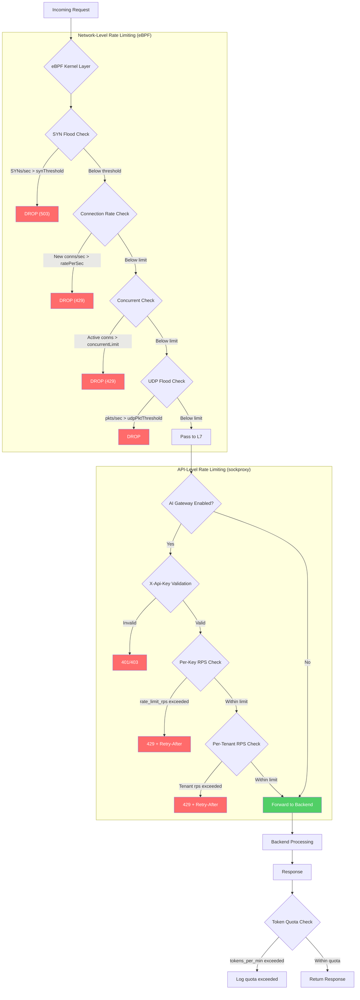

# Rate Limiting

!!! enterprise "Enterprise Feature"
    This feature requires loxilb-enterprise. It is not available in the community edition.
    See [Installation](../getting-started/installation.md) for enterprise binary setup.

## What is Rate Limiting?

Rate limiting protects backend services from overload by enforcing request-per-second (RPS) and burst limits at the gateway layer. For AI Gateway deployments, it also enforces **token-per-minute quotas** to control LLM inference costs — a critical feature when GPU resources are shared across multiple tenants.

loxilb provides rate limiting at two distinct layers:

1. **Network-level rate limiting** — SYN flood protection, connection rate limiting, and UDP flood protection via the `/config/securityrate` API. These operate at L3/L4 in the eBPF kernel path.
2. **API-level rate limiting** — Per-key RPS, burst limits, and token quotas via the `/config/ai/apikey` and `/config/ai/tenant/ratelimit` APIs. These operate at L7 in the sockproxy HTTP processing path.

## Rate Limiting Pipeline

The following diagram shows how rate limiting decisions are made at each layer of the security pipeline:



## Deep Internals

### Network-Level Rate Limiting (eBPF)

Network-level rate limiting is configured via the `/config/securityrate` endpoint and operates entirely in the eBPF kernel path, adding near-zero latency to allowed traffic. The implementation tracks per-source-IP counters for three protection types:

**SYN Flood Protection:**

- Tracks SYN packets per second per source IP
- When rate exceeds `cookieThreshold`, enables SYN cookies (validates connections before allocating state)
- When rate exceeds `synThreshold`, drops SYN packets entirely (hard drop)
- Statistics tracked: `synBlocked`, `synPassed`, `synCookies`

**Connection Rate Limiting:**

- Tracks new TCP connections per second per source IP (`ratePerSec`)
- Tracks concurrent active connections per source IP (`concurrentLimit`)
- Exceeding either limit drops the connection
- Statistics tracked: `connBlocked`, `connPassed`, `concurrentBlocked`

**UDP Flood Protection:**

- Tracks UDP packets per second per source IP (`udpPktThreshold`)
- Tracks UDP bandwidth per source IP (`udpBandwidthMB`)
- Statistics tracked: `udpBlocked`, `udpPassed`

**IP Whitelisting:** The `whitelistIps` array allows specific IPs to bypass all network-level rate limiting. Useful for trusted monitoring systems or known internal services.

### API-Level Rate Limiting (sockproxy_http.c)

API-level rate limiting executes in the sockproxy HTTP processing path (sockproxy_http.c, line ~4531) and uses a **token-bucket algorithm** implemented in Go:

**Per-key rate limiting:**

1. The `X-Api-Key` header is validated via `llb_ai_validate_key()`
2. Per-key RPS is checked via `llb_ai_ratelimit_check(key_id, tenant_id, &rl_dec)`
3. If the rate limit is exceeded, the gateway returns:

```
HTTP/1.1 429 Too Many Requests
Content-Type: application/json
Retry-After: {retry_after}
Connection: close

{"error":"rate_limit_exceeded","retry_after":{retry_after}}
```

The `retry_after` value (in seconds) tells the client how long to wait before retrying.

**Token-bucket algorithm:**

- The bucket refills at `rate_limit_rps` tokens per second
- Each request consumes one token
- `burst_size` is the maximum bucket capacity — allowing short bursts above the sustained rate
- When the bucket is empty, requests are rejected with a `retryAfter` duration

**Per-tenant rate limiting:**

Tenant-level limits aggregate all API keys belonging to a tenant. Configured via `/config/ai/tenant/ratelimit`, these limits prevent any single tenant from monopolizing gateway capacity.

**Token quota enforcement:**

For AI Gateway deployments, `tokens_per_min` controls LLM token consumption per minute per API key. Token usage is tracked via `llb_ai_token_quota_consume()` during SSE response streaming. When exceeded, subsequent requests are rejected until the next minute window.

### Cleanup and Memory Management

The rate limiter store runs a background cleanup goroutine that removes entries with more than 10 minutes of inactivity. This prevents memory growth from expired or abandoned API keys.

## REST API Configuration

### Network-Level Rate Limiting

```bash
curl -X POST http://loxilb:11111/netlox/v1/config/securityrate \
  -H "Authorization: Bearer <token>" \
  -H "Content-Type: application/json" \
  -d '{
    "synEnabled": true,
    "synThreshold": 100,
    "cookieThreshold": 50,
    "connRateEnabled": true,
    "ratePerSec": 50,
    "concurrentLimit": 200,
    "udpEnabled": true,
    "udpPktThreshold": 1000,
    "udpBandwidthMB": 100,
    "whitelistIps": ["10.0.0.1", "10.0.0.2"]
  }'

# Response (200): {"result": "Success"}
```

### Network Rate Limiting Field Reference

Verified against `SecurityRateConfigMod` in swagger.yml:

| Field | Type | Default | Description |
|-------|------|---------|-------------|
| `synEnabled` | boolean | (required) | Enable SYN flood protection |
| `synThreshold` | integer | `100` | Maximum SYNs per second per IP (hard drop) |
| `cookieThreshold` | integer | `50` | SYN cookie activation threshold (must be < synThreshold) |
| `connRateEnabled` | boolean | (required) | Enable connection rate limiting |
| `ratePerSec` | integer | `50` | Maximum new connections per second per IP |
| `concurrentLimit` | integer | `200` | Maximum concurrent connections per IP |
| `udpEnabled` | boolean | (required) | Enable UDP flood protection |
| `udpPktThreshold` | integer | `1000` | Maximum UDP packets per second per IP |
| `udpBandwidthMB` | integer | `100` | Maximum UDP bandwidth in MB per second per IP |
| `whitelistIps` | string[] | `[]` | IPs to bypass all rate limiting |

### API-Level Rate Limiting (Per-Key)

Rate limits are configured as part of API key creation:

```bash
curl -X POST http://loxilb:11111/netlox/v1/config/ai/apikey \
  -H "Authorization: Bearer <token>" \
  -H "Content-Type: application/json" \
  -d '{
    "tenant_id": "org-acme",
    "allowed_models": ["gpt-4", "gpt-3.5-turbo"],
    "rate_limit_rps": 100,
    "burst_size": 150,
    "tokens_per_min": 50000,
    "expires_at": "2026-12-31T23:59:59Z"
  }'
```

### API Rate Limiting Field Reference

Verified against `ApiKeyCreateRequest` in swagger.yml:

| Field | Type | Description |
|-------|------|-------------|
| `rate_limit_rps` | integer | Maximum requests per second for this key |
| `burst_size` | integer | Burst capacity above the steady-state RPS limit |
| `tokens_per_min` | integer | Maximum LLM tokens per minute for this key |

### Per-Tenant Rate Limiting

```bash
curl -X POST http://loxilb:11111/netlox/v1/config/ai/tenant/ratelimit \
  -H "Authorization: Bearer <token>" \
  -H "Content-Type: application/json" \
  -d '{
    "tenant_id": "org-acme",
    "rps": 500,
    "tokens_per_min": 200000
  }'
```

### Tenant Rate Limit Field Reference

Verified against `TenantRateLimitMod` in swagger.yml:

| Field | Type | Description |
|-------|------|-------------|
| `tenant_id` | string | Tenant identifier (required) |
| `rps` | integer | Maximum requests per second for the tenant (aggregate across all keys) |
| `tokens_per_min` | integer | Maximum LLM tokens per minute for the tenant |

## Configuration Scenarios

### Scenario 1: Per-API-Key Rate Limiting

Each API key gets its own RPS quota, protecting against individual key abuse. Suitable for multi-tenant AI deployments where each customer has their own API key.

```bash
# Create API key with per-key limits
curl -X POST http://loxilb:11111/netlox/v1/config/ai/apikey \
  -H "Authorization: Bearer <token>" \
  -H "Content-Type: application/json" \
  -d '{
    "tenant_id": "org-acme",
    "name": "production-key",
    "allowed_models": ["gpt-4"],
    "rate_limit_rps": 50,
    "burst_size": 100,
    "tokens_per_min": 100000
  }'
```

**Key settings:** `rate_limit_rps: 50` allows sustained 50 req/s. `burst_size: 100` allows brief spikes to 100 req/s. `tokens_per_min: 100000` caps LLM token usage at 100K/min per key.

### Scenario 2: Per-Tenant Rate Limiting with Network Protection

Aggregate limits across all keys for a tenant, preventing noisy-neighbor problems. Combined with network-level protection against DDoS.

```bash
# Enable network-level protection
curl -X POST http://loxilb:11111/netlox/v1/config/securityrate \
  -H "Authorization: Bearer <token>" \
  -H "Content-Type: application/json" \
  -d '{
    "synEnabled": true,
    "synThreshold": 200,
    "cookieThreshold": 100,
    "connRateEnabled": true,
    "ratePerSec": 100,
    "concurrentLimit": 500,
    "udpEnabled": false,
    "udpPktThreshold": 0,
    "udpBandwidthMB": 0,
    "whitelistIps": ["10.0.0.0/8"]
  }'

# Set tenant-level aggregate limits
curl -X POST http://loxilb:11111/netlox/v1/config/ai/tenant/ratelimit \
  -H "Authorization: Bearer <token>" \
  -H "Content-Type: application/json" \
  -d '{
    "tenant_id": "org-acme",
    "rps": 500,
    "tokens_per_min": 500000
  }'
```

**Key settings:** Network-level protection drops malicious traffic before it reaches the API layer. Tenant-level `rps: 500` means all of org-acme's keys combined cannot exceed 500 req/s. Internal IPs are whitelisted to bypass SYN/connection rate checks.

## Verify

```bash
# Check network rate limiting configuration and statistics
curl http://loxilb:11111/netlox/v1/config/securityrate/all \
  -H "Authorization: Bearer <token>"

# Check API key rate limit configuration
curl http://loxilb:11111/netlox/v1/config/ai/apikey/{key_id} \
  -H "Authorization: Bearer <token>"

# Check tenant rate limit
curl http://loxilb:11111/netlox/v1/config/ai/tenant/ratelimit/{tenant_id} \
  -H "Authorization: Bearer <token>"
```

## Troubleshoot

| Symptom | Likely Cause | Resolution |
|---------|-------------|------------|
| Rate limits not enforced (API-level) | `rate_limit_rps` not set on the API key | Verify key config via `GET /config/ai/apikey/{key_id}` |
| Token quota exceeded unexpectedly | `tokens_per_min` too low | Increase value or review token consumption |
| Burst rejected despite low average | `burst_size` too small | Increase `burst_size` for traffic pattern |
| SYN cookies activating frequently | `cookieThreshold` too low | Increase threshold or check for legitimate high-rate clients |
| Legitimate traffic blocked at network level | IP not in `whitelistIps` | Add trusted IPs to whitelist |

## See Also

- [Security Controls API Reference](../reference/api.md#security-controls)
- [AI Gateway API Key Management](../ai-gateway/api-key-management.md) — Per-key rate limit configuration
- [SSE Quota Management](../ai-gateway/sse-quota-management.md) — Token quota enforcement during streaming
- [Security Gateway Overview](overview.md) — Full security pipeline showing rate limiting position
- [SYN Flood Protection](syn-flood.md) — Detailed SYN flood protection configuration
- [Configuration Reference](configuration-reference.md) — Quick-reference for all Security Gateway config fields
